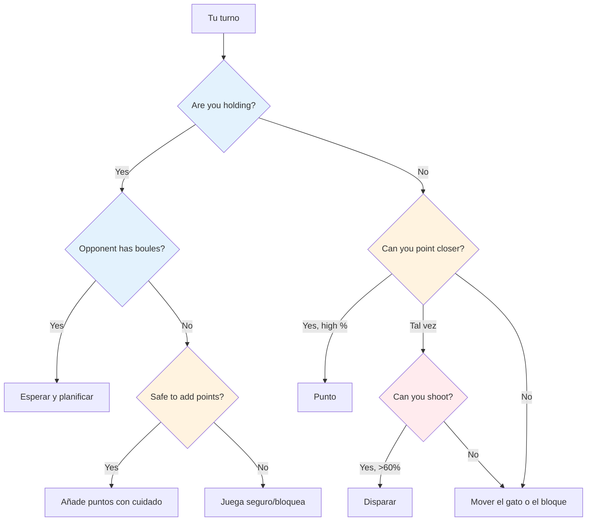
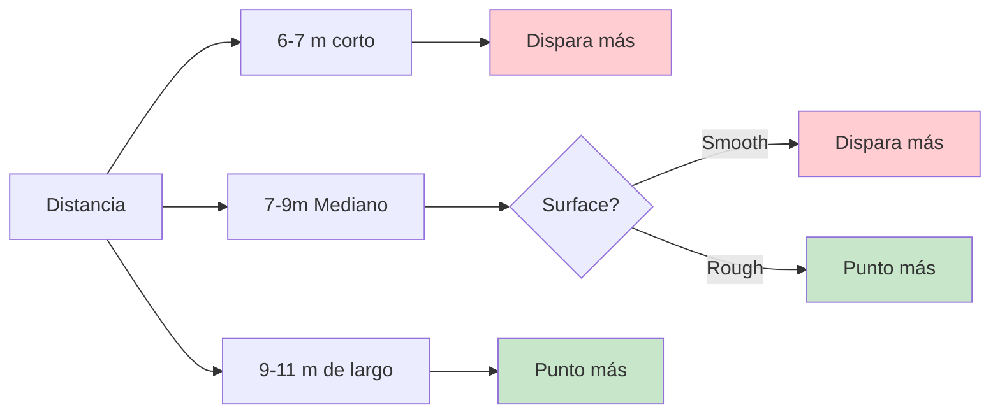

# Pensamiento táctico en la petanca

En la élite, se da por sentado la habilidad técnica. Lo que distingue a los ganadores del resto es la inteligencia táctica: saber qué lanzamiento intentar y cuándo. Los mejores jugadores anticipan el juego con varias jugadas de antelación y aprovechan cada ventaja.

::: tip El principio fundamental
**En el nivel de élite, la diferencia rara vez es la técnica: es la toma de decisiones.** El equipo que comete menos errores tácticos gana.
:::

## Marco de decisión rápida

## La mentalidad táctica

### Piensa en probabilidades

Cada lanzamiento tiene una probabilidad de éxito. Una buena táctica implica elegir lanzamientos donde:
- La probabilidad de éxito es suficientemente alta
- La recompensa justifica el riesgo
- El fracaso no duele demasiado

**Ejemplo de decisión:**
- Disparo difícil: 40% de éxito, gana 3 puntos
- Punto seguro: 80% de éxito, gana 1 punto

¿Cuál es mejor? Depende del resultado, la situación y tu confianza.

### Considere todas las opciones

Antes de cada lanzamiento, considere:
1. **Punto:** Colocar una bola cerca del boliche
2. **Disparar:** Quitar la bola de un oponente
3. **Bloquear:** Colocar una bola para obstruir
4. **Mover el gato:** Golpear el gato intencionalmente
5. **Sacrificio:** Aceptar una mala posición para prepararla más tarde

No te quedes con la opción obvia. Piensa en alternativas.

### Lea la situación

Factores a considerar:
- Puntuación actual (quién lleva ventaja y por cuánto)
- Bolas restantes (las tuyas y las de ellos)
- Posición en el terreno
- Tendencias oponentes
- Las fortalezas de tu equipo

## Principios tácticos básicos

::: tip Los 6 principios tácticos
1. **Controla el gato** - La posición es poder
2. **Estrategia de distancia y superficie** - Adaptarse a las condiciones
3. **Dicte el estilo de juego** - Fuerza tus fortalezas
4. **Gestionar el riesgo frente a la recompensa**: Adapte el riesgo a la situación
5. **Usa la petanca con prudencia**: a veces concede 1 para evitar 3
6. **Piensa en el futuro** - Visualiza los próximos 2 o 3 movimientos
:::

### Principio 1: Controlar el gato

El equipo que controla la posición del gato tiene una ventaja significativa.

**Formas de control:**
- Gana el derecho a lanzar el gato
- Mueva el gato a un terreno favorable
- Proteja el gato para que no se mueva

**Estrategia de colocación del gato:**
- Gato corto: Favorece el disparo, es más fácil acertar a objetivos a corta distancia.
- Long jack: favorece el apuntado, el disparo se vuelve más difícil
- Obstáculos cercanos: crea desafíos para los oponentes

**Explotar las debilidades del oponente:**
- Observa su técnica de señalización: ¿siempre utilizan el mismo arco o estilo?
- Si no pueden adaptarse (por ejemplo, solo rodar, solo lanzar), coloque el jack para forzar lanzamientos incómodos
- Coloque el gato a distancias o posiciones que expongan sus limitaciones
- Sólo explota una debilidad si no la compartes: considera primero las fortalezas de tu propio equipo

### Principio 2: Estrategia de distancia y superficie

El equilibrio óptimo entre apuntar y disparar depende en gran medida de la distancia y el terreno:

::: info Estrategia de distancia
**Corto (6-7 m):** Favorece el tiro: es más fácil acertar a corta distancia
**Mediano (7-9 m):** La superficie es lo más importante
- Superficie lisa → dispara más
- Superficie rugosa → punto más

**Largo (9-11 m):** Favorece la puntería: la precisión del disparo disminuye significativamente
:::

**Tu porcentaje de tiro personal:**
- Si dispara con una tasa de éxito del 75% o más, dispare con más frecuencia
- Considere disparar para reducir los puntos del oponente (incluso si no toma la delantera)
- Disparar para reducir las bolas puntuables del oponente (de 3 a 1) es un control de daños valioso.

**Disparar como estrategia a largo plazo:**
- Si dispara con todas sus bolas, considere su tasa de éxito acumulada
- Calcula: cuando aciertas todos los tiros ganas significativamente más puntos
- Incluso fallar algunos tiros puede reducir los puntos del oponente.
- Ejemplo: Falla 1 o 2 tiros pero aún así elimina amenazas, luego gana mucho cuando aciertas todos
- Este es un riesgo calculado: acepte algunas pérdidas a cambio de ganancias mayores cuando funciona.

### Principio 3: Dictar el estilo de juego

En el nivel élite, la mayoría de los jugadores saben apuntar y disparar bien. La clave está en forzar el juego según el estilo más fuerte del equipo.

**Si tu equipo tiene tiradores fuertes:**
- Dispara lo máximo que puedas: aprovecha tu ventaja
- No desperdicies tu fuerza apuntando cuando puedes dominar disparando
- Controla el juego eliminando las amenazas antes de que se acumulen
- El conector corto a mediano mantiene los disparos efectivos

**Contra tiradores igualmente fuertes:**
- Niégales que sean blancos fáciles disparándoles primero
- Jugar a larga distancia para reducir el porcentaje de tiro de todos
- El equipo que dispara primero suele controlar el final.

**Si los oponentes te superan en tiros:**
- Juega long jack de forma consistente: incluso los tiradores de élite pierden porcentaje a más de 10 m
- Fuerza una batalla de apuntado donde puedas competir
- Haz que disparen en ángulos difíciles o a través de obstáculos.

### Principio 4: Gestionar el riesgo frente a la recompensa

| Situación | Tolerancia al riesgo |
|-----------|---------------|
| Adelante cómodamente | Bajo - protege tu ventaja |
| Juego cerrado | Riesgos medios calculados |
| Detrás significativamente | Alto: necesidad de tomar riesgos |
| Fin final | Depende de la diferencia de puntuación |

### Principio 5: Utilice sus bolas con prudencia

La gestión de la petanca separa a los jugadores de élite:
- Cuando al oponente se le acaben las bolas, hay que decidir con cuidado: ¿sumar puntos o jugar a lo seguro?
- Cuando estés en desventaja, calcula si puedes recuperar el punto de manera realista.
- A veces conceder 1 punto es mejor que desperdiciar bolas y ceder 3.
- Mantenga un registro de las bolas restantes (las suyas y las de ellos) en todo momento

### Principio 6: Piensa en múltiples movimientos por adelantado

Pensamiento de élite:
- Antes de lanzar, visualice las siguientes 2-3 bolas de ambos equipos.
- ¿Cuál es la mejor respuesta de tu oponente si tienes éxito? ¿Y si fracasas?
- ¿Cómo este lanzamiento prepara el terreno para el próximo?
- Consideremos el escenario final desde la posición actual.

## Situaciones tácticas comunes

### Estás sosteniendo y el oponente tiene bolas restantes

Debes esperar, es su turno de lanzar. Aprovecha este tiempo para:
- Analizar lo que es probable que hagan
- Planifica tu respuesta a sus posibles lanzamientos
- Mantente concentrado y preparado

### Estás sosteniendo y el oponente está fuera de la petanca

Ahora puedes jugar tus bolas restantes. **Opciones:**
- Añade más puntos si puedes hacerlo de forma segura.
- Bloque para proteger contra el movimiento del gato
- Juega seguro: no te arriesgues a convertir una victoria de 2 puntos en una derrota.

**Decisión clave:** ¿Vale la pena correr el riesgo de sumar puntos abriendo potencialmente el juego?

### No estás sosteniendo

Debes lanzar. **Opciones:**
- Apunta más cerca que su mejor bola
- Dispara su mejor bola
- Mueve el gato hacia tus bolas
- Bloquear para limitar su puntuación (si no puedes tomar el punto)

**Factores de decisión:** Su porcentaje de tiro, número de bolas restantes (ambos equipos), puntuación actual

### Situaciones de última bola

Cuando tengas la última bola:
- Máxima presión pero también máximo control
- Tómate tu tiempo: evalúa todas las opciones
- Considere: ¿apuntar, disparar o mover el gato?
- Ejecutar con pleno compromiso

Cuando el oponente tiene la última bola:
- Has hecho lo que podías: acepta el resultado.
- Si es posible, crea una situación que no tenga una respuesta fácil para ellos.
- Múltiples amenazas son mejores que una

## Leyendo a tus oponentes

En la élite, la exploración es fundamental. Conoce a tus oponentes antes de jugar.

### Inteligencia previa al partido
- ¿Cuál es su estilo de juego preferido (equipo de tiro vs. equipo de apuntar)?
- ¿Quién es su tirador más fuerte? ¿Pointer?
- ¿Qué distancias prefieren?
- ¿Cómo se desempeñan bajo presión en las finales?

### Observación durante el partido
- Realice un seguimiento de sus tasas de éxito a lo largo del partido
- Fíjate si alguien tiene un mal día
- Identificar quién maneja bien la presión y quién no
- Ajuste la ubicación del gato en función de lo que observe

### Aprovecha lo que encuentres
- Apunta a los jugadores más débiles cuando sea posible
- Obligar a su tirador débil a disparar, o a su puntero débil a apuntar
- Si alguien está luchando, mantén la presión sobre él.

## En esta sección

- **[Decisiones basadas en probabilidad](/es/education/tacticas/probabilidad)** - Usar las matemáticas para tomar mejores decisiones

## Resumen: Todas las reglas tácticas

::: tip Regla n.° 1: La regla de la probabilidad
**Elija lanzamientos en los que la probabilidad de éxito justifique el riesgo.**
Considere: tasa de éxito, recompensa si tiene éxito, costo si falla
:::

::: tip Regla n.° 2: La regla del control del gato
**El equipo que controla la posición del gato tiene la ventaja.**
Utilice la colocación de las fichas para explotar las debilidades del oponente y favorecer sus fortalezas.
:::

::: tip Regla n.° 3: La regla de la distancia
**La distancia corta favorece el disparo, la distancia larga favorece el apuntado.**
Media distancia: la calidad de la superficie determina el equilibrio
:::

::: tip Regla n.° 4: La regla del estilo
**Fuerza el juego hacia el estilo más fuerte de tu equipo.**
Si son buenos tiradores, disparen más. No desperdicien su ventaja.
:::

::: tip Regla n.° 5: La regla de gestión de la bola
**A veces es mejor conceder 1 punto que arriesgar 3.**
Sepa cuándo cortar sus pérdidas y guardar las bolas para la siguiente final
:::

::: tip Regla n.° 6: La regla de pensar con anticipación
**Visualiza los próximos 2-3 movimientos de ambos equipos.**
¿Cuál es su mejor respuesta? ¿Cómo influye esto en tu próximo lanzamiento?
:::

::: tip Regla n.° 7: La regla del escultismo
**Conoce a tus oponentes antes de jugar.**
Realice un seguimiento de sus preferencias, tasas de éxito y respuestas a la presión.
:::

## Conclusión clave

> En la élite, la diferencia rara vez radica en la técnica, sino en la toma de decisiones. El equipo que comete menos errores tácticos gana.

Analiza el juego. Conoce tus fortalezas. Aprovecha sus debilidades. Ejecuta con confianza.

