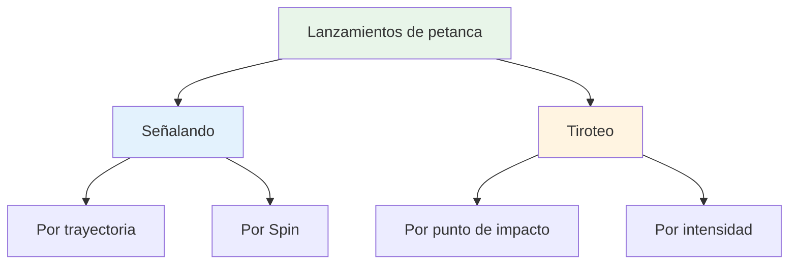
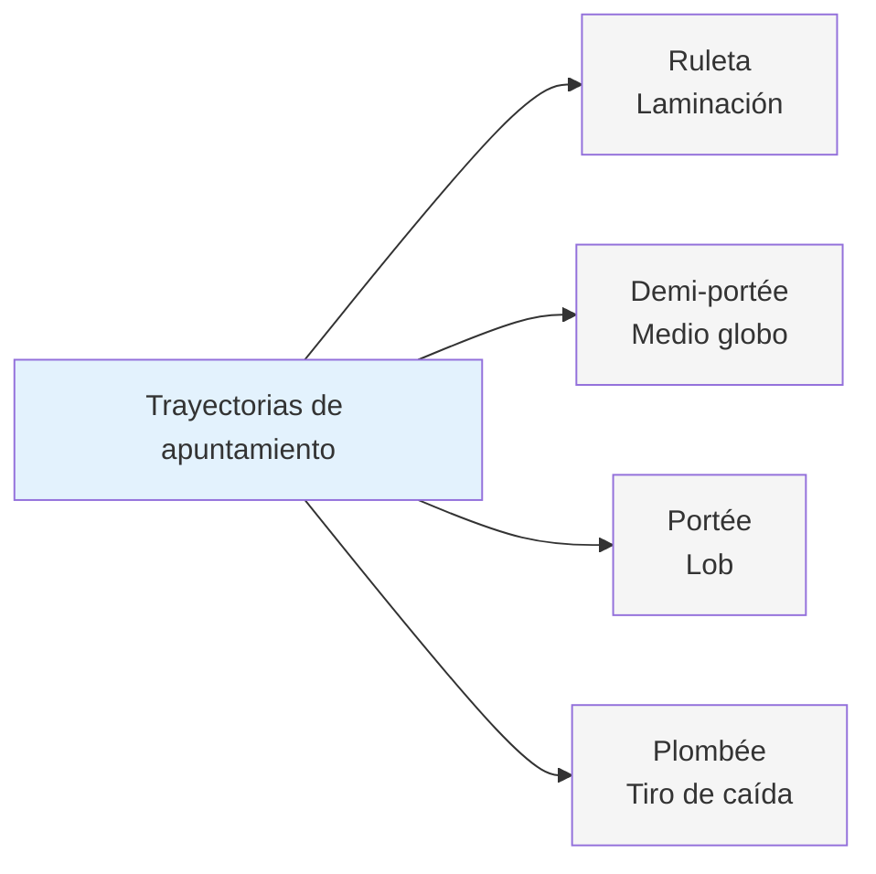
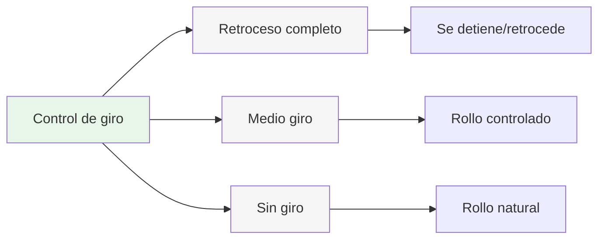
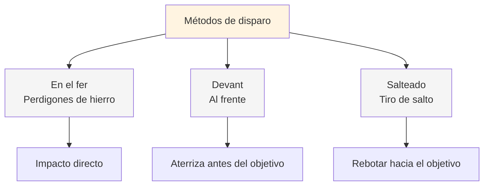
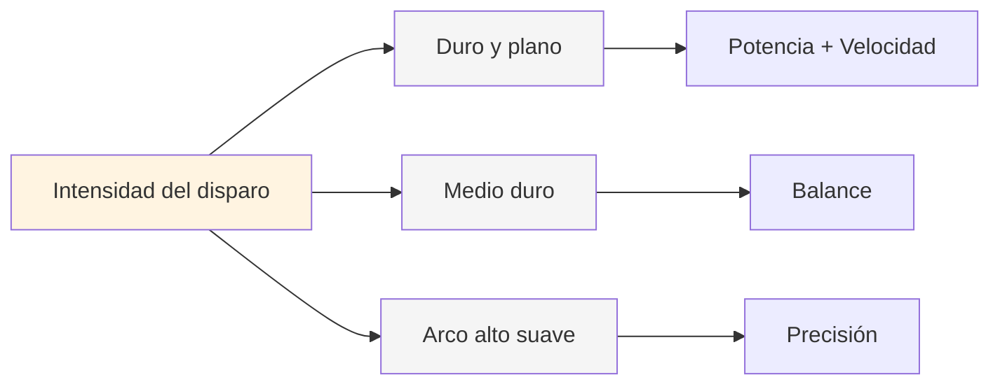
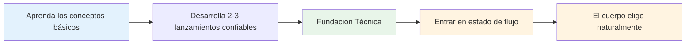

# Paleta de mantas

## El repertorio técnico completo

Este es un resumen de los lanzamientos disponibles en la petanca. No es necesario dominarlos todos, pero conocerlos te ayudará a comprender el alcance completo del juego.

::: tip El panorama general
**Comprender la paleta completa te ayudará a tomar decisiones informadas sobre qué desarrollar.** No necesitas dominar todo: concéntrate en lo que funciona para tu juego.
:::

## Técnicas de señalización

### Por trayectoria

| Tirar | Término francés | Trayectoria | Cuándo usarlo |
|-------|-------------|------------|-------------|
| **Laminación** | Ruleta | Bajo, rueda la mayor parte del camino | Terreno liso, distancia corta. |
| **Medio lóbulo** | Demi-portée | Medio, aterriza a mitad de camino | Más común, versátil |
| **Lob** | Portée | Alto, aterriza cerca del objetivo | Obstáculos, terreno accidentado |
| **Tiro de caída** | Plombée | Muy alto, cae verticalmente | Espacios reducidos, colocación precisa |

### Por Spin

| Tipo de giro | Efecto en el aterrizaje | Cuándo usarlo |
|-----------|-------------------|-------------|
| **Giro completo (backspin)** | Se detiene o retrocede al aterrizar | Es necesario detenerse rápidamente, evitando pasar de largo. |
| **Medio giro** | Efecto retroceso moderado, balanceo controlado | El más versátil y predecible. |
| **Sin giro** | Balanceo natural y neutral al aterrizar | Deja que el terreno dicte el rumbo |

## Técnicas de tiro

### Por punto de impacto

| Técnica | Término francés | Punto de impacto | Características |
|-----------|-------------|--------------|-----------------|
| **Perdigones de hierro** | En el fer | Impacto directo en la bola | El contacto limpio más común |
| **Al frente** | Devant | Aterrizaje justo antes del objetivo | Más seguro, se necesita menos precisión |
| **Tiro de salto** | Salteado | Rebotando hacia el objetivo | Avanzado, para obstáculos |

### Por intensidad

| Intensidad | Trayectoria | Cuándo usarlo |
|-----------|------------|-------------|
| **Tiro plano duro** | Directo, potente, plano. | Línea clara, se necesita distancia para golpear. |
| **Medianamente duro** | Potencia y control equilibrados | El más versátil |
| **Suave con arco alto** | Disparo de globo, cae desde arriba | Obstáculos, espacios reducidos |

## La paleta completa

::: details Referencia rápida: todos los lanzamientos
**Señalando:**
- Ruleta (rodando)
- Demi-portée (medio lóbulo)
- Portée (lob)
- Plombée (drop shot)
- Giro completo / Medio giro / Sin giro

**Tiroteo:**
- Au fer (perdigones de hierro)
- Devant (al frente)
- Salteado (tiro con salto)
- Plano duro / Medio / Arco alto suave
:::

## Camino de maestría

::: tip Recordar
**El objetivo no es dominarlo todo.** Se trata de tener la base técnica suficiente para poder entrar en la zona y dejar que tu cuerpo elija el lanzamiento correcto de forma natural.

Concentrarse en:
1. **Técnicas de 2 a 3 puntos** en las que puedes confiar
2. **1-2 métodos de disparo** que funcionan para ti
3. **Ejecución consistente** bajo presión
4. **Juego mental** para acceder al estado de flujo
:::

::: info Próximos pasos
Una vez que tienes una técnica sólida, el verdadero crecimiento proviene de:
- **[La Zona](/es/educacion/juego-mental/la-zona/)** - Acceder a estados de flujo de forma consistente
- **[Métodos de entrenamiento](/es/educacion/técnica/entrenamiento/)** - Cómo practicar eficazmente
- **[Fuerza mental](/es/educacion/juego-mental/fuerza-mental/)** - Rendimiento bajo presión
:::

