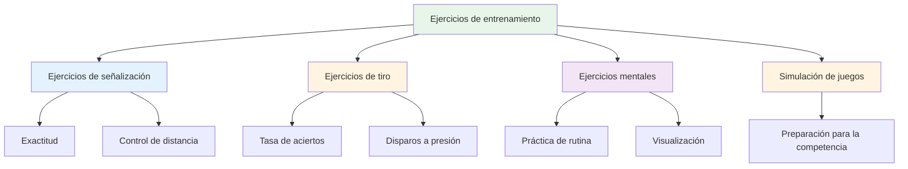

# Ejercicios de entrenamiento

Aquí tienes ejercicios probados que utilizan los jugadores de élite. Cada ejercicio tiene un propósito específico: elige según lo que necesites desarrollar.

::: tip La gran idea
**Cada ejercicio tiene un propósito específico.** No lances bolas al azar: elige ejercicios que se enfoquen en tus debilidades y contribuyan a tus objetivos. Monitorea tu progreso para ver si mejora.
:::

## Ejercicios de señalización

### El callejón
**Propósito:** Aislar el ángulo de liberación y la consistencia de la línea

**Configuración:**
- Coloque dos marcadores separados entre 30 y 40 cm, aproximadamente a 1 metro del círculo.
- El objetivo está a 7-9 metros de distancia.

**Perforar:**
- Lanzar a través del &quot;callejón&quot; (entre los marcadores)
- Cualquier lanzamiento que impacte un marcador está &quot;muerto&quot;.
- Centrarse en un punto de liberación consistente

**Progresión:**
- Estrecha el callejón a medida que mejoras
- Varía la distancia del objetivo
- Añadir una zona de aterrizaje específica

### Zonas de precisión
**Propósito:** Desarrollar la precisión en áreas específicas

**Configuración:**
- Marcar zonas alrededor de un objetivo (por ejemplo, círculos a 20 cm, 40 cm, 60 cm)
- O utilice marcadores naturales en el terreno.

**Tanteo:**
- Dentro de 20cm: 3 puntos
- Interior 40cm: 2 puntos
- Interior 60cm: 1 punto
- Exterior: 0 puntos

**Perforar:**
- Lanza 10 bolas y sigue tu puntuación
- Objetivo: Mejora constante a lo largo de las sesiones.

### Variación de la distancia
**Propósito:** Desarrollar el control de la profundidad

**Configuración:**
- Coloque objetivos a 6 m, 7 m, 8 m, 9 m, 10 m

**Perforar:**
- Lanzar a cada distancia en orden aleatorio
- El compañero anuncia la distancia
- Concéntrese en ajustar el peso, no la técnica.

**Variación:**
- Agregue llamadas &quot;cortas&quot; y &quot;largas&quot; después de publicar
- Debe ajustarse en pleno vuelo (desarrolla sensibilidad)

## Ejercicios de tiro

### La escalera de tiro
**Propósito:** Desarrollar precisión bajo presión progresiva

**Configuración:**
- Coloque una bola de diana a 6 metros
- Marcar distancias a 7m, 8m, 9m, 10m

**Perforar:**
- Empezar a 6 metros
- Golpear = retroceder un metro
- Miss = avanzar un metro (o reiniciar)
- Objetivo: alcanzar los 10 metros

**Variaciones:**
- Versión estricta: Cualquier fallo vuelve a 6 m.
- Versión cronometrada: ¿Qué tan lejos puedes llegar en 10 minutos?
- Versión de equipo: alternar con compañero

### La barrera (Blox)
**Propósito:** Forzar disparos de arco alto

**Configuración:**
- Coloque una barrera (un palo, una cuerda o un obstáculo) entre usted y el objetivo.
- La barrera debe ser lo suficientemente alta como para requerir un globo.

**Perforar:**
- Debes superar la barrera para alcanzar el objetivo.
- Cualquier lanzamiento que golpee la barrera está &quot;muerto&quot;
- Desarrolla un punto de liberación alto

**Por qué es importante:**
- La competencia a menudo requiere disparar sobre obstáculos.
- Aumenta la versatilidad en tus disparos.

### Carrera de obstáculos
**Propósito:** Desarrollar la fotografía desde diferentes ángulos.

**Configuración:**
- Coloque la bola objetivo en el centro
- Añade obstáculos (otras bolas, marcadores) a su alrededor.

**Perforar:**
- Dispara desde diferentes posiciones alrededor del círculo.
- Hay que encontrar el ángulo que funcione
- Desarrolla la lectura de líneas de tiro.

## Ejercicios de entrenamiento mental

### Repetición de rutina
**Propósito:** Automatizar tu rutina previa a la inyección

**Perforar:**
- Practica tu rutina completa sin tirar
- Realice cada paso deliberadamente
- Haz de 10 a 20 repeticiones
- Luego añade el tiro

**Enfocar:**
- Tiempo consistente
- Transición clara del pensamiento a la ejecución
- La misma rutina cada vez

### Puntos de presión
**Propósito:** Practicar el desempeño bajo presión

**Configuración:**
- Crear un escenario de &quot;obligación&quot;
- Establecer consecuencias por faltar

**Ejemplos:**
- &quot;Haz 3 seguidos o empieza de nuevo&quot;
- &quot;Señorita, haga 10 flexiones&quot;
- &quot;Anuncia tu objetivo antes de lanzar&quot;

**Llave:**
- La presión debe sentirse real
- Practica tu respuesta mental a la presión
- Utiliza tu rutina exactamente como en la competición

### Práctica de recuperación
**Propósito:** Desarrollar el hábito del reinicio mental rápido

**Perforar:**
- Lanzar intencionalmente una bola mala
- Practique inmediatamente SOAS (Detenerse, Observar, Aceptar, Deslizar)
- Lanzar la siguiente bola con total compromiso

**Enfocar:**
- No te detengas en la señorita
- Reiniciar completamente antes del próximo lanzamiento
- Mantener un lenguaje corporal positivo

## Ejercicios de simulación de juegos

### El deleite de Millieu
**Propósito:** Romper el bloqueo del ritmo, desarrollar versatilidad

**Perforar:**
- Alterna entre apuntar y disparar en cada lanzamiento.
- No se permiten dos lanzamientos consecutivos del mismo tipo
- Desarrolla la capacidad de cambiar de modo.

### Juego de escenario
**Propósito:** Practicar la toma de decisiones tácticas

**Configuración:**
- Establecer situaciones de juego realistas
- Asignar puntuaciones y recuentos de bolas

**Ejemplos:**
- &quot;Estás perdiendo 10-8, el oponente tiene 2 puntos, tú tienes 2 bolas&quot;
- Empatados 6-6, tienes la última bola, ellos tienen 1 punto.

**Perforar:**
- Decidir qué hacer
- Ejecutar con pleno compromiso
- Revise la decisión después

### Match Play con reglas
**Propósito:** Simulación de competición

**Variaciones:**
- Jugar hasta 13 (juego completo)
- Jugar hasta 7 (más corto, más juegos)
- &quot;Puntos de presión&quot;: ciertos fines que valen el doble
- &quot;Muerte súbita&quot;: el primero en perder un final pierde el juego.

## Seguimiento de sus ejercicios

Mantenga un registro de cada ejercicio:

| Fecha | Perforar | Puntuación/Resultado | Notas |
|------|-------|--------------|-------|
| | | | |

**Seguimiento a lo largo del tiempo:**
- ¿Estás mejorando?
- ¿Qué ejercicios ayudan más?
- ¿Dónde tienes dificultades?

## Construyendo una sesión de ejercicios

### Calentamiento (10 min)
- Lanzamientos fáciles para relajarse
- Sin presión, solo siente

### Enfoque técnico (20-30 min)
- Uno o dos ejercicios enfocados en habilidades específicas
- Práctica bloqueada para nuevas habilidades
- Práctica aleatoria para habilidades establecidas

### Simulación de presión/juego (20-30 min)
- Añadir consecuencias
- Crear escenarios realistas
- Practica habilidades mentales

### Enfriamiento (10 min)
- Lanzamientos fáciles
- Reflexionar sobre la sesión
- Tenga en cuenta en qué trabajar a continuación

## Conclusión clave

> Los taladros son herramientas. Elige la herramienta adecuada para lo que necesitas construir.

No te limites a lanzar bolas. Entrena con un propósito.

