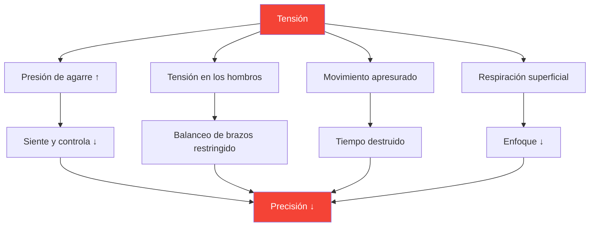

# Comprender la tensión en los deportes de precisión

::: tip La tensión es enemiga de la precisión
**Peso: 300 puntos** — No se puede ser tenso y preciso al mismo tiempo. Aprender a gestionar la tensión es esencial para un rendimiento consistente.
:::

## La paradoja de la precisión

> &quot;Cuanto más lo intentas, peor lo haces.&quot;

Esto no es debilidad, sino física y fisiología. La petanca requiere movimientos relajados y fluidos. La tensión destruye las cualidades que producen lanzamientos precisos.

### Cómo la tensión destruye la precisión



---

## Tensión física vs. tensión mental

La tensión existe en dos formas conectadas:

### Tensión física

Tensión muscular que afecta directamente el lanzamiento:

| Área | Efecto al lanzar |
|------|-----------------|
| **Agarre** | Pérdida de sensibilidad, liberación inconsistente |
| **Antebrazo** | Movimiento restringido de la muñeca |
| **Hombro** | Balanceo de brazos acortado y entrecortado |
| **Cuello** | Posición de la cabeza y visión restringidas |
| **Mandíbula** | Conectado a la tensión corporal general |
| **Centro** | Problemas de equilibrio y transferencia de peso |

### Tensión mental

Estrés psicológico que genera síntomas físicos:

- Pensamientos acelerados
- Preocuparse por los resultados
- Miedo al fracaso
- Conciencia de la presión
- Errores pasados que se repiten

::: warning El bucle de tensión
Tensión mental → Tensión física → Bajo rendimiento → Más tensión mental

Romper este bucle es esencial para un juego consistente.
:::

---

## La ley de Yerkes-Dodson

La relación entre la excitación (nivel de activación) y el rendimiento sigue una curva de U invertida:

```
Performance
    ↑
    │         ★ Optimal Zone
    │        /\
    │       /  \
    │      /    \
    │     /      \
    │    /        \
    │   /          \
    └──┴────────────┴──→ Arousal
     Low           High

   "Flat"   "Alert"   "Tense"
   Unfocused Relaxed  Anxious
```

### Demasiado bajo (poco excitado)
- Plano, desenfocado
- Errores por descuido
- Falta de intensidad
- Siguiendo los pasos

### Demasiado alto (sobreexcitado)
- Tenso, apresurado
- Cavilaciones
- Agarre fuerte, movimiento restringido
- No se puede recuperar de los errores

### Zona óptima
- Alerta pero relajado
- Enfocado pero fluido
- Intensidad apropiada
- Recuperación rápida

---

## Encontrar SU zona óptima

Cada jugador tiene un nivel de excitación óptimo diferente:

### El proceso de autoevaluación

1. **Recuerda tus mejores actuaciones**
   - ¿Cómo te sentiste físicamente?
   - ¿Cuál era tu nivel de energía?
   - ¿Cómo calificarías tu excitación (del 1 al 10)?

2. **Recuerda tus peores actuaciones**
   - ¿Estabas demasiado plano o demasiado tenso?
   - ¿Qué síntomas físicos notaste?
   - ¿Qué desencadenó el estado subóptimo?

3. **Identifica tu patrón**
   - ¿Tiene tendencia a la sobreexcitación o a la subexcitación?
   - ¿Qué situaciones desencadenan tu patrón?
   - ¿Qué le ayuda a volver al estado óptimo?

### Perfiles de jugadores comunes

| Perfil | Tendencia | Situaciones de riesgo | Estrategia |
|---------|----------|-----------------|----------|
| **El Preocupado** | Sobreexcitación | Apuestas altas, juegos reñidos | Técnicas de relajación |
| **La línea plana** | Subexcitación | Rondas tempranas de bajo riesgo | Técnicas de activación |
| **El reactor** | Variable | Después de los fallos, el impulso cambia | Regulación emocional |
| **El cazador** | Sobreexcitación cuando estás detrás | Regresos, presión del tiempo | Técnicas de aceptación |

---

## Reconociendo señales de tensión

### Señales de advertencia físicas

Aprende a notar estos cambios antes de que afecten tu lanzamiento:

| Señal | Ubicación | Acción |
|--------|----------|--------|
| **Agarre fuerte** | Mano | Suavizar antes de cada lanzamiento |
| **Hombros levantados** | Parte superior de la espalda | Caer y rodar |
| **Mandíbula apretada** | Rostro | Abra ligeramente la boca |
| **Respiración superficial** | Pecho | Respiración abdominal profunda |
| **Movimiento apresurado** | Todo el cuerpo | Disminuya la velocidad deliberadamente |
| **Inquietud inquieta** | General | Conéctate a tierra |

### Señales de advertencia mental

- Pensamientos acelerados
- El diálogo interno negativo aumenta
- Centrarse en el resultado, no en el proceso
- Conciencia de lo que está en juego/puntuación
- Pensando en los errores del pasado

---

## Autoevaluación del rendimiento en tensión

Utilice esta evaluación rápida entre lanzamientos o en los descansos:

**Escaneo físico (5 segundos):**
1. Agarre → ¿Suave?
2. Hombros → ¿Abajo?
3. Mandíbula → ¿Sin apretar?
4. Respiración → ¿Lenta y profunda?

**Escaneo mental (5 segundos):**
1. Pensamientos → ¿Enfocado en el presente?
2. Energía → ¿Rango óptimo?
3. Siguiente acción → ¿Borrar?

::: tip Hazlo un hábito
Los mejores jugadores lo hacen automáticamente. Puedes entrenarte para hacer lo mismo mediante la repetición.
:::

---

## En este módulo

### Técnicas de liberación de tensión
- Relajación muscular progresiva (PMR)
- Técnicas de liberación rápida para competición
- Protocolos de respiración
- Reinicio de tensión antes del lanzamiento

### Gestión de la tensión en la competición
- Preparación previa al partido
- Protocolos durante el partido
- Recuperación de emergencia por tensión excesiva
- Recuperación tras un error

---

## Victoria rápida: el reinicio de 10 segundos

Antes de tu próximo lanzamiento, utiliza este protocolo rápido:

1. **Hombros** — Déjalos caer conscientemente
2. **Agarre** — Aligera un 20%
3. **Mandíbula** — Afloja, separa la lengua del paladar
4. **Respiración**: una exhalación lenta y completa

Esto toma 10 segundos y puede mejorar inmediatamente tu próximo lanzamiento.

---

## Factores relacionados

- [Fuerza mental](/es/educacion/juego-mental/fuerza-mental/) — Manejo de la presión
- [Sueño y recuperación](/es/educacion/sueño/) — El descanso reduce la tensión basal
- [Mindfulness](/es/educacion/juego-mental/mindfulness/) — Conciencia del momento presente
- [La Zona](/es/educacion/juego-mental/la-zona/) — Estado de rendimiento óptimo

