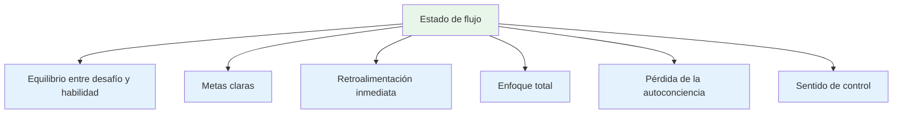
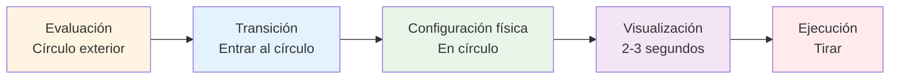
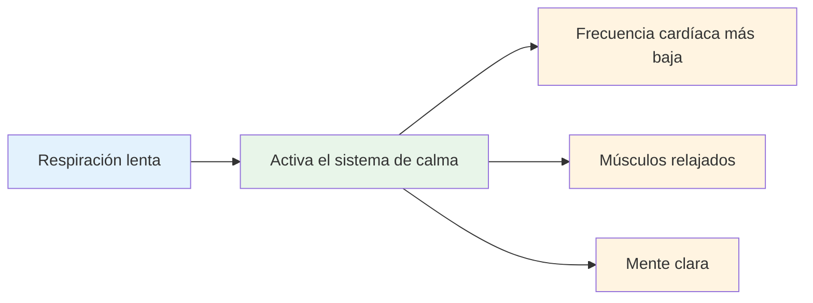
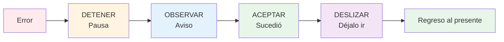

# Entrar en la zona: técnicas prácticas
<AdBanner />

La zona no es algo que simplemente te sucede. Con la práctica, puedes aprender a acceder a ella con mayor consistencia. Aquí tienes técnicas probadas que utilizan los atletas de élite.

::: tip La gran idea
**Puedes entrenarte para entrar en estados de flujo de forma más confiable.** La zona no es magia: es una habilidad que se desarrolla a través de técnicas específicas y práctica constante.
:::

## Las seis condiciones para el flujo

Las investigaciones muestran que los estados de flujo requieren ciertas condiciones:

| Condición | Qué significa | En la petanca |
|-----------|---------------|-------------|
| **Equilibrio entre desafío y habilidad** | La tarea te exige mucho, pero es alcanzable. | Competir a tu nivel, ni demasiado fácil ni imposible |
| **Objetivos claros** | Sabes exactamente lo que estás intentando hacer. | Objetivo específico, intención clara para cada lanzamiento. |
| **Retroalimentación inmediata** | Ves resultados de tus acciones | La pelota aterriza, sabes si funcionó |
| **Enfoque total** | Atención plena en la tarea | Sin distracciones, solo el momento presente |
| **Pérdida de la autoconciencia** | No me preocupa cómo te ves | No me importa quién esté mirando |
| **Sensación de control** | Siéntete capaz de manejarlo | Confía en tu formación y capacidad |

::: info Visión clave
Cuando estas seis condiciones se alinean, el flujo se hace posible. Tu trabajo es crear estas condiciones deliberadamente.
:::

## Técnica 1: La rutina previa al disparo

Tu rutina previa al tiro es tu puerta de entrada a la zona. Es una secuencia constante que le indica a tu cerebro: &quot;Es hora de ejecutar&quot;.

### Construyendo tu rutina

Una buena rutina tiene estos elementos:

::: details 1. Evaluación visual (fuera del círculo)
- Leer el terreno
- Elige tu objetivo y lugar de aterrizaje
- Decide el tipo de lanzamiento

**Aquí es donde ocurre el pensamiento.** Tómate tu tiempo aquí.
:::

::: details 2. Transición (Entrada al círculo)
- Toma un respiro
- Deja ir el análisis
- Cambiar al modo de ejecución

**Este es el cambio.** El análisis termina aquí.
:::

::: details 3. Desencadenante físico (en el círculo)
- Una configuración de postura consistente
- Una comprobación de agarre específica
- Un pequeño movimiento que te resulte natural.

**Hazlo consistente.** Lo mismo cada vez.
:::

::: details 4. Visualización (breve, 2-3 segundos)
- Ver la trayectoria de la pelota
- Siente el lanzamiento exitoso
- Conéctate con tu objetivo

**Sea breve.** Demasiado largo = pensar demasiado.
:::

::: details 5. Ejecución
- Concéntrese sólo en el objetivo
- Confía en tu cuerpo
- Liberación sin dudarlo

**Solo enfoque externo.** Objetivo, no técnica.
:::

### Por qué funcionan las rutinas

Tu rutina se convierte en una señal de atención plena: una señal que cambia tu estado mental. Con suficiente repetición, el simple hecho de comenzar tu rutina desencadena el cambio mental hacia la fluidez.

::: tip Consejo práctico
Usa tu rutina en CADA lanzamiento durante los entrenamientos, no solo en las competiciones. La rutina debe volverse automática.
:::

<AdInArticle />

## Técnica 2: Enfoque externo

El lugar donde pones tu atención importa enormemente.

| Tipo de enfoque | En qué piensas | Pensamientos de ejemplo |
|------------|---------------------|------------------|
| **Interno** ❌ | La mecánica de tu cuerpo | &quot;Mantén mi codo recto&quot;  &quot;Seguir adelante adecuadamente&quot;  &quot;No agarres demasiado fuerte&quot; |
| **Externo** ✅ | Objetivo y resultado | &quot;Aterrízalo justo ahí&quot;  &quot;Ver el camino&quot;  &quot;Dar en el blanco&quot; |

::: tip Hallazgos de investigación
Los estudios demuestran consistentemente que **la concentración externa produce mejores resultados** en jugadores expertos. Tu cuerpo sabe qué hacer: déjalo trabajar.
:::

### Practique el enfoque externo
- Elija un lugar específico en el suelo (no solo &quot;cerca del gato&quot;)
- Visualiza la trayectoria completa de la pelota
- Mantén la vista en el objetivo, no en tu mano.

::: warning Error común
Bajo presión, los jugadores suelen recurrir a la concentración interna (&quot;No me arruines la técnica&quot;). Es precisamente cuando más se necesita la concentración externa.
:::

## Técnica 3: El apretón de la mano izquierda

Esta inusual técnica tiene respaldo científico.

::: info La ciencia
Apretar la mano izquierda (si es diestro) durante 10 a 15 segundos antes de lanzar:
- ✅ Activa el hemisferio derecho de tu cerebro (espacial, intuitivo)
- ✅ Calma el hemisferio izquierdo (verbal, analítico)
- ✅ Reduce el pensamiento excesivo
:::

**Cómo usarlo:**
1. Haz un puño con la mano que no usas para lanzar
2. Apriete firmemente durante 10-15 segundos.
3. Liberate y comienza tu rutina
4. Tirar

::: tip Cuándo usarlo
Esto funciona mejor cuando notas que piensas demasiado o te sientes presionado. Es como un botón de reinicio para tu cerebro.
:::

## Técnica 4: Control de la respiración

Tu respiración afecta directamente tu estado mental.

**Antes de entrar al círculo:**
- Tome una respiración lenta y profunda
- Exhala completamente
- Siente como tus hombros caen

**En el círculo:**
- Respira naturalmente
- No contengas la respiración durante el lanzamiento.
- Deja que la exhalación acompañe tu liberación.

::: details La técnica 4-7-8 (para alta presión)
1. Inhala durante 4 segundos
2. Mantener durante 7 tiempos
3. Exhala durante 8 segundos
4. Repetir una o dos veces

**Por qué funciona:** Esto activa el sistema nervioso parasimpático (el sistema de &quot;calma&quot;).
:::

## Técnica 5: Palabras desencadenantes

Una palabra o frase desencadenante puede cambiar instantáneamente tu estado mental.

::: tip Palabras clave populares
- &quot;Liso&quot;
- &quot;Confianza&quot;
- &quot;Míralo, sélo&quot;
- &quot;Déjalo ir&quot;
- &quot;Fluir&quot;
- &quot;Fácil&quot;
:::

**Cómo desarrollar el tuyo:**
1. Piensa en una ocasión en la que actuaste perfectamente.
2. ¿Qué palabra captura ese sentimiento?
3. Usa esa palabra en tu rutina
4. Dilo en silencio mientras te preparas para lanzar.

::: info Por qué funciona
Con la repetición, la palabra se vincula con tu mejor rendimiento. Es un atajo mental para fluir.
:::

## Técnica 6: Reiniciar después de los errores

Los errores ocurren. La clave es no dejar que un mal lanzamiento se convierta en dos.

**El método SOAS:**

| Paso | Acción | Qué significa |
|------|--------|---------------|
| **Detener | Pausa, no reacciones inmediatamente | No levantes las manos, no maldigas. |
| **Observar | Observa lo que pasó sin juzgar | &quot;La pelota se fue a la izquierda&quot; no &quot;soy terrible&quot; |
| **Aceptar | Pasó, está hecho. | No se puede cambiar el pasado |
| **Deslizar | Déjalo ir, suéltalo | Regresar al momento presente |

::: warning Habilidad crítica
Esto requiere práctica, pero evita la espiral de frustración que impide el flujo. Practica SOAS en tu vida diaria para que se adapte automáticamente a la competencia.
:::

## Construyendo su kit de herramientas de flujo

No todas las técnicas funcionan para todos. Experimenta y encuentra la que te funcione:

| Situación | Prueba esto |
|-----------|----------|
| Cavilaciones | Apretón de mano izquierda, enfoque externo |
| Nervioso/tenso | Control de la respiración, palabra clave |
| Después de un error | Método SOAS |
| Lanzamiento importante | Rutina completa previa al disparo |
| Perdiendo el enfoque | Regreso a la rutina básica |

## La práctica hace la permanencia

Estas técnicas sólo funcionan si las practicas:

1. **Usa tu rutina en cada lanzamiento de práctica** - no solo en las competiciones
2. **Simular presión** - crear consecuencias en la práctica
3. **Presta atención cuando estés en estado de flujo**: ¿qué lo desencadenó?
4. **Revisión después de las sesiones**: ¿Qué ayudó y qué no?

## Conclusión clave

::: tip Recordar
**La zona no es cuestión de suerte. Es una habilidad que puedes desarrollar.**

Empieza con tu rutina previa a la inyección. Sé constante. Confía en ella. La zona llegará sola.
:::

<AdBanner />
