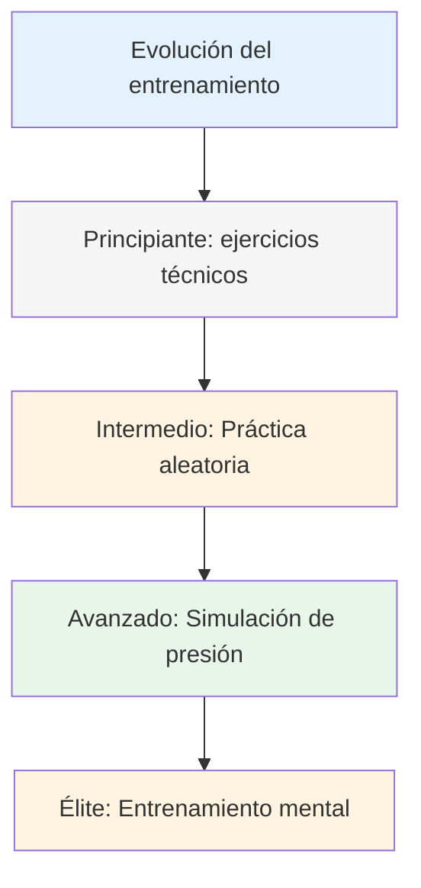
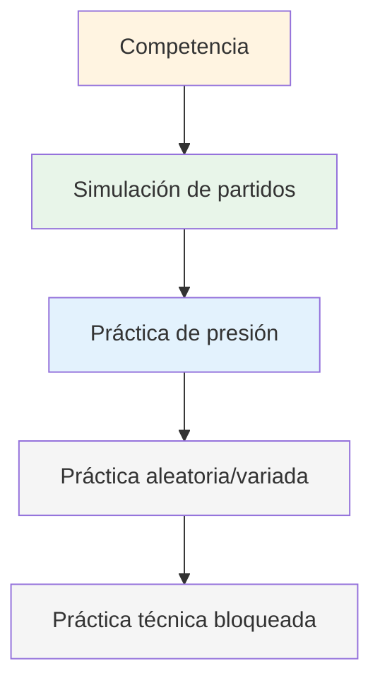

# Métodos de entrenamiento
<AdBanner />

Cuando tu técnica es sólida, ¿qué practicas? Aquí es donde muchos jugadores se estancan: siguen practicando la técnica cuando el verdadero crecimiento reside en otra área.

::: tip La gran idea
**La mayoría de los jugadores se estancan porque siguen practicando la técnica cuando el verdadero crecimiento está en otra parte.** Los jugadores de élite entrenan la adaptabilidad, la toma de decisiones y la fortaleza mental, no solo la mecánica.
:::

## Más allá de la repetición técnica

La mayoría de los jugadores entrenan repitiendo lanzamientos. Esto es importante para los principiantes, pero los jugadores avanzados necesitan más:

| Tipo de entrenamiento | Lo que desarrolla | Cuándo usarlo |
|--------------|------------------|-------------|
| ejercicios técnicos | Mecánica, forma | Aprender nuevas habilidades, solucionar problemas |
| Práctica aleatoria | Adaptabilidad, toma de decisiones | Preparación para la competición |
| Simulación de presión | Fortaleza mental | Antes de eventos importantes |
| Entrenamiento mental | Concentración, recuperación y confianza | En curso, a menudo descuidado |

## La pirámide de entrenamiento

::: warning Error común
**La mayoría de los jugadores pasan demasiado tiempo en la base.** Los jugadores de élite trabajan en todos los niveles de la pirámide, con énfasis en los niveles superiores a medida que avanzan.
:::

## Práctica bloqueada vs. práctica aleatoria

### Práctica bloqueada
Repite el mismo lanzamiento muchas veces:
- 20 puntos desde 7 metros
- 20 disparos al mismo objetivo
- Misma distancia, mismo lanzamiento

**Bueno para:** Aprendizaje inicial, desarrollo de confianza, calentamiento.
**Limitación:** No se transfiere bien a la competencia.

### Práctica aleatoria
Varía todo:
- Diferentes distancias en cada lanzamiento
- Apuntar y disparar alternativamente
- Cambiar objetivos constantemente

**Bueno para:** Preparación para competiciones, desarrollo de adaptabilidad.
**Sensación:** Más difícil, más errores, menos &quot;productivo&quot;
**Realidad:** Mejor retención y transferencia a largo plazo

### La investigación

Los estudios muestran consistentemente que:
- La práctica bloqueada se siente mejor (mejora rápida visible)
- La práctica aleatoria produce un mejor rendimiento en la competición
- La &quot;lucha&quot; de la práctica aleatoria es donde ocurre el aprendizaje.

<AdInArticle />

## Simulación de presión

No puedes manejar la presión de la competencia si nunca la experimentas en el entrenamiento.

### Creando presión en la práctica

**Consecuencias:**
- Flexiones para los fallos
- El perdedor compra café
- Los puntos cuentan para algo

**Escenarios:**
- Situaciones &quot;imprescindibles&quot;
- Abajo 12-10, necesitamos anotar
- Última bola del partido

**Audiencia:**
- Practica observando a la gente
- Grábate en vídeo
- Anuncia lo que estás intentando hacer

**Fatiga:**
- Practica cuando estés cansado
- Fin de una larga sesión
- Después del ejercicio físico

### La escalera de tiro

Un clásico taladro de presión:
1. Empezar a 6 metros
2. Dar en el objetivo = retroceder un metro
3. Señorita = avanzar un metro (o empezar de nuevo)
4. Objetivo: alcanzar los 10 metros

Esto crea una presión natural a medida que avanzas.

## Sesiones de entrenamiento mental

Dedica tiempo específicamente a las habilidades mentales:

### Sesión de visualización (15-20 min)
1. Encuentra un lugar tranquilo
2. Cierra los ojos
3. Visualízate en una competición
4. Ver lanzamientos exitosos en detalle
5. Siente la confianza y el flujo
6. Practica el manejo de momentos de presión

### Práctica de rutina previa al disparo
- Practica tu rutina sin tirar
- Centrarse en las transiciones mentales
- Desarrollar el hábito de la preparación constante

### Práctica de recuperación
- Cometer errores intencionalmente en la práctica
- Practica tu respuesta SOAS
- Desarrolla el hábito del reinicio mental rápido

## Estructurando tu semana de entrenamiento

### Ejemplo: Aficionado serio (6 horas/semana)

| Día | Duración | Enfocar |
|-----|----------|-------|
| Lunes | 1,5 horas | Técnico: Ejercicios de apuntamiento |
| Miércoles | 1,5 horas | Técnico: Ejercicios de tiro |
| Viernes | 1 hora | Mental: Visualización, práctica rutinaria |
| Sábado | 2 horas | Juego de partidos con elementos de presión |

### Ejemplo: Jugador competitivo (10 horas/semana)

| Día | Duración | Enfocar |
|-----|----------|-------|
| Lunes | 2 horas | Técnico: Apuntar (bloqueado → aleatorio) |
| Martes | 1 hora | Entrenamiento mental + visualización |
| Miércoles | 2 horas | Técnico: Disparo (bloqueado → aleatorio) |
| Jueves | 1 hora | Revisión de vídeo + trabajo mental |
| Viernes | 2 horas | Simulación de presión, escenarios de juego. |
| Sábado | 2 horas | Competición o juego de partidos |

## Principios de entrenamiento

### 1. Calidad sobre cantidad
- 30 minutos de concentración superan 2 horas de repetición sin sentido
- Detenerse cuando el enfoque disminuye
- Es mejor terminar temprano que practicar malos hábitos.

### 2. Práctica deliberada
- Tenga un objetivo específico para cada sesión
- Trabaja al límite de tus capacidades
- Obtener retroalimentación (video, socio, resultados)
- Ajuste en función de lo que aprenda

### 3. La recuperación importa
- Los días de descanso son parte del entrenamiento.
- El sueño afecta significativamente el rendimiento
- La fatiga mental es real: respétala

### 4. Seguimiento de todo
- Mantenga un registro de entrenamiento
- Tenga en cuenta lo que funciona y lo que no.
- Revisar periódicamente
- Ajuste su plan en función de los datos

## En esta sección

- **[Ejercicios de entrenamiento](/es/education/training/ejercicios)** - Ejercicios específicos para diferentes habilidades

## Conclusión clave

> Tu entrenamiento determina tu rendimiento. Entrena como quieres jugar.

Combina tu entrenamiento. Incluye trabajo mental. Crea presión. Monitorea tu progreso.

<AdBanner />
