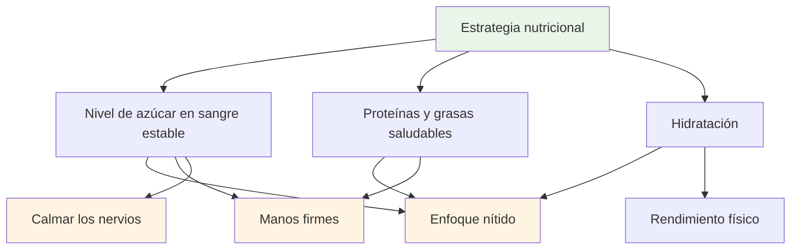
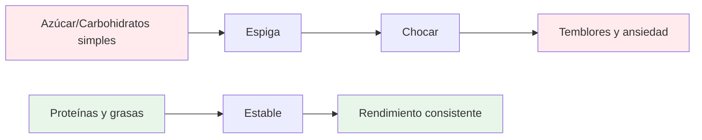
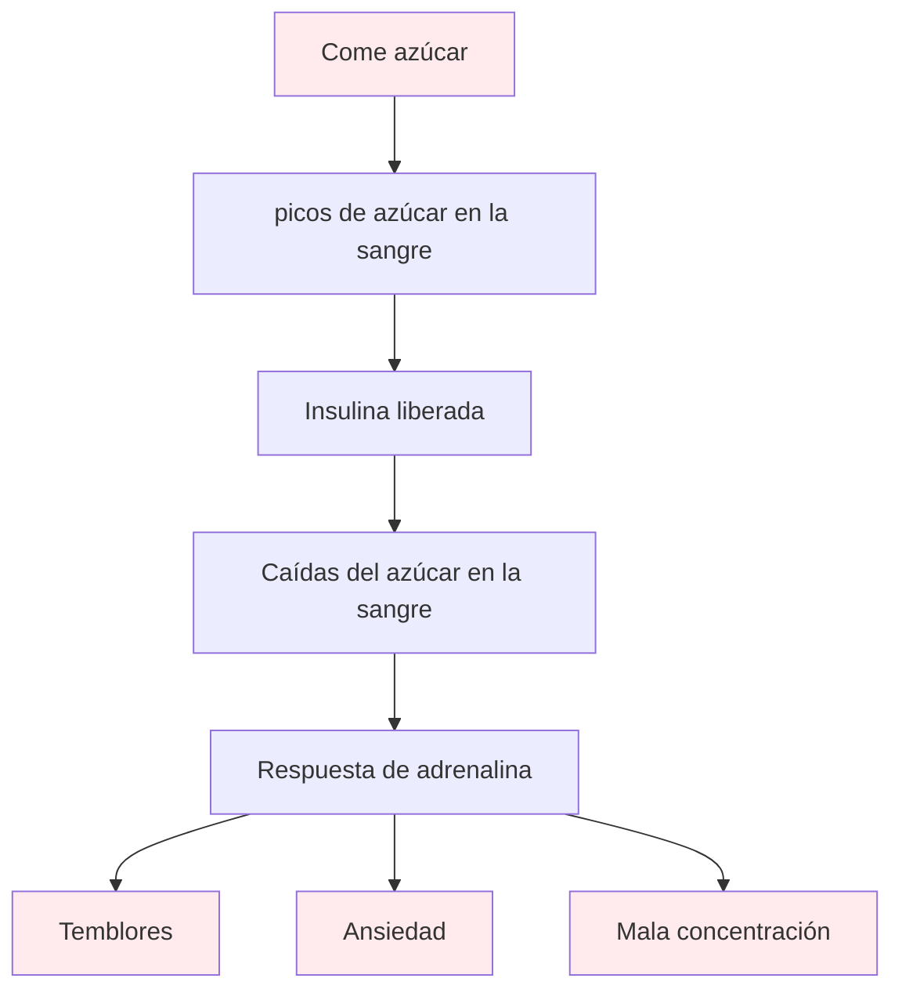

# Alimentación y nutrición

## Impulsando el rendimiento de precisión

La petanca es un deporte de precisión. Tu cerebro es tu herramienta más importante: aliméntalo con energía estable, no con energía de montaña rusa.

::: tip El principio fundamental
**Nivel de azúcar en sangre estable = Enfoque nítido + Manos firmes**

Evite los picos de azúcar. Priorice las proteínas y las grasas saludables. Manténgase hidratado.
:::

## Principios clave

### Un nivel de azúcar en sangre estable lo es todo

::: warning Impacto de las caídas de azúcar en sangre
El azúcar y los carbohidratos simples provocan picos y caídas de glucosa en sangre, lo que impacta directamente en:
- ❌ Concentración mental y claridad
- ❌ Manos firmes (temblores por bajadas de azúcar en sangre)
- ❌ Calidad en la toma de decisiones
- ❌ Estabilidad emocional y compostura
:::

### Priorizar las proteínas y las grasas saludables

::: tip Los mejores alimentos para la precisión
Las grasas y las proteínas aportan energía sostenida sin caídas:
- ✅ Frutos secos, aguacate, aceite de oliva, huevos, queso.
- ✅ Digestión lenta = energía constante todo el día
- ✅ Sin bajón de energía por la tarde durante torneos largos
:::

### Evite la trampa del azúcar

::: danger Alimentos que se deben evitar
Tenga especial cuidado con:
- ❌ Barritas y bebidas «energéticas» (a menudo ricas en azúcar)
- ❌ Jugos de frutas y batidos (azúcar concentrado)
- ❌ Pan blanco, bollería, snacks de máquinas expendedoras
:::

## Guía rápida del día de la competición

| Momento | Qué comer | Por qué |
|--------|-------------|-----|
| **2-3 horas antes** | Comida equilibrada: proteínas, grasas, verduras. | Energía estable sin somnolencia |
| **Durante la competición** | Agua + pequeños snacks proteicos (frutos secos, queso, cecina) | Mantenga la concentración y las manos firmes |
| **Evitar todo el día** | Snacks y bebidas azucaradas | Prevenir choques y temblores |

::: tip Snacks rápidos para la competición
**Trae esto:**
- Frutos secos mixtos (sin sal)
- huevos duros
- Cubitos de queso
- Cecina de res o pavo
- Verduras con hummus

**Deja esto en casa:**
- Dulces y chocolate
- bebidas energéticas
- Pasteles
- Zumo de frutas
:::

## La ciencia

::: info Por qué esto es importante para la petanca
A diferencia de los deportes de resistencia, la petanca requiere:
- **Precisión** - Manos firmes, sin temblores
- **Claridad mental**: toma de decisiones precisa durante todo el día
- **Nervios tranquilos** - Baja ansiedad bajo presión

La energía basada en el azúcar actúa contra todos estos factores.
:::

## Más información

Para conocer estrategias nutricionales detalladas, protocolos para el día de la competencia y la ciencia detrás de la energía estable:

::: tip Guía completa de nutrición
→ **[Nutrición para un Rendimiento de Precisión](./education/nutrition/)** - Guía completa en nuestra sección de Educación

Incluye:
- Planificación detallada de comidas
- Protocolos del día de la competición
- La opción baja en carbohidratos para deportistas de precisión
- Estrategias de hidratación
- Alimentos que ayudan vs. alimentos que dañan
:::

