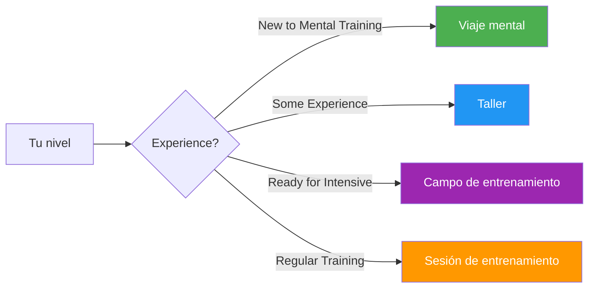

# Guías y herramientas

Recursos prácticos para jugadores, entrenadores y clubes para implementar programas de entrenamiento mental estructurados.

## Elige tu formato

## Formatos de guía

### 🌱 [Viaje Mental](/es/guias/viaje-mental/)
**Para principiantes**: introducción de 2 a 3 horas

Perfecto para jugadores que se inician en el entrenamiento mental. Una introducción sencilla a los conceptos básicos con ejercicios prácticos.

- Duración: 2-3 horas
- Tamaño del grupo: 4-12 jugadores
- Materiales: proporcionados
- [Ver guía →](/es/guias/viaje-mental/)

---

### 🎯 [Taller](/es/guias/taller/)
**Para nivel intermedio**: inmersión profunda de 3 a 4 horas

Formato de taller estructurado para clubes y equipos que quieran explorar el entrenamiento mental más seriamente.

- Duración: 3-4 horas
- Tamaño del grupo: 6-8 jugadores
- Incluye: Guía del coordinador + materiales descargables
- [Ver guía →](/es/guias/taller/)

---

### 🏕️ [Campo de entrenamiento](/es/guias/campo-de-entrenamiento/)
**Para equipos comprometidos** — Fin de semana intensivo

Programa completo de fin de semana que combina teoría, práctica y competición. Ideal para equipos que se preparan para torneos importantes.

- Duración: 2-3 días
- Tamaño del grupo: 10-20 jugadores
- Incluye: Programa completo + materiales organizadores
- [Ver guía →](/es/guias/campo-de-entrenamiento/)

---

### 🔄 [Sesión de formación](/es/guias/sesion-de-formacion/)
**Para práctica regular**: sesiones estructuradas de 2 a 4 horas

Marco para sesiones de entrenamiento regulares que incorporan habilidades mentales junto con la práctica técnica.

- Duración: 2-4 horas
- Tamaño del grupo: 4 jugadores (un equipo)
- Enfoque: Simulación de competición con reflexión
- [Ver guía →](/es/guias/sesion-de-entrenamiento/)

---

## Plantillas y herramientas

Plantillas descargables para apoyar tu desarrollo:

### 📋 [Plantilla de objetivo](/es/guias/plantillas/plantilla-de-objetivo)
Hoja de trabajo estructurada para establecer y realizar un seguimiento de sus objetivos de petanca utilizando el marco SMART.

### 📓 [Plantilla de diario](/es/guias/plantillas/plantilla-de-diario)
Plantilla de diario de entrenamiento y competición para realizar un seguimiento del progreso, los conocimientos y las áreas de mejora.

---

## ¿Qué formato es adecuado para usted?

| Formato | Mejor para | Compromiso de tiempo | Profundidad |
|--------|----------|-----------------|-------|
| **Viaje mental** | Primera introducción | 2-3 horas | ⭐ |
| **Taller** | Días de entrenamiento del club | 3-4 horas | ⭐⭐ |
| **Campo de entrenamiento** | Preparación del equipo | Fin de semana | ⭐⭐⭐ |
| **Sesión de entrenamiento** | Desarrollo continuo | Regular 2-4h | ⭐⭐ |

::: tip Para entrenadores y líderes de clubes
Cada guía incluye materiales tanto para participantes como para facilitadores/organizadores. Busque la sección &quot;Para Coordinadores&quot; con archivos PDF descargables y diapositivas de presentación.
:::

## Recursos relacionados

- [🎯 Evaluación](/es/evaluación/) — Evalúa tus 8 factores y encuentra prioridades
- [📚 Centro Educativo](/es/educacion/) — Profundice en los 8 factores de rendimiento
- [📝 Artículos](/es/articulos/) — Investigación y perspectivas

