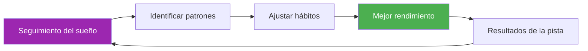

# Plantilla de seguimiento del sueño

> &quot;El jugador que duerme mejor suele ganar.&quot;

Realice un seguimiento de sus patrones de sueño y correlacionelos con el rendimiento para optimizar la recuperación.

::: tip ¿Por qué realizar un seguimiento del sueño?
**El sueño es la herramienta de recuperación número uno.** Los atletas de élite que controlan su sueño de manera constante informan tener más energía, tiempos de reacción más rápidos y una mejor toma de decisiones bajo presión.
:::

---

## Entrada diaria rápida

### Copia esto para cada día

---

**Fecha:** ________

| **Hora de dormir:** ________ | **Hora de despertarse:** ________ |
**Total de sueño:** ________ horas

**Calidad del sueño (1-10):** _____

**Factores que afectan el sueño:**
- [ ] Cafeína después de las 2pm
- [ ] Alcohol
- [ ] Tiempo frente a la pantalla antes de acostarse
- [ ] Estrés/preocupación
- [ ] Disturbios por ruido/luz
- [ ] Problemas de temperatura
- [ ] Comida tardía
- [ ] Otro: ________

**Energía matutina (1-10):** _____

**Notas:**

---

## Resumen semanal del sueño

### Copia esto cada semana

---

**Semana de:** ________

| Día | Hora de acostarse | Despertar | Horas | Calidad | Energía | Notas |
|-----|---------|------|-------|---------|--------|-------|
| Lun | /10 | /10 |
| Mar | /10 | /10 |
| Casarse | /10 | /10 |
| Jue | /10 | /10 |
| Vie | /10 | /10 |
| Se sentó | /10 | /10 |
| Sol | /10 | /10 |

| **Promedio semanal:** _____ horas | Calidad: _____/10 | Energía: _____/10 |

**Mejor noche:** ________ ¿Por qué? ________

**La peor noche:** ________ ¿Por qué? ________

**Patrón observado:**

---

## Protocolo de sueño precompetición

### 3 días antes de la competición

| Noche | Hora de acostarse objetivo | Actual | Horas | Calidad | Notas |
|-------|----------------|--------|-------|---------|-------|
| -3 días |
| -2 días |
| -1 día |

**Energía del día de la competición (1-10):** _____

**Correlación de rendimiento:**
- ¿El sueño afectó mi juego? Sí / No / Quizás
- ¿Cómo?

---

## Lista de verificación del entorno del sueño

Califica tu entorno de sueño:

| Factor | Puntuación (1-10) | ¿Es necesaria alguna mejora? |
|--------|--------------|---------------------|
| **Oscuridad** |
| **Temperatura** (16-19°C ideal) |
| **Nivel de ruido** |
| **Comodidad del colchón** |
| **Soporte de almohada** |
| **Calidad del aire** |
| **Teléfono fuera de la habitación** |

---

## Hábitos de higiene del sueño

Realiza un seguimiento de los hábitos que estás siguiendo:

### Rutina nocturna (2 horas antes de acostarse)

- [ ] No tomar cafeína después de las 2 p. m.
- [ ] Sin alcohol (o limitado a 1 bebida, 3 o más horas antes de acostarse)
- [ ] Cena ligera, no demasiado tarde.
- [ ] Luces tenues en casa
- [ ] No hacer ejercicio intenso
- [ ] Toque de queda de pantalla (1 hora antes de acostarse)
- [ ] Actividad de relajación (lectura, estiramientos, respiración)

### Reglas del dormitorio

- [ ] Temperatura ambiente 16-19°C
- [ ] Oscuridad total (o máscara para dormir)
- [ ] Teléfono en silencio, boca abajo (o fuera de la habitación)
- [ ] Hora de acostarse constante (±30 min)
- [ ] Cama solo para dormir (no para trabajar ni desplazarse)

**Hábitos seguidos esta semana:** _____/12

---

## Correlación entre el sueño y el rendimiento

Realice un seguimiento durante 4 semanas para ver patrones:

| Semana | Promedio de sueño | Calidad media | Rendimiento del entrenamiento | Resultado de la competición |
|------|-----------|-------------|---------------------|-------------------|
| 1 | horas | /10 | /10 |
| 2 | horas | /10 | /10 |
| 3 | horas | /10 | /10 |
| 4 | horas | /10 | /10 |

**Correlación descubierta:**

---

## Protocolo de sueño para viajes

Para competiciones fuera de casa:

**Antes del viaje:**
- [ ] Ajuste la hora de acostarse 30 minutos antes o después según la zona horaria
- [ ] Empaca artículos esenciales para dormir (máscara, tapones para los oídos, almohada)
- [ ] Reserva una habitación tranquila (lejos del ascensor/calle)

**En destino:**
- [ ] Ajuste la temperatura ambiente inmediatamente
- [ ] Bloquear fuentes de luz
- [ ] Mantener la rutina de la hora de acostarse en casa
- [ ] Evite siestas mayores de 20 minutos después del viaje.

**Notas para el próximo viaje:**

---

---

## Victoria rápida: empieza esta noche

::: info El desafío de los 3 días
Registra tu sueño durante solo 3 días. Probablemente descubrirás un patrón que desconocías.
:::

1. **Esta noche** — Anota tu hora de acostarte y cualquier factor
2. **Mañana por la mañana** — Califica la calidad y la energía de inmediato
3. **Repetir durante 3 días** — Busque patrones

---

## Recursos relacionados

- [Educación sobre el sueño y la recuperación](/es/educacion/sueño/) — La ciencia detrás del sueño
- [Lista de verificación para la competencia](/es/guides/templates/pre-competition-checklist) — Guía completa de preparación
- [Diario de entrenamiento](/es/guides/templates/diary-template) — Realiza un seguimiento de todos los aspectos del entrenamiento

