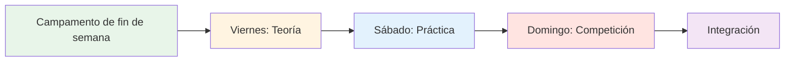
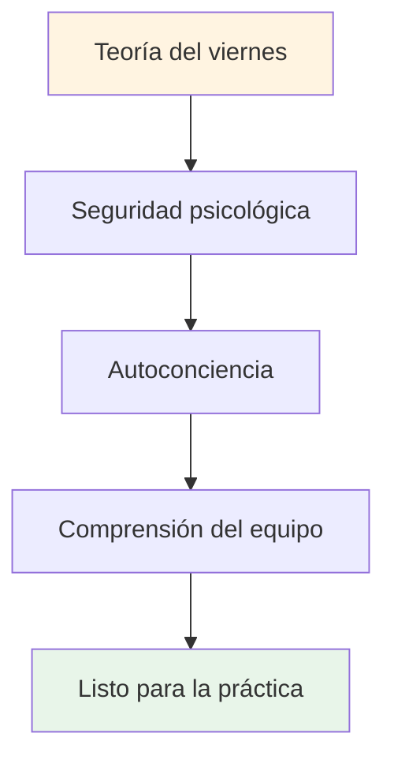

# Campamento de entrenamiento: Fin de semana de juego mental intensivo

## Descripción general

Un campamento de entrenamiento integral de fin de semana (viernes a domingo) para 10 a 20 jugadores que combina la teoría del juego mental, la práctica en pista y la aplicación competitiva. Este formato intensivo fomenta un aprendizaje transformador mediante la integración de los tres elementos.

::: tip Dos secciones en esta guía
- **[Para los participantes](#para-participantes)** - Lo que los jugadores experimentarán durante el fin de semana
- **[Para organizadores](#para-organizadores)** - Cómo planificar y ejecutar el campamento de entrenamiento
:::

::: tip La filosofía del campo de entrenamiento
**La teoría sin práctica es solo información. La práctica sin teoría es solo repetición. La competencia sin reflexión es solo juego.** Este fin de semana integra las tres para un aprendizaje transformador.
:::

## Acceso rápido

| Sección | Objetivo | Acceso |
|---------|---------|--------|
| **Para los participantes** | Horario del fin de semana y qué llevar | [Ver sección](#para-participantes) |
| **Para organizadores** | Guía completa de planificación y facilitación | [Ver sección](#para-organizadores) |
| **Horarios diarios** | Cronograma detallado y actividades | [Viernes](#viernes-noche-juego-mental-fundamento-3-4-horas) • [Sábado](#sábado-aplicación-práctica-día-completo) • [Domingo](#domingo-integración-competencia-día-completo) |
| **Guías relacionadas** | Otros formatos de formación | [Viaje Mental](/es/guides/mental-journey/) • [Taller](/es/guides/workshop/) |

---

## Para los participantes

### Qué esperar

Este fin de semana intensivo te desafiará mental, física y emocionalmente. Aprenderás conceptos de juego mental, los practicarás en la pista y los aplicarás en la competición, todo ello mientras construyes vínculos profundos con tus compañeros.

**Estructura del fin de semana:**

### Desglose diario

#### Viernes por la noche: Fundación del juego mental (3-4 horas)
**Qué:** Sesión teórica sobre conceptos de juegos mentales
**Dónde:** Sala de reuniones interior
**Formato:** Discusión en círculo y ejercicios

**Aprenderás:**
- Los estados de zona y flujo
- Crítico interno vs. Coach interno
- Patrones de respuesta a la presión
- Fundamentos de la rutina previa al disparo

**Actividades:**
- Registro y normas básicas
- El iceberg de la petanca
- Creación del manual de usuario
- Ejercicio de miedo en un sombrero

#### Sábado: Práctica y aplicación (día completo)
**Mañana (3 horas):** Práctica estructurada con enfoque mental
**Tarde (3 horas):** Simulacros de simulación de presión
**Tarde (2 horas):** Reflexión e integración

**Practicarás:**
- Rutinas previas al lanzamiento en lanzamientos reales
- Técnicas de reinicio después de errores
- Enfoque los anclajes bajo presión
- Protocolos de comunicación en equipo

**Formato:**
- Ejercicios en grupos pequeños (3-4 jugadores)
- Análisis de vídeo de patrones mentales
- Escenarios de presión
- Sesión informativa vespertina

#### Domingo: Competición e Integración (Día Completo)
**Mañana (3 horas):** Juego de torneo
**Tarde (2 horas):** Rondas finales
**Tarde (1 hora):** Reflexión de cierre

**Aplicarás:**
- Todas las herramientas mentales en competición
- Protocolos de equipo bajo presión
- Recuperación de errores en tiempo real
- Proceso de reflexión posterior al partido

### Qué llevar

**Requerido:**
- Tus bolas y tu equipo
- Ropa cómoda para todo tipo de clima
- Cuaderno y bolígrafo
- Mente abierta y voluntad de compartir.
- Botella de agua

**Opcional:**
- Diario de entrenamiento
- Preguntas sobre desafíos mentales específicos
- Ejemplos de situaciones de presión a las que te enfrentas

**No necesario:**
- Solicitudes de entrenamiento técnico (esto se centra en el juego mental)
- Ego o necesidad de demostrar tu valía
- Juicio de los demás

### Reglas básicas para el fin de semana

::: tip El contenedor
Todos los participantes acuerdan:
1. **Confidencialidad** - Lo compartido se queda aquí
2. **Respeto** - Honrar la vulnerabilidad de los demás
3. **Participación** - Participar plenamente en todas las actividades
4. **Mentalidad de crecimiento**: acepte la incomodidad como aprendizaje
5. **Soporte** - Ayuda a los compañeros de equipo a aplicar conceptos
:::

### Con lo que te irás

**Conocimiento:**
- Comprensión profunda de sus patrones mentales
- Herramientas prácticas para la gestión de la presión
- Protocolos de equipo para competición
- Rutina personalizada previa a la inyección

**Habilidades:**
- Capacidad de acceder a estados de flujo
- Técnicas de recuperación de errores
- Reformulación del Coach Interior
- Anclajes de enfoque

**Conexión:**
- Lazos más profundos con los compañeros de equipo
- Lenguaje compartido para el juego mental
- Red de apoyo para el crecimiento continuo

**Materiales:**
- Hojas de trabajo y ejercicios completados
- Análisis en vídeo de tus patrones mentales
- Plan de acción para los próximos 30 días
- Acceso a todos los módulos educativos

### Horario típico

**Viernes:**
- 18:00 - Llegada y check-in
- 19:00 - Cena
- 20:00 - Sesión inaugural (teoría)
- 23:00 - Tiempo libre / descanso

**Sábado:**
- 08:00 - Desayuno
- 09:00 - Sesión de práctica matutina
- 12:00 - Almuerzo
- 13:30 - Sesión de práctica de la tarde
- 17:00 - Descanso
- 18:00 - Cena
- 19:30 - Sesión de reflexión vespertina
- 21:00 - Tiempo libre / descanso

**Domingo:**
- 08:00 - Desayuno
- 09:00 - Comienza el torneo
- 12:00 - Almuerzo
- 13:00 - Rondas finales
- 15:00 - Premios y reconocimientos
- 16:00 - Círculo de cierre
- 17:00 - Salida

---

## Para organizadores

### Descripción general de la planificación

Esta sección proporciona todo lo que necesitas para organizar y ejecutar un campamento de entrenamiento de fin de semana exitoso para 10 a 20 jugadores.

### Planificación previa al campamento (6-8 semanas antes)

### Tamaño y estructura del grupo

**Óptimo:** 10-20 jugadores
- **Campamento pequeño (10-12):** Intercambio más íntimo y profundo
- **Campamento grande (16-20):** Perspectivas más diversas, requiere subgrupos

**Estructura del equipo:**
- Divídanse en equipos de 3-4 para practicar y competir.
- Mezcla niveles de habilidad y estilos de juego.
- Rotar equipos durante el fin de semana

### Requisitos de personal

| Role | Responsabilidades | Cantidad |
|------|------------------|----------|
| **Coordinador de Rendimiento Mental** | Facilitar sesiones teóricas, dinámicas de grupo. | 1 |
| **Entrenador técnico** | Supervisar la práctica, proporcionar retroalimentación | 1-2 |
| **Director de Competición** | Organizar torneos, gestionar la logística. | 1 |
| **Personal de apoyo** | Comidas, montaje, administración | 1-2 |

### Requisitos de ubicación

::: info Necesidades de instalaciones
**Pista:**
- Múltiples terrenos (mínimo 3-4 pistas)
- Diferentes superficies si es posible (grava, arena, dura)
- Iluminación para el juego nocturno

**Espacio interior:**
- Sala para 20 personas en círculo (sesiones teóricas)
- Separado de la pista
- Pizarra/proyector
- Asientos cómodos

**Alojamiento:**
- En el sitio o cerca (a poca distancia)
- Las habitaciones compartidas fomentan la unión
- Espacio tranquilo para la reflexión

**Abastecimiento:**
- Comidas centradas en la nutrición (ver [Guía de alimentos](./food))
- Evitar los bajones de azúcar
- Estaciones de hidratación
:::

### Lista de verificación de materiales

::: details Lista completa de materiales
**Sesiones teóricas:**
- [ ] Sillas para círculo (sin mesas)
- [ ] Petanca y cochonnet para el centro
- [ ] Rotafolios y marcadores
- [ ] Notas adhesivas
- [ ] Hojas de trabajo (Manual de usuario, Crítico interno, etc.)
- [ ] Papel y bolígrafos
- [ ] Proyector (para contenido del sitio web)

**Sesiones de práctica:**
- [ ] Cinta métrica
- [ ] Conos/marcadores para ejercicios
- [ ] Cámara de vídeo/trípode
- [ ] Portapapeles y papel (seguimiento)
- [ ] Silbar

**Competencia:**
- [ ] Hojas de puntuación
- [ ] Cuadro del torneo
- [ ] Premios/reconocimientos
- [ ] botiquín de primeros auxilios

**Logística:**
- [ ] etiquetas de nombre
- [ ] Lista de participantes con contactos
- [ ] Información de contacto de emergencia
- [ ] Botellas de agua
- [ ] Protector solar
- [ ] Pañuelos (¡para trabajo emocional!)
:::

## Horario de fin de semana

### Viernes por la noche (3 horas)

**18:00-18:30 - Llegada y bienvenida**
- Registrarse
- Asignación de habitaciones
- Resumen del fin de semana

**18:30-19:30 - Cena**
- Comida centrada en la nutrición
- Presentaciones informales

**19:30-22:30 - Sesión teórica: Fundamentos**

Utilice la [Guía del taller](./workshop) para una facilitación detallada:

1. **Reglas básicas (15 min)** - Establecer seguridad psicológica
2. **Matriz de registro (20 min)** - Evaluar la energía del grupo
3. **El Iceberg (30 min)** - Explora tus pensamientos internos
4. **Manual del usuario (45 min)** - Fomentar la comprensión del equipo
5. **Miedo en un sombrero (45 min)** - Romper el aislamiento
6. **Check-Out (15 min)** - Cierra el círculo

**22:30 - Tiempo libre**
- Socialización informal
- Descanso y reflexión

### Sábado (Día completo - Teoría + Práctica)

**08:00-09:00 - Desayuno y Mindfulness**
- Desayuno tranquilo
- Meditación guiada opcional de 15 minutos
- Establezca intenciones para el día

**09:00-10:30 - Sesión teórica: Conectando el contenido con la experiencia**

Elige entre 3 y 4 temas del sitio web de la Academia y explora el juego interior:

**Temas de ejemplo:**

1. **[Nutrición](./educación/nutrición/)** (20 min)
   - ¿Cómo cambia tu elección de alimentos bajo presión?
   - ¿Comes lo que tu cuerpo necesita o lo que tu ansiedad quiere?
   - Práctica: Planificar la nutrición el día de la competición

2. **[Fuerza mental](./educacion/juego-mental/fuerza-mental/)** (25 min)
   - ¿Cuál es tu relación con el fracaso?
   - &quot;¿Cómo te hablas a ti mismo después de un fallo?&quot;
   - Actividad: Reformular al crítico interno en entrenador interno

3. **[Mindfulness](./educacion/juego-mental/mindfulness/)** (25 min)
   - &quot;¿A dónde va tu mente durante la pausa antes de lanzar?&quot;
   - &quot;¿Qué te saca del momento presente?&quot;
   - Práctica: escaneo corporal de 5 minutos

4. **[Tácticas](./educación/técnica/tácticas/)** (20 min)
   - &quot;¿Tu elección de tiro se basa en la estrategia o en el miedo?&quot;
   - &quot;¿Cuándo jugar a lo seguro y cuándo tomar riesgos?&quot;
   - Discutir: Perfiles de riesgo en el grupo

**10:30-10:45 - Descanso**

**10:45-12:30 - Integración en pista: ejercicios con enfoque mental**

**Ejercicio 1: Apunta tu tiro (30 min)**

De la [Guía del taller](./taller) - Practica la posesión de la intención y la duda:

1. Anunciar el objetivo: &quot;Estoy disparando el hierro&quot;
2. Confianza del Estado: &quot;Soy un 7 sobre 10&quot;
3. Nombra el pensamiento interior: &quot;Mi voz interior se preocupa por el efecto retroceso&quot;
4. Ejecutar el tiro
5. Reflexiona: &quot;¿Qué pasó? ¿Qué aprendiste?&quot;

**Ejercicio 2: Interferencia cognitiva (30 min)**

Prueba si la técnica se ha vuelto automática:
- El coordinador hace preguntas complejas mientras el jugador dispara
- &quot;Nombra 5 capitales&quot; o &quot;Cuenta hacia atrás desde 100 de 7 en 7&quot;
- Éxito = la técnica es implícita, no se procesa conscientemente

**Ejercicio 3: Práctica del manual del usuario (30 min)**

Aplicar los Manuales de Usuario del viernes:
- Jugar en equipos de 3
- Después de cada disparo, los compañeros de equipo responden según el Manual del usuario
- &quot;Marc necesita silencio después de un fallo&quot;: el equipo lo reconoce
- Informe final: &quot;¿Cómo te sentiste al ser comprendido?&quot;

**12:30-14:00 - Almuerzo y descanso**
- Comida centrada en la nutrición
- Momento tranquilo para la reflexión
- Opcional: Check-in individual con coordinador

**14:00-17:00 - Sesión práctica: Adaptación del terreno**

**Objetivo:** Desarrollar adaptabilidad y flexibilidad mental.

**Configuración:**
- Gira a través de 3-4 terrenos/pistas diferentes
- 45 minutos por terreno
- Centrarse en la adaptación mental, no sólo en la técnica

**Estructura de rotación:**

| Terreno | Enfoque mental | Práctica |
|---------|--------------|----------|
| **Terreno 1: Blando/Arena** | Aceptación de la incertidumbre | &quot;La donación - aceptar lo que es&quot; |
| **Terreno 2: Duro/Grava** | Precisión bajo presión | &quot;Confía en tu técnica&quot; |
| **Terreno 3: Desigual** | Regulación emocional | &quot;Mantén la calma cuando sea injusto&quot; |
| **Terreno 4: Competición** | Acceso al estado de flujo | &quot;Encuentra la zona&quot; |

**Facilitación:**
- El entrenador técnico proporciona retroalimentación sobre la técnica.
- MPC pregunta: &quot;¿Qué está pasando en tu mente ahora mismo?&quot;
- Diario de jugadores entre rotaciones

**17:00-18:00 - Descanso y reflexión**
- Diario individual
- ¿Qué aprendiste sobre ti hoy?
- &quot;¿Qué cosa harás diferente mañana?&quot;

**18:00-19:00 - Cena**

**19:00-21:00 - Teoría de la tarde: Vulnerabilidad profunda**

**Actividad 1: Reformulando al crítico interno (45 min)**

Consulte la [Guía del taller](./workshop) para ver el protocolo completo:
1. Identificar la frase crítica exacta
2. Reencuadre como entrenador interno
3. Práctica de socios

**Actividad 2: Preparación para la competición (45 min)**

Mañana es día de competición. Prepárense mentalmente:

1. **Visualización (15 min)**
   - Cierra los ojos
   - Imagina la toma perfecta
   - Siente la confianza
   - Observa la calma

2. **Protocolos de equipo (20 min)**
   - Crear señales de apoyo
   - &quot;Necesito un reinicio&quot; = tocar la petanca
   - &quot;Necesito ánimo&quot; = chocar los puños
   - &quot;Necesito espacio&quot; = dar un paso atrás

3. **Establecer intenciones (10 min)**
   - &quot;Mañana me centraré en...&quot;
   - &quot;Mi objetivo no es ganar, sino...&quot;
   - &quot;Voy a practicar...&quot;

**Salida (30 min)**
- Comparte un miedo sobre el mañana
- Compartir una intención
- Apoyo grupal

**21:00 - Tiempo libre**
- A la cama temprano (¡mañana hay competición!)
- Reflexión tranquila

### Domingo (Día de la competición)

**08:00-09:00 - Desayuno y preparación mental**
- Desayuno ligero (ver [Guía nutricional](./educacion/nutricion/))
- Práctica de atención plena de 15 minutos
- reuniones de equipo

**09:00-09:30 - Reunión informativa sobre la competencia**

**Formato:** Torneo todos contra todos
- Equipos de 3
- Jugar hasta 13 puntos
- Todos juegan contra todos
- Centrarse en el PROCESO, no en el resultado

**El giro: Puntuación del rendimiento mental**

::: tip Sistema de puntuación dual
**Tradicional:** Puntos ganados
**Rendimiento mental:** Calificado por MPC

Puntos de rendimiento mental (0-5 por juego):
- Herramientas del Manual de Usuario Usadas
- Apoyó a sus compañeros de equipo de manera efectiva
- Crítico interno gestionado
- Permanecer presente (sin detenerse en tomas pasadas)
- Seguridad psicológica demostrada

**Ganador:** Mejor puntuación combinada (tradicional + mental)
:::

**09:30-13:00 - Competición matutina**
- Juegos de todos contra todos
- El MPC observa y califica
- El entrenador técnico proporciona una breve retroalimentación entre juegos.
- Pausas para hidratarse y tomar refrigerios

**13:00-14:00 - Almuerzo**
- Centrado en la nutrición
- Reflexión informal
- Descansar

**14:00-17:00 - Competición de la tarde**
- Continuar con el sistema round-robin
- Semifinales y finales
- Aumento de la presión
- Aplicar los aprendizajes de la mañana

**17:00-17:30 - Premios y reconocimientos**

**Categorías:**
- Ganador tradicional
- Ganador en rendimiento mental
- Más mejorado
- Mejor compañero de equipo
- Premio al coraje (los más vulnerables)

**17:30-19:00 - Sesión de reflexión final**

**Crítico:** Aquí es donde se consolida el aprendizaje.

**Estructura:**

**1. Reflexión individual (15 min)**
Escribe en el diario:
- ¿Qué aprendiste sobre ti mismo este fin de semana?
- ¿Qué te sorprendió?
- ¿Qué harás diferente?
- ¿Qué te llevas a casa?

**2. Intercambio en grupos pequeños (30 min)**
Grupos de 4-5:
- Compartir información clave
- ¿Qué fue lo que más te resonó?
- ¿Qué fue lo más difícil?
- ¿Qué fue lo más valioso?

**3. Integración grupal completa (30 min)**
Hacer un círculo:
- Cada persona comparte UNA conclusión clave
- MPC valida y conecta temas
- Discutir: &quot;¿Cómo aplicarás esto?&quot;

**4. Compromisos (15 min)**
- Cada persona declara un compromiso
- &quot;En mi próxima competición, voy a...&quot;
- El grupo es testigo y apoya

**5. Cierre (15 min)**
- Agradecer a los participantes por su valentía
- Recordar la confidencialidad
- Intercambiar contactos
- Seguimiento del plan (sesión online opcional)

**19:00 - Cena y salida**

## Consejos de facilitación

### Equilibrando la teoría y la práctica

::: warning No sobrecargues la teoría
**El error:** Hablar demasiado y hacer poco

**El equilibrio:**
- La teoría crea conciencia
- La práctica desarrolla habilidades
- Integración de pruebas de competencia
- La reflexión consolida el aprendizaje

**Regla general:** 30% teoría, 40% práctica, 20% competencia, 10% reflexión
:::

### Gestión de la dinámica de grupo

**El Alfa Competitivo:**
- Quiere ganar a toda costa
- Resiste la vulnerabilidad
- **Estrategia:** Canalizar la competitividad hacia la puntuación del rendimiento mental

**El observador silencioso:**
- Lo absorbe todo, no lo comparte
- **Estrategia:** Crear puntos de entrada de bajo riesgo, validar la observación como participación

**El escéptico:**
- &quot;Esto de ser tan sensiblero no funciona&quot;
- **Estrategia:** Aikido verbal: alinear y pivotar (ver [Guía del taller](./taller))

**El que comparte demasiado:**
- Domina la discusión
- **Estrategia:** &quot;Gracias, escuchemos a los demás&quot;

### Cómo manejar momentos emocionales

**Alguien llora durante Miedo en un sombrero:**
- ✅ Normalizar: “Las lágrimas son coraje, no debilidad”
- ✅ Ofrece pañuelos, no te apresures
- ✅ Pregunta: &quot;¿Qué necesitas ahora mismo?&quot;
- ❌ No: &quot;Está bien, no llores&quot;

**Conflicto entre jugadores:**
- ✅ Pausa y dirección
- ✅ &quot;¿Qué está pasando ahora mismo?&quot;
- ✅ Úselo como momento de aprendizaje
- ❌ No: Ignorar o minimizar

**Alguien se apaga:**
- ✅ Regístrese de forma privada durante el descanso
- ✅ &quot;Me di cuenta de que te quedaste en silencio. ¿Qué pasa?&quot;
- ✅ Ofrece opciones: participa de manera diferente, tómate un descanso
- ❌ No: Llamar públicamente

## Seguimiento posterior al campamento

### Inmediato (24-48 horas)

**Enviar a todos los participantes:**
- mensaje de agradecimiento
- Resumen de las conclusiones clave
- Fotos del fin de semana
- Lista de contactos (con permiso)
- Enlace a recursos en el sitio web

**Check-in individual:**
- Envía un mensaje de texto a cualquiera que haya compartido mucho.
- ¿Cómo te sientes acerca del fin de semana?
- Abordar cualquier resaca de vulnerabilidad

### Corto plazo (2 semanas)

**Sesión online opcional (60-90 min):**
- ¿Cómo has aplicado lo aprendido?
- ¿Qué funciona? ¿Qué supone un reto?
- Apoyo entre pares y resolución de problemas
- Reforzar los compromisos

### A largo plazo (1-3 meses)

**Participantes de la encuesta:**
- ¿Qué es diferente en tu juego?
- ¿Qué herramientas sigues utilizando?
- ¿Qué haría que el próximo campamento fuera mejor?
- ¿Lo recomendarías a otros?

**Impacto en la pista:**
- Resultados de la competición
- Confianza autoinformada
- Dinámica de equipo
- Compromiso continuo

## Adaptación para diferentes tamaños de grupos

### Campamento pequeño (10-12 jugadores)

**Ventajas:**
- Compartir más profundamente
- Más atención individualizada
- Lazos más fuertes

**Ajustes:**
- Un solo grupo para toda la teoría
- Más tiempo por persona en actividades
- Formato de competición íntima

### Campamento grande (16-20 jugadores)

**Ventajas:**
- Perspectivas diversas
- Más variedad de competencia
- Economías de escala

**Ajustes:**
- Dividirse en 2 grupos para algunas sesiones teóricas.
- Se necesitan 2 MPC/facilitadores
- Cuadro de torneo más grande
- Rotaciones más estructuradas

## Consideraciones presupuestarias

### Ganancia

| Artículo | Precio por persona | 20 personas | 10 personas |
|------|------------------|-----------|-----------|
| **Registro** | 150-250 € | 3.000-5.000 € | 1.500-2.500 € |

### Gastos

| Categoría | Costo | Notas |
|----------|------|-------|
| **Alquiler de instalaciones** | 500-1.000 € | Tarifa de fin de semana |
| **Alojamiento** | 40-60 €/persona/noche | Habitaciones compartidas |
| **Comidas** | 30-40 €/persona/día | 6 comidas |
| **Personal** | 500-1.000 € | MPC + autocares |
| **Materiales** | 100-200 € | Hojas de trabajo, materiales |
| **Premios** | 100-200 € | Elementos de reconocimiento |

**Total por persona:** 120-180 €
**Margen:** 30-70 €/persona (o punto de equilibrio para la creación de comunidad)

## Métricas de éxito

### Indicadores inmediatos

- [ ] Puntuación de seguridad psicológica (promedio 1-10 &gt;7)
- [ ] Tasa de participación (&gt;80% compartiendo activamente)
- [ ] Tasa de finalización (&gt;90% estancia fin de semana completo)
- [ ] Puntuación de satisfacción (promedio 1-10 &gt;8)

### Indicadores a largo plazo

- [ ] Cambio de comportamiento (utilización de herramientas en la competición)
- [ ] Mejora del rendimiento (autoinformada)
- [ ] Construcción de comunidad (mantenerse en contacto)
- [ ] Referencias (recomendar a otros)

## Errores comunes que se deben evitar

::: danger Trampas
**1. Demasiado contenido**
- Tratando de cubrirlo todo
- **Solución:** Concéntrese en la profundidad, no en la amplitud

**2. Saltarse la reflexión**
- Corriendo hacia la siguiente actividad
- **Solución:** Tiempo de procesamiento incorporado

**3. Ignorar la resistencia**
- Superando el escepticismo
- **Solución:** Abordarlo directamente con Aikido Verbal

**4. Coaching técnico durante la teoría**
- Mezcla de roles
- **Solución:** Límites claros entre el MPC y el entrenador técnico

**5. Sin seguimiento**
- El fin de semana termina, el aprendizaje se detiene
- **Solución:** Planificar puntos de contacto posteriores al campamento
:::

## Recursos

### Desde este sitio

- [Guía del taller](./taller) - Protocolos detallados de facilitación
- [Guía de sesiones de entrenamiento](./training-session) - Para la práctica continua
- [Nutrición](./educacion/nutricion/) - Protocolos para el día de competición
- [Fuerza Mental](./educacion/juego-mental/fuerza-mental/) - Conceptos del juego interior
- [Mindfulness](./educacion/juego-mental/mindfulness/) - Técnicas de presencia
- [Tácticas](./educación/técnica/tácticas/) - Pensamiento estratégico

### Lectura recomendada

- *El juego interior del tenis* de Timothy Gallwey
- *Mentalidad* de Carol Dweck
- *La organización intrépida* de Amy Edmondson

