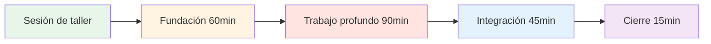
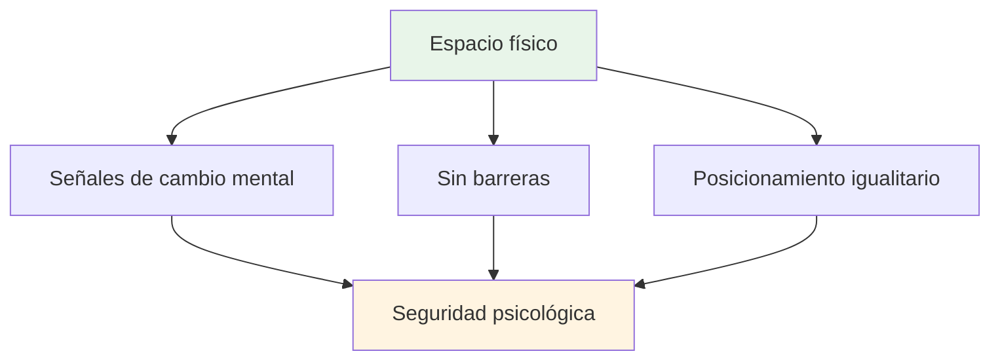
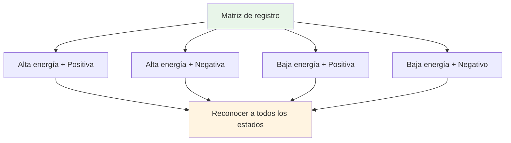
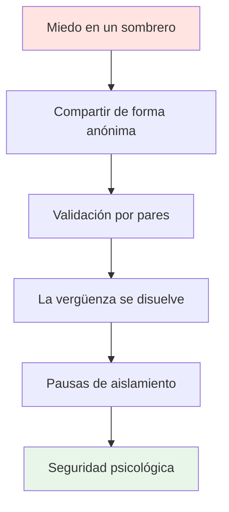

# Taller: Sesión de Juego Mental Avanzado (3-4 Horas)

## Descripción general

Este taller es una sesión teórica avanzada de 3 a 4 horas para 6 a 8 jugadores de élite, centrada en el trabajo psicológico profundo y el aprendizaje basado en la vulnerabilidad. Va más allá de las habilidades mentales básicas para explorar el juego interior a un nivel profundo.

::: tip Dos secciones en esta guía
- **[Para los participantes](#para-participantes)** - Lo que los jugadores experimentarán y aprenderán
- **[Para facilitadores](#para-facilitadores)** - Cómo conducir el taller como Coordinador de Desempeño Mental
:::

**Diferencia con la sesión para principiantes:**
- **Principiante (2-3h):** Introducción a los conceptos de juegos mentales → [Ver Guía del Viaje Mental](/es/guias/viaje-mental/guia-de-sesion)
- **Avanzado (3-4h):** Trabajo psicológico profundo con ejercicios de vulnerabilidad (esta página)

## Acceso rápido

| Sección | Objetivo | Acceso |
|---------|---------|--------|
| **Para los participantes** | Qué esperar y cómo prepararse | [Ver sección](#para-participantes) |
| **Para facilitadores** | Guía completa de sesiones y ejercicios | [Ver sección](#para-facilitadores) |
| **Materiales de la sesión** | Ejercicios y hojas de trabajo | [Ver materiales](#facilitator-materials) |
| **Guías relacionadas** | Otros formatos de formación | [Viaje Mental](/es/guides/mental-journey/) • [Campo de Entrenamiento](/es/guides/training-camp/) |

---

## Para los participantes

### Qué esperar

Esta no es una sesión de entrenamiento típica. Participarás en debates profundos sobre los aspectos mentales y emocionales de la petanca, temas que rara vez se abordan abiertamente.

**Este taller es:**
- ✅ Un espacio seguro para explorar pensamientos y miedos internos.
- ✅ Aprendizaje basado en la vulnerabilidad con compañeros de equipo
- ✅ Conectando patrones mentales con el rendimiento
- ✅ Desarrollar la inteligencia psicológica del equipo

**Este taller NO es:**
- ❌ Entrenamiento técnico o entrenamiento táctico
- ❌ Terapia o asesoramiento
- ❌ Discursos de pensamiento positivo o motivación
- ❌ Juicio o crítica

### Estructura de la sesión

**Duración total:** 3-4 horas
**Tamaño del grupo:** 6-8 jugadores
**Formato:** Discusión en círculo con ejercicios estructurados

### Lo que aprenderás

#### Fase 1: Fundación (60 min)
- Reglas básicas para la seguridad psicológica
- La &quot;Matriz de Registro&quot;: reconocer su estado actual
- El &quot;Iceberg de la Petanca&quot;: explorando pensamientos ocultos

#### Fase 2: Trabajo profundo (90 min)
- Creando tu &quot;Manual de Usuario&quot; para compañeros de equipo
- Conectando patrones mentales con el rendimiento
- &quot;Miedo en un sombrero&quot;: romper el aislamiento a través de la vulnerabilidad compartida

#### Fase 3: Integración (45 min)
- Reformulando tu Crítico Interno a Coach Interno
- Creación de protocolos de equipo para la competición
- Conclusiones prácticas para la pista

#### Fase 4: Cierre (15 min)
- Reflexión y compromiso
- Soporte de seguimiento

### Reglas básicas

Antes de comenzar la sesión, todos los participantes acuerdan:

::: tip El contenedor: reglas básicas esenciales
1. **Confidencialidad** - Lo que se dice aquí, se queda aquí.
2. **La regla de Las Vegas**: Las lecciones salen de la habitación, las historias se quedan
3. **Sin arreglos** - Sea testigo y comprenda, no intente resolver.
4. **Derecho a pasar** - La vulnerabilidad no se puede coaccionar
5. **Respeta el proceso** - Confía en la incomodidad
:::

### Qué llevar

**Requerido:**
- Mente abierta y voluntad de compartir.
- Tus propias experiencias y desafíos
- Respeto por la vulnerabilidad de los demás

**Opcional:**
- Cuaderno de reflexiones personales
- Preguntas sobre desafíos mentales específicos

### Actividades clave que experimentarás

#### La matriz de registro
Sitúate en una red de energía y estado de ánimo. Acepta que todos tenemos estados de ánimo diferentes.

#### El iceberg de la petanca
Explora lo que sucede debajo de la superficie: los pensamientos y miedos que nadie ve.

#### El manual del usuario
Cree un manual de operaciones para usted mismo para que sus compañeros de equipo comprendan cómo ayudarlo.

#### Miedo en un sombrero
Comparte anónimamente tus miedos profundos y escucha cómo tus compañeros los validan. Rompe el aislamiento.

#### Reencuadre del crítico interno
Transforme el diálogo interno duro en un lenguaje de coaching de apoyo.

### Después del taller

Te irás con:
- Una comprensión más profunda de sus patrones mentales
- Protocolos de equipo para apoyarse mutuamente
- Frases reformuladas del Coach Interior
- Conexión con los compañeros de equipo a través de la vulnerabilidad compartida
- Herramientas prácticas para la competencia

::: warning Resaca de vulnerabilidad
Después de compartir profundamente, podrías sentirte expuesto o arrepentido. Esto es normal. El facilitador se pondrá en contacto contigo en 24 horas. Recuerda: lo que compartiste ayudó a todos.
:::

---

## Para facilitadores

### Su papel como coordinador del rendimiento mental

Como **Coordinador de desempeño mental (MPC)**, usted facilita debates profundos sobre el juego mental, creando seguridad psicológica que se traduce en desempeño en la pista.

::: warning Concepto crítico
**Usted no es un entrenador técnico ni un terapeuta.** Su función es facilitar el aprendizaje basado en la vulnerabilidad que ayude a los jugadores a comprender la conexión entre sus pensamientos internos y su desempeño.
:::

### Sus responsabilidades

::: info Responsabilidades clave
- **Facilite, no dé sermones** - Usted guía la discusión, no enseña técnicas
- **Mantenga el espacio** - Cree y mantenga la seguridad psicológica
- **Conecta la teoría con la práctica**: conecta el contenido del sitio web con la experiencia interna
- **Monitorear la dinámica del grupo**: observar quién participa y quién se resiste.
- **Mantenga límites** - Sepa cuándo recurrir a ayuda profesional
:::

### Preparación previa al taller

### Competencias esenciales

| Competencia | Qué significa | Cómo desarrollar |
|------------|---------------|----------------|
| **Inteligencia emocional** | Detectar microexpresiones de malestar | Practique la observación activa |
| **Autoridad Neutral** | Imponer respeto sin poder técnico | Establecer credibilidad a través de la presencia |
| **Contexto deportivo** | Comprender la mecánica de la presión | Aprenda la terminología y la cultura de la petanca |
| **Aikido verbal** | Alineate con la resistencia, no luches contra ella | Practique la comunicación no defensiva |

::: details Términos clave de petanca que debes conocer
- **Carreau** - Tiro perfecto que desplaza la bola del oponente
- **Bibber** - Los &quot;yips&quot; - temblor involuntario durante la liberación
- **Dato** - Lo &quot;dado&quot; - aceptar el terreno tal como es
- **Portée** - Lanzar sin rebote
- **Ruleta** - Tiro rodante
- **Cochonnet** - La bola objetivo (jack)
:::

## Configuración física: El círculo mágico

### Requisitos de ubicación

::: warning Configuración crítica
**Elija un espacio neutral LEJOS de la pista.** Esto indica un cambio del trabajo físico al trabajo mental.

Requisitos:
- ✅ Insonorizado o privado
- ✅ Temperatura confortable
- ✅ Sin distracciones (teléfonos apagados)
- ✅ Luz natural si es posible
- ✅ Separado del área de entrenamiento
:::

### La configuración del círculo

**Asientos:**
- Círculo perfecto de sillas
- **NO MESAS** - Las mesas crean barreras y ocultan el lenguaje corporal
- Todas las sillas a la misma altura (sin posiciones eléctricas)
- El coordinador se sienta como parte del círculo (no al frente)

**Artefactos del centro:**
- Coloque las petancas y el cochonnet en el centro.
- Ancla el trabajo al deporte
- Recordatorio visual del propósito compartido

## Estructura de la sesión (3-4 horas)

### Fase 1: Fundación (60 minutos)

#### 1. Bienvenida y reglas básicas (15 min)

**El contrato social:**

::: tip El contenedor: reglas básicas esenciales
Antes de comenzar a compartir, el grupo DEBE aceptar:

1. **Confidencialidad** - Lo que se dice aquí, se queda aquí.
2. **La regla de Las Vegas**: Las lecciones salen de la habitación, las historias se quedan
3. **Sin arreglos** - Sea testigo y comprenda, no intente resolver.
4. **Derecho a pasar** - La vulnerabilidad no se puede coaccionar
5. **Respeta el proceso** - Confía en la incomodidad
:::

**Tu guión:**
> Bienvenidos. Este espacio es diferente a la pista. Aquí, exploramos lo que sucede *dentro* cuando estás frente a esa toma. Todo lo que se comparte aquí es confidencial. Las lecciones que aprendes pueden irse, pero las historias personales se quedan. No estás aquí para arreglarte, solo para comprender. Y siempre puedes pasar. ¿Están todos de acuerdo con esto?

#### 2. Actividad: La Matriz de Registro (20 min)

**Objetivo:** Normalizar la admisión de la fatiga o el estrés.

**Materiales:** Pizarra blanca o rotafolio, notas adhesivas

**Procedimiento:**
1. Dibuje una matriz 2x2: Energía alta/baja (vertical), Energía positiva/negativa (horizontal)
2. Cada jugador escribe su nombre en una nota adhesiva.
3. Coloque la nota en su cuadrante actual
4. Debate: &quot;Tenemos tres personas en estado de &#39;Baja Energía/Negativo&#39;. ¿Cómo afecta esto a nuestra sesión de hoy?&quot;

**Consejos de facilitación:**
- No juzgues ningún cuadrante como “malo”
- Pregúntate: ¿Qué necesita tu cuerpo ahora mismo?
- Observa patrones: &quot;Tres de ustedes están en el mismo espacio. ¿Qué es eso?&quot;

#### 3. Actividad: El Iceberg de la Petanca (25 min)

**Objetivo:** Visualizar pensamientos internos ocultos

**Materiales:** Papel grande, marcadores

**Procedimiento:**
1. Dibujar un iceberg en papel
2. **Sobre el agua:** Escribe &quot;Técnica, El lanzamiento, El resultado&quot;
3. **Debajo del agua:** Pregunta: &quot;¿Qué está pasando en tu mente que nadie ve?&quot;

**Indicaciones:**
- &quot;¿De qué tienes miedo cuando te acercas a disparar?&quot;
- ¿Qué juicio te preocupa?
- ¿Qué te dice tu voz interior cuando fallas?

**La pregunta de la perspicacia:**
> &quot;¿Qué le pasa a tu brazo cuando el material &#39;submarino&#39; se vuelve demasiado pesado?&quot;

Esto vincula la carga mental con la tensión física (el babeo/los gritos).

::: details Respuestas comunes a &quot;Bajo el agua&quot;
- Miedo a decepcionar al equipo
- Preocuparse por parecer estúpido
- Duda sobre la capacidad
- Comparación con otros
- Presión para demostrar valía
- Miedo al juicio del entrenador/compañeros de equipo
- Síndrome del impostor
:::

### Fase 2: Trabajo profundo (90 minutos)

#### 4. Actividad: El Manual del Usuario (30 min)

**Objetivo:** Operacionalizar la empatía: ayudar a los compañeros de equipo a entenderse entre sí.

**Materiales:** Hojas de trabajo (una por jugador)

**La plantilla del manual del usuario:**

| Sección | Inmediato | Ejemplo |
|---------|--------|---------|
| **Mi firma de estrés** | &quot;Cuando estoy ansioso, yo...&quot; | &quot;...quedarse en completo silencio&quot; |
| **Cómo tratarme** | &quot;Cuando fallo un tiro crucial, necesito...&quot; | &quot;...silencio, no aliento&quot; |
| **Mi pensamiento interior** | &quot;La mentira que me digo a mí mismo es...&quot; | &quot;...que no soy lo suficientemente bueno&quot; |
| **Mi detonante** | &quot;Me pongo a la defensiva cuando...&quot; | &quot;...alguien cuestiona mi elección de tiro&quot; |

**Procedimiento:**
1. Dé a los jugadores 10 minutos para completarlo en silencio.
2. Dar una vuelta en círculo: cada persona comparte UNA sección
3. Otros pueden hacer preguntas aclaratorias (¡no consejos!)
4. El coordinador valida cada acción

**Guión de facilitación:**
> Este es tu manual de instrucciones. Cuando tu compañero de equipo sabe que te quedas en silencio cuando estás ansioso, no lo tomará como algo personal. Cuando sabe que necesitas silencio después de un fallo, no intentará &quot;arreglarte&quot;. Así es como construimos la inteligencia de equipo.

#### 5. Conectando el contenido del sitio web con el pensamiento interno (30 min)

**Objetivo:** Vincular el contenido técnico con la experiencia psicológica

Elige 2 o 3 secciones del sitio web de la Academia y explora el juego interior:

**Ejemplo 1: Técnica - El agarre y la liberación**

**La cuestión de la confianza:**
> Cuando estás en 12-12 en un torneo, ¿tu mano se *siente* como la descripción de la técnica? ¿Son los músculos los que cambian o el pensamiento de &quot;No la sueltes&quot; lo que cambia tu agarre?

**El microtemblor:**
> ¿Quién siente aquí el microtemblor de la ansiedad? ¿Qué pensamiento interno lo desencadena?

**Ejemplo 2: Tácticas: Apuntar vs. Disparar**

**Perfil de riesgo:**
> Cuando el guía dice &quot;Dispara para ganar&quot;, ¿tu reacción es de emoción o de miedo? ¿Qué te dice eso sobre tu relación con el riesgo?

**El impostor:**
> ¿Alguna vez apuntas cuando *sabes* que debes disparar, solo para evitar la vergüenza de fallar? ¿Cuánto cuesta ese seguro?

**Ejemplo 3: Nutrición - Día de competición**

**La trampa de la comida reconfortante:**
> ¿Comes lo que tu cuerpo necesita o lo que te pide la ansiedad? ¿Cómo sabes la diferencia?

::: tip Técnica de facilitación
No des sermones sobre el contenido. Haz preguntas que conecten la información técnica con su experiencia. La información viene de ELLOS, no de ti.
:::

#### 6. Actividad: El miedo en un sombrero (30 min)

**Objetivo:** Romper el ciclo de aislamiento: demostrar que los compañeros comparten profundas inseguridades.

**Materiales:** Papel, bolígrafo, sombrero/bolsa

**Procedimiento:**
1. Todo el mundo escribe un miedo profundo sobre su carrera o equipo de forma anónima.
2. Doblar papeles y mezclar en el sombrero.
3. Cada jugador roba una nota (no la suya)
4. Léelo en voz alta
5. Valídalo: &quot;Puedo entender por qué alguien se sentiría así porque...&quot;

**Ejemplos de miedos:**
- &quot;Me temo que he llegado a mi límite y nunca mejoraré&quot;
- &quot;Me preocupa que mis compañeros de equipo piensen que estoy sobrevalorado&quot;
- &quot;Temo ahogarme en el gran momento&quot;
- &quot;Tengo miedo de que me sustituyan jugadores más jóvenes&quot;

**El poder:**
Cuando los jugadores escuchan su miedo secreto leído en voz alta y validado por sus compañeros, la vergüenza desaparece. Se dan cuenta: «No estoy solo. Esto es normal».

**Rol del coordinador:**
- Validar CADA miedo como legítimo
- No minimices: &quot;¡Eso no es cierto!&quot; invalida el sentimiento.
- Pregunte: &quot;¿Cuántos de ustedes han sentido algo similar?&quot;

### Fase 3: Integración (45 minutos)

#### 7. Actividad: Reformulando al crítico interno (25 min)

**Objetivo:** Reestructuración cognitiva: cambiar el diálogo interno

**Materiales:** Hoja de trabajo

**Procedimiento:**

**Paso 1: Identificar al crítico (10 min)**
> Escribe la frase EXACTA que dice tu crítico interior después de un error. No la versión educada, sino la brutal.

Ejemplos:
- &quot;Siempre te ahogas&quot;
- &quot;Todo el mundo te está viendo fracasar&quot;
- &quot;Te estás avergonzando a ti mismo&quot;
- &quot;No perteneces aquí&quot;

**Paso 2: Reformular como Coach Interno (10 min)**
> &quot;Ahora reescríbelo como tu Coach Interior: firme pero comprensivo&quot;.

Ejemplos:
- Crítico: &quot;Siempre te ahogas&quot; → Entrenador: &quot;Reinicia y respira. Siguiente tiro&quot;.
- Crítico: &quot;Todos te están viendo fracasar&quot; → Entrenador: &quot;Concéntrate en el objetivo, no en la multitud&quot;
- Crítico: &quot;Te estás avergonzando a ti mismo&quot; → Entrenador: &quot;Un tiro a la vez. Ya lo has hecho antes&quot;.

**Paso 3: Práctica en pareja (5 min)**
> Comparte tu frase de Coach con un compañero. Te la recordará cuando vea surgir al Crítico.

#### 8. Puente a la pista (20 min)

**Objetivo:** Crear protocolos viables para la competencia

**Preguntas para discusión:**
1. &quot;¿Qué cosa de hoy usarás en tu próxima competición?&quot;
2. ¿Cómo sabrán tus compañeros de equipo que necesitas apoyo?
3. &quot;¿Cuál es tu señal para &#39;Necesito un reinicio mental&#39;?&quot;

**Crear protocolos de equipo:**

| Situación | Protocolo | Ejemplo |
|-----------|----------|---------|
| **Después de un fallo** | Consulte el manual del usuario | &quot;Marc necesita silencio, Lisa necesita un puñetazo&quot; |
| **Sintiendo presión** | Utilice la frase del entrenador | &quot;Reinicia y respira&quot; |
| **Tensión de equipo** | Tiempo de espera de llamada | &quot;Tomémonos 2 minutos&quot; |
| **Crítico interno en voz alta** | Reinicio físico | Toca la petanca, respira hondo |

### Fase 4: Cierre (15 minutos)

#### 9. La caja (10 min)

**Procedimiento:**
Dar una vuelta en círculo y cada persona comparte:
1. **Una cosa que te llevas:** &quot;¿Qué conocimiento o herramienta te llevas?&quot;
2. **Una cosa que estás dejando atrás:** &quot;¿Qué estás dejando ir?&quot;

**Rol del coordinador:**
- Agradezca a cada persona por su contribución.
- Validar el trabajo realizado
- Recordar la confidencialidad

#### 10. Protocolo de seguimiento (5 min)

::: warning Crítico: Prevenir la resaca de la vulnerabilidad
El trabajo profundo provoca una “resaca de vulnerabilidad”: arrepentimiento o vergüenza por compartirlo.

**Su protocolo de 24 horas:**
- Envía un mensaje de texto a cualquier persona que haya compartido mucho contenido en las últimas 24 horas.
- Mensaje: &quot;Gracias por tu valentía de ayer. Lo que compartiste ayudó a todos&quot;.
- Registrarse: &quot;¿Cómo se siente acerca de la sesión?&quot;
:::

**Guión de cierre:**
> Lo que pasó hoy aquí requirió valentía. Te presentaste, te abriste, confiaste en el proceso. Esa misma valentía es la que traerás a la pista. Recuerda: las lecciones salen de esta sala, pero las historias se quedan. Gracias.

## Manejo de la resistencia

### El atleta &quot;demasiado genial&quot;

**Escenario:** Un jugador pone los ojos en blanco ante un ejercicio de vulnerabilidad.

**Estrategia:** Aikido Verbal (Alineación y Pivote)

**Guion:**
> Veo esa reacción, [Nombre]. La verdad es que lo entiendo. Hablar de sentimientos es delicado. Pero la pista es incómoda. Si no podemos soportar la incomodidad de esta sala, no estamos entrenando nuestra tolerancia a la incomodidad del juego. ¿Puedes confiar en mí durante 20 minutos?

### El participante silencioso

**Escenario:** Alguien no ha hablado en 45 minutos.

**Estrategia:** Crear un punto de entrada de bajo riesgo

**Guion:**
> &quot;[Nombre], veo que lo estás asimilando todo. ¿Qué es lo que te resuena hasta ahora? Aunque sea solo una palabra.&quot;

### El que comparte demasiado

**Escenario:** Alguien domina con historias largas

**Estrategia:** Redirección suave

**Guion:**
> Gracias por eso, [Nombre]. Quiero asegurarme de que todos tengan espacio. Escuchemos a alguien que aún no ha compartido.

### El reparador

**Escenario:** Alguien intenta resolver los problemas de los demás.

**Estrategia:** Reforzar las reglas básicas

**Guion:**
> &quot;Aprecio que quieras ayudar, pero recuerda nuestra regla: presenciar y comprender, no arreglar. [Orador original], ¿qué necesitas ahora mismo?&quot;

## Lista de verificación de materiales

::: details Materiales del taller
**Configuración física:**
- [ ] Sillas (6-8, sin mesas)
- [ ] Petanca y cochonnet para el centro
- [ ] Rotafolio o pizarra blanca
- [ ] Marcadores

**Actividades:**
- [ ] Notas adhesivas (Matriz de registro)
- [ ] Papel grande (actividad del iceberg)
- [ ] Hojas de trabajo del manual del usuario
- [ ] Papel y bolígrafos (Miedo en un sombrero)
- [ ] Hojas de trabajo de Crítico Interno/Coach

**Logística:**
- [ ] Agua para los participantes
- [ ] Pañuelos (¡trabajo emocional!)
- [ ] Temporizador (mantenerse en el horario)
- [ ] Lista de contactos de los participantes (para seguimiento)
:::

## Coordinador de Autocuidado

::: warning Tú también necesitas apoyo
Mantener espacio para la vulnerabilidad es emocionalmente exigente.

**Después del taller:**
- Informe con un compañero o supervisor
- Diario sobre lo que te surgió
- Tome un paseo o un descanso físico
- No lleves sus historias a casa
:::

## Medición del impacto

### Retroalimentación inmediata

Al final, pregunta:
1. &quot;En una escala del 1 al 10, ¿qué tan seguro te sentiste al compartir hoy?&quot;
2. &quot;¿Qué cosa haría que la próxima sesión fuera mejor?&quot;

### Seguimiento a largo plazo

Seguimiento después de 2-4 semanas:
- ¿Has utilizado alguna herramienta del taller?
- ¿Cómo ha cambiado tu relación con tu crítico interno?
- ¿Qué es diferente en tu mentalidad competitiva?

## Próximos pasos

::: tip Construyendo sobre esta base
Este taller es la Fase 1. Considere:
- **Sesiones de seguimiento** (en línea o presenciales)
- **Integración en pista** (ver guía de sesiones de entrenamiento)
- **Protocolos del equipo** (implementar Manuales de Usuario en competición)
- **Check-ins individuales** (para jugadores que necesitan más apoyo)
:::

