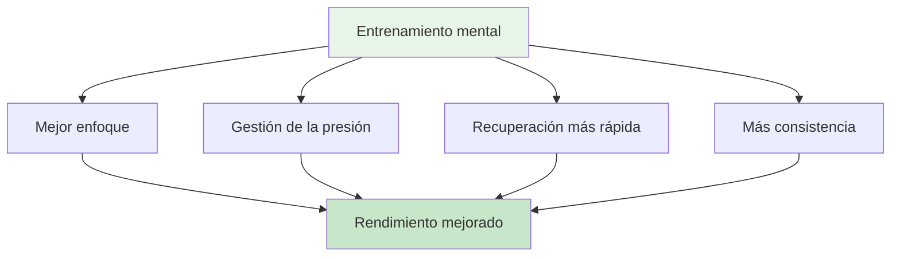

# Viaje mental para principiantes

## Bienvenido a tu viaje de juego mental

Ya sea que seas un jugador que busca mejorar su juego mental o un entrenador que desea introducir el entrenamiento mental en su equipo, esta guía te ayudará a dar los primeros pasos en el mundo de la psicología deportiva para la petanca.

::: tip ¿Para quién es esto?
- **Jugadores** que quieran entender el juego mental
- **Entrenadores** introducen el entrenamiento mental a sus equipos
- **Clubes** que organizan talleres de juegos mentales
- **Cualquiera** que tenga curiosidad sobre la psicología de la petanca
:::

## Acceso rápido

| Recurso | Objetivo | Acceso |
|----------|---------|--------|
| **Empezando** | Introducción a los conceptos de juegos mentales | [Lea a continuación](#por-qué-es-importante-el-entrenamiento-mental) |
| **Guía de la sesión** | Guía completa de taller de 2-3 horas para facilitadores | [Ver guía](/es/mental-journey/session-guide) |
| **Materiales** | Guías, diapositivas y hojas de trabajo para los participantes | [Ver materiales](/es/mental-journey/materials) |
| **Guías relacionadas** | Formatos avanzados | [Taller](/es/taller) • [Campo de entrenamiento](/es/campo-de-entrenamiento) |

## Por qué es importante el entrenamiento mental

En cualquier nivel de petanca, la mente influye en el rendimiento. Pero la mayoría de los jugadores se centran un 90 % en la técnica y solo un 10 % en la capacidad mental. Esta guía te ayuda a empezar a equilibrar esa ecuación.

## Lo que aprenderás

### Para jugadores

**Conceptos básicos:**
1. **La Zona** - Comprender los estados de flujo y cómo acceder a ellos
2. **El crítico interno** - Cómo reconocer y gestionar el diálogo interno negativo
3. **Respuesta a la presión**: Por qué juegas diferente en competición
4. **El cambio** - Pasar del pensamiento a la acción

**Habilidades prácticas:**
- Rutina sencilla previa al disparo
- Técnica de reinicio de 3 respiraciones
- Protocolo de recuperación de errores
- Anclajes de enfoque para la competencia

### Para entrenadores/guías

**Cómo facilitar:**
1. Creando seguridad psicológica
2. Liderar debates grupales
3. Conectando la teoría con la práctica
4. Gestionar diferentes personalidades

**Estructura de la sesión:**
- Formato de taller de 2 a 3 horas
- Temas de discusión y ejercicios
- Materiales descargables
- Actividades de seguimiento

## Empezando

### Opción 1: Autoaprendizaje (para jugadores)

**Semana 1: Comprensión de los conceptos básicos**
1. Leer el módulo [La Zona](/es/educacion/la-zona/)
2. Pruebe la técnica de reinicio de 3 respiraciones
3. Observa cuándo estás en &quot;modo técnico&quot; frente a &quot;modo de flujo&quot;

**Semana 2: Generando conciencia**
1. Lea el módulo [Fuerza Mental](/es/educacion/fuerza-mental/)
2. Identifica tus patrones de crítica interna
3. Practique la observación neutral después de los errores

**Semana 3: Creando Estructura**
1. Leer el módulo [Mindfulness](/es/educación/mindfulness/)
2. Comience una práctica diaria de 5 minutos
3. Desarrollar una rutina sencilla previa al disparo

**Semana 4: Integración**
1. Utilice su rutina en la práctica
2. Realice un seguimiento del rendimiento mental en [Plantilla de diario](/es/diary-template)
3. Establezca objetivos de juego mental utilizando [Plantilla de objetivos](/es/goal-template)

### Opción 2: Taller grupal (para entrenadores)

**Realizar una sesión de 2 a 3 horas:**

Utilice nuestra completa [Guía de sesiones](/es/mental-journey/session-guide) que incluye:
- Estructura completa de la sesión
- Temas de discusión
- ejercicios en grupo
- Materiales descargables

**Lo que necesitarás:**
- 6-12 participantes
- Habitación tranquila con asientos en círculo.
- Pizarra blanca o rotafolio
- Pantalla o proyector para compartir materiales
- 2-3 horas de tiempo ininterrumpido

## Los tres pilares del entrenamiento mental

### 1. Conciencia
**Qué es:** Observar tus pensamientos, sentimientos y patrones

**Por qué es importante:** No puedes cambiar lo que no notas

**Cómo desarrollar:**
- Práctica diaria de atención plena (5-10 minutos)
- Reflexión posterior al partido
- Mantener un diario de entrenamiento

### 2. Aceptación
**Qué es:** Permitir pensamientos y sentimientos sin juzgar.

**Por qué es importante:** Luchar contra tu experiencia interna crea tensión

**Cómo desarrollar:**
- Práctica de observación neutral
- Trabajo de entrenador interno vs. crítico interno
- Dejar ir el perfeccionismo

### 3. Acción
**De qué se trata:** Elegir respuestas útiles a pesar de los pensamientos difíciles

**Por qué es importante:** El entrenamiento mental consiste en tener un buen desempeño a pesar de los nervios.

**Cómo desarrollar:**
- Rutinas previas al disparo
- Restablecer protocolos
- Simulación de presión en el entrenamiento

## Preguntas frecuentes

### &quot;No soy lo suficientemente bueno como para preocuparme por el entrenamiento mental&quot;
El entrenamiento mental ayuda en todos los niveles. De hecho, empezar temprano crea mejores hábitos. No necesitas ser un experto para beneficiarte de comprender tu mente.

### ¿No es esto simplemente &#39;pensar en positivo&#39;?
No. El entrenamiento mental se trata de tener un buen rendimiento a pesar de los pensamientos negativos, no de eliminarlos. Se trata de habilidades prácticas, no de pensamiento positivo.

### ¿Cuánto tiempo se tarda en ver resultados?
Algunas técnicas (como el reinicio de 3 respiraciones) funcionan de inmediato. Los cambios más profundos (como los estados de flujo constantes) requieren de 2 a 3 meses de práctica.

### &quot;¿Necesito un psicólogo deportivo?&quot;
No necesariamente. Esta guía proporciona herramientas prácticas que puedes usar de inmediato. La ayuda profesional es valiosa para problemas más complejos, pero la mayoría de los jugadores pueden empezar por su cuenta.

### &quot;¿Esto ayudará a mi técnica?&quot;
El entrenamiento mental no reemplaza la práctica técnica. Pero te ayuda a mejorar tu técnica de forma constante, especialmente bajo presión.

## Recursos disponibles

### Para jugadores
- Módulos educativos: 8 guías completas
- [Plantilla de objetivo](/es/goal-template) - Estructura tu desarrollo
- [Plantilla de diario](/es/diary-template) - Sigue tu progreso
- [Casos prácticos](/es/casos-de-estudio) - Ejemplos reales

### Para entrenadores/guías
- [Guía de la sesión](/es/mental-journey/session-guide) - Taller completo de 2-3 horas
- [Materiales para el facilitador](/es/mental-journey/materials) - Guías y diapositivas digitales
- [Guía del taller](/es/taller) - Formato avanzado de 3-4 horas
- [Guía del Training Camp](/es/training-camp) - Programa de fin de semana

## Próximos pasos

### Para jugadores individuales
1. **Empieza con consciencia** - Lee [La Zona](/es/educacion/la-zona/)
2. **Prueba una técnica**: utiliza el reinicio de 3 respiraciones esta semana
3. **Sigue tu experiencia** - Observa qué cambios hay
4. **Desarrolla gradualmente** - Agrega una nueva habilidad por semana

### Para entrenadores/grupos
1. **Revisar la Guía de la Sesión** - Comprender la estructura
2. **Descargar materiales** - Obtenga folletos y diapositivas
3. **Agenda una sesión** - Bloque 2-3 horas
4. **Prepárese** - Lea las notas del facilitador
5. **Ejecuta el taller** - Sigue la guía

## Apoyo

**¿Preguntas sobre cómo empezar?**
- Correo electrónico: [patrik.wiik@gmail.com](mailto:patrik.wiik@gmail.com)
- Revise [Estudios de caso](/es/estudios-de-caso) para ver ejemplos
- Únete a las discusiones en tu club

---

::: tip ¿Listo para comenzar?
**Jugadores:** Comienza con el módulo [La Zona](/es/educacion/la-zona/)

**Entrenadores:** Vayan a [Guía de sesiones](/es/mental-journey/session-guide)

**Descargar materiales:** Visita [Materiales del facilitador](/es/mental-journey/materials)
:::

