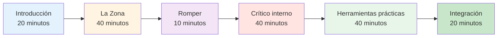

# Guía de la sesión: Introducción al juego mental (2-3 horas)

<AdBanner />

## Descripción general

Esta guía te ayuda a realizar una sesión introductoria de 2 a 3 horas sobre entrenamiento mental para jugadores de petanca. Ideal para entrenadores, líderes de club o jugadores experimentados que quieran introducir el entrenamiento mental en su equipo.

::: tip Dos secciones en esta guía
- **[Para los participantes](#para-participantes)** - Qué aprenderán los jugadores
- **[Para facilitadores](#para-facilitadores)** - Cómo llevar a cabo la sesión
:::

## Acceso rápido

| Sección | Objetivo | Acceso |
|---------|---------|--------|
| **Para los participantes** | Qué esperar de la sesión | [Ver sección](#para-participantes) |
| **Para facilitadores** | Plan completo de la sesión y cronograma | [Ver sección](#para-facilitadores) |
| **Materiales de la sesión** | Guías, diapositivas y hojas de trabajo | [Ver materiales](/es/mental-journey/materials) |
| **Lista de verificación de preparación** | Qué preparar antes de la sesión | [Ver lista de verificación](#preparación-1-semana-antes) |

---

## Para los participantes

### Qué esperar

Esta sesión introduce el juego mental de la petanca a través de debates, ejercicios y técnicas prácticas que podrás utilizar de inmediato.

**Aprenderás:**
- Por qué el entrenamiento mental es importante para el rendimiento
- La diferencia entre el &quot;modo técnico&quot; y el &quot;modo de flujo&quot;
- Cómo reconocer y gestionar a tu crítico interno
- Técnicas sencillas para el manejo de la presión
- Una rutina básica previa al disparo

**Lo que necesitarás:**
- Mente abierta y voluntad de compartir.
- Cuaderno y bolígrafo
- Tus propias experiencias para discutir
- 2-3 horas de tiempo concentrado

### Estructura de la sesión



### Conceptos clave que explorarás

#### 1. La Zona (Estado de Flujo)
- Lo que se siente cuando todo encaja
- Por qué pensar en la técnica altera el rendimiento
- El “cambio” de la planificación a la ejecución

#### 2. El crítico interno
- Cómo el diálogo interno negativo afecta el rendimiento
- La diferencia entre el Crítico Interno y el Coach Interno
- Observación neutral vs. juicio severo

#### 3. Respuesta a la presión
- Por qué juegas diferente en la competición
- Signos físicos de presión
- Técnicas de reinicio rápido

#### 4. Herramientas prácticas
- Reinicio de 3 respiraciones
- Rutina sencilla previa al disparo
- Protocolo de recuperación de errores

### Qué llevar

**Requerido:**
- Tú mismo y tus experiencias
- Voluntad de participar

**Opcional:**
- Ejemplos de desafíos mentales que enfrentas
- Preguntas sobre situaciones específicas
- Cuaderno para notas personales

### Después de la sesión

Recibirás:
- Resumen de conceptos clave
- Ejercicios de práctica para la semana
- Enlaces a módulos educativos detallados
- Plantilla de objetivos para el desarrollo de juegos mentales

<AdInArticle />

---

## Para facilitadores

### Lista de verificación de preparación

**1 semana antes:**
- [ ] Reservar habitación por 2-3 horas
- [ ] Invitar de 6 a 12 participantes
- [ ] Marcar páginas de materiales (ver [Materiales](/es/mental-journey/materiales))
- [ ] Revise esta guía a fondo
- [ ] Prepare un rotafolio o una pizarra blanca

**1 día antes:**
- [ ] Confirmar asistencia
- [ ] Preparar la sala (asientos en círculo)
- [ ] Probar cualquier tecnología (diapositivas, etc.)
- [ ] Preparar materiales

**1 hora antes:**
- [ ] Llegar temprano
- [ ] Disponer los asientos en círculo
- [ ] Preparar materiales
- [ ] Céntrate en ti mismo

### Su papel como facilitador

::: warning Importante
No eres un terapeuta ni un coach técnico. Eres un facilitador que:
- Discusión de guías
- Crea un espacio seguro
- Conecta conceptos con la experiencia.
- Gestiona la dinámica de grupo
:::

**Habilidades clave:**
- escucha activa
- Presencia neutral
- Gestionar diferentes personalidades
- Saber cuándo seguir adelante

### Plan de sesión detallado

---

#### Parte 1: Introducción (20 minutos)

**Objetivos:**
- Crear seguridad psicológica
- Establecer expectativas
- Construir conexión grupal

**Guion:**

Bienvenidos a todos. Esta sesión se centra en el juego mental de la petanca: los pensamientos, sentimientos y patrones que influyen en tu rendimiento.

**Reglas básicas:**
1. Lo que se comparte aquí, se queda aquí
2. No juzgar las experiencias de los demás
3. La participación es voluntaria
4. No hay respuestas incorrectas

**Ronda rápida:** Nombre, cuánto tiempo has jugado, un desafío mental que enfrentas.

**Notas del facilitador:**
- Vaya primero a modelar la vulnerabilidad
- Mantenga las presentaciones breves (1 minuto cada una)
- Observar temas comunes
- Validar todas las respuestas

---

#### Parte 2: La Zona/Estado de Flujo (40 minutos)

**Objetivos:**
- Comprender los estados de flujo
- Reconocer el modo técnico frente al modo de flujo
- Aprenda el concepto de &quot;cambio&quot;

**Pregunta de apertura:**
Piensa en una ocasión en la que jugaste tu mejor partido de petanca. ¿Cómo te sentiste? ¿Qué fue diferente?

**Temas de discusión:**
1. &quot;¿Cuántos de ustedes han tenido partidas en las que todo encajó?&quot;
2. ¿En qué estabas pensando en esos momentos?
3. &quot;¿En qué se diferencia eso de cuando luchas?&quot;

**Puntos clave de enseñanza:**

Utilice la pizarra para dibujar:
```
PLANNING MODE          →    EXECUTION MODE
(Outside circle)            (Inside circle)
- Analyze situation         - Eyes on target
- Choose strategy           - Trust training
- Decide throw type         - Automatic movement
```

**Ejercicio: El cambio (10 minutos)**

&quot;Practiquemos el momento del cambio:
1. Ponerse de pie
2. Imagina que estás fuera del círculo: piensa en un tiro.
3. Toma un respiro
4. Da un paso adelante (en un círculo imaginario)
5. A medida que avanzas, deja ir el análisis.
6. Concéntrese sólo en un objetivo imaginario&quot;

**Interrogar:**
- &quot;¿Qué notaste?&quot;
- ¿Fue fácil o difícil dejar de pensar?
- &quot;¿Cómo podría aplicarse esto en juegos reales?&quot;

---

#### Parte 3: Descanso (10 minutos)

**Acciones del facilitador:**
- Fomentar el debate informal
- Observa la energía del grupo
- Prepárate para la siguiente sección

---

#### Parte 4: El crítico interno (40 minutos)

**Objetivos:**
- Reconocer patrones de diálogo interno negativos
- Distinguir entre el crítico interno y el entrenador interno
- Practique la observación neutral

**Apertura:**
Todos tenemos una voz interior que comenta sobre nuestro desempeño. A veces es útil, a veces es dura. Analicémosla.

**Ejercicio: Inventario del crítico interno (15 minutos)**

&quot;En tu papel, escribe:
1. Lo que dice tu voz interior después de un mal lanzamiento
2. Lo que dice cuando estás bajo presión
3. &quot;Lo que dice de tus habilidades&quot;

*Da 5 minutos para escribir*

&quot;Y ahora, ¿quién está dispuesto a compartir un ejemplo?&quot;

**Notas del facilitador:**
- Normalizar el diálogo interno duro
- No intentes &quot;arreglar&quot; a nadie
- Busque patrones comunes

**Enseñanza: Crítico Interno vs Coach Interno (15 minutos)**

Dibuja dos columnas en la pizarra:

| Crítico interno | Entrenador interior |
|--------------|-------------|
| &quot;¡¿Cómo pudiste perderte eso?!&quot; | &quot;Eso se fue a la izquierda&quot; |
| &quot;Siempre te ahogas&quot; | &quot;Intentémoslo de nuevo&quot; |
| &quot;Eres terrible&quot; | ¿Qué puedo aprender? |

**Discusión:**
- &quot;¿Notas la diferencia?&quot;
- ¿Qué voz ayuda al rendimiento?
- &quot;¿Puedes cambiar la voz?&quot;

**Práctica: Reencuadre (10 minutos)**

&quot;Toma una de tus afirmaciones de Crítico Interno. ¿Cómo la diría un Coach Interno?&quot;

Comparte ejemplos.

---

#### Parte 5: Herramientas prácticas (40 minutos)

**Objetivos:**
- Aprenda el reinicio de 3 respiraciones
- Crea una rutina sencilla antes de disparar
- Comprender la recuperación de errores

**Herramienta 1: Reinicio de 3 respiraciones (10 minutos)**

Este es tu botón de reinicio de emergencia. Úsalo cuando sientas que aumenta la presión.

**Demostrar:**
1. Inhale mientras cuenta hasta 4
2. Mantener durante 2 segundos
3. Exhala durante 6 segundos
4. Repetir 3 veces

&quot;Practiquemos juntos ahora.&quot;

*Guía al grupo a través de 3 ciclos*

**Interrogar:**
- ¿Qué notaste en tu cuerpo?
- &quot;¿Cuándo podrías utilizar esto?&quot;

**Herramienta 2: Rutina sencilla previa al disparo (15 minutos)**

&quot;Una rutina te ayuda a pasar de la planificación a la ejecución de manera consistente&quot;.

**Estructura básica:**
```
Outside Circle (Planning):
- Look at situation
- Decide on throw
- See the result in your mind

Walking to Circle (Transition):
- One deep breath
- Let go of analysis

Inside Circle (Execution):
- Eyes on target only
- Trust your training
- Execute
```

**Ejercicio:**
&quot;Crea tu propia rutina de 3 pasos. Escríbela.&quot;

Comparte ejemplos.

**Herramienta 3: Protocolo de recuperación de errores (15 minutos)**

&quot;Los jugadores de élite no cometen menos errores. Se recuperan más rápido.&quot;

**Protocolo de 3 pasos:**
1. **Observar** - Expresar el hecho de manera neutral (&quot;Eso se fue a la izquierda&quot;)
2. **Aprender** - Extraer información (&quot;El viento era más fuerte de lo que pensaba&quot;)
3. **Reinicio** - Avanzar (reinicio de 3 respiraciones, mirada hacia adelante)

**Práctica:**
Piensa en un error reciente. Sigue los tres pasos.

---

#### Parte 6: Integración y cierre (20 minutos)

**Objetivos:**
- Consolidar el aprendizaje
- Crear planes de acción
- Proporcionar recursos

**Preguntas de reflexión:**
1. &quot;¿Qué conocimiento te llevas?&quot;
2. &quot;¿Qué cosa intentarás esta semana?&quot;
3. ¿Qué preguntas quedan?

**Planificación de acciones (10 minutos)**

&quot;En tu folleto, escribe:
1. Una técnica que practicarás esta semana
2. ¿Cuándo y dónde lo practicarás?
3. Cómo harás el seguimiento de tu progreso

**Recursos:**
- Entregar hoja resumen
- Compartir sitio web: carreau.app
- Módulo de inicio recomendado: [La Zona](/es/educacion/la-zona/)

**Círculo de cierre:**
&quot;Una palabra para describir cómo te sientes ahora mismo.&quot;

**Palabras finales:**
El entrenamiento mental es una habilidad como cualquier otra: requiere práctica. Empieza poco a poco, ten paciencia contigo mismo y observa los cambios. Gracias por tu apertura de hoy.

---

### Consejos para el facilitador

#### Manejo de situaciones difíciles

**Si alguien domina:**
- &quot;Gracias [nombre]. Escuchemos a otros&quot;.
- Utilice turnos estructurados

**Si alguien se resiste:**
- No discutas
- Esa es una perspectiva válida. ¿Qué opinan los demás?
- Alinearse con su preocupación

**Si alguien se emociona:**
- Normalizarlo
- &quot;Esto toca algo real. Gracias por compartir.&quot;
- No intentes arreglarlo

**Si la discusión se estanca:**
- Utilice indicaciones específicas
- Comparte tu propio ejemplo
- Pasar a un ejercicio

#### Gestión de la energía

**Alta energía:** Utilice ejercicios y movimiento
**Baja energía:** Haz preguntas provocativas
**Dispersos:** Devolver a la estructura
**Tiempo:** Usa el humor o interrumpe

### Post-sesión

**Hacer un seguimiento:**
- Enviar correo electrónico de resumen dentro de las 24 horas
- Incluir enlaces a recursos
- Ofrecer responder preguntas
- Programar sesión de seguimiento opcional

**Autorreflexión:**
- ¿Qué funcionó bien?
- ¿Qué cambiarías?
- ¿Qué te sorprendió?
- ¿Qué aprendiste?

<AdBanner />

---

## Materiales

- [Guía del participante](/es/mental-journey/materials#guia-del-participante)
- [Diapositivas del facilitador](/es/viaje-mental/materiales#diapositivas-del-facilitador)
- [Hoja de resumen](/es/viaje-mental/materiales#hoja-de-resumen)
- [Hojas de ejercicios](/es/mental-journey/materials#exercise-worksheets)

---

::: tip ¿Listo para facilitar?
1. Revise esta guía a fondo
2. Descargar materiales
3. Practica los ejercicios tú mismo
4. Programa tu sesión
5. Confía en el proceso
:::

