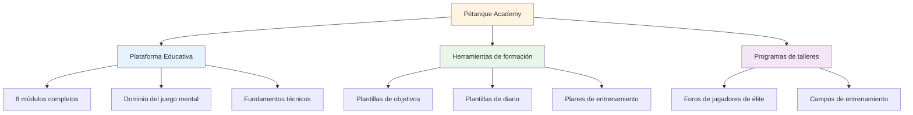
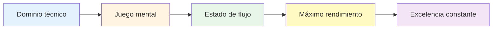

# Noticias y actualizaciones

## Bienvenido a la Academia de Petanca

::: tip ¡La plataforma ya está disponible! 🎉
**¡La Academia de Petanca ya está en pleno funcionamiento!**

Hemos lanzado una plataforma integral dedicada a ayudar a los jugadores de petanca de élite a alcanzar su máximo potencial a través del dominio del juego mental, entrenamiento estructurado y herramientas prácticas.
:::

## Qué hay disponible ahora

### 📚 Plataforma Educativa Completa

Hemos lanzado **8 módulos educativos integrales** que cubren todo, desde los estados de flujo hasta la nutrición:

| Módulo | ¿Qué hay dentro? | Características principales |
|--------|---------------|--------------|
| **[La Zona](/es/educacion/la-zona/)** | Dominio del estado de flujo | 4 guías detalladas sobre cómo ingresar y mantener el flujo |
| **[Fuerza mental](/es/educacion/fuerza-mental/)** | Manejo de presión | Rutinas previas al disparo, gestión de la crítica interna |
| **[Atención plena](/es/educación/atención plena/)** | Conciencia del momento presente | Prácticas diarias, técnicas de competición. |
| **[Metas](/es/educación/metas/)** | Planificación estratégica | Objetivos SMART, jerarquía, sistemas de seguimiento |
| **[Tácticas](/es/educación/tácticas/)** | Estrategia de juego | Toma de decisiones, probabilidad, posicionamiento |
| **[Jugador de equipo](/es/educacion/jugador-de-equipo/)** | Habilidades de colaboración | Comunicación, confianza, dinámica de equipo. |
| **[Formación](/es/educacion/formacion/)** | Métodos de práctica | Ejercicios, práctica deliberada, progresión. |
| **[Nutrición](/es/educacion/nutricion/)** | Combustible de alto rendimiento | Manejo del azúcar en sangre, nutrición para competición |

### 🛠️ Herramientas prácticas

**Plantillas y programas listos para usar:**

- **[Taller](/es/taller)** - Sesiones estructuradas de 3 horas para el desarrollo del juego mental
- **[Training Camp](/es/training-camp)** - Programas intensivos de fin de semana para jugadores de élite
- **[Sesión de capacitación](/es/sesion-de-capacitacion)** - Marcos de práctica de 2 a 3 horas
- **[Plantilla de objetivos](/es/plantilla-de-objetivos)** - Sistema completo de establecimiento y seguimiento de objetivos
- **[Plantilla de diario](/es/diary-template)** - Diario de práctica y reflexión diaria

### 🎯 Orientación técnica

La sección **[Asesoramiento técnico](/es/technical/)** incluye:
- Guía completa de todos los lanzamientos de petanca
- Estrategias de selección de trayectorias
- Técnicas de control de giro
- Marcos de selección de tomas

### 🍽️ Nutrición para el rendimiento

**[Comida](/es/comida)** - Guía completa para:
- Control del azúcar en sangre para un enfoque estable
- Estrategias de nutrición precompetitivas
- Optimización energética para torneos

### 📝 Artículos y perspectivas

**NUEVO: 14 artículos en profundidad** que cubren temas de juegos mentales:

| Categoría | Artículos |
|----------|----------|
| **Entendiendo al crítico interno** | [Crítico Interno](/es/blog/crítico-interno) - Domina tu diálogo interno |
| **Creando rutinas previas al disparo** | [Rutinas previas al disparo](/es/blog/rutinas-previas-al-disparo) - Crea consistencia |
| **Gestión de la presión** | [Gestión de la presión](/es/blog/gestion-de-la-presion) - Rendimiento bajo estrés |
| **Psicología del rendimiento** | [Estados de flujo](/es/blog/ciencia-del-estado-de-flujo) • [Atención plena](/es/blog/competencia-de-atención-plena) • [Establecimiento de objetivos](/es/blog/establecimiento-de-objetivos-de-élite) • [Resiliencia mental](/es/blog/resiliencia-mental) |
| **Dinámica de equipo** | [Comunicación](/es/blog/comunicacion-en-equipo) • [Química-en-equipo](/es/blog/química-en-equipo) • [Liderazgo](/es/blog/liderazgo-en-equipo) |
| **Capacitación y desarrollo** | [Errores de entrenamiento mental](/es/blog/errores-de-entrenamiento-mental) • [Estructura de la práctica](/es/blog/estructura-de-la-practica) • [Preparación para la competición](/es/blog/preparacion-para-la-competición) |

➡️ **[Explorar todos los artículos](/es/blog/)**

### 📖 Recursos

**Estudios de caso y testimonios:**

- **[Casos de estudio](/es/casos-de-estudio)** - Ejemplos reales de jugadores de élite que utilizan el entrenamiento del juego mental
- **[Testimonios](/es/testimonios)** - Comentarios de jugadores que han implementado estos métodos

## Nuestra misión

::: tip El siguiente nivel
Los jugadores de élite ya dominan la técnica. El siguiente avance proviene del **juego mental**: aprender a acceder a estados de fluidez, manejar la presión y rendir al máximo de forma constante.

**La Academia de Petanca proporciona la hoja de ruta completa.**
:::

## Estadísticas de la plataforma

::: info Lo que hemos construido
- ✅ **8 módulos educativos** con más de 30 guías detalladas
- ✅ **5 herramientas prácticas** listas para usar
- ✅ **10 idiomas** - accesible en todo el mundo
- ✅ **Más de 100 páginas** de contenido de nivel élite
- ✅ **Diagramas de sirena** para el aprendizaje visual
- ✅ **Plantillas para copiar y pegar** para uso inmediato
:::

## Cómo empezar

### Para nuevos visitantes

**Comienza con lo fundamental:**

1. **[Ambición](/es/ambición)** - Entender la filosofía detrás del desarrollo de élite
2. **[La Zona](/es/educacion/la-zona/)** - Aprende sobre los estados de flujo
3. **[Plantilla de objetivos](/es/goal-template)** - Establece tus primeros objetivos estructurados

### Para jugadores experimentados

**Profundice en temas avanzados:**

1. **[Fuerza Mental](/es/educacion/fuerza-mental/)** - Domina las situaciones de presión
2. **[Tácticas](/es/educación/tácticas/)** - Refinar la toma de decisiones estratégicas
3. **[Taller](/es/taller)** - Implementar sesiones de juego mental estructuradas

### Para equipos

**Construir la excelencia colectiva:**

1. **[Jugador de equipo](/es/educacion/jugador-de-equipo/)** - Mejora la dinámica del equipo
2. **[Training Camp](/es/training-camp)** - Organiza intensivos de fin de semana
3. **[Sesión de capacitación](/es/sesion-de-capacitacion)** - Estructurar las prácticas del equipo

## ¿Qué hace que esto sea diferente?

::: warning Por qué destaca la Academia de Petanca
**La mayor parte del entrenamiento se centra en la técnica. Nos centramos en lo que realmente necesitan los jugadores de élite:**

1. **Dominio del juego mental**: El verdadero diferenciador en los niveles altos
2. **Herramientas prácticas**: no solo teoría, sino plantillas listas para usar
3. **Programas estructurados** - Marcos claros para talleres y campamentos
4. **Basado en evidencia** - Construido sobre psicología deportiva e investigación del estado de flujo
5. **Enfocado en la élite** - Diseñado para jugadores que ya dominan los conceptos básicos
:::

## Complicarse

**¿Quieres contribuir o brindar comentarios?**

Visita nuestra página **[Acerca de](/es/acerca de)** para:
- Conozca más sobre la plataforma
- Comparte tus comentarios
- Solicitar contenido específico
- Conéctate con nosotros

---

::: tip Empieza tu viaje hoy
Todo lo que necesitas para llevar tu juego al siguiente nivel ya está aquí. Elige un módulo, descarga una plantilla y empieza a implementar.

**Bienvenido a la Academia de Petanca, donde los jugadores de élite se vuelven excepcionales.**
:::

