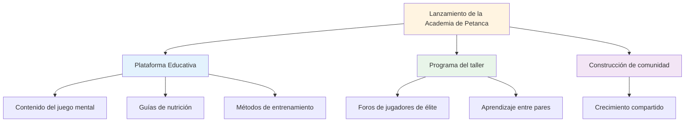
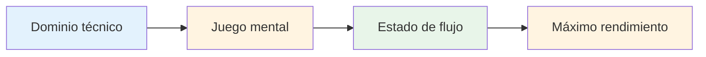

# Noticias

## Bienvenido a la Academia de Petanca

::: tip ¡Lanzamiento emocionante! 🎉
**¡Esta es la primera startup!**

Estamos entusiasmados de lanzar Pétanque Academy, una nueva iniciativa dedicada a ayudar a los jugadores de petanca de élite a alcanzar su máximo potencial.
:::

## Lo que viene

::: info Mantente atento para
- 📅 **Próximos talleres** - Sesiones en grupos pequeños para jugadores de élite
- 📚 **Nuevo contenido educativo** - Juego mental, nutrición, métodos de entrenamiento
- 🎯 **Eventos comunitarios**: conéctate con jugadores con ideas afines
- 💡 **Historias y perspectivas de los jugadores**: aprende de las experiencias de otros
:::

## Nuestra misión

::: tip El siguiente nivel
Los jugadores de élite ya dominan la técnica. El siguiente avance proviene del juego mental: aprender a acceder a estados de fluidez, manejar la presión y rendir al máximo constantemente.
:::

## Empezar

Mientras espera los anuncios de los talleres, explore nuestra sección de educación integral:

| Sección | Lo que aprenderás | Empieza aquí |
|---------|-------------------|------------|
| **La Zona** | Cómo ingresar a estados de flujo de manera consistente | [Entendiendo el Flujo](/es/educacion/la-zona/) |
| **Fuerza mental** | Manejo de la presión y creación de rutinas | [Juego Mental](/es/educacion/fuerza-mental/) |
| **Consciencia** | Conciencia del momento presente para el rendimiento | [Práctica de atención plena](/es/educación/atención/) |
| **Nutrición** | Alimenta tu cerebro para un enfoque estable | [Nutrición de precisión](/es/educación/nutrición/) |
| **Objetivos** | Establecer y alcanzar objetivos significativos | [Establecimiento de metas](/es/educacion/metas/) |

::: info Únete al viaje
Esto es solo el comienzo. Estamos construyendo algo especial para jugadores de élite que quieren dar el siguiente paso. Bienvenidos a la Academia de Petanca.
:::

