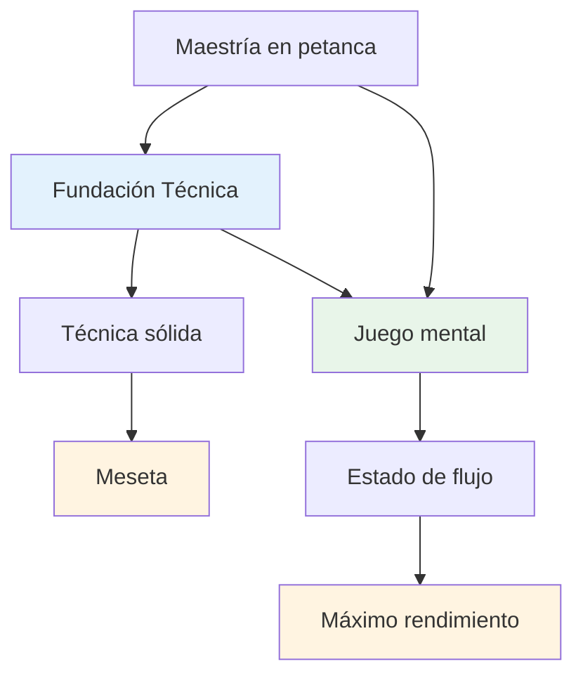
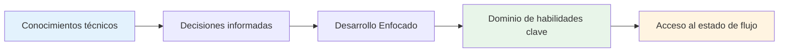

# Asesoramiento técnico
<AdBanner />

## Una nota sobre la técnica

Si bien nuestro enfoque principal está en el juego mental y el estado de flujo, reconocemos que la técnica es la base sobre la que se construye todo lo demás.

::: info Nuestra filosofía
**La técnica es la base, pero el flujo es el techo.** Necesitas una técnica sólida para alcanzar el nivel de élite, pero el dominio mental es lo que te lleva más allá.
:::

## El error más común en la formación técnica

<AdInArticle />

::: info Esta sección es para jugadores experimentados
Si eres nuevo en la petanca, naturalmente necesitarás desarrollar tu técnica básica desde cero, y ese es un viaje diferente.

**Este consejo es para jugadores que llevan años jugando** y ya tienen una técnica establecida que les resulta natural, relajada y fiable. Ya has encontrado tu estilo de lanzamiento. Ahora la pregunta es: ¿cómo progresas a partir de ahí?
:::

::: warning La trampa común
Cuando los jugadores experimentados quieren mejorar, suelen volver a lo básico: ajustar el agarre, el movimiento del brazo, el punto de lanzamiento y la posición del cuerpo. Horas de práctica. Ajustes sin fin.

**Pero se han saltado la pregunta más importante:** ¿Qué quieres exactamente que haga la bola?
:::

Antes de abordar tu técnica, necesitas tener claro el **resultado** que quieres lograr. No &quot;Quiero golpear más&quot; ni &quot;Quiero ser más consistente&quot;; esos no son resultados, son deseos.

Un resultado real se ve así:
- &quot;Quiero un globo de arco alto que se detenga a 20 cm de donde aterriza&quot;
- &quot;Quiero un plano rodante que se curve hacia la izquierda en este tipo de terreno&quot;
- &quot;Quiero un tiro suave y frontal que apenas toque la bola objetivo&quot;

**Primero, explora la [Paleta de Lanzamientos](/es/technical/throws)** para comprender las posibilidades. Luego, decide qué lanzamiento específico quieres añadir a tu repertorio. Solo entonces deberías empezar a trabajar en cómo deben moverse tu brazo, muñeca y cuerpo para lograr ese resultado.

## La forma correcta de trabajar la técnica

No decimos que nunca debas trabajar el brazo, la muñeca, la liberación ni la posición corporal. **El trabajo técnico de ejecución es absolutamente válido**, pero debe tener el propósito correcto.

::: info El propósito correcto para el trabajo técnico
**Propósito correcto:** &quot;Quiero agregar un nuevo diseño a mi paleta&quot;

**Propósito equivocado:** &quot;Quiero pegar más tiros&quot; o &quot;Quiero ser más consistente&quot;
:::

Aquí está el proceso:

1. **Explora la [Paleta de Lanzamientos](/es/technical/throws)** — Identifica qué lanzamiento o técnica quieres agregar a tu repertorio
2. **Visualiza el resultado**: ¿Qué debería hacer la bola? ¿Qué trayectoria, aterrizaje, giro y comportamiento necesitas?
3. **Luego trabaja en la ejecución**: ahora puedes concentrarte en el brazo, la muñeca, la posición del cuerpo y la liberación para lograr ese resultado específico.

Este enfoque le da a tu formación técnica **una dirección clara y un progreso medible**. No solo estás practicando, sino que estás ampliando deliberadamente tus capacidades.

::: tip Ejemplo: Agregar una Plombée
**Objetivo:** Añade un drop shot (plombée) a tu repertorio de puntería

**Visualización del resultado:** La bola debe formar un arco alto, aterrizar suavemente con efecto retroceso y detenerse casi inmediatamente.

**Enfoque técnico:** Punto de liberación más alto, mayor acción de la muñeca para el efecto retroceso, agarre más suave

**Medida de éxito:** ¿Puedes ejecutar este lanzamiento cuando lo desees? Ese es el objetivo.
:::

## Por qué &quot;golpear más&quot; es el objetivo equivocado

Si estás ajustando tu técnica para &quot;golpear más a menudo&quot; o &quot;ser más consistente&quot;, probablemente estés abordando el problema equivocado.

**La verdad es esta:** Si bateas bien en los entrenamientos, pero te cuesta en la competición, el problema no es tu técnica, sino la mentalidad. Tu brazo sabe qué hacer. La pregunta es si tu mente se lo permite.

::: tip La conexión mental
La inconsistencia bajo presión rara vez es un problema técnico: es un problema mental.

**Para lograr consistencia y rendimiento bajo presión, explora nuestra sección [Educación](/es/educacion/)**, en particular:
- [La Zona](/es/educacion/la-zona/) — Creando condiciones para un rendimiento máximo
- [Fuerza mental](/es/educacion/fuerza-mental/) — Actuando cuando importa
- [Técnica vs. Flujo](/es/education/the-zone/technical-vs-flow) — Cuándo centrarse en la técnica vs. en la confianza
:::

## Nuestra perspectiva

::: tip No necesitas dominarlo todo
**No es necesario que domines todas las técnicas**, pero comprender la paleta completa de posibilidades te ayudará a:

- ✅ Conozca lo que es posible
- ✅ Tomar decisiones informadas sobre qué desarrollar
- ✅ Apreciar el juego a un nivel más profundo
- ✅ Entender lo que pueden hacer los jugadores de élite
:::

::: info El objetivo
Si tiene un enfoque técnico y desea ampliar su repertorio, esta sección describe el objetivo final: la paleta completa de lanzamientos disponibles para un jugador de petanca.

**Recuerda:** El objetivo no es dominarlo todo. Es tener la base técnica suficiente para entrar en la zona y dejar que tu cuerpo elija el lanzamiento correcto de forma natural.
:::

## Temas

### [Paleta de Lanzamientos](/es/técnico/lanzamientos)
¿Qué lanzamientos hay? Un resumen completo de las posibilidades técnicas en la petanca.

::: tip Después de la técnica, ¿qué sigue?
Una vez que tienes una técnica sólida, el verdadero crecimiento proviene de:
- **[La Zona](/es/educacion/la-zona/)** - Acceso a estados de flujo
- **[Fuerza mental](/es/educacion/fuerza-mental/)** - Manejo de la presión
- **[Métodos de entrenamiento](/es/educacion/entrenamiento/)** - Cómo practicar eficazmente
:::

<AdBanner />
