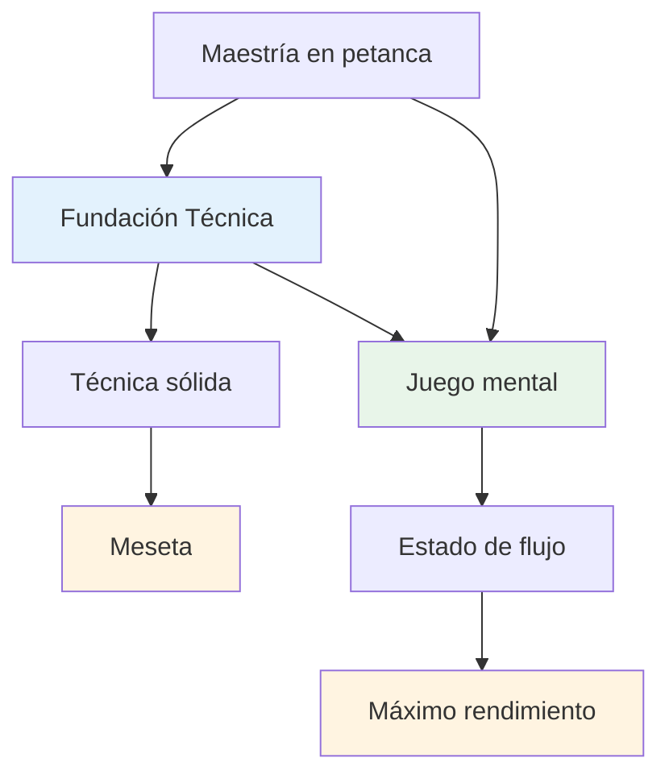
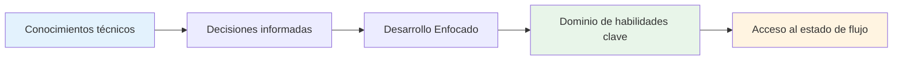

# Asesoramiento técnico

## Una nota sobre la técnica

Si bien nuestro enfoque principal está en el juego mental y el estado de flujo, reconocemos que la técnica es la base sobre la que se construye todo lo demás.

::: info Nuestra filosofía
**La técnica es la base, pero el flujo es el techo.** Necesitas una técnica sólida para alcanzar el nivel de élite, pero el dominio mental es lo que te lleva más allá.
:::

## Nuestra perspectiva

::: tip No necesitas dominarlo todo
**No es necesario que domines todas las técnicas**, pero comprender la paleta completa de posibilidades te ayudará a:

- ✅ Conozca lo que es posible
- ✅ Tomar decisiones informadas sobre qué desarrollar
- ✅ Apreciar el juego a un nivel más profundo
- ✅ Entender lo que pueden hacer los jugadores de élite
:::

::: info El objetivo
Si tiene un enfoque técnico y desea ampliar su repertorio, esta sección describe el objetivo final: la paleta completa de lanzamientos disponibles para un jugador de petanca.

**Recuerda:** El objetivo no es dominarlo todo. Se trata de tener la base técnica suficiente para entrar en la zona y dejar que tu cuerpo elija el lanzamiento correcto de forma natural.
:::

## Temas

### [Paleta de Lanzamientos](/es/técnico/lanzamientos)
¿Qué lanzamientos hay? Un resumen completo de las posibilidades técnicas en la petanca.

::: tip Después de la técnica, ¿qué sigue?
Una vez que tienes una técnica sólida, el verdadero crecimiento proviene de:
- **[La Zona](/es/educacion/la-zona/)** - Acceso a estados de flujo
- **[Fuerza mental](/es/educacion/fuerza-mental/)** - Manejo de la presión
- **[Métodos de entrenamiento](/es/educacion/entrenamiento/)** - Cómo practicar eficazmente
:::

