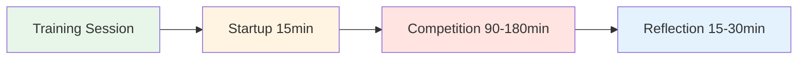

# Sesión de entrenamiento: Guía de práctica de competición

<AdBanner />

## Cómo 4 jugadores pueden entrenar juntos regularmente

Esta guía muestra cómo crear un grupo de entrenamiento regular de 4 jugadores que compiten entre sí en diferentes superficies y entornos durante 2 a 4 horas. Imita la competición real mientras desarrollas seguridad psicológica y habilidades de rendimiento mental.

::: tip La filosofía de la sesión de entrenamiento
**La competencia sin reflexión es solo juego. El entrenamiento sin competencia es solo práctica.** Este formato combina ambas cosas: competir con intensidad y luego reflexionar profundamente.
:::



## ¿Por qué 4 jugadores?

**El número perfecto:**
- **Formato 2v2** - Refleja la competencia real
- **Opciones de rotación** - Cambiar de pareja, jugar individuales
- **Aprendizaje entre pares** - Diversos estilos de juego
- **Responsabilidad** - Es difícil cancelar a 3 personas
- **Intimidad** - Lo suficientemente pequeño para compartir en profundidad

::: info La dinámica de grupo
Cuatro jugadores crean el equilibrio ideal entre la intensidad de la competición y la seguridad psicológica. Compiten con intensidad, pero también se apoyan mutuamente en su crecimiento.
:::

## Encontrar tu grupo

### Composición ideal del grupo

**Nivel de habilidad:**
- Nivel similar (dentro de 1-2 niveles)
- Todos comprometidos con la mejora
- Mezcla de punteros y tiradores
- Diferentes estilos de juego

**Mentalidad:**
- Abierto a la vulnerabilidad
- Dispuesto a reflexionar
- Competitivo pero solidario
- Orientado al crecimiento

**Logística:**
- Vivir a 30 minutos uno del otro
- Puede comprometerse con un horario regular
- Disponibilidad similar

### Reclutando a tu grupo

**Dónde encontrar jugadores:**
- Los jugadores de élite de tu club
- Participantes habituales de torneos regionales
- Comunidades de petanca online.
- Pídele recomendaciones a tu entrenador

**La invitación:**
Estoy formando un pequeño grupo de entrenamiento de 4 jugadores que quieren competir regularmente y trabajar la mentalidad. Nos reuniríamos semanalmente de 2 a 3 horas, jugaríamos con intensidad y luego reflexionaríamos sobre lo que estamos aprendiendo. ¿Te interesa?

## Estructura de la sesión

### Sesión de 2 horas

| Tiempo | Actividad | Duración |
|------|----------|----------|
| **Inicio** | Registro y configuración | 15 min |
| **Competición** | Partidos 2v2 | 90 min |
| **Reflexión** | Informe y aprendizaje | 15 min |

### Sesión de 3 horas

| Tiempo | Actividad | Duración |
|------|----------|----------|
| **Inicio** | Registro y configuración | 15 min |
| **Ronda de competición 1** | Partidos 2v2 | 60 min |
| **Pausa** | Descanso y charla informal | 15 min |
| **Ronda de competencia 2** | Rotar compañeros | 60 min |
| **Reflexión** | Informe profundo | 30 min |

### Sesión de 4 horas

| Tiempo | Actividad | Duración |
|------|----------|----------|
| **Inicio** | Registro y configuración | 20 min |
| **Ronda de competición 1** | Partidos 2v2 | 75 min |
| **Pausa** | Descanso y refrigerio | 15 min |
| **Ronda de competencia 2** | Rotar compañeros | 75 min |
| **Descanso** | Descanso | 10 min |
| **Ronda de competencia 3** | Individual o desafío | 45 min |
| **Reflexión** | Análisis profundo y planificación | 30 min |

<AdInArticle />

## Protocolo de inicio (15-20 minutos)

### 1. Configuración física (5 min)

**Elige el terreno:**
- Rotar por diferentes superficies cada semana.
- Variar la dificultad y las condiciones
- A veces eliges terrenos incómodos intencionadamente.

**Configura el espacio:**
- Marcar claramente los límites
- Preparar herramientas de medición
- Estación de agua
- Sombrear si es necesario

### 2. Registro mental (10 min)

**El Círculo de Check-In:**

Párese en un círculo (sin bolas todavía) y camine alrededor:

**Cada persona comparte:**
1. **Nivel de energía** (1-10): &quot;Hoy estoy en un 7&quot;
2. **Estado mental**: «Me siento concentrado» o «Estoy distraído por el estrés laboral»
3. **Intención**: &quot;Hoy quiero trabajar en mantener la calma después de fallar&quot;

**Por qué esto es importante:**
- Desarrolla la conciencia del estado mental.
- Crea empatía en el grupo.
- Establece un enfoque individual para la sesión.
- Normaliza estar &quot;desconectado&quot; algunos días.

**Consejo para el facilitador:** Rotar quién empieza cada semana

### 3. Recordatorio de reglas básicas (5 min)

**En cada sesión, recuerda brevemente:**

::: Reglas básicas de la sesión de tip
1. **Compite duro** - Juega para ganar, sin reservas
2. **Apoyar el crecimiento** - Ayúdense unos a otros a aprender
3. **Respetar los manuales de usuario** - Honrar cómo cada persona quiere ser tratada
4. **Manténgase presente** - No se permiten teléfonos durante el juego
5. **Reflexiona honestamente** - Comparte lo que realmente está sucediendo en tu interior
6. **Confidencialidad**: Lo que se comparte aquí, se queda aquí.
:::

**El equilibrio:**
&gt; &quot;Competimos como si fuera un torneo, pero apoyamos como si fuéramos compañeros de equipo. Duros con el juego, suaves con la persona&quot;.

## Reglas de conducta de la competición

### Formato de coincidencia

**Estándar 2v2:**
- Juega hasta 13 puntos
- Reglas estándar de petanca
- Llevar la cuenta honestamente
- Mide cuando sea necesario (no adivines)

**Opciones de rotación:**

**Semana 1:** A+B vs C+D
**Semana 2:** A+C vs B+D
**Semana 3:** A+D vs B+C
**Semana 4:** Ronda de individuales

### Creando un entorno competitivo

::: warning Crítica: Hazlo Realidad
**Esto no es una práctica casual.** Trátalo como un torneo:

✅ **Hacer:**
- Llevar la puntuación oficial
- Medir con precisión
- Llamar faltas de pie
- Tómalo en serio
- Celebra los buenos tiros
- Mostrar decepción por los fallos

❌ **No:**
- Dar &quot;segundas oportunidades&quot;
- Ser demasiado informal
- Dejar pasar las malas decisiones
- Broma durante todo el juego.
- Poner excusas
:::

### El giro del rendimiento mental

**Puntuaciones de la pista dos:**

1. **Puntuación tradicional** - Puntos ganados
2. **Puntuación de rendimiento mental**: Qué tan bien gestionaste tu juego interior

**Criterios de rendimiento mental (autocalificados del 1 al 5 después de cada juego):**

| Criterio | 1 (Malo) | 3 (Bueno) | 5 (Excelente) |
|-----------|----------|----------|---------------|
| **Me quedé presente** | Me concentré en tomas pasadas | Mayormente presente | Plenamente en el momento |
| **Crítico interno gestionado** | Diálogo interno duro | Atrapado y replanteado | Entrenador interno utilizado |
| **Regulación emocional** | Frustración visible | Se mantuvo mayormente tranquilo | Calma en todo momento |
| **Socio compatible** | Ignorado o culpado | Soporte básico | Manual de usuario usado |
| **Enfoque** | Distraído, desenfocado | Mayormente enfocado | Enfocado como un láser |

**Total:** /25 por juego

**Por qué esto es importante:**
- Cambia el enfoque del resultado al proceso
- Desarrolla la conciencia del juego mental.
- Crea responsabilidad por el trabajo interno.
- Celebra el rendimiento mental, no solo la victoria

### Variando el entorno

**Rota a través de diferentes desafíos:**

**Semana 1: Terreno local**
- Tu pista habitual
- Condiciones confortables
- Enfoque: Generar confianza

**Semana 2: Terreno difícil**
- Superficie irregular y desafiante
- Enfoque: Regulación emocional, aceptación

**Semana 3: Ubicación diferente**
- La pista de otro club
- Enfoque: Adaptabilidad

**Semana 4: Condiciones de presión**
- Espectadores (invitar a otros a mirar)
- Enfoque: Gestión de la presión externa

**Semana 5: Desafío meteorológico**
- Viento, calor o frío
- Enfoque: Fortaleza mental

**Semana 6: Presión del tiempo**
- Reloj de lanzamiento (30 segundos por lanzamiento)
- Enfoque: Toma de decisiones bajo presión

```mermaid
graph TD
    A[Vary Environment] --> B[Different Surfaces]
    A --> C[Different Locations]
    A --> D[Different Conditions]
    A --> E[Different Pressures]

    B --> F[Build Adaptability]
    C --> F
    D --> F
    E --> F

    style A fill:#e8f5e9
    style F fill:#fff4e1


## Reflection Protocol (15-30 minutes)

**Critical:** This is where the learning happens. Don't skip it!

### Short Reflection (15 min)

**After each game, quick debrief:**

**Go around the circle, each person shares:**

1. **Mental Performance Score** (1-5): "I give myself a 4 today"
2. **One thing that went well mentally**: "I stayed calm after my miss in the 3rd end"
3. **One thing to work on**: "I need to catch my inner critic faster"

**Group discussion:**
- "What did you notice about your inner game today?"
- "When did you feel most in the zone?"
- "When did you lose focus?"

### Deep Reflection (30 min)

**After final game, deeper debrief:**

**Structure:**

**1. Individual Journaling (5 min)**

Write privately:
- What happened in my mind during pressure moments?
- When did I use my Inner Coach vs. Inner Critic?
- How did I support my partner?
- What pattern am I noticing about myself?

**2. Pair Sharing (10 min)**

Partner up, share:
- One insight from journaling
- One question you're sitting with
- One commitment for next session

**3. Group Integration (15 min)**

Full circle:
- Each person shares ONE key learning
- Group identifies themes
- Discuss: "What are we learning as a group?"
- Set focus for next session

**Closing:**
- Thank each other for showing up
- Confirm next session date/time
- One-word check-out: "How are you leaving?"

<AdInArticle />

## User Manual Integration

### Creating Your User Manuals

**In your first session together, each person completes:**

| Section | Prompt | Example |
|---------|--------|---------|
| **My Stress Signature** | "When I'm anxious, I..." | "...go completely quiet" |
| **How to Support Me** | "After a miss, I need..." | "...silence, not encouragement" |
| **My Trigger** | "I get defensive when..." | "...someone questions my shot choice" |
| **My Reset Signal** | "When I need a mental reset, I..." | "...touch my boules and take 3 breaths" |

**Share with the group and keep copies.**

### Using User Manuals During Play

**During competition:**
- Partner knows how to support you
- Teammates respect your needs
- No guessing about what helps

**Example:**
- Marc's User Manual says: "After a miss, I need 30 seconds of silence"
- His partner knows: Don't immediately encourage, give space
- Result: Marc feels understood, recovers faster

**This is psychological safety in action.**

## Advanced Variations

### The Mental Challenge Week

**Once a month, add a mental challenge:**

**Week 1: Silent Game**
- No talking during play
- Only non-verbal communication
- Focus: Internal awareness

**Week 2: Positive Self-Talk Only**
- Catch and reframe every negative thought
- Say Inner Coach phrase out loud
- Focus: Cognitive restructuring

**Week 3: Pressure Simulation**
- Play with spectators
- Announce score loudly
- Focus: External pressure management

**Week 4: Gratitude Game**
- After each end, state one thing you're grateful for
- Focus: Positive mindset

### The Vulnerability Round

**Every 4-6 weeks, dedicate a session to deeper sharing:**

**Format:**
- 30 min: Play one game
- 60 min: Deep reflection using [Workshop](./workshop) activities
- 30 min: Play final game applying insights

**Activities to use:**
- Fear in a Hat
- Reframing Inner Critic
- The Iceberg
- User Manual updates

**Why this matters:**
- Prevents the group from becoming just "playing buddies"
- Maintains psychological safety
- Deepens learning
- Builds authentic connection

## Tracking Progress

### Individual Tracking

**Keep a training journal:**

After each session, record:
- Date, location, conditions
- Partners and opponents
- Traditional score
- Mental performance score (1-5)
- Key insights
- Patterns noticed
- Commitments for next time

**Monthly review:**
- What's improving?
- What patterns keep showing up?
- What's my mental performance trend?
- What do I need to focus on?

### Group Tracking

**Shared document (Google Sheet):**

| Date | Location | Teams | Score | Mental Perf | Key Learning |
|------|----------|-------|-------|-------------|--------------|
| Jan 7 | Club A | A+B vs C+D | 13-11 | 4.2 avg | Staying calm in wind |
| Jan 14 | Club B | A+C vs B+D | 13-8 | 3.8 avg | Managing inner critic |

**Benefits:**
- See progress over time
- Notice group patterns
- Celebrate improvements
- Identify focus areas

## Sustaining the Group

### Commitment Agreement

**At the start, agree on:**

**Frequency:**
- Weekly? Bi-weekly? Monthly?
- Same day/time each week?
- How many sessions committed to? (suggest minimum 8-12)

**Cancellation Policy:**
- 24-hour notice required
- Maximum 2 cancellations per person per quarter
- If someone cancels repeatedly, have a conversation

**Rotation:**
- Who chooses location each week?
- Who facilitates reflection?
- How do we keep it fresh?

### Handling Conflicts

**When tension arises:**

::: warning Address It, Don't Avoid It
**The mistake:** Letting resentment build

**The solution:** Use it as a learning moment

**Script:**
> "I notice some tension. Can we pause and talk about what's happening? This is exactly the kind of moment we can learn from."
:::

**Common conflicts:**
- Disagreement on calls
- Perceived unfairness
- Personality clashes
- Competitive intensity

**Resolution process:**
1. Pause the game
2. Each person shares their perspective
3. Group validates both sides
4. Agree on how to move forward
5. Return to play

**This builds psychological safety.**

### Keeping It Fresh

**Avoid stagnation:**

**Every 8-12 weeks, change something:**
- Invite a 5th player for variety
- Play at a tournament together
- Do a mini training camp (full day)
- Bring in a guest coach
- Try a new format (singles, different scoring)
- Do a deep vulnerability session

**The goal:** Keep learning, keep growing, keep it interesting

## Integration with Tournaments

### Pre-Tournament Prep

**2 weeks before a major tournament:**

**Session focus:**
- Play on similar terrain
- Simulate tournament pressure
- Practice competition-day nutrition
- Rehearse pre-shot routines
- Visualize success

**Mental preparation:**
- What's your intention for the tournament?
- What's your Inner Coach phrase?
- What's your reset signal?
- How will you handle pressure?

### Post-Tournament Debrief

**After a tournament:**

**Dedicate a session to reflection:**

**Structure:**
- 30 min: Share tournament experience
- 30 min: What worked? What didn't?
- 30 min: What did you learn about yourself?
- 30 min: Play a game applying learnings

**Questions:**
- When did you feel most in the zone?
- When did you lose it?
- How did you handle pressure?
- What would you do differently?
- What are you proud of?

**This cements learning and builds resilience.**

## Resources & Tools

### From This Site

- [Workshop Guide](./workshop) - Deep facilitation protocols
- [Training Camp Guide](./training-camp) - Weekend intensive format
- [Nutrition](./education/nutrition/) - Competition-day protocols
- [Mental Strength](./education/mental-strength/) - Inner game concepts
- [Mindfulness](./education/mindfulness/) - Presence techniques
- [Tactics](./education/tactics/) - Strategic thinking

### Recommended Tools

**Journaling:**
- Physical notebook or digital app
- Prompt: "What happened in my mind today?"

**Video Analysis:**
- Phone camera on tripod
- Review technique and body language
- Notice patterns

**Meditation Apps:**
- Headspace, Calm, Insight Timer
- 5-10 minutes before sessions

**Tracking:**
- Google Sheets for group data
- Personal spreadsheet for trends

## Success Stories

### Example: The Stockholm Four

**Group:** 4 elite players, ages 28-45
**Frequency:** Weekly, 3 hours
**Duration:** 18 months

**Results:**
- All 4 improved tournament rankings
- 2 made national team
- Mental performance scores increased from 3.2 to 4.5 average
- Group still meets 3 years later

**Key factors:**
- Consistent commitment
- Deep vulnerability work
- Honest reflection
- Mutual support

### Example: The Barcelona Crew

**Group:** 4 club players wanting to compete regionally
**Frequency:** Bi-weekly, 2 hours
**Duration:** 6 months

**Results:**
- Confidence increased dramatically
- All 4 entered first regional tournament
- 1 placed in top 8
- Group expanded to 8 players

**Key factors:**
- Started small and built trust
- Focused on mental game
- Celebrated small wins
- Kept it fun

## Common Challenges

### "We just end up playing, not reflecting"

**Solution:**
- Set a timer
- Designate a "reflection keeper"
- Make reflection non-negotiable
- Start with just 10 minutes

### "One person dominates"

**Solution:**
- Use structured sharing (everyone gets 2 minutes)
- Rotate who speaks first
- Gently redirect: "Let's hear from others"

### "It's getting stale"

**Solution:**
- Change locations
- Try new formats
- Do a vulnerability session
- Invite a guest
- Take a break and come back fresh

### "Someone's not committed"

**Solution:**
- Have an honest conversation
- Revisit commitment agreement
- Consider finding a replacement
- It's okay if someone leaves

## Getting Started Checklist

::: details Your First Session Checklist

**Before Session 1:**
- [ ] Find your 4 players
- [ ] Agree on frequency and duration
- [ ] Choose first location
- [ ] Share this guide with everyone
- [ ] Create group chat

**Session 1 Agenda:**
- [ ] Introductions and intentions
- [ ] Agree on ground rules
- [ ] Complete User Manuals
- [ ] Play first game
- [ ] Short reflection
- [ ] Schedule next 4 sessions

**Ongoing:**
- [ ] Rotate locations
- [ ] Track progress
- [ ] Deep reflection every 4-6 weeks
- [ ] Adjust format as needed
- [ ] Celebrate improvements
:::

## Final Thoughts

::: tip The Power of Regular Practice
**Consistency beats intensity.** Four players meeting regularly, competing hard, and reflecting deeply will improve faster than sporadic tournament play alone.

**Why?**
- Regular feedback loop
- Psychological safety to experiment
- Accountability and support
- Deliberate practice on mental game
- Community and connection

**The result:** You don't just get better at pétanque. You become a more complete competitor.
:::

<AdBanner />

