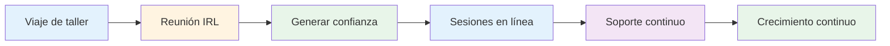
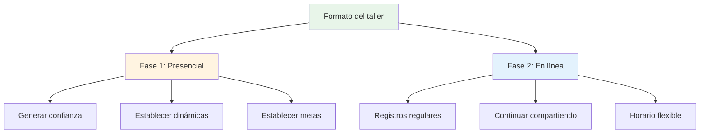
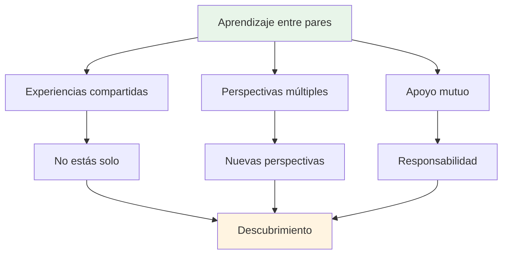

# Taller

## Foros para jugadores de élite

Nuestros talleres son foros íntimos donde los jugadores de élite comparten experiencias y abren sus pensamientos internos sobre el juego, el rendimiento y los desafíos mentales.

::: tip ¿Qué hace que nuestros talleres sean diferentes?
**Grupos pequeños y seleccionados de jugadores de élite en un espacio seguro para una discusión honesta.** Esto no es una conferencia: es una experiencia de aprendizaje entre pares en la que compartes, aprendes y creces juntos.
:::

## Formato

### Grupos pequeños
::: info Tamaño del grupo
- **6-8 jugadores** por taller
- Grupos cuidadosamente seleccionados para una dinámica óptima
- Espacio seguro para una discusión honesta
- Todos contribuyen, todos aprenden
:::

### Enfoque híbrido

| Fase | Formato | Objetivo | Beneficios |
|-------|--------|---------|----------|
| **Primera reunión** | En persona (IRL) | Construir cimientos | Confianza, conexión, dinámica de grupo. |
| **Sesiones en curso** | En línea | Mantener el impulso | Apoyo regular, flexibilidad y responsabilidad. |

::: details Fase 1: Reunión en persona
**¿Por qué en persona primero?**
- Genere confianza y conexión cara a cara
- Establecer dinámicas de grupo y seguridad.
- Establecer intenciones y objetivos juntos
- Crear las bases para un intercambio honesto

**Lo que sucede:**
- Presentaciones y establecimiento de objetivos
- Ejercicios y debates iniciales
- Establecer normas de grupo
- Construyendo confianza
:::

::: details Fase 2: Sesiones en línea
**¿Por qué online para continuar?**
- Check-ins regulares sin desplazamientos
- Continuamos compartiendo y apoyando
- Horarios flexibles para jugadores ocupados
- Mantener el impulso entre reuniones en persona

**Lo que sucede:**
- Actualizaciones de progreso y desafíos
- Apoyo entre pares y resolución de problemas
- Controles de rendición de cuentas
- Aprendizaje y crecimiento continuos
:::

## Qué esperar

### Temas que exploramos

| Área | Enfocar | Resultados |
|------|-------|----------|
| **Juego mental** | Estado de flujo, presión, enfoque | Rendimiento máximo constante |
| **Desafíos personales** | Miedos, bloqueos, frustraciones | Avances y soluciones |
| **Aprendizaje entre pares** | Experiencias compartidas | Nuevas perspectivas y perspectivas |
| **Herramientas prácticas** | Técnicas y ejercicios | Aplicación inmediata |
| **Comunidad** | Soporte continuo | Crecimiento a largo plazo |

::: tip Experiencia de taller
- 🧠 Discusiones profundas sobre los aspectos mentales del juego.
- 💬 Intercambio de experiencias y desafíos personales
- 🤝 Apoyo entre pares y responsabilidad
- 🛠️ Ejercicios y técnicas prácticas
- 👥 Una comunidad de jugadores comprometidos con el crecimiento
:::

## ¿Quién debería unirse?

::: info Participantes ideales
- **Jugadores de élite** que buscan dar el siguiente paso
- Jugadores que han **dominado la técnica** pero quieren más
- Los interesados en el **juego mental**
- Jugadores abiertos a la **autorreflexión honesta**
- Comprometidos con el **crecimiento personal**
:::

::: warning No es una buena opción si
- Estás buscando solo coaching técnico
- No te sientes cómodo compartiendo en un grupo
- No estás dispuesto a ser vulnerable
- Quieres soluciones rápidas sin hacer el trabajo.
:::

## El valor del aprendizaje entre pares

::: tip Por qué funcionan los grupos de pares
Los jugadores de élite se enfrentan a retos únicos que otros no comprenden. En un taller, estás con personas que **lo entienden**: la presión, las expectativas, las batallas mentales. Esto crea un espacio seguro para un crecimiento real.
:::

## ¿Listo para unirse?

::: info Próximos pasos
Los talleres se anuncian en nuestra sección [Noticias]. Manténgase al tanto de las próximas fechas y la información de inscripción.
:::

