# Ambition

Notre mission est d&#39;aider les joueurs d&#39;élite à franchir la prochaine étape de leur développement.

::: tip Notre vision
**Transformez vos joueurs d&#39;élite, de techniquement compétents à mentalement invincibles.** Nous utilisons une approche basée sur les données pour identifier vos axes d&#39;amélioration les plus importants.
:::

## Le modèle de performance à 8 facteurs

Les recherches et l&#39;expérience montrent que la performance de haut niveau en pétanque repose sur **8 facteurs interdépendants**. La plupart des joueurs privilégient la technique au détriment des facteurs qui distinguent réellement les bons joueurs des excellents.

```mermaid
graph TD
    subgraph "High Impact (1500 points)"
        A[🧠 Jeu mental <br/> 600 points]
        B[🔥 Motivation <br/> 500 points]
        C[😴 Dormir <br/> 400 points]
    end

    subgraph "Medium Impact (1000 points)"
        D[🪞 Conscience de soi <br/> 400 points]
        E[🥗 Nutrition <br/> 300 points]
        F[🤝 Dynamique d&#39;équipe <br/> 300 points]
    end

    subgraph "Foundation (400 points)"
        G[💆 Gestion du stress <br/> 300 points]
        H[🎯 Technique <br/> 100 points]
    end

    A --> I[Performance optimale]
    B --> I
    C --> I
    D --> I
    E --> I
    F --> I
    G --> I
    H --> I

    style A fill:#9C27B0,color:#fff
    style B fill:#FF5722,color:#fff
    style C fill:#3F51B5,color:#fff
    style I fill:#4CAF50,color:#fff
```

### Pourquoi la technique a le poids le plus faible

::: warning La vérité qui dérange
**La technique ne représente que 100 points sur un total de 2 900** dans notre modèle.

Ce n&#39;est pas que la technique n&#39;ait aucune importance ; c&#39;est que les joueurs de haut niveau possèdent déjà une technique adéquate. L&#39;amélioration marginale apportée par le perfectionnement de son geste est infime comparée à celle obtenue en optimisant son sommeil, en gérant sa tension ou en renforçant son mental.
:::

## Le principe du retour sur investissement

Toutes les améliorations ne se valent pas. Nous utilisons le calcul du **retour sur investissement (RSI)** pour identifier les domaines où votre temps de formation aura le plus d&#39;impact.

| Votre niveau | Facteur de pondération | Potentiel de retour sur investissement |
|------------|---------------|---------------|
| Faible compétence dans la zone à poids élevé | Élevé (ex. : 600) | **Maximum** |
| Haute compétence dans une zone à poids élevé | Élevé (ex. : 600) | Faible (rendements décroissants) |
| Faible compétence dans le domaine des poids légers | Faible (ex. : 100) | Modéré |
| Haute compétence dans le domaine des poids légers | Faible (ex. : 100) | **Minimal** |

**Exemple :** Améliorer votre sommeil de 30 % à 60 % (facteur de poids élevé, faible niveau de compétence actuel) aura probablement plus d&#39;impact qu&#39;améliorer votre technique de 75 % à 85 % (facteur de poids faible, niveau de compétence déjà élevé).

## Les 8 facteurs expliqués

| Facteur | Poids | Ce que cela couvre |
|--------|--------|----------------|
| 🧠 **Jeu mental** | 600 | Schémas de pensée, concentration, confiance, accès à l&#39;état de flow |
| 🔥 **Motivation** | 500 | Motivation, détermination, orientation vers les objectifs, persévérance |
| 😴 **Sommeil et récupération** | 400 | Repos de qualité, protocoles de pré-compétition, gestion de l&#39;énergie |
| 🪞 **Conscience de soi** | 400 | Perception précise de soi, reconnaissance des angles morts, utilisation du feedback |
| 🥗 **Nutrition** | 300 | Stabilité de la glycémie, hydratation, alimentation pour la compétition |
| 🤝 **Dynamique d&#39;équipe** | 300 | Communication, confiance, clarté des rôles, contribution à l&#39;équipe |
| 💆 **Gestion du stress** | 300 | Relaxation physique, contrôle de la respiration, excitation optimale |
| 🎯 **Technique** | 100 | Mécanique physique, répertoire de lancers, régularité |

## Découvrez votre chemin

Nous avons créé un **outil d&#39;évaluation gratuit** qui analyse vos niveaux actuels sur l&#39;ensemble des 8 facteurs et calcule vos priorités d&#39;amélioration personnalisées.

::: info Passez l&#39;évaluation
**[→ Commencez votre évaluation du développement des joueurs](/fr/assessment/)**

Dans 5 minutes, vous recevrez :
- Votre graphique radar couvrant l&#39;ensemble des 8 facteurs
- Recommandations classées par retour sur investissement concernant les points à travailler
- Liens vers du contenu éducatif spécifique pour vos priorités principales
- Possibilité d&#39;obtenir des commentaires de ses coéquipiers
:::

## Ce que nous proposons

| Offre | Description | Lien |
|----------|-------------|------|
| **Outil d&#39;évaluation** | Identifiez vos axes d&#39;amélioration présentant le meilleur retour sur investissement. | [Passer l&#39;évaluation](/fr/assessment/) |
| **Modules de formation** | Contenu approfondi sur les 8 facteurs | [Parcourir la section Éducation](/fr/education/) |
| **Ateliers** | Séances de 3 à 4 heures pour des groupes de 6 à 8 joueurs | [Guide d&#39;atelier](/fr/guides/workshop/) |
| **Camps d&#39;entraînement** | Stages intensifs de week-end alliant théorie et pratique | [Guide du camp](/fr/guides/training-camp/) |

## Notre approche

### 1. Évaluer en premier
Commencez par une auto-évaluation honnête. Sollicitez l&#39;avis de vos pairs pour identifier vos angles morts.

### 2. Prioriser en fonction du retour sur investissement
Concentrez-vous sur les facteurs importants sur lesquels vous avez une marge de progression, et non sur ce qui vous semble confortable.

### 3. Apprendre la science
Comprendre *pourquoi* quelque chose fonctionne, et pas seulement *ce qu&#39;il faut faire*.

### 4. Pratiquer délibérément
Mettez en pratique les techniques d&#39;entraînement avant la compétition. Développez des habitudes, pas seulement des connaissances.

### 5. Réévaluer régulièrement
Suivez vos progrès. Vos priorités évolueront au fur et à mesure de votre amélioration.

::: tip Prêt à passer à l&#39;étape suivante ?
**[→ Commencez par l&#39;évaluation](/fr/assessment/)** — C&#39;est gratuit et cela prend 5 minutes.

Ou explorez notre section [Éducation](/fr/education/) pour approfondir chacun des 8 facteurs.
:::

