# Ambition

<AdBanner />

Notre mission est d&#39;aider les joueurs d&#39;élite à franchir la prochaine étape de leur développement.

::: tip Notre vision
**Transformez les joueurs d&#39;élite, de techniquement compétents à mentalement invincibles.** Nous vous aidons à atteindre l&#39;état de flow où des boules parfaites deviennent une expression naturelle de votre maîtrise.
:::

## Dépasser la technique

L&#39;entraînement traditionnel met l&#39;accent sur les aspects techniques : la prise en main, la position, le lâcher de club. Bien que ces fondamentaux soient importants, les joueurs de haut niveau les maîtrisent déjà parfaitement.

```mermaid
graph LR
    A[Formation traditionnelle] --> B[Focus technique]
    B --> C[Plateau]

    D[Pétanque Academy] --> E[Concentration sur l&#39;état de flux]
    E --> F[Performance de niveau supérieur]

    style A fill:#f5f5f5
    style C fill:#ffebee
    style D fill:#e8f5e9
    style F fill:#e8f5e9
```

::: info La percée
**Le niveau suivant ne consiste pas à perfectionner la technique, mais à entrer dans un état de flow.**

Nous aidons les joueurs à passer d&#39;une perspective d&#39;entraînement technique à une perspective de **flow (dans la zone)**, où les boules parfaites deviennent une expression naturelle de leur maîtrise plutôt qu&#39;un effort conscient.
:::

## Le voyage

```mermaid
graph TD
    A[Joueur d&#39;élite] --> B[Maîtrise technique]
    B --> C{What's Next?}

    C --> D[Jeu mental]
    C --> E[État de flux]
    C --> F[Nutrition]
    C --> G[pleine conscience]

    D --> H[Performance optimale]
    E --> H
    F --> H
    G --> H

    style A fill:#e3f2fd
    style B fill:#e8f5e9
    style H fill:#fff4e1
```

## Ce que nous proposons

| Offre | Description | Impact |
|----------|-------------|--------|
| **Ateliers** | Petits groupes de joueurs d&#39;élite (6-8) | Apprentissage et soutien approfondis entre pairs |
| **Éducation** | Aspects mentaux de la performance optimale | Des techniques pratiques que vous pouvez utiliser immédiatement |
| **Communauté** | Des joueurs partageant la même vision repoussent les limites | Responsabilisation et croissance partagée |
| **Approche holistique** | Nutrition, état d&#39;esprit et entraînement mental | Optimisation complète des performances |

::: tip Pourquoi ça marche
Les joueurs d&#39;élite possèdent déjà les bases techniques. Ce qui distingue les bons joueurs des excellents, c&#39;est leur capacité à donner le meilleur d&#39;eux-mêmes sous pression. C&#39;est sur cela que nous nous concentrons.
:::

## Notre approche

### 1. Entraînement à l&#39;état de flux
Apprenez à entrer « dans la zone » de manière constante, et non par accident.

### 2. Force mentale
Développez des routines, la pleine conscience et la gestion du stress.

### 3. Nutrition intelligente
Nourrissez votre cerveau pour une concentration stable et des mains sûres.

### 4. Apprentissage par les pairs
Partagez vos expériences avec d&#39;autres joueurs d&#39;élite dans un environnement sûr et solidaire.

::: info Prêt à passer à l&#39;étape suivante ?
Explorez notre section [Éducation](/en/education/) ou découvrez nos [Ateliers](/en/workshop).
:::

<AdBanner />

