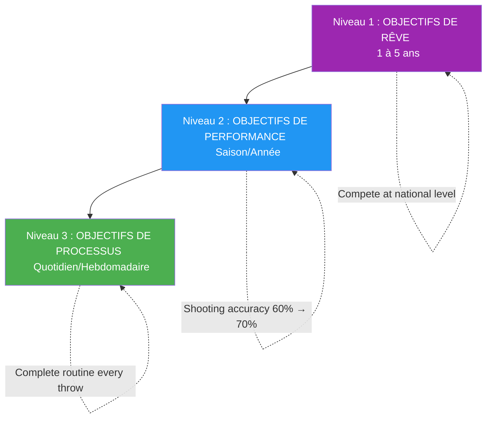

# Fixer des objectifs aux athlètes d&#39;élite

> « Les bons objectifs accélèrent le développement ; les mauvais engendrent frustration et stagnation. »

Se fixer des objectifs semble simple : décider de ce que l’on veut et œuvrer pour l’obtenir. Mais la définition d’objectifs de haut niveau est plus nuancée.

::: warning Erreur courante
La plupart des joueurs ne se fixent que des objectifs de résultat (« Gagner le championnat »). On ne contrôle pas les résultats, seulement le processus qui y mène.
:::

---

## Au-delà des objectifs de base

| Problèmes liés aux objectifs de résultats | Pourquoi c&#39;est un problème |
|----------------------|-------------------|
| On ne peut pas contrôler entièrement les résultats | Engage l&#39;impuissance |
| Crée une pression sans direction | Anxiété sans action |
| Le succès ou l&#39;échec est binaire. | Pas de victoires partielles |
| Ne guide pas la pratique quotidienne | Que faites-vous concrètement ? |

La définition d&#39;objectifs d&#39;élite va plus loin.

---

## La hiérarchie des objectifs

### Niveau 1 : Objectifs de rêve (1 à 5 ans)
Vos aspirations ultimes :
- « Participer à la compétition nationale »
- « Être reconnu comme un tireur d&#39;élite »
- « Gagner un championnat majeur »

::: info Direction, pas action
Elles fournissent une orientation et une motivation, mais ne sont pas applicables au quotidien.
:::

### Niveau 2 : Objectifs de performance (Saison/Année)
Améliorations mesurables dans votre jeu :
- « Augmenter la précision de tir de 60 % à 70 % »
- « Réduire les erreurs non provoquées de 25 % »
- &quot;Développez une plombée fiable&quot;

Ces éléments sont sous votre contrôle et mesurables.

### Niveau 3 : Objectifs de processus (quotidiens/hebdomadaires)
Les actions qui favorisent l&#39;amélioration :
- &quot;Routine complète de préparation avant chaque lancer&quot;
- &quot;Pratiquez la visualisation pendant 10 minutes par jour&quot;
- &quot;Entraînez-vous à la technique de tir 3 fois par semaine&quot;

::: tip Contrôle total
**Les objectifs du processus sont 100 % maîtrisables.** Concentrez-vous ici pour un impact maximal.
:::

## Le cadre SMART+

Allez au-delà des objectifs SMART de base :

### Spécifique
Non pas « améliorer mon pointage », mais « développer une demi-portée régulière qui atterrisse à moins de 30 cm de la cible à 8 mètres ».

### Mesurable
Définissez comment vous suivrez les progrès :
- Pourcentages de réussite
- Mesures de cohérence
- marqueurs d&#39;analyse vidéo

### Réalisable mais ambitieux
L&#39;objectif doit encourager la progression tout en restant réaliste. Un tireur à 60 % qui vise 65 % a un objectif atteignable ; viser 90 % relève de l&#39;utopie.

### Pertinent
Les objectifs doivent être en lien avec vos aspirations plus larges et s&#39;attaquer aux faiblesses réelles, et non pas seulement à ce qui est facile à améliorer.

### Limité dans le temps
Fixez des échéances claires :
- &quot;D&#39;ici la fin de la saison&quot;
- «Dans les 3 mois»
- &quot;Par le championnat national&quot;

### + Personnellement significatif
Cet objectif doit avoir de l&#39;importance pour VOUS, et pas seulement pour votre entraîneur ou vos coéquipiers. La motivation intrinsèque permet de maintenir l&#39;effort même lorsque les progrès sont lents.

## Processus vs. résultat

### Le problème des objectifs de résultats

« Gagner le match » pose problème :
- L&#39;anxiété liée à des choses que vous ne pouvez pas contrôler
- Distraction par rapport à l&#39;exécution
- Pensée du tout ou rien
- Pression sans conseils

### Le pouvoir des objectifs de processus

« Exécuter parfaitement ma routine de préparation à la prise de vue » propose :
- Contrôle total
- Concentration claire
- Réponse immédiate
- Construit naturellement vers des résultats.

### L&#39;équilibre

Utilisez les objectifs de résultat pour la motivation et l&#39;orientation. Utilisez les objectifs de processus pour la concentration et l&#39;exécution au quotidien.

## Définition des objectifs pour les différentes phases

### Hors saison
Mettre l&#39;accent sur les objectifs de développement :
- Améliorations techniques
- Conditionnement physique
- Développement des compétences mentales
- Élargir votre palette de jetés

### Pré-saison
Transition vers l&#39;intégration :
- Combiner les compétences dans des conditions similaires à celles d&#39;un match
- Améliorations testées en compétition amicale
- Stratégies d&#39;amélioration

### Saison de compétition
Passer à la performance et aux processus :
- Mettre en œuvre ce que vous avez développé
- Objectifs de processus pour chaque match
- Modifications techniques minimales

### Après la compétition
Réflexion et planification :
- Analysez ce qui a fonctionné
- Identifier les axes de croissance
- Fixez-vous des objectifs pour le prochain cycle.

## Erreurs courantes lors de la définition d&#39;objectifs

### Trop d&#39;objectifs
La concentration est la clé du succès. 2 ou 3 objectifs clés valent mieux que 10 objectifs dispersés.

### Objectifs de résultats uniquement
Sans objectifs de processus, vous n&#39;avez pas de feuille de route.

### Aucune flexibilité
Les objectifs doivent s&#39;adapter aux nouvelles informations. S&#39;en tenir rigidement à des objectifs obsolètes est une perte de temps.

### Objectifs fondés sur la comparaison
« Être meilleur que [joueur] » revient à confier son succès à quelqu&#39;un d&#39;autre.

### Négliger les objectifs mentaux
Les objectifs techniques et physiques prédominent, mais les aptitudes mentales déterminent souvent le vainqueur.

## Stratégies de mise en œuvre

### Notez-les
Les objectifs écrits ont beaucoup plus de chances d&#39;être atteints.

### Examiner régulièrement
Un bilan hebdomadaire permet de garder les objectifs en tête et de les ajuster.

### Partager de manière sélective
Partagez avec ceux qui vous soutiendront, et non ceux qui vous discréditeront.

### Visualiser la réussite
Visualisez régulièrement la réalisation de vos objectifs — la sensation, le moment.

### Suivre les progrès
Ce qui se mesure se gère. Conservez des traces.

## Lorsque les objectifs ne sont pas atteints

Les objectifs non atteints ne sont pas des échecs, ce sont des données :

1. **Analyse** : Pourquoi cet objectif n’a-t-il pas été atteint ?
2. **Apprenez** : Qu’est-ce que cela vous apprend ?
3. **Ajuster** : Modifier l’objectif ou l’approche
4. **À suivre** : La persévérance l&#39;emporte sur la perfection

## Le jeu mental des objectifs

Les objectifs influencent la psychologie :
- **Trop facile** : Ennui, complaisance
- **Trop difficile** : Anxiété, découragement
- **Parfait** : Engagement, fluidité, croissance

Trouvez le juste milieu où les objectifs sont stimulants sans être insurmontables.

---

| *À lire aussi : [Introduction à la fixation d’objectifs](/en/education/motivation/) | [Objectifs SMART](/en/education/motivation/smart-goals) | [Planifier votre développement](/en/education/motivation/planning)* |

