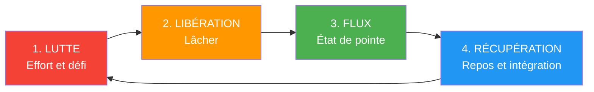

# La science derrière les états de flux

> « L’état de flow — cette zone magique où tout s’enchaîne parfaitement, le temps ralentit et la performance semble sans effort. »

Ce n&#39;est pas mystique ; c&#39;est neurologique. Comprendre les mécanismes scientifiques qui sous-tendent l&#39;état de flow peut vous aider à y accéder plus régulièrement.

::: tip Aperçu clé
On ne peut pas forcer l&#39;écoulement, mais on peut créer les conditions qui favorisent son apparition.
:::

---

## Qu&#39;est-ce que le flow ?

Le psychologue Mihaly Csikszentmihalyi a défini le flow comme « un état d&#39;immersion totale dans une activité ». À la pétanque, vous l&#39;avez déjà expérimenté : des lancers qui semblent automatiques, des décisions instantanées, le sentiment de ne faire qu&#39;un avec le jeu.

```mermaid
flowchart TD
    A[Défi = Compétence + 4 %] --> B[Concentration profonde]
    B --> C[La critique intérieure s&#39;apaise]
    C --> D[Libération neurochimique]
    D --> E[ÉTAT D&#39;ÉCOULEMENT]
    E --> F[Performance sans effort]

    style A fill:#FF9800,color:#fff
    style E fill:#4CAF50,color:#fff
    style F fill:#4CAF50,color:#fff
```

### Caractéristiques d&#39;écoulement

| Caractéristiques | Ce que l&#39;on ressent |
|----------------|-------------------|
| **Absorption complète** | Le jeu est tout ce qui existe. |
| **Perte de conscience de soi** | Pas de critique intérieure |
| **Temps déformé** | Les heures semblent des minutes |
| **Motivation intrinsèque** | Jouer pour le plaisir |
| **Sentiment de contrôle** | Confiance sans arrogance |
| **Réponse immédiate** | Réglage instantané |

## Les neurosciences du flow

### Modifications cérébrales pendant le flux

Lorsque vous entrez en état de flow, votre cerveau subit des changements mesurables :

**Hypofrontalité transitoire**
Le cortex préfrontal, responsable de l&#39;autocritique, du doute et de la rumination, devient moins actif. C&#39;est pourquoi l&#39;état de flow semble naturel : votre critique intérieure se tait.

**Cocktail neurochimique**
L&#39;état de flow déclenche un puissant mélange de neurotransmetteurs :
- **Dopamine** : Améliore la concentration et la reconnaissance des formes
- **Noradrénaline** : Augmente l’éveil et l’attention
- **Endorphines** : Procurent une sensation de bien-être
- **Anandamide** : Favorise la pensée latérale
- **Sérotonine** : Produit la sensation de bien-être qui suit l’effort.

**Modifications des ondes cérébrales**
L&#39;état de flow est corrélé à des changements d&#39;ondes bêta (état de conscience normal éveillé) vers les ondes alpha et thêta (vigilance détendue et créativité).

## Les déclencheurs de flux

Des recherches ont permis d&#39;identifier les conditions qui favorisent l&#39;écoulement :

### 1. Équilibre défi-compétence

L&#39;état de flow survient lorsque le défi dépasse légèrement votre niveau de compétence actuel, soit environ 4 % au-delà de votre zone de confort. Un défi trop facile engendre l&#39;ennui ; un défi trop difficile, l&#39;anxiété.

**À la pétanque :**
- Cherchez des adversaires légèrement meilleurs que vous.
- Fixez-vous des défis personnels au sein des matchs
- Variez vos pratiques pour maintenir l&#39;engagement.

### 2. Des objectifs clairs

Vous devez savoir ce que vous cherchez à accomplir. Des intentions vagues ne permettent pas d&#39;atteindre l&#39;état de flow.

**À la pétanque :**
- Définissez votre intention pour chaque lancer.
- Avoir des objectifs de match clairs
- Connaissez votre rôle au sein de l&#39;équipe

### 3. Retour d&#39;information immédiat

Pour être performant, il est nécessaire de savoir où l&#39;on en est en temps réel.

**À la pétanque :**
- Le résultat de chaque lancer est immédiatement visible.
- Consultez la réponse du terrain
- Soyez attentif aux réactions de votre corps.

### 4. Concentration profonde

L&#39;état de flow requiert une attention focalisée sans distraction.

**À la pétanque :**
- Élaborez votre routine d&#39;avant-injection
- Pratiquer la pleine conscience
- Éliminer les distractions extérieures

### 5. Sentiment de contrôle

Avoir le sentiment que vos actions ont de l&#39;importance et que vous pouvez influencer les résultats.

**À la pétanque :**
- Faites confiance à votre formation
- Concentrez-vous sur ce que vous pouvez contrôler.
- Accepter l&#39;incertitude des résultats

---

## Pourquoi on ne peut pas forcer le flux

::: warning Le paradoxe du flux
**Tenter d&#39;entrer dans un état de flow l&#39;empêche.** Le flow émerge lorsque vous cessez d&#39;essayer de l&#39;atteindre et que vous vous engagez simplement pleinement dans l&#39;activité.
:::

C&#39;est parce que :
- L&#39;effort active le cortex préfrontal (l&#39;inverse de l&#39;état de flow).
- L&#39;autosurveillance perturbe l&#39;immersion
- L&#39;accent mis sur les objectifs remplace l&#39;accent mis sur les processus.

## Créer les conditions d&#39;un flux

Bien qu&#39;il soit impossible de forcer l&#39;écoulement, il est possible de créer des conditions qui le rendent plus probable :

### Avant la compétition
- Un sommeil et une alimentation adéquats
- Échauffement approprié
- état mental positif
- Intentions claires

### Pendant la compétition
- Restez concentré sur le présent
- Utilisez votre routine pré-injection
- Lâchez prise sur les résultats
- Faites confiance à votre corps

### Facteurs environnementaux
- Réduisez les distractions
- état physique confortable
- Niveau de difficulté approprié
- Dynamique d&#39;équipe solidaire

---

## Le cycle d&#39;écoulement

Le flux n&#39;est pas constant — il suit un cycle :

Comprendre ce cycle vous aide à :
- Ne pas forcer le flux pendant la phase de lutte
- Savoir reconnaître quand lâcher prise
- Permettre une récupération adéquate entre les états d&#39;écoulement

## Flux dans l&#39;équipe Pétanque

L&#39;état de flow peut être contagieux. Lorsqu&#39;un joueur entre en état de flow, celui-ci peut se propager à ses coéquipiers par :
- énergie positive et langage corporel
- Réduction de la pression sur les autres
- Confiance collective accrue
- Rythme d&#39;équipe synchronisé

## Capacité de flux du bâtiment

Comme toute compétence, l&#39;accès à l&#39;état de flow s&#39;améliore avec la pratique :

### Pratiques quotidiennes
- La méditation de pleine conscience (développe le contrôle de l&#39;attention)
- Visualisation (amorce les voies neuronales)
- Entraînement physique (développe les compétences de base)

### En formation
- Entraînez-vous à la limite de vos capacités
- Maintenir un engagement total même lors des exercices
- Observez quand le flux se produit et ce qui l&#39;a précédé.

### Développement à long terme
- Augmenter progressivement le niveau de difficulté
- Développer des routines de pré-prise de vue robustes
- Développer sa résilience mentale pour la phase de lutte

---

| *À lire aussi : [The Zone](/en/education/mental-game/the-zone/) | [Entrer dans la zone](/en/education/mental-game/the-zone/entering-the-zone) | [Techniques de pleine conscience](/en/education/mental-game/mindfulness/techniques)* |

