# Comprendre le critique intérieur

> « Tous les joueurs de pétanque connaissent cette voix — celle qui murmure &quot;tu vas rater&quot; juste au moment où tu t&#39;apprêtes à lancer. »

Il s&#39;agit de votre critique intérieure — et apprendre à la gérer est essentiel pour atteindre des performances d&#39;élite.

::: warning Le paradoxe
**Votre critique intérieure ne cherche pas à vous nuire** — c&#39;est une tentative maladroite de protection. Mais cette « protection » se transforme en autosabotage.
:::

---

## Qu&#39;est-ce que le critique intérieur ?

Le critique intérieur est cette voix intérieure qui juge, critique et mine votre confiance :

```mermaid
flowchart TD
    A[Situation de pression] --> B[La voix critique intérieure s&#39;active]
    B --> C[«Tu vas rater.»]
    B --> D[« Tout le monde regarde »]
    B --> E[«Tu t&#39;étouffes toujours.»]

    C --> F[Tension musculaire ↑]
    D --> F
    E --> F

    F --> G[Performance ↓]
    G --> H[Plus de munitions pour Critique]
    H --> B

    style A fill:#FF9800,color:#fff
    style B fill:#f44336,color:#fff
    style G fill:#f44336,color:#fff
```

### Quand il apparaît

| Moment | La voix intérieure critique dit |
|--------|-------------------|
| **Avant le tir crucial** | « Tout le monde regarde. Ne gâchez pas tout. » |
| **Après un échec** | «Tu perds toujours tes moyens sous la pression.» |
| **Pendant une série de défaites** | « Tu n&#39;es pas assez bon pour ce niveau. » |

## Identifier vos schémas

La première étape est la prise de conscience. Commencez par remarquer quand votre critique intérieure se manifeste :

### Déclencheurs courants
- Situations de haute pression (balle de match, tournois importants)
- Après avoir commis une erreur
- Lorsque les adversaires performent bien
- Quand les coéquipiers semblent frustrés
- fatigue ou inconfort physique

### Messages courants
- « Tu ne supportes pas la pression »
- « Tu n&#39;es pas aussi bon qu&#39;eux. »
- « Tout le monde te juge »
- « Tu échoues toujours quand c&#39;est important. »

## L&#39;impact sur la performance

Lorsque la voix critique intérieure prend le dessus, votre corps réagit :

1. **La tension musculaire augmente** — Votre lancer devient rigide
2. **La respiration devient superficielle** — Moins d&#39;oxygène, moins de concentration
3. **La vision se rétrécit** — Vous perdez conscience du terrain
4. **La prise de décision est compromise** — Vous doutez de vous-même

Cela crée un cercle vicieux : la critique intérieure engendre de mauvaises performances, ce qui donne encore plus de munitions à cette critique.

## Stratégies pour gérer sa voix critique intérieure

### 1. Nommez-le pour l&#39;apprivoiser

Donnez un nom à votre critique intérieure – quelque chose d&#39;un peu ridicule. « Oh, revoilà Negative Nils ! » Cela crée une distance entre vous et cette voix, ce qui vous permet de l&#39;ignorer plus facilement.

### 2. Remettre en question les preuves

Quand un critique vous dit « tu rates toujours tes coups sous pression », demandez-vous : est-ce vraiment vrai ? Pouvez-vous citer des moments où vous avez bien performé sous pression ? Le critique s’appuie sur des affirmations absolues qui reflètent rarement la réalité.

### 3. Reformuler le message

Transformer la critique en coaching :
- « Tu vas rater quelque chose » → « Concentre-toi sur ta routine »
- &quot;Tout le monde vous regarde&quot; → &quot;C&#39;est votre moment de briller&quot;
- &quot;Tu perds toujours tes moyens&quot; → &quot;Tu as déjà su gérer la pression&quot;

### 4. Utilisez votre routine d&#39;avant-tir

Une bonne routine d&#39;avant-tir donne à votre esprit quelque chose de constructif sur lequel se concentrer, laissant moins de place au critique.

### 5. Pratiquez l&#39;autocompassion

Traitez-vous comme vous traiteriez un coéquipier. Diriez-vous à un coéquipier en difficulté « tu es nul » ? Bien sûr que non. Faites preuve de la même bienveillance envers vous-même.

## Développer une voix intérieure bienveillante

L’objectif n’est pas de faire taire complètement la voix critique intérieure — c’est quasiment impossible. Il s’agit plutôt de développer une voix plus constructive :

### La voix du soutien dit :
- &quot;Un lancer à la fois&quot;
- «Faites confiance à votre formation»
- «Vous avez déjà fait ça»
- « Restez dans le présent »
- &quot;Respirez et réinitialisez-vous&quot;

### Pratique quotidienne

Consacrez 5 minutes par jour :
1. Repensez à un moment où vous avez bien performé.
2. Souvenez-vous de ce que vous ressentiez dans votre corps.
3. Écoutez ce que disait votre voix encourageante
4. Ancrez cette sensation par un geste physique (toucher votre boule, ajuster votre position).

## En compétition

Quand la voix intérieure critique se manifeste pendant un match :

1. **Reconnaissez-le** : « Je remarque que je suis autocritique. »
2. **Respirez** : Respirez lentement et profondément pour vous ressourcer.
3. **Utilisez votre point d&#39;ancrage** : Le geste physique issu de votre pratique
4. **Retour à la routine** : Concentrez-vous sur votre préparation avant la prise de vue

## Le voyage à long terme

Gérer sa voix intérieure critique n&#39;est pas une solution miracle. C&#39;est un travail de longue haleine qui s&#39;améliore avec le temps. Les athlètes de haut niveau n&#39;éliminent pas le doute ; ils apprennent à performer malgré lui.

Votre critique intérieure fera toujours partie de vous. Mais avec la pratique, sa voix s&#39;apaise et votre voix bienveillante se renforce. C&#39;est cet avantage mental qui distingue les bons joueurs des grands champions.

---

| *À lire aussi : [Gérer la pression](/fr/education/mental-game/mental-strength/handling-pressure) | [Routine d&#39;avant-tir](/fr/education/mental-game/mental-strength/pre-shot-routine) | [Techniques de pleine conscience](/fr/education/mental-game/mindfulness/techniques)* |

