# La résilience mentale à la pétanque

> « La résilience ne consiste pas à ne jamais tomber, mais à se relever rapidement. »

À la pétanque, où la dynamique peut basculer rapidement et où un seul lancer peut tout changer, la résilience mentale détermine souvent le vainqueur.

::: tip La vérité sur la résilience
**Tous les joueurs d&#39;élite connaissent des moments difficiles.** Ce qui les distingue, c&#39;est leur vitesse de récupération — en minutes, pas en matchs.
:::

---

## Qu&#39;est-ce que la résilience mentale ?

```mermaid
flowchart TD
    A[Un revers survient] --> B{Resilient?}

    B -->|Yes| C[Accepter → Apprendre → Réinitialiser]
    B -->|No| D[Frustration → Tension → Plus d&#39;erreurs]

    C --> E[Rétablissement rapide]
    D --> F[Dégrincer]

    E --> G[Performance maintenue]
    F --> H[Effondrement des performances]

    style A fill:#FF9800,color:#fff
    style E fill:#4CAF50,color:#fff
    style G fill:#4CAF50,color:#fff
    style F fill:#f44336,color:#fff
    style H fill:#f44336,color:#fff
```

La résilience mentale est la capacité à :
- Se remettre rapidement des revers
- Poursuivre les efforts malgré les difficultés
- S&#39;adapter aux circonstances changeantes
- Gardez confiance face à l&#39;adversité
- Tirez des leçons de vos échecs sans vous laisser définir par eux.

---

## Pourquoi la résilience est importante en pétanque

La pétanque teste constamment sa résilience :

| Défi | Réponse résiliente | Réponse non résiliente |
|-----------|-------------------|------------------------|
| Point parfait touché | &quot;Prochain lancer&quot; | &quot;Injuste!&quot; |
| Rater un tir « facile » | &quot;Réinitialiser, passer à autre chose&quot; | «Je m&#39;étouffe toujours» |
| Les adversaires reviennent | « Restez concentré » | «Nous allons perdre» |
| Les difficultés des coéquipiers | « Soutenez-les » | « Ils sont en train de tout gâcher » |

---

## L&#39;état d&#39;esprit de résilience

### Mentalité fixe vs. mentalité de croissance

| Mentalité fixe | Mentalité de croissance |
|---------------|----------------|
| « J&#39;ai échoué parce que je ne suis pas assez bon. » | « J’ai raté quelque chose… qu’est-ce que je peux en apprendre ? » |
| «Je ne supporte pas la pression» | « J&#39;apprends à gérer la pression. » |
| « L’échec signifie que je suis un échec. » | « L’échec signifie que je grandis » |

::: info Aperçu clé
**Les joueurs résilients considèrent les revers comme une information, et non comme une définition de leur identité.**
:::

### Concentration des éléments contrôlables

Les joueurs résilients se concentrent sur ce qu&#39;ils peuvent contrôler :
- Leur préparation
- Leur effort
- Leur attitude
- Leur réaction aux événements

Ils libèrent ce qu&#39;ils ne peuvent pas contrôler :
- Performance des adversaires
- conditions météorologiques
- Rebonds chanceux ou malchanceux
- Les opinions des autres

### perspective à long terme

Un lancer, un match, un tournoi : rien ne définit votre carrière. Les joueurs résilients gardent le cap.
- « Ce n&#39;est qu&#39;un moment d&#39;un long voyage. »
- « J&#39;ai déjà surmonté des échecs. »
- « Cela me rendra plus fort »

## Renforcer la résilience

### 1. Développer des bases solides

La résilience est plus facile quand on a :
- **Technique solide** : Confiance en ses capacités
- **Condition physique** : Énergie nécessaire pour soutenir l&#39;effort
- **Aptitudes mentales** : Outils pour gérer l’adversité
- **Réseau de soutien** : Les personnes qui croient en vous

### 2. S&#39;exercer à surmonter l&#39;adversité

On ne peut pas développer sa résilience sans relever de défis :
- S&#39;entraîner dans des conditions difficiles
- Pratiquez quand vous êtes fatigué
- Affrontez des joueurs plus forts
- Mettez-vous dans des situations de pression.

### 3. Élaborer des routines de récupération

Créez des rituels pour rebondir :

**Réinitialisation physique :**
- Respiration profonde
- Secouez les tensions
- Changer de posture

**Réinitialisation mentale :**
- Reconnaître le revers
- Extraire toute leçon
- Recentrez-vous sur le présent

### 4. Constituer une banque de résilience

Gardez en mémoire les fois où vous avez surmonté l&#39;adversité :
- Répliques que vous avez faites
- Les défis que vous avez rencontrés
- Croissance que vous avez réalisée

Puisez dans ces souvenirs lorsque les défis actuels vous semblent insurmontables.

## La résilience en action

### Après un tir manqué

1. **Accepter** : « C&#39;est arrivé »
2. **Respirez** : Une respiration profonde
3. **Apprendre** : Évaluation rapide (si utile)
4. **Sortie** : Libérée, délivrée
5. **Recentrage** : Prochaine opportunité

### Pendant une série de défaites

1. **Perspective** : « Les séries prennent fin »
2. **Processus** : Privilégiez l’exécution aux résultats.
3. **Patience** : Ayez confiance, les performances reviendront.
4. **Persévérance** : Continuez à vous présenter

### Lorsque les adversaires dominent

1. **Respect** : Reconnaissez leur bon jeu.
2. **Concentrez-vous** : Maîtrisez ce que vous pouvez.
3. **Concurrence** : Faites-les mériter chaque point
4. **À retenir** : Que pouvez-vous en tirer ?

### Après une dure perte

1. **Ressentir** : Autoriser la déception (brièvement)
2. **Analyse** : Qu’est-ce qui a bien fonctionné ? Qu’est-ce qui n’a pas fonctionné ?
3. **Extrait** : Leçons pour la prochaine fois
4. **Passez à autre chose** : N&#39;en parlez plus tard

## Les tueurs de résilience

### le perfectionnisme
S&#39;attendre à la perfection est la garantie d&#39;être déçu. L&#39;excellence, et non la perfection, est le but à atteindre.

### catastrophisme
« J&#39;ai raté ce tir, le match est terminé, je suis nul. » Un seul événement ne détermine pas tout.

### Comparaison
Se comparer aux autres, c&#39;est mettre sa confiance entre leurs mains.

### Rumination
Rejouer les échecs ne les change pas, cela ne fait qu&#39;amplifier leur impact.

## Résilience d&#39;équipe

La résilience est contagieuse — dans les deux sens :

**Renforcer la résilience de l&#39;équipe :**
- Soutenir les coéquipiers en difficulté
- Célébrez les efforts, pas seulement les résultats.
- Modéliser les réponses résilientes
- Adoptez un langage corporel positif

**Se protéger contre la négativité :**
- Ne participez pas aux séances de plaintes
- Rediriger les conversations négatives
- Concentrez-vous sur les solutions, pas sur les problèmes.

## Développement de la résilience à long terme

### Pratiques quotidiennes
- Tenir un journal de gratitude (développe une perspective positive)
- La méditation de pleine conscience (favorise la régulation émotionnelle)
- L&#39;exercice physique (développe la tolérance au stress)

### Réflexion hebdomadaire
- Quels défis ai-je rencontrés ?
- Comment ai-je réagi ?
- Que ferais-je différemment ?
- De quoi suis-je fier ?

### Revue saisonnière
- Les principaux revers et comment je les ai gérés
- Renforcement des capacités de résilience
- Domaines à poursuivre au développement

## Le concurrent résilient

Les concurrents les plus résilients partagent des caractéristiques communes :
- Ils anticipent les défis et s&#39;y préparent.
- Ils considèrent les revers comme temporaires et spécifiques
- Ils maintiennent leurs efforts même lorsque les résultats tardent à venir.
- Ils tirent des leçons de chaque expérience.
- Ils gardent le cap sur ce qui compte vraiment.

La résilience n&#39;est pas une qualité innée, c&#39;est une compétence qui se développe par la pratique et la volonté.

---

| *En lien avec : [Force mentale](/fr/education/mental-game/mental-strength/) | [Gérer la pression](/fr/education/mental-game/mental-strength/handling-pressure) | [La Zone](/fr/education/mental-game/the-zone/)* |

