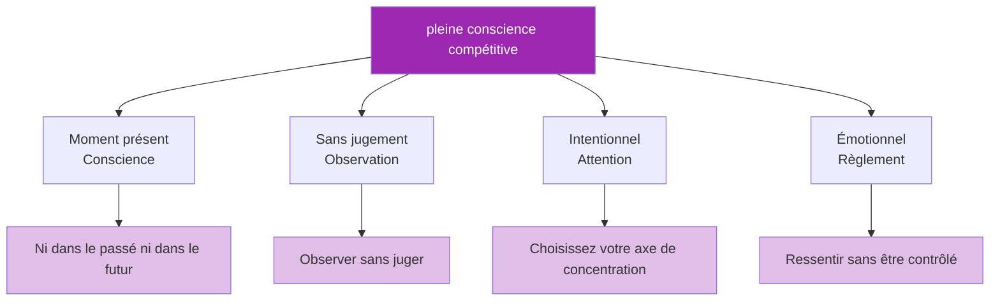

# La pleine conscience en compétition

> « La pleine conscience n&#39;est pas seulement un gadget pour les coussins de méditation, c&#39;est un avantage concurrentiel. »

La capacité à rester présent, attentif et non réactif pendant les matchs distingue les athlètes d&#39;élite de ceux qui s&#39;effondrent sous la pression.

::: tip L&#39;avantage du moment présent
**On ne peut lancer qu&#39;une boule à la fois.** La pleine conscience vous permet de rester dans le seul moment qui compte : celui-ci.
:::

---

## Que signifie la pleine conscience en compétition ?

---

## Le problème de l&#39;esprit vagabond

::: danger Le problème des 47 %
**Des recherches montrent que l&#39;esprit vagabonde en moyenne 47 % du temps.** En compétition, cette distraction est coûteuse.
:::

| Où va l&#39;esprit | Ce que vous manquez |
|-----------------|---------------|
| Dernier tir manqué | Lecture actuelle du terrain |
| S&#39;inquiéter du score | Sélection optimale du lancer |
| Ce que pensent les autres | Sensation de la boule |
| Planification des célébrations | Exécution en temps réel |

Chaque instant passé à voyager mentalement dans le temps est un instant non consacré à la tâche qui se trouve devant vous.

## Compétences de pleine conscience pour la compétition

### 1. S&#39;ancrer dans le présent

Utilisez des repères sensoriels pour revenir au présent :

**Points d&#39;ancrage physiques :**
- Sentez le poids de la boule
- Sentez vos pieds sur le sol
- Sentez la texture de la poignée

**Ancrages environnementaux :**
- Examinez les détails spécifiques du terrain.
- Écoutez des sons ambiants
- Ressentez la température et le vent

### 2. Observer sans réagir

Lorsque des émotions surviennent (frustration, anxiété, excitation), pratiquez :

1. **Avis** : « Je suis frustré(e) »
2. **Nom** : « C&#39;est de la frustration »
3. **Autoriser** : Laissez-le être là sans lutter
4. **Retour** : Ramener l’attention sur la tâche en cours

L&#39;émotion ne disparaît pas, mais elle perd son pouvoir de vous contrôler.

### 3. Mise au point sur un seul point

Concentrez votre attention sur une seule chose :

**Avant le lancer :**
- Concentrez-vous uniquement sur la lecture du terrain.
- Ensuite seulement en visualisant le résultat
- Ensuite, uniquement sur votre position corporelle

**Pendant le lancer :**
- Concentrez-vous uniquement sur la cible
- Laissez le corps agir sans interférence.

### 4. L&#39;esprit du débutant

Abordez chaque lancer comme si c&#39;était le premier :
- Aucune hypothèse fondée sur les performances passées
- Un regard neuf sur le terrain
- La curiosité plutôt que l&#39;attente

## Applications pratiques

### Entre les lancers

C’est entre les lancers que l’esprit vagabonde le plus. Profitez de ce temps en pleine conscience :

- **Observez activement** : portez une attention soutenue à vos coéquipiers et adversaires.
- **Restez ancré dans votre corps** : Prenez conscience de votre respiration, de votre posture et de votre état physique.
- **Préparez-vous mentalement** : Visualisez les scénarios potentiels
- **Reposez votre attention** : Accordez-vous de brèves pauses.

### Lors des moments de pression

Lorsque les enjeux sont les plus élevés :

1. Ralentissez : prenez une respiration supplémentaire.
2. **Renforcez-vous** : Sentez vos pieds, la boule
3. **Objectif précis** : Ce lancer uniquement
4. **Confiance** : Lâchez prise sur l’attachement au résultat.

### Après les erreurs

Les erreurs engendrent la rumination. Brisez ce cercle vicieux :

1. **Reconnaître** : « Ça ne s&#39;est pas passé comme prévu. »
2. **Extrait** : « Que puis-je apprendre ? »
3. **Communiqué** : « C&#39;est terminé, on passe à autre chose »
4. **Recentrage** : « Et après ? »

## La routine pré-photo consciente

Intégrez la pleine conscience à votre routine :

1. **Arrivée** : Entrez dans le cercle en pleine présence.
2. **Respiration** : Une respiration consciente pour se recentrer
3. **Voir** : Observez attentivement le terrain
4. **Visualiser** : Voyez le résultat clairement
5. **Sensation** : Sentez la boule, votre corps
6. **Libération** : Lâchez prise et faites confiance

## Défis communs

### «Je n&#39;arrive pas à arrêter de penser»

Il n&#39;est pas nécessaire d&#39;arrêter les pensées ; il suffit de ne pas les suivre. Observez la pensée, laissez-la passer, puis revenez à votre point d&#39;ancrage.

### « La pleine conscience me rend trop détendu »

La pleine conscience en situation de compétition ne consiste pas à être calme, mais à être présent. On peut être alerte, énergique et attentif simultanément.

### « J&#39;oublie d&#39;être attentif »

Utiliser des déclencheurs :
- Ramasser la boule = un signal de pleine conscience
- Entrer dans le cercle = rappel de présence
- Prendre position = ancrer l&#39;attention

## Développer les compétences

### Pratique quotidienne

5 à 10 minutes de pratique formelle de la pleine conscience permettent de développer les voies neuronales :
- méditation sur la respiration
- pratique du scan corporel
- exercices d&#39;observation attentive

### Intégration de la formation

Pratiquez la pleine conscience lors de chaque séance d&#39;entraînement :
- Présence totale pour chaque lancer
- Remarquez quand l&#39;attention se disperse.
- Entraînez-vous à revenir à la concentration

### Préparation à la compétition

Avant les matchs :
- brève pratique de pleine conscience
- Définir une intention pour se concentrer sur le présent
- Rappelez-vous vos points d&#39;ancrage

## L&#39;avantage concurrentiel

Les concurrents attentifs ont des avantages :
- **Récupération plus rapide** après les erreurs
- **Meilleure prise de décision** sous pression
- Performances **plus constantes**
- **Un plus grand plaisir** de la compétition
- **Réduction du burn-out** et de l&#39;anxiété

Le joueur qui est pleinement présent à chaque lancer, tandis que les autres sont perdus dans leurs pensées, possède un avantage considérable.

---

| *À consulter également : [Introduction à la pleine conscience](/en/education/mental-game/mindfulness/) | [Techniques de pleine conscience](/en/education/mental-game/mindfulness/techniques) | [Pratique quotidienne](/en/education/mental-game/mindfulness/daily-practice)* |

