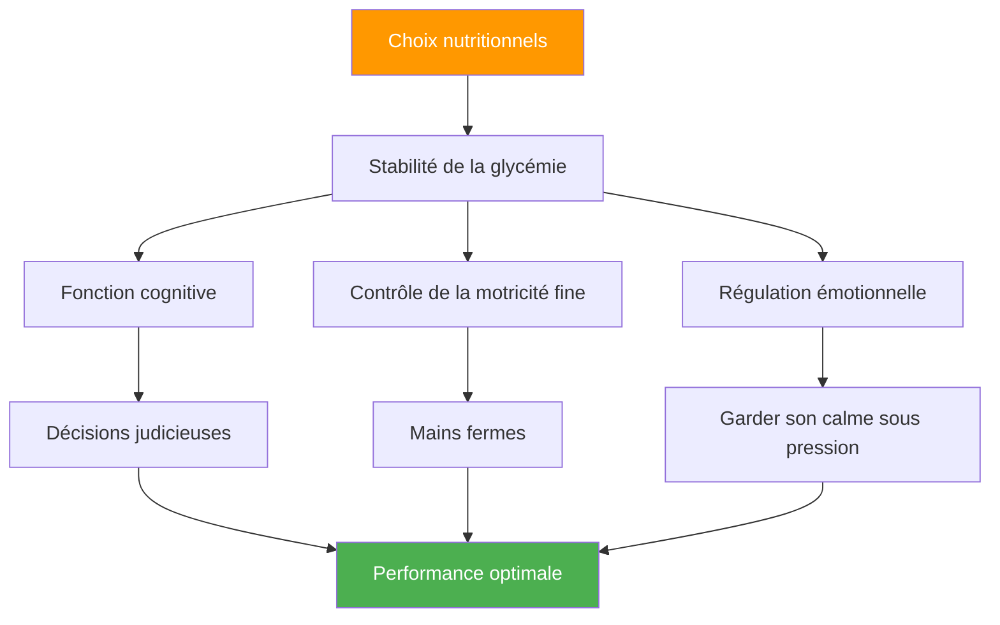

# Nutrition pour la compétition : Optimiser la performance de précision

> « Au pétanque, votre cerveau est votre outil le plus important. Nourrissez-le d&#39;un carburant stable, pas d&#39;énergie en montagnes russes. »

Les compétitions de pétanque peuvent durer de 6 à 10 heures. Ce que vous consommez a un impact direct sur vos fonctions cognitives, votre motricité fine et votre capacité à rester concentré(e) tout au long des matchs.

::: tip La règle d&#39;or
**Une glycémie stable = des mains sûres.** Chaque choix nutritionnel doit favoriser une énergie constante, et non des pics et des chutes brutales.
:::

---

## L&#39;importance de la nutrition pour la pétanque

Contrairement aux sports de haute intensité, la pétanque exige :

De mauvais choix nutritionnels engendrent des problèmes de performance que les joueurs attribuent à une « faiblesse mentale » ou à la « malchance ».

---

## Le lien avec la glycémie

Votre cerveau fonctionne grâce au glucose. Les fluctuations de la glycémie ont un impact direct sur :

| État de glycémie | Effet mental | Effet physique |
|-------------------|---------------|-----------------|
| **Écurie** | Réflexion claire, bonnes décisions | Mains fermes, constantes |
| **Pic (trop élevé)** | Énergie initiale, puis fracas | Nerveux, hyperactif |
| **Crash (trop bas)** | Difficultés de concentration, irritabilité | Tremblante, faible prise |
| **Montagnes russes** | Humeur/concentration imprévisibles | Performances inconstantes |

**Objectif :** Maintenir une glycémie stable tout au long de la compétition.

## Nutrition le jour de la compétition

### Avant la compétition (3 à 4 heures avant)

**Prenez un repas copieux :**
- Glucides complexes (flocons d&#39;avoine, pain complet, riz)
- Protéines (œufs, yaourt, viande maigre)
- Matières grasses saines (avocat, noix, huile d&#39;olive)
- À éviter : les sucres simples, les aliments lourds et gras

**Exemples de repas :**
- Gruau aux noix et à la banane
- Œufs sur pain complet grillé avec avocat
- Riz au poulet et aux légumes

### Avant-match (1 à 2 heures avant)

**En-cas léger et familier :**
- Banane
- Une petite poignée de noix
- Un demi-sandwich
- À éviter : tout ce qui est nouveau ou expérimental

### Pendant la compétition

**Entre les matchs :**
- De petites collations fréquentes toutes les 60 à 90 minutes
- Noix, graines, fruits secs
- craquelins de grains entiers
- Fruits frais (banane, pomme)

**Pendant les matchs :**
- Des gorgées d&#39;eau entre les extrémités
- Glucides rapides si besoin (fruits secs)
- Évitez de manger pendant les jeux actifs

### Récupération (après la compétition)

**Dans un délai de 30 à 60 minutes :**
- Protéines pour la récupération musculaire
- Des glucides pour reconstituer
- Boissons pour se réhydrater

## Protocole d&#39;hydratation

### Les bases
- Commencez par bien vous hydrater (vérifiez la couleur de vos urines du matin).
- Buvez régulièrement tout au long de votre consommation, n&#39;attendez pas d&#39;avoir soif.
- Objectif : 150 à 250 ml par heure de compétition
- Ajuster en fonction de la chaleur et de l&#39;humidité

### Signes avant-coureurs de déshydratation
- Soif (vous êtes déjà déshydraté)
- Urine foncée
- Mal de tête
- Diminution de la concentration
- Fatigue

### Le piège de la surhydratation
Trop d&#39;eau, surtout sans électrolytes :
- Des pauses fréquentes aux toilettes (perturbent le rythme)
- Électrolytes dilués (peuvent provoquer des tremblements)
- Inconfort et distraction

**Équilibre :** Apport régulier, incluant des électrolytes par temps chaud.

## Aliments à éviter

### Le jour de la compétition
- **Repas copieux** — Dirigent le sang vers la digestion
- **Taux de sucre élevé** — Provoque des coups de fatigue
- **Alcool (la veille au soir)** — Perturbe le sommeil, déshydrate
- **Excès de caféine** — Peut provoquer de la nervosité
- **Nouveaux aliments** — Risque de troubles digestifs
- **Aliments gras/frits** — Digestion lente, léthargie

### Aliments problématiques
- **Boissons gazeuses** — Ballonnements, inconfort
- **Aliments riches en fibres** — Peuvent causer des troubles digestifs
- **Produits laitiers (pour certaines personnes)** — Sensibilité digestive
- **Édulcorants artificiels** — Peuvent causer des troubles digestifs

## Stratégie caféine

La caféine peut améliorer la concentration et le temps de réaction, mais nécessite une gestion attentive :

### Utilisation efficace
- Connaissez votre tolérance
- Un timing constant (ne pas le modifier pour la compétition)
- Dose modérée (100-200 mg)
- Assez tôt pour éviter toute interférence avec les matchs du soir
- À consommer avec des aliments pour réduire la nervosité

### Utilisation inefficace
- Plus que d&#39;habitude (provoque de l&#39;anxiété, des tremblements)
- En fin de journée (perturbe le sommeil)
- À jeun (nervosité, coup de fatigue)
- Recourir à la caféine pour compenser un mauvais sommeil

## Élaboration de votre plan nutritionnel de compétition

### Étape 1 : Test pratique
Mettez à l&#39;épreuve votre plan nutritionnel de compétition à l&#39;entraînement :
- Même horaire
- Mêmes aliments
- Même hydratation
- Notez comment vous vous sentez et comment vous performez

### Étape 2 : Préparer la logistique
- Renseignez-vous sur les plats disponibles sur place.
- Apportez vos propres collations éprouvées.
- Disposer d&#39;options de secours
- Emportez plus que ce que vous pensez nécessaire

### Étape 3 : Créer un planning
Notez le calendrier de vos apports nutritionnels :
- Repas d&#39;avant-compétition (heure, nourriture)
- Collation d&#39;avant-match (heure, nourriture)
- Pendant la compétition (programme, alimentation)
- intervalles de rappel d&#39;hydratation

### Étape 4 : Suivi et réglage
Après les compétitions, veuillez noter :
- Ce que vous avez mangé et quand
- Comment vous vous sentiez physiquement
- Qualité de performance
- Des problèmes quelconques (faim, coup de fatigue, maux d&#39;estomac)

## Considérations relatives à la chaleur et à l&#39;humidité

exigences relatives aux changements liés à la chaleur :

- **Augmentez votre consommation de liquides** — Vous pourriez avoir besoin de 50 à 100 % de plus.
- **Ajoutez des électrolytes** — La transpiration entraîne une perte de minéraux
- **Repas légers** — Les aliments lourds sont plus difficiles à digérer
- **Pauses à l&#39;ombre** — Ne sous-estimez pas le stress thermique
- **Pré-refroidissement** — Arrivez sur les lieux frais et hydratés

## Erreurs courantes

::: warning Évitez ces
- **Sauter le petit-déjeuner** — Épuise les réserves de glycogène matinal
- **Boissons énergisantes** — Trop de caféine et de sucre
- **Attendre d&#39;avoir faim** — Cela a déjà un impact sur les performances
- **Consommation d&#39;alcool la veille** — Déshydratation et troubles du sommeil
- **Essayer de nouveaux aliments** — Risque de troubles digestifs
:::

## Étapes à suivre

1. **Planifiez votre nutrition pour la compétition** à l&#39;avance
2. **Mettez votre plan à l&#39;épreuve** en conditions réelles
3. **Préparez vos collations** la veille
4. **Respectez votre programme** quelle que soit la pression des matchs
5. **Réviser et améliorer** après chaque compétition

---

## Contenu associé

- Module de nutrition — Formation complète en nutrition
- [Nutrition de compétition](/fr/education/nutrition/competition) — Protocoles détaillés
- [Sommeil pour la performance](/fr/articles/sleep-performance) — Optimisation de la récupération

