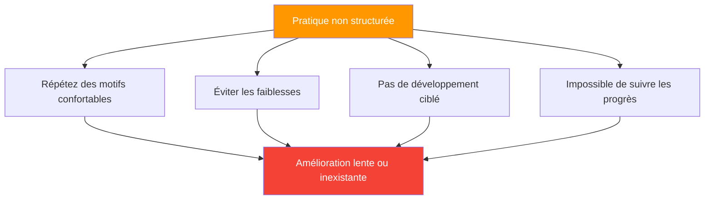

# Structurer votre pratique

> « Deux joueurs peuvent passer le même nombre d&#39;heures sur le terrain et constater des progrès très différents. »

La différence réside souvent dans la manière dont la pratique est structurée.

::: tip Le mythe des 10 000 heures
**Ce n&#39;est pas une question d&#39;heures, c&#39;est une question de façon de les utiliser.** La pratique délibérée est toujours préférable à la répétition machinale.
:::

---

## Le problème de la pratique non structurée

La plupart des activités récréatives ressemblent à ceci :
- Présentez-vous, lancez quelques boules
- Jouez à quelques jeux occasionnels
- Discutez avec vos amis
- Rentrez chez vous

C&#39;est agréable, mais inefficace pour l&#39;amélioration.

---

## Principes d&#39;une pratique efficace

| Principe | Question à poser |
|-----------|----------------|
| **Déterminé** | Sur quoi est-ce que je travaille aujourd&#39;hui ? |
| **Volontaire** | Est-ce que cela me met au défi ? |
| **Riche en commentaires** | Comment savoir si je progresse ? |
| **Concentré** | Suis-je pleinement présent ? |

### 1. Pratique intentionnelle

Chaque session doit avoir un objectif clair :
- Sur quoi est-ce que je travaille aujourd&#39;hui ?
- À quoi ressemble le succès ?
- Comment saurai-je si j&#39;ai progressé ?

### 2. Difficulté délibérée

::: info L&#39;avantage du talent
**La pratique doit vous mettre au défi.** Si elle est confortable, vous ne progressez pas.
:::

- Travaillez à la limite de vos capacités
- Incluez des éléments difficiles
- Évitez la répétition pure et simple dans votre zone de confort.

### 3. Retour d&#39;information immédiat

Vous devez savoir comment vous vous en sortez :
- Suivre les résultats des exercices
- Utilisez la vidéo lorsque c&#39;est possible.
- Obtenez l&#39;avis de vos partenaires de formation

### 4. Attention focalisée

La qualité prime sur la quantité :
- Concentration totale pendant l&#39;entraînement
- Des séances plus courtes et ciblées valent mieux que des séances longues et décousues.
- L&#39;engagement mental est essentiel

## Structure de la session

### Échauffement (10-15 minutes)

**Physique:**
- Mouvement léger
- préparation des bras et des épaules
- Augmentation progressive de l&#39;intensité

**Mental:**
- Transition de la vie quotidienne
- Définir l&#39;intention de la séance
- Commencez à concentrer votre attention.

### Travaux techniques (20-30 minutes)

Concentrez-vous sur des compétences spécifiques :
- pratique technique isolée
- Exercices ciblant les points faibles
- Répétition avec attention

**Exemples de domaines d&#39;intervention :**
- Précision de pointage à des distances spécifiques
- Prise de vue sous différents angles
- Types de lancers spécifiques (plombée, portée, etc.)

### Exercices pratiques (20-30 minutes)

Mettre ses compétences en pratique dans des contextes réalistes :
- Situations de jeu simulées
- forets à pression
- Pratique de la prise de décision

### Retour au calme (10 minutes)

**Physique:**
- Portée de lumière
- Étirage

**Mental:**
- Réviser ce que vous avez appris
- Identifier les domaines à explorer ultérieurement.
- Transition hors du mode entraînement

## Types de séances d&#39;entraînement

### session de développement des compétences

Objectif : Développer ou perfectionner des techniques spécifiques

- 70% exercices techniques
- 20 % de pratique appliquée
- 10 % d&#39;échauffement/récupération

### Simulation de compétition

Objectif : Se préparer aux conditions de match

- 20 % d&#39;échauffement ciblé
- 60 % de jeu similaire à un match, avec pression
- Débriefing et ajustement à 20 %

### Session de maintenance

Objectif : Maintenir ses compétences à jour

- Travail équilibré dans tous les domaines
- Aucune concentration intense sur une seule chose
- Agréable mais utile

### Séance de récupération

Objectif : Entraînement léger après la compétition

- Faible intensité
- lancer agréable
- Réinitialisation mentale

## Conception des forets

Les exercices efficaces comportent :

### Objectifs clairs
Que pratiquez-vous précisément ?

### Résultats mesurables
Comment mesure-t-on le succès ?

### Défi approprié
Assez difficile pour s&#39;étirer, mais pas trop pour réussir.

### Pertinence
Lié à des situations de jeu réelles

### Progression
Comment augmenter la difficulté à mesure que vous progressez

## Exercices d&#39;entraînement

### Précision de pointage

**Configuration :** Cible à 8 mètres
**Objectif :** Atterrir à moins de 30 cm de la cible
**Suivi :** Taux de réussite sur 20 lancers
**Progrès :** Diminuer la taille de la cible, augmenter la distance

### Cohérence des tirs

**Configuration :** Boule cible fixe
**Objectif :** Atteindre la cible
**Suivi :** Nombre de coups par 10 tentatives
**Progression :** Variez les angles, ajoutez du mouvement

### Simulation de pression

**Configuration :** Il faut en réaliser 3 d&#39;affilée pour « gagner ».
**Objectif :** Terminer la séquence
**Suivi :** Tentatives nécessaires
**Progrès :** Augmenter la séquence requise

## Planification hebdomadaire

### Exemple de semaine équilibrée

**Lundi :** Développement des compétences (pointage)
**Mercredi :** Simulation de compétition
**Vendredi :** Développement des compétences (pointe sur le tir)
**Week-end :** Matchs

### Périodisation

Faire varier l&#39;intensité au fil de la saison :

**Hors saison :** Développement intensif des compétences
**Pré-saison :** Intégration et simulation
**Saison de compétition :** Entretien et affûtage
**Après-saison :** Récupération et réflexion

## Erreurs courantes

### Trop de jeu

Jouer à des jeux vidéo est amusant, mais ne permet pas de cibler efficacement les faiblesses.

### Aucun suivi

Sans mesure, vous ne pouvez pas savoir si vous progressez.

### Éviter les faiblesses

On pratique naturellement ce qu&#39;on sait faire de mieux. Forcez-vous à travailler vos points faibles.

### Horaire irrégulier

Une pratique sporadique produit des résultats sporadiques.

### Aucune pratique mentale

La répétition physique sans engagement mental limite les progrès.

## Bâtonnet d&#39;entraînement à fabriquer

### Avant l&#39;entraînement
- Définissez des intentions claires
- Se préparer mentalement
- Consultez les notes de la séance précédente

### Pendant l&#39;entraînement
- Restez concentré
- Résultats du suivi
- Ajuster au besoin

### Après l&#39;entraînement
- Notez ce que vous avez appris
- Identifier les prochaines étapes
- Célébrons les progrès

## Le mythe des 10 000 heures

Il ne s&#39;agit pas seulement du nombre d&#39;heures, mais aussi de la qualité. 1 000 heures de pratique délibérée valent mieux que 10 000 heures de répétition machinale.

Structurez votre pratique avec un objectif précis, et chaque heure comptera davantage.

---

| *En lien avec : [Méthodes de formation](/en/education/technique/training/) | [Exercices d&#39;entraînement](/en/education/technique/training/drills) | [Fixation d&#39;objectifs](/en/education/motivation/)* |

