# Développer la conscience de soi : le fondement du progrès

> « On ne peut améliorer ce que l&#39;on ne perçoit pas avec précision. »

La conscience de soi — connaître ses forces et ses faiblesses réelles — est le fondement d&#39;un développement efficace.

::: danger La vérité qui dérange
**La plupart des joueurs travaillent sur les mauvaises choses** parce qu&#39;ils n&#39;ont pas une vision claire d&#39;eux-mêmes.
:::

---

## Le paradoxe de la conscience de soi

```mermaid
flowchart TD
    A[Le paradoxe de la conscience de soi] --> B[Effet Dunning-Kruger]
    A --> C[Angles morts de l&#39;expert]
    A --> D[Interférence émotionnelle]

    B --> E[Faible niveau de compétence = surestimation des capacités]
    C --> F[Même les joueurs expérimentés peuvent se tromper dans leurs jugements.]
    D --> G[Nous voulons croire que nous sommes meilleurs]

    E --> H[Travailler sur les mauvaises choses]
    F --> H
    G --> H

    style A fill:#f44336,color:#fff
    style H fill:#f44336,color:#fff
```

---

## Pourquoi les joueurs de pétanque ont-ils des difficultés ?

La pétanque rend l&#39;auto-évaluation particulièrement difficile :

| Défi | Pourquoi c&#39;est difficile |
|-----------|--------------|
| **Écart de résultat** | De bonnes décisions peuvent engendrer de mauvais résultats (et vice versa). |
| **Biais de comparaison** | On se souvient des meilleures performances, on explique les pires. |
| **Protection de l&#39;identité** | Admettre sa faiblesse est menaçant |

::: warning La mémoire n&#39;est pas une donnée
**Nous construisons des récits qui protègent notre image de soi.** Un suivi objectif est essentiel.
:::

---

## Les composantes de la conscience de soi

La véritable conscience de soi exige une compréhension de multiples domaines :

| Domaine | Questions clés |
|--------|---------------|
| **Technique** | Quels lancers sont réellement fiables ? Lesquels sont irréguliers ? |
| **Mental** | Comment réagir face à la pression ? Qu&#39;est-ce qui déclenche ma voix intérieure critique ? |
| **Physique** | À quel moment mon énergie est-elle au maximum ? Comment la fatigue m’affecte-t-elle ? |
| **Tactique** | Est-ce que j&#39;attaque trop ? Pas assez ? Comment j&#39;analyse les situations ? |
| **Émotionnel** | Qu&#39;est-ce qui me frustre ? Quand est-ce que je joue de manière crispée ? |
| **Relations interpersonnelles** | Comment mes coéquipiers perçoivent-ils ma communication ? |

## Avis externes : Le miroir dont vous avez besoin

Vous ne pouvez pas voir vos propres angles morts. Vous avez besoin de points de vue extérieurs.

### Méthodes de rétroaction structurées

**Analyse vidéo**
- Enregistrement des matchs et entraînement
- Observer en se concentrant sur des zones spécifiques
- Remarquez les schémas qui vous échappent sur le moment.

**Évaluation par les pairs**
- Demandez un avis honnête à vos coéquipiers de confiance.
- Utilisez l&#39;[outil d&#39;évaluation](/en/assessment/) pour la validation par les pairs
- Comparez votre auto-évaluation avec leur évaluation

**Observation de l&#39;entraîneur**
- Un regard neuf perçoit ce que les yeux habitués ne voient pas. Un regard neuf voit ce que les yeux habitués ne voient pas. On remarque ce que les yeux habitués ne voient pas. Un regard neuf perçoit ...
- Demandez des commentaires précis, pas des impressions générales.
- Suivre l&#39;évolution des thèmes de commentaires au fil du temps

### Le déficit de rétroaction

Lorsque votre auto-évaluation diffère sensiblement des commentaires externes, soyez attentif :

| Type d&#39;espace | Signification | Action |
|----------|---------|--------|
| Vous avez une meilleure note | angle mort potentiel | Enquêter à l&#39;aide de vidéos/données |
| Votre note est plus basse | Problème de confiance potentiel | Mettez l&#39;accent sur les preuves de compétence |
| Écart constant | Erreur de perception systématique | Recalibrez votre modèle mental |

## Développer des habitudes de conscience de soi

### Réflexion quotidienne (5 minutes)

Après chaque séance, posez-vous la question suivante :

1. **Qu&#39;est-ce qui a bien fonctionné ?** (Soyez précis)
2. **Qu&#39;est-ce qui n&#39;a pas fonctionné ?** (Soyez honnête)
3. **Que ferais-je différemment ?** (Soyez constructif)
4. **Qu&#39;est-ce qui m&#39;a surpris ?** (Soyez curieux)

### Revue hebdomadaire (15 minutes)

Recherchez des schémas :

- Quelles sont les situations qui me mettent constamment au défi ?
- Où est-ce que je m&#39;améliore ?
- Quels commentaires ai-je reçus ?
- Qu’est-ce que j’évite de regarder ?

### Évaluation mensuelle

Utilisez l&#39;outil [Évaluation du joueur](/en/assessment/) :

- Évaluez-vous sur chacun des 8 facteurs
- Demande de validation par les pairs
- Comparer au mois précédent
- Identifier les plus grandes lacunes

## L&#39;avantage des données

La perception subjective est peu fiable. Les données apportent l&#39;objectivité :

### Que suivre

**Données de performance**
- Taux de réussite par type de lancer
- Performance sous pression vs sans pression
- Premier set contre sets suivants
- Avec différents partenaires

**Traitement des données**
- Qualité du sommeil avant les matchs
- Conformité aux règles de routine avant le match
- L&#39;état mental lors des moments clés
- Temps de récupération après les erreurs

### Comment utiliser les données

1. **Identifier les tendances** — Qu&#39;est-ce qui est corrélé à une bonne/mauvaise performance ?
2. **Remettre en question les hypothèses** — Les données correspondent-elles à vos convictions ?
3. **Formation guidée** — Concentrez-vous sur les faiblesses réelles, et non sur celles perçues.
4. **Suivre les progrès** — L&#39;amélioration est souvent invisible sans mesure.

## Blocages courants de la conscience de soi

::: warning Attention à ces
- **Attitude défensive** face aux commentaires
- **Justifier** les mauvaises performances
- **Je cherche une confirmation** plutôt que la vérité
- **Éviter de mesurer** les zones fragiles
- **Incriminer systématiquement les facteurs externes**
:::

## Le lien avec l&#39;état d&#39;esprit de croissance

La conscience de soi exige d&#39;accepter que :

- La capacité actuelle n&#39;est pas fixée
- La faiblesse réside dans l&#39;information, non dans l&#39;identité.
- Les commentaires sont un cadeau, pas une attaque
- L&#39;amélioration nécessite une évaluation honnête

## Étapes à suivre

1. **Aujourd&#39;hui :** Complétez l&#39;[auto-évaluation](/en/assessment/)
2. **Cette semaine :** Demandez l’avis de deux collègues de confiance.
3. **En cours :** Instaurer une habitude de réflexion quotidienne
4. **Mensuel :** Suivre les progrès grâce à des évaluations répétées

---

## Contenu associé

- Module de sensibilisation à soi-même — Formation complète
- [Évaluation du joueur](/en/assessment/) — Évaluez vos 8 facteurs
- [Le critique intérieur](/en/articles/inner-critic) — Gérer son propre jugement

