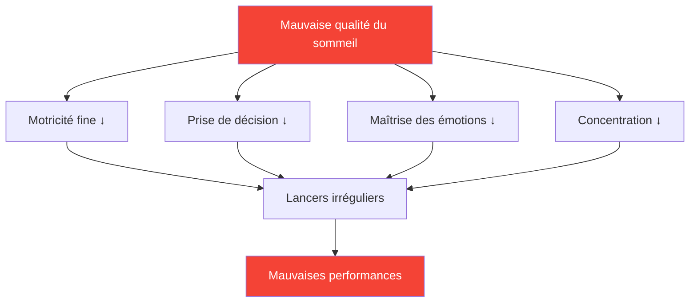

# Le sommeil : le facteur de performance le plus sous-estimé

> « Le joueur qui a le mieux dormi gagne souvent. »

La plupart des joueurs se concentrent sur la technique et la préparation mentale. Rares sont ceux qui optimisent leur sommeil. C&#39;est une erreur : améliorer son sommeil représente sans doute l&#39;investissement le plus rentable pour la plupart des joueurs de compétition.

::: tip Amélioration à retour sur investissement élevé
**L&#39;optimisation du sommeil ne requiert aucun talent particulier et offre des résultats exceptionnels.** C&#39;est ce qui se rapproche le plus d&#39;un produit légal pour améliorer les performances.
:::

---

## La recherche

La science du sommeil révèle des effets frappants sur les performances sportives de précision :

### Temps de réaction
- **24 heures sans sommeil** = temps de réaction équivalent à un taux d&#39;alcoolémie de 0,1 %
- **6 heures/nuit pendant 2 semaines** = équivalent à rester éveillé 48 heures
- Les athlètes d&#39;élite s&#39;entraînent en moyenne **8,5 heures et plus** contre 7 heures pour la population générale.

### Prise de décision
- Le manque de sommeil affecte d&#39;abord le cortex préfrontal.
- Les décisions tactiques se dégradent avant même que la fatigue ne soit manifeste.
- Vous ne vous rendez pas compte de votre déficience (la métacognition est également défaillante).

### Commande de moteur
- La motricité fine (préhension, relâchement) nécessite une mémoire consolidée
- La consolidation de la mémoire se produit pendant le sommeil profond.
- Apprendre une compétence sans dormir suffisamment = pratique gaspillée

## La connexion de précision

La pétanque exige précisément ce que le manque de sommeil détruit :

| Compétences requises | Effets de la privation de sommeil |
|----------------|--------------------------|
| Contrôle de la motricité fine | La pression exercée sur la poignée devient incohérente |
| Traitement visuel | altération du jugement des distances |
| Prise de décision | Les erreurs tactiques augmentent |
| Régulation émotionnelle | La frustration après les erreurs augmente |
| Attention soutenue | La concentration se relâche lors des matchs plus longs. |

## Signes que vous ne dormez pas assez

Vous vous êtes adapté à la privation chronique de sommeil si :

- Il vous faut un réveil pour vous réveiller
- Vous êtes somnolent en début d&#39;après-midi
- Vous vous endormez en moins de 5 minutes après vous être allongé.
- Vous «rattrapez» votre retard le week-end
- Le café est essentiel, pas optionnel.

**Vérification des faits :** Si vous avez besoin de caféine pour fonctionner normalement, c&#39;est que vous manquez de sommeil.

## Protocole de la semaine de compétition

### 7 jours avant
- Commencez à dormir 30 minutes de plus par nuit
- Stabiliser l&#39;heure du réveil (même heure chaque jour)

### 3 jours avant
- Pas d&#39;alcool (perturbe l&#39;architecture du sommeil)
- Pas de repas copieux après 19h
- Réduisez votre temps d&#39;écran après le coucher du soleil.

### La nuit précédant
- Heure normale du coucher (ne vous couchez pas tôt, vous risquez de rester éveillé).
- Un environnement familier si possible
- routine de relaxation

### Matinée de compétition
- Réveil à l&#39;heure normale
- exposition à la lumière immédiatement
- Routine de petit-déjeuner habituelle

## Optimisation de la qualité du sommeil

Ce n&#39;est pas seulement la durée qui compte, la qualité est plus importante.

### Environnement de sommeil
- **Température :** 18-20 °C (65-68 °F) est optimal
- **Obscurité :** Obscurité totale ou masque de sommeil
- **Son :** Constant (bruit blanc) ou silencieux
- **Literie :** Confortable, pas trop chaude

### Routine avant le coucher
- Plus de 60 minutes sans écran avant le coucher
- Lumières tamisées le soir
- Activités de détente régulières
- Une douche fraîche peut favoriser l&#39;endormissement.

### Timing
- Heure de réveil régulière (plus important que l&#39;heure du coucher)
- Évitez de dormir plus de 30 minutes le week-end.
- Siestes : avant 15 h, moins de 20 minutes

## La stratégie de la sieste

La sieste stratégique les jours de compétition :

### La sieste éclair (10-20 min)
- Réduit la fatigue sans provoquer de somnolence.
- Idéal pour les séances entre le matin et l&#39;après-midi
- Programmez une alarme — ne faites pas la grasse matinée.

### Le cycle complet (90 min)
- Cycle de sommeil complet
- Uniquement si vous avez plus de 2 heures avant la compétition
- Risque de somnolence en cas d&#39;interruption

### Ne jamais faire de sieste si :
- Vous souffrez d&#39;insomnie d&#39;endormissement
- La compétition dure 90 minutes.
- Il est plus de 15h et tu dois dormir cette nuit.

## Considérations relatives au voyage

Pour les compétitions à l&#39;extérieur :

### Avant le voyage
- Apportez vos objets de sommeil habituels (oreiller, masque de sommeil).
- Recherche de chambre d&#39;hôtel (demander une chambre calme)
- Adaptez votre horaire si vous traversez plusieurs fuseaux horaires.

### À destination
- Essayez de respecter votre horaire de sommeil habituel si possible.
- L&#39;exposition à la lumière contrôle le rythme circadien
- Évitez les repas copieux juste avant le coucher.

### Changement de fuseau horaire
- 1 jour par heure pour s&#39;adapter complètement
- Réglage de la vitesse d&#39;exposition à la lumière du matin vers l&#39;est
- l&#39;exposition à la lumière du soir accélère l&#39;ajustement vers l&#39;ouest

## Suivre votre sommeil

Ce qui se mesure se gère :

### Suivi simple
- Heure de réveil et heure du coucher
- Qualité subjective (1-10)
- notes de corrélation de performance

### Suivi avancé
- traqueur de sommeil ou appareil portable
- tendances de la VFC (variabilité de la fréquence cardiaque)
- données sur les stades du sommeil

### Ce qu&#39;il faut rechercher
- Corrélation entre le sommeil et les performances
- Comportements (rattrapage du week-end, insomnies pré-compétition)
- Évolution des tendances au fil du temps

## Erreurs courantes

::: warning Évitez ces
- **L&#39;alcool comme somnifère** — Facilite l&#39;endormissement, mais nuit à la qualité du sommeil
- **Rattrapage du week-end** — Impossible de « rembourser » sa dette de sommeil
- **Écrans au lit** — Habitue le cerveau à associer lit ≠ sommeil
- **Horaire irrégulier** — Le rythme circadien a besoin de régularité.
- **Négliger le sommeil pour s&#39;entraîner** — Privilégier la quantité à la qualité
:::

## Étapes à suivre

1. **Cette semaine :** Suivez votre sommeil réel (durée et qualité).
2. **La semaine prochaine :** Établir une heure de réveil régulière
3. **Semaines suivantes :** Optimiser l’environnement et la routine
4. **Avant la compétition :** Mettre en œuvre le protocole de la semaine de compétition

---

## Contenu associé

- Module Sommeil et Récupération — Formation complète sur le sommeil
- [Habitudes de sommeil](/en/education/sleep/habits) — Établir des routines durables
- [Sommeil en compétition](/en/education/sleep/competition) — Protocoles spécifiques à l&#39;événement

