# Communication sous pression

> « Les mots justes au bon moment inspirent confiance. Les mots malheureux peuvent faire s&#39;effondrer même les équipes les plus talentueuses. »

::: tip La vérité sur la communication
**Sous pression, la simplicité est la clé.** Une communication claire et concise vaut toujours mieux que de longues discussions.
:::

---

## Pourquoi la communication est importante

```mermaid
flowchart TD
    A[Communication efficace] --> B[Stratégie partagée]
    A --> C[Soutien mutuel]
    A --> D[Décisions rapides]
    A --> E[Résilience d&#39;équipe]

    B --> F[Meilleures performances]
    C --> F
    D --> F
    E --> F

    style A fill:#2196F3,color:#fff
    style F fill:#4CAF50,color:#fff
```

Les équipes de pétanque sont confrontées à des défis uniques :
- Des décisions doivent être prises rapidement.
- La pression influence notre façon de parler et d&#39;écouter.
- Les signaux non verbaux sont visibles pour les adversaires.
- La performance individuelle influence la dynamique d&#39;équipe

---

## Les principes de la communication

### 1. La clarté prime sur la quantité

| ❌ Ne le dis pas | ✅ Dites plutôt |
|-------------|---------------|
| « Je pense qu&#39;on devrait peut-être essayer de montrer du doigt ici, mais je n&#39;en suis pas sûr... » | « Je vais montrer le côté gauche. Le terrain y est meilleur. » |

### 2. Cadrage positif

| ❌ Négatif | ✅ Positif |
|------------|------------|
| « À ne pas manquer ! » | « Tu peux le faire — fais confiance à ton lancer » |
| « C&#39;était terrible. » | &quot;On passe à autre chose, au suivant&quot; |

### 3. Focus sur le présent

::: warning Passé vs Présent
**Au lieu de :** « Pourquoi l&#39;as-tu jeté là ? »
**Dites :** « Bon, quelle est notre meilleure option maintenant ? »
:::

### 4. Langage de propriété

Utilisez le « je » pour vos propres actions et le « nous » pour les situations d&#39;équipe :

- « Je vais tenter ma chance. »
- «Nous devons protéger ce point.»
- «Je pense que nous devrions...»

## Que communiquer

### Avant chaque extrémité

- **Discussion stratégique** : Bref alignement sur l’approche
- **Clarté des rôles** : Qui fait quoi ?
- **Observations sur le terrain** : Conditions pertinentes

### Pendant le jeu

- **Décisions** : Énoncé clair de l’action envisagée
- **Soutien** : Encouragements avant les lancers
- **Informations** : Observations pertinentes concernant le terrain ou les adversaires

### Après les lancers

- **Remerciements** : Brève reconnaissance (positive ou négative)
- **Ajustements** : Tout changement stratégique nécessaire
- **Réinitialisation** : Aider un coéquipier à se recentrer

## Ce qu&#39;il ne faut PAS communiquer

### À éviter lors des moments de pression

- Instructions techniques (« Gardez votre coude à l&#39;intérieur »)
- Critiques des lancers passés
- Expressions de frustration
- Doute sur les capacités du coéquipier
- Analyse excessive

### À éviter en général

- Langage du blâme
- Sarcasme ou agression passive
- Comparaisons avec d&#39;autres joueurs
- Prédictions d&#39;échec

## Communication non verbale

Votre langage corporel en dit long :

### Signaux positifs
- contact visuel avec les coéquipiers
- Posture ouverte et détendue
- Hochements de tête et reconnaissance
- Mouvements calmes et réguliers

### Signaux négatifs (à éviter)
- Lever les yeux au ciel ou soupirer
- Se détourner de ses coéquipiers
- Bras croisés ou posture fermée
- Frustration visible

### Coéquipiers de lecture

Apprenez à reconnaître les besoins de vos coéquipiers :
- **Espace** : Ils traitent les données, ne les interrompez pas.
- **Soutien** : Ils sont en difficulté, offrez-leur des encouragements.
- **Information** : Leurs propos sont incertains, veuillez apporter des précisions.
- **Énergie** : Elles sont plates, elles apportent de l&#39;enthousiasme

## Rôles de communication

### Le Pointeur
- Faites part de votre analyse du terrain.
- Indiquez clairement l&#39;emplacement prévu.
- Demandez un avis en cas de doute

### Le tireur
- Confirmer la sélection de la cible
- Communiquer le niveau de confiance
- Demander des informations sur les angles

### Le Milieu/Capitaine
- Faciliter les discussions d&#39;équipe
- Prendre les décisions finales lorsque cela est nécessaire
- Gérer l&#39;énergie et la concentration de l&#39;équipe

## Situations de pression

### Quand derrière

- Restez concentré sur les solutions
- Maintenez une énergie positive
- Évitez les reproches et la frustration.
- Célébrez les petites victoires

### Quand en avance

- Restez concentré, évitez la complaisance
- Maintenez une communication cohérente
- Ne changez pas ce qui fonctionne

### Point de match (le leur)

- Reconnaissez brièvement la pression.
- Concentrez-vous sur le processus
- Soutenez-vous mutuellement de manière visible

### Pointe de match (la nôtre)

- Restez calme et concentré
- Évitez les célébrations prématurées
- Exécuter normalement

## Développer ses compétences en communication

### En pratique

- Pratiquez la communication pendant l&#39;entraînement
- Donner et recevoir des commentaires sur la communication
- Expérimentez différentes approches

### Accords d&#39;équipe

Établir des normes d&#39;équipe :
- Comment nous gérons les désaccords
- À quoi ressemble le soutien
- Quand parler et quand se taire

### Analyse d&#39;après-match

Discuter de la communication :
- Qu&#39;est-ce qui a bien fonctionné ?
- Qu&#39;est-ce qui pourrait être amélioré ?
- Des malentendus à clarifier ?

## Quand la communication se rompt

### Dans l&#39;instant

1. Respirez
2. Repartons sur une simple affirmation : « Concentrons-nous sur ce lancer. »
3. Retour aux fondamentaux : clair, positif, présent

### Après le match

- Réglez les problèmes calmement
- Concentrez-vous sur les comportements, pas sur les personnalités.
- Convenir des améliorations
- Avancer ensemble

## Le soutien silencieux

Parfois, la meilleure communication est la présence :
- Soutenir un coéquipier en difficulté
- Une main sur l&#39;épaule
- Un signe de confiance
- Le simple fait d&#39;être là

Les mots ne sont pas toujours nécessaires. Le lien, lui, l&#39;est.

---

| *À consulter également : [Dynamique d&#39;équipe](/en/education/team-dynamics/) | [Communication](/en/education/team-dynamics/communication) | [Gérer la pression](/en/education/mental-game/mental-strength/handling-pressure)* |

