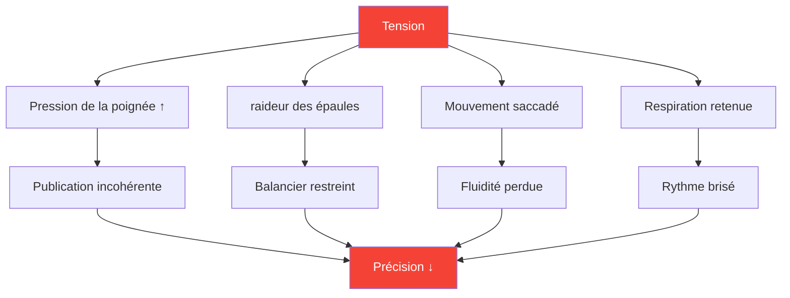
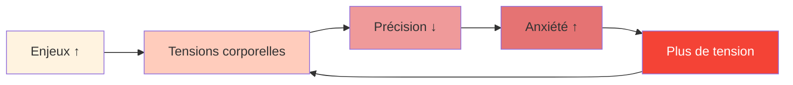

# Tension et précision : le lien caché

> « On ne peut pas être à la fois tendu et précis. C&#39;est physiquement impossible. »

Vous l&#39;avez déjà ressenti : ce lancer crucial où votre corps se crispe, votre prise se resserre, et la balle part exactement là où vous ne le vouliez pas. La tension est l&#39;ennemie silencieuse de la précision.

::: danger L&#39;ennemi caché
**La plupart des tensions sont invisibles pour le joueur qui les ressent.** On ne se rend compte de sa tension que lorsqu&#39;il est trop tard.
:::

---

## La biomécanique de la tension

---

## Là où se cache la tension

La plupart des joueurs sont conscients des tensions importantes (épaules crispées avant un lancer long). Peu remarquent les tensions subtiles qui dégradent constamment leurs performances.

| Emplacement | Effet sur le lancer | Comment remarquer |
|----------|-----------------|---------------|
| **Poignée** | Calendrier de sortie incohérent | Marques de balle sur la paume |
| **Avant bras** | Fluidité réduite du poignet | Sensation de brûlure |
| **Épaule** | Arc de balancement restreint | Le lancer semble « court ». |
| **Cou** | Position de la tête modifiée | Raideurs après les matchs |
| **Mâchoire** | Cascade de tension corporelle totale | dents serrées |
| **Haleine** | Rythme perturbé | Retenir sa respiration |

---

## La spirale de pression-tension

Sous la pression, un cycle destructeur se met en place :

::: tip Briser le cycle
**Interrompez à l&#39;étape 2** — avant que la tension n&#39;affecte la performance. C&#39;est pourquoi les routines de pré-prise de vue avec vérification de la tension sont essentielles.
:::

## Détecter vos schémas de tension

### La méthode de scan corporel

Avant de pratiquer, fermez les yeux et balayez l&#39;espace :

1. Commencez par vos pieds — Y a-t-il une crispation des orteils ?
2. Remontez en fléchissant les jambes — Genoux bloqués ?
3. Observez vos hanches et votre tronc — Y a-t-il des tensions musculaires ?
4. Vérifiez les épaules — Y a-t-il une élévation ?
5. Examinez les bras et les mains — Y a-t-il une prise prématurée ?
6. Observez le cou et le visage — Y a-t-il des crispations ?

Évaluez la tension de 0 à 10 à chaque point de mesure. **Votre valeur de référence devrait être de 2 ou moins.**

### La méthode vidéo

Enregistrez-vous en train de lancer :
- Pratique à faible enjeu
- Entraînement à enjeux modérés
- Compétition à enjeux élevés

Analysez votre langage corporel. Où vous crispez-vous lorsque l&#39;enjeu augmente ?

### La méthode du partenaire

Demandez à un coéquipier d&#39;observer :
- Votre expression avant les lancers importants
- Votre position change sous la pression
- Vos schémas respiratoires
- Votre comportement de préhension

Les observateurs extérieurs voient ce que nous ne pouvons pas ressentir.

## Techniques de libération

### Attaches rapides (à utiliser en compétition)

**La séance de débriefing**
- Brève et vigoureuse poignée de mains et de bras
- Libère les modèles d&#39;attente
- Cela prend 2 à 3 secondes

**La goutte d&#39;expiration**
- Inspirez profondément.
- À l&#39;expiration, abaissez consciemment vos épaules.
- Relâchez simultanément la tension de la mâchoire

**La réinitialisation de la prise en main**
- main ouverte complètement
- Écartez les doigts
- Reprenez la main avec la force minimale nécessaire.

### Relâchements profonds (À utiliser à l&#39;entraînement/avant la compétition)

**Relaxation musculaire progressive**
- Contractez délibérément chaque groupe musculaire (5 secondes).
- Relâcher complètement (15 secondes)
- Remarquez la différence
- Travailler sur l&#39;ensemble du corps

**Lien entre la respiration et le corps**
- Respiration lente (4 temps d&#39;inspiration, 6 temps d&#39;expiration)
- À chaque expiration, relâchez une zone du corps.
- Continuez jusqu&#39;à ce que vous atteigniez une relaxation complète du corps.

## L&#39;intégration avant prise de vue

Intégrez la prise de conscience de la tension dans votre routine d&#39;avant-prise de vue :

### Avant de s&#39;avancer vers le cercle
- Analyse corporelle rapide (2 secondes)
- Une expiration en libérant
- Confirmer la prise relâchée

### Dans le cercle
- Dernier souffle pour se calmer
- Mise au point douce sur la cible
- Initier le lancer à partir d&#39;un état détendu

### Après le lancer
- Observez où la tension s&#39;est accumulée.
- Secouez si nécessaire
- Réinitialisation pour le prochain lancer

## Formation à la prise de conscience de la tension

### Exercice 1 : La prise minimale

Trouvez la pression minimale sur la poignée qui permet de garder le contrôle :
- Commencez avec une prise ferme — lancez 5 balles
- Réduisez la force de votre prise de 20 % — lancez 5 balles
- Continuez à réduire jusqu&#39;à ce que le contrôle soit perdu.
- Revenez d&#39;un niveau — voici votre prise optimale

La plupart des joueurs serrent la poignée 40 à 60 % plus fort que nécessaire.

### Exercice 2 : Simulation de pression

S&#39;entraîner sous pression artificielle tout en surveillant la tension :
- Créer des conséquences pour les lancers d&#39;entraînement
- Remarquez où la tension apparaît
- Entraînez-vous à relâcher la pression tout en maintenant votre concentration.
- Augmenter progressivement la tolérance à la pression

### Exercice 3 : Le pointeur détendu

Évaluez-vous selon deux dimensions :
- Résultat technique (où la balle a-t-elle atterri ?)
- Niveau de tension (à quel point étiez-vous détendu ?)

**Objectif :** Optimiser les deux simultanément. De nombreux joueurs doivent accepter des résultats légèrement inférieurs au début, le temps d’apprendre à lancer de manière détendue.

## Protocole du jour de compétition

### Avant-match
- relaxation progressive de 10 minutes
- Analyse corporelle pour identifier les zones d&#39;attente
- routine de décompression

### Entre les extrémités
- Brève séance de décompression
- Une expiration libératrice
- Contrôle de la tension avant les lancers critiques

### Pendant le lancer
- Faites confiance à votre routine d&#39;avant-injection
- La technique de déclenchement est préprogrammée.
- Ne pas contrôler consciemment pendant l&#39;exécution

## Erreurs courantes

::: warning Évitez ces
- **Excès de relaxation** — Une certaine activation est nécessaire
- **Contrôle conscient pendant le lancer** — Perturbe le flux
- **Se détendre uniquement pour les longs lancers** — Doit être régulier
- **Négliger sa respiration** — Respiration et tension sont liées
- **Bâcler le travail** — La détente prend du temps
:::

## Les avantages à long terme

Les joueurs qui maîtrisent la gestion de la tension :
- performer de manière plus constante sous pression
- Ressentez moins de fatigue physique
- Récupérez plus rapidement de vos erreurs
- Appréciez davantage la compétition

---

## Contenu associé

- Module de gestion des tensions — Formation complète
- Préparation physique
- Gestion de la pression — Aspects mentaux

