# Pourquoi les joueurs d&#39;élite ont davantage besoin d&#39;entraînement mental que d&#39;entraînement technique

*Temps de lecture : 8 minutes*

Si vous jouez à la pétanque depuis des années et que vous maîtrisez bien la technique, cet article va remettre en question tout ce que vous pensez savoir sur l&#39;entraînement. La vérité, aussi dérangeante soit-elle : **un excès de pratique technique pourrait vous freiner.**

## Le paradoxe du développement des élites

Voici quelque chose qui surprend la plupart des joueurs :

::: warning Le principe d&#39;inversion
À mesure que vos compétences techniques augmentent, le rapport entre l&#39;entraînement technique et l&#39;entraînement mental devrait s&#39;**inverser**.

- **Débutants :** 90 % technique, 10 % mental
- **Niveau intermédiaire :** 70 % technique, 30 % mental
- **Niveau avancé :** 50 % technique, 50 % mental
- **Élite :** 20 % technique, 80 % mental
:::

Ce n&#39;est pas intuitif. La plupart des joueurs pensent que pour progresser, ils doivent davantage pratiquer leur technique. Mais au plus haut niveau, cette approche pose en réalité problème.

## Pourquoi l&#39;entraînement technique peut nuire aux performances de haut niveau

### Le problème de la suranalyse

En pratiquant intensivement une technique, vous renforcez la conscience de vos mouvements. C&#39;est idéal pour les débutants qui développent leurs connexions neuronales. Mais pour les joueurs de haut niveau, cela crée une habitude dangereuse : celle de penser à la technique pendant son exécution.

**Exemple tiré du terrain :**

*Débutant :* Doit penser « plier les genoux, relâcher en douceur, accompagner le mouvement » pour exécuter correctement.

Joueur d&#39;élite : possède déjà plus de 10 000 heures d&#39;entraînement. Le mouvement est automatique. Penser à « plier les genoux » perturbe en réalité le schéma moteur acquis.

### La barrière de l&#39;état de flux

Les états de flow (être « dans la zone ») nécessitent une **hypofrontalité transitoire** — une réduction temporaire de l&#39;activité du cortex préfrontal (la partie analytique de votre cerveau).

```mermaid
graph LR
    A[Pratique technique] -->|Reinforces| B[Conscience consciente]
    B -->|Prevents| C[État de flux]
    C -->|Required for| D[Performance d&#39;élite]
    
    style A fill:#ffebee
    style C fill:#e8f5e9
    style D fill:#e3f2fd
```

Plus vous pratiquez consciemment votre technique, plus il devient difficile de « déconnecter » pendant la compétition.

## Ce dont les joueurs d&#39;élite ont réellement besoin

### 1. La possibilité de changer de mode

La performance de haut niveau exige la maîtrise de la transition entre deux modes cérébraux :

**Mode planification (hors du cercle)**
- pensée analytique
- Évaluation de la stratégie
- Prise de décision
- Évaluation des risques

**Mode d&#39;exécution (à l&#39;intérieur du cercle)**
- Mouvement automatique
- Concentration ciblée uniquement
- Confiance dans la formation
- accès à l&#39;état du flux

La plupart des joueurs d&#39;élite restent bloqués en phase de planification lors de l&#39;exécution. Ils doivent travailler le **changement de perspective**, et non la technique.

### 2. Gestion de la pression

La pratique technique dans des conditions confortables ne prépare pas à la pression psychologique de la compétition.

**Ce qui se passe sous pression :**
- Le rythme cardiaque augmente
- La respiration devient superficielle.
- Muscles tendus
- L&#39;attention se rétrécit
- La voix critique intérieure s&#39;active

On peut avoir une technique parfaite à l&#39;entraînement et la perdre complètement sous la pression. Ce n&#39;est pas un problème technique, c&#39;est un problème mental.

### 3. Correction d&#39;erreurs

Les joueurs d&#39;élite ne font pas moins d&#39;erreurs que les bons joueurs. Ils **récupèrent plus vite**.

**Bon joueur après un mauvais lancer :**
- S&#39;attarde sur l&#39;erreur
- Analyse ce qui s&#39;est mal passé
- Inquiétudes concernant le prochain lancer
- Les performances se détériorent

**Réaction d&#39;un joueur d&#39;élite après un mauvais lancer :**
- Observation neutre
- Apprentissage rapide
- Réinitialisation immédiate
- Performance maintenue

Il s&#39;agit d&#39;une compétence acquise, et non d&#39;un trait de personnalité.

## La science : Pourquoi l&#39;entraînement mental fonctionne

### Neurosciences de l&#39;expertise

Les recherches sur la performance des experts montrent que les athlètes d&#39;élite possèdent :

1. **Schémas moteurs automatisés** - Les mouvements se produisent sans contrôle conscient
2. **Reconnaissance des formes supérieure** - Analysez les situations plus rapidement
3. **Meilleure régulation émotionnelle** - Gérer efficacement la pression
4. **Récupération plus rapide** - Réinitialisation rapide après les erreurs

Remarque : Seul le point n° 1 est technique. Les trois autres sont d&#39;ordre mental.

### Le seuil des 10 000 heures

Après avoir consacré environ 10 000 heures à une pratique délibérée (soit environ 8 à 10 ans de jeu assidu), vos schémas techniques sont largement acquis. Toute amélioration technique supplémentaire présente des rendements de plus en plus faibles.

Mais le développement mental dans le jeu ? C&#39;est là que des progrès considérables sont encore possibles.

## Comment restructurer votre formation

### Pour les joueurs d&#39;élite (8 ans et plus d&#39;expérience)

**Répartition typique actuelle :**
- 80% pratique technique
- 20% jeu/compétition

**Répartition recommandée :**
- 20% maintenance technique
- 40% entraînement mental
- 40 % de situations de compétition/pression

### À quoi ressemble l&#39;entraînement mental ?

**Pas ceci :**
- &quot;Détendez-vous simplement&quot;
- « N&#39;y pense pas »
- « Ayez confiance »

**Mais ceci :**
- Pratique structurée de la pleine conscience (10 min par jour)
- Développement et pratique de la routine avant le tir
- Simulation de pression en formation
- protocoles de récupération des erreurs
- identification du déclencheur d&#39;état de flux
- Travail sur le coach intérieur contre le critique intérieur

Consultez notre section [Éducation](/en/education/) pour des techniques spécifiques.

## La vérité qui dérange

Si vous êtes un joueur de haut niveau et que vous consacrez encore 80 % de votre temps d&#39;entraînement à des exercices techniques, vous vous entraînez comme un débutant. Votre technique est déjà suffisamment bonne. Votre limite ne vient pas de votre bras, mais de votre mental.

::: tip La vraie question
Il ne s&#39;agit pas de se demander « Comment puis-je améliorer ma technique de pointage ? »

La question est : « Comment puis-je accéder de manière constante à ma meilleure technique sous pression ? »
:::

## Prochaines étapes pratiques

### 1. Évaluez votre ratio de liquidité générale

Suivez votre entraînement pendant une semaine :
- Heures de pratique technique
- Des heures consacrées au travail mental.
- Heures en situation de compétition/pression

### 2. Commencez petit

Ne modifiez pas les proportions du jour au lendemain. Ajoutez :
- 10 minutes de pleine conscience par jour
- Un objectif mental par séance d&#39;entraînement
- Exercices de routine avant le tir

### 3. Mesurer les performances mentales

Piste:
- Temps de récupération après les erreurs
- La constance sous pression
- Fréquence de l&#39;état d&#39;écoulement
- Adhésion au protocole pré-injection

### 4. Utilisez les modules de formation

Commencez par :
1. [The Zone](/en/education/the-zone/) - Comprendre les états de flow
2. [Force mentale](/en/education/mental-strength/) - Développer ses compétences en matière de gestion du stress
3. [Pleine conscience](/en/education/mindfulness/) - Développer la concentration sur le moment présent

## Conclusion

Le chemin vers la performance de haut niveau ne passe pas par une pratique technique accrue, mais par un entraînement mental plus intelligent. Votre technique est déjà suffisamment bonne. La question est : saurez-vous l&#39;exploiter au moment crucial ?

Les joueurs qui opèrent ce changement — qui font de l&#39;entraînement mental leur principal axe de développement — sont ceux qui dépassent les plateaux de performance et atteignent une excellence constante.

**Le choix vous appartient :** Continuez à vous entraîner comme un débutant, ou commencez à vous entraîner comme un joueur d’élite.

---

## Ressources connexes

- [La Zone : Comprendre l&#39;état de flux](/en/education/the-zone/)
- [Études de cas : Les joueurs d&#39;élite en action](/en/case-studies)
- [Modèle d&#39;objectif](/en/goal-template) - Planifiez votre développement mental

**Des questions ou des commentaires ?** Envoyez un courriel à [patrik.wiik@gmail.com](mailto:patrik.wiik@gmail.com)

