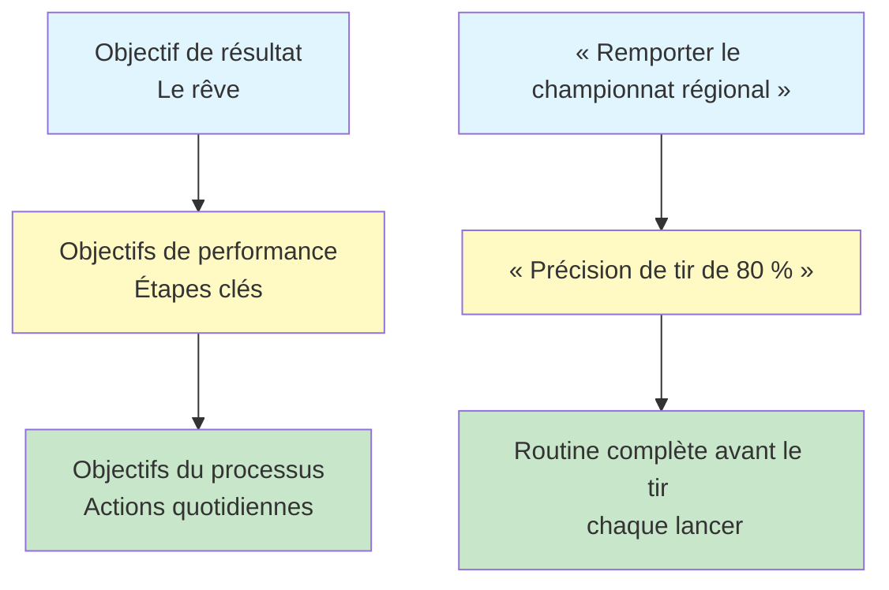

# Fixer des objectifs aux joueurs de pétanque
<AdBanner />

Des objectifs clairs sont votre boussole. Ils orientent votre entraînement, vous motivent dans les moments difficiles et vous permettent de mesurer vos progrès. Sans objectifs, vous naviguez à vue d&#39;œil. Avec des objectifs, vous construisez un but.

::: tip Le principe fondamental
**Un objectif sans plan n&#39;est qu&#39;un vœu pieux.** Fixez-vous des objectifs clairs, décomposez-les, concentrez-vous sur ce que vous pouvez contrôler et suivez vos progrès.
:::

## Pourquoi les objectifs sont importants

Les objectifs servent de multiples fonctions :
- **Consignes :** Savoir sur quoi travailler
- **Motivation :** Avoir un objectif à atteindre
- **Mesure :** Suivez vos progrès
- **Concentrez-vous :** Donnez la priorité à votre temps limité

Pour le joueur autonome, les objectifs sont particulièrement importants. Sans entraîneur pour le pousser, ses objectifs deviennent son guide.

## Les trois types d&#39;objectifs

Tous les objectifs ne se valent pas. Comprendre les différents types d&#39;objectifs vous aide à en définir de meilleurs.

### 1. Objectifs de résultats
**Quoi :** Le résultat final que vous souhaitez
**Exemple :** « Remporter le championnat régional »
**Niveau de contrôle :** Faible – dépend des adversaires, des conditions et de la chance

### 2. Objectifs de performance
**Quoi :** Normes de performance spécifiques
**Exemple :** « Atteindre une précision de 80 % aux exercices de tir »
**Niveau de contrôle :** Moyen – dépend principalement de vous

### 3. Objectifs du processus
**Quoi :** Les actions et les comportements que vous contrôlez
**Exemple :** « Terminer ma routine d&#39;avant-lancer à chaque lancer »
**Niveau de contrôle :** Élevé – entièrement à votre discrétion

### La hiérarchie des objectifs

::: warning Aperçu clé
**Concentrez l&#39;essentiel de votre attention sur les objectifs de processus.** Ce sont eux que vous contrôlez et qui mènent aux résultats que vous souhaitez.

- **Objectifs de résultats :** Faible contrôle, forte motivation
- **Objectifs de performance :** Maîtrise moyenne, progrès mesurables
- **Objectifs du processus :** Contrôle élevé, concentration quotidienne ← **Concentrez-vous ici**
:::

## Le cadre SMART

::: info Liste de contrôle des objectifs SMART
Chaque objectif devrait être :
- ✅ **Spécifique** - Clair et bien défini
- ✅ **Mesurable** - Vous pouvez suivre les progrès
- ✅ **A** réalisable - Difficile mais possible
- ✅ **Pertinent** - Aligné sur votre vision globale
- ✅ **À durée déterminée** - A une date limite
:::

<AdInArticle />

### S - Spécifique
❌ &quot;Améliorez votre tir&quot;
✅ « Améliorer ma précision au tir direct à 8 mètres »

### M - Mesurable
❌ &quot;Tirez avec plus de précision&quot;
✅ « Obtenir au moins 24/30 à l&#39;exercice de tir à l&#39;échelle »

### A - Réalisable
❌ « Ne jamais rater une occasion » (impossible)
✅ « Améliorer la précision de 10 % en 8 semaines » (ambitieux mais réaliste)

### R - Pertinent
❌ « Courir un marathon » (sans rapport direct)
✅ « Améliore l&#39;équilibre et la stabilité pour de meilleurs lancers » (améliore votre jeu)

### T - Limité dans le temps
❌ &quot;Un jour j&#39;irai mieux&quot;
✅ « D&#39;ici le 15 mars, j&#39;aurai atteint... »

## Exemples de buts à la pétanque

| Taper | Mauvais but | Objectif SMART |
|------|-----------|------------|
| Résultat | «Gagnez plus» | &quot;Atteindre les demi-finales du tournoi de printemps&quot; |
| Performance | &quot;Pointer mieux&quot; | &quot;Obtenir 70 % des points à moins de 50 cm à une distance de 8 m&quot; |
| Processus | &quot;Entraînez-vous davantage&quot; | « Effectuez 3 séances d&#39;entraînement ciblées par semaine » |

## Décomposer les grands objectifs

Les objectifs ambitieux peuvent paraître insurmontables. Décomposez-les en étapes plus petites :

### Exemple : « Remporter le championnat du club (dans 12 mois) »

**Objectif annuel :** Remporter le championnat du club

**Objectifs trimestriels :**
- Q1 : Améliorer la précision de tir à 75 %
- Q2 : Mettre en place une routine d’avant-tir régulière
- Q3 : Situations de pression principale
- Q4 : Performance optimale et préparation à la compétition

**Objectifs mensuels (T1) :**
- Mois 1 : Établir la situation de référence, identifier les points faibles
- Mois 2 : Se concentrer sur la technique de tir
- Mois 3 : Augmenter la pression lors des séances d’entraînement au tir

**Objectifs hebdomadaires (Mois 2) :**
- Semaine 1 : 3 séances de tir, analyse vidéo
- Semaine 2 : Travailler sur le problème technique identifié
- Semaine 3 : Augmenter progressivement la distance
- Semaine 4 : Évaluation des progrès, ajustement du plan

## Relier ses objectifs à son « pourquoi »

Les objectifs sont plus efficaces lorsqu&#39;ils sont liés à une motivation plus profonde.

Posez-vous la question :
- Pourquoi est-ce que je souhaite réaliser cela ?
- Qu&#39;est-ce que cela signifiera pour moi ?
- Que ressentirai-je lorsque je réussirai ?
- Qu&#39;est-ce qui me pousse à m&#39;améliorer ?

Notez vos réponses. Vous y reviendrez lorsque votre motivation faiblira.

## Dans cette section

- **[Objectifs SMART en détail](/en/education/goals/smart-goals)** - Analyse approfondie de la création d&#39;objectifs efficaces
- **[Créer votre plan d&#39;entraînement](/en/education/goals/planning)** - Transformer vos objectifs en actions

## Résumé : Règles de fixation d&#39;objectifs

::: tip Règle n° 1 : La règle de contrôle
**Privilégiez les objectifs de processus (ce que vous contrôlez) aux objectifs de résultat.**
Les objectifs de processus mènent à des objectifs de performance, qui mènent à des objectifs de résultats.
:::

::: tip Règle n° 2 : La règle SMART
**Les objectifs doivent être spécifiques, mesurables, atteignables, pertinents et temporellement définis.**
Des objectifs vagues donnent des résultats vagues. Des objectifs SMART permettent de progresser.
:::

::: tip Règle n° 3 : La règle de la panne
**Les objectifs ambitieux nécessitent des étapes intermédiaires trimestrielles, mensuelles et hebdomadaires.**
Décomposez vos grands objectifs en petites étapes concrètes que vous pouvez réaliser cette semaine.
:::

::: tip Règle n° 4 : La règle de connexion
**Reliez vos objectifs à votre « pourquoi » profond.**
Lorsque la motivation faiblit, votre « pourquoi » vous permet de continuer.
:::

## Points clés à retenir

> Un objectif sans plan n&#39;est qu&#39;un souhait.

Fixez-vous des objectifs clairs. Décomposez-les. Concentrez-vous sur ce que vous pouvez contrôler. Suivez vos progrès.

<AdBanner />
