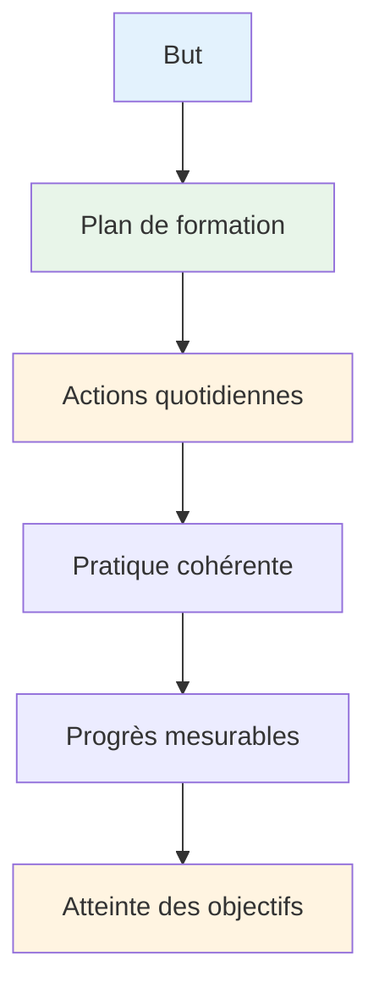

# Élaborer votre plan d&#39;entraînement
<AdBanner />

Des objectifs sans plan ne sont que des vœux pieux. Ce guide vous aide à transformer vos objectifs en un plan d&#39;entraînement structuré et efficace.

::: tip La grande idée
**Des objectifs sans plan ne sont que des vœux pieux.** Un plan d&#39;entraînement structuré transforme vos objectifs en actions quotidiennes qui, cumulées, se traduisent par de réels progrès.
:::

## Les 8 phases du développement autodirigé

### Phase 1 : Définir votre boussole (objectifs)
Vous avez déjà appris ce qu&#39;est un objectif SMART. Maintenant, hiérarchisez-le :

1. **Objectif à long terme** (1 à 2 ans) : Votre rêve
2. **Objectif annuel** : Objectif de cette année
3. **Objectifs trimestriels** : étapes clés sur 3 mois
4. **Objectifs mensuels** : Domaines d’intervention spécifiques
5. **Objectifs hebdomadaires** : Objectifs d’entraînement

### Phase 2 : Évaluer vos ressources

Avant de planifier, évaluez honnêtement ce que vous avez :

| Ressource | Questions à poser |
|----------|-----------------|
| **Temps** | Combien d&#39;heures par semaine pouvez-vous raisonnablement vous entraîner ? |
| **Emplacement** | Avez-vous accès à une piste en bon état ? Quel est l’état du revêtement ? |
| **Équipement** | Disposez-vous de boules de boules appropriées ? D’outils de mesure ? D’un équipement vidéo ? |
| **Connaissance** | Quels sont vos points forts et vos points faibles techniques ? |
| **État physique** | Des limitations ? Des points à améliorer ? |

Soyez honnête. Un plan réaliste vaut mieux qu&#39;un fantasme ambitieux.

### Phase 3 : Choisissez vos exercices

Choisissez des exercices qui contribuent directement à vos objectifs :

**Pour améliorer la précision du pointage :**
- Pointage précis vers les zones marquées
- exercices de variation de distance
- Pratique de différentes surfaces

**Pour améliorer son tir :**
- Échelle de tir (distances progressives)
- Tir d&#39;obstacle (arc de cercle forcé)
- entraînement à la cible mobile

**Pour le développement mental :**
- Exercices de routine avant le tir
- séances de visualisation
- Simulation de pression

**Équilibrez votre programme :**
- Travail technique (pointage, prise de vue)
- Entraînement mental (pleine conscience, visualisation)
- Conditionnement physique (équilibre, souplesse)
- Match play (application des compétences)

### Phase 4 : Établissez votre planning

Élaborez un planning hebdomadaire réaliste :

<AdInArticle />

| Jour | Matin | Après-midi | Soirée | Se concentrer |
|-----|---------|-----------|---------|-------|
| Lun | - | Technique : Pointage | mobilité légère | Précision |
| Mar | - | Technique : Prise de vue | - | Puissance/précision |
| Épouser | - | entraînement mental | - | pleine conscience |
| Jeu | - | Mixte : Scénarios de jeu | mobilité légère | Application |
| Ven | - | Technique : Faiblesse | - | Amélioration |
| Assis | Match play ou compétition | - | - | Performance |
| Soleil | Repos | Revue hebdomadaire | Planification | Récupération |

**Principes clés :**
- Priorisez l&#39;entraînement mental (il est souvent négligé).
- Inclure les jours de repos
- Équilibrer différentes compétences
- Laissez la flexibilité pour la vie

### Phase 5 : Se préparer aux obstacles

Les choses vont mal tourner. Préparez-vous-y.

| Risque | Probabilité | Impact | Plan de secours |
|------|------------|--------|-------------|
| Pénurie de temps | Haut | Moyen | Préparez une « session minimale » (20 min). |
| Intempéries | Moyen | Moyen | Visualisation intérieure, étude vidéo |
| Faible motivation | Haut | Moyen | Revenez au « pourquoi », fixez-vous des objectifs plus modestes, faites une pause |
| Blessure mineure | Moyen | Haut | Concentrez-vous sur l&#39;entraînement mental et les compétences non affectées. |
| Pas de partenaire d&#39;exercice | Moyen | Faible | Exercices individuels, auto-analyse vidéo |

### Phase 6 : Suivez vos progrès

Ce qui se mesure se gère.

**Tenez un journal d&#39;entraînement :**
- Date et durée
- Exercices terminés
- Scores/résultats
- Comment vous vous sentiez (énergie, concentration, fluidité)
- Notes techniques
- Météo/conditions

**Questions de révision hebdomadaires :**
- Ai-je terminé toutes les séances prévues ?
- Quels scores ai-je obtenus ?
- Qu&#39;est-ce qui vous a plu ? Qu&#39;est-ce qui a été difficile ?
- Des expériences de flow ?
- Que dois-je ajuster ?

### Phase 7 : Restez motivé

La motivation fluctue. Mettez en place des systèmes pour la maintenir :

**Motivation interne :**
- Connectez-vous à votre « pourquoi »
- Célébrez les petites victoires
- On constate une amélioration au fil du temps.
- Trouvez de la joie dans le processus

**Soutien externe :**
- partenaires d&#39;entraînement (même occasionnellement)
- Partager ses objectifs avec quelqu&#39;un
- Rejoignez les communautés en ligne
- Suivi des séries et de la régularité

**Quand la motivation chute :**
- Faites une séance minimale (mieux vaut quelque chose que rien du tout).
- Changez votre environnement
- Examinez vos progrès
- Se souvenir des succès passés
- Faites une pause planifiée si nécessaire

### Phase 8 : Révision et adaptation

Votre plan doit évoluer :

**Hebdomadaire :** Révision rapide, ajustements mineurs
**Mensuel :** Évaluer les progrès accomplis vers les objectifs mensuels et ajuster les priorités.
**Trimestriel :** Bilan important, définition des objectifs du trimestre suivant
**Annuellement :** Évaluation complète, nouveau plan annuel

**Questions à revoir :**
- Est-ce que je progresse vers mes objectifs ?
- Ma formation est-elle efficace ?
- Ai-je besoin d&#39;exercices différents ?
- Mes objectifs sont-ils toujours pertinents ?
- Qu&#39;ai-je appris ?

## Exemple de plan sur 8 semaines

**Objectif :** Améliorer la précision de tir de 15 %

| Semaine | Se concentrer | Séances clés |
|------|-------|--------------|
| 1 | Ligne de base | Test du niveau actuel, analyse vidéo |
| 2 | Technique | Identifier et traiter les problèmes clés |
| 3 | Répétition | entraînement au tir à volume élevé |
| 4 | Test | Évaluation à mi-parcours, ajuster |
| 5 | Variation | Différentes distances et angles |
| 6 | Pression | Ajouter des conséquences aux exercices |
| 7 | Intégration | Scénarios de type jeu |
| 8 | Test final | Amélioration des mesures |

## Points clés à retenir

> Planifiez votre travail, puis travaillez selon votre plan. Mais soyez prêt à vous adapter.

Le meilleur plan est celui que vous suivrez réellement. Commencez simplement, restez constant et ajustez-le au fur et à mesure que vous apprenez.

<AdBanner />
