# Objectifs SMART pour la pétanque

La méthode SMART transforme les souhaits vagues en objectifs concrets. Examinons chaque élément en détail, avec des exemples spécifiques pour la pétanque.

::: tip La grande idée
Des objectifs vagues mènent à des résultats vagues. Les objectifs SMART apportent clarté, action et progrès mesurables. Transformez votre désir de vous améliorer en objectifs précis et atteignables.
:::

```mermaid
graph LR
    A[Objectif vague] --> B[Aucune action claire]
    B --> C[Aucun progrès]

    D[Objectif SMART] --> E[Plan d&#39;action clair]
    E --> F[Progrès mesurables]
    F --> G[Réalisation]

    style A fill:#ffebee
    style C fill:#ffebee
    style D fill:#e8f5e9
    style G fill:#fff4e1
```

## S - Spécifique

Un objectif spécifique répond à ces questions :
- **Quel** est exactement ce que je souhaite réaliser ?
- **Où** cela se passera-t-il ?
- **Quels** aspects sont concernés ?

### Rendre les objectifs spécifiques

| Vague | Spécifique |
|-------|----------|
| «Améliorer ma façon de pointer» | « Améliorer ma précision de pointage sur les surfaces de gravier à des distances de 7 à 9 mètres » |
| « Renforcez-vous mentalement » | « Développer une routine d&#39;avant-lancer constante que j&#39;utilise pour chaque lancer » |
| « Gagnez plus de matchs » | « Gagner au moins 60 % de mes matchs compétitifs cette saison » |

### Liste de contrôle de spécificité
- [ ] Quelqu&#39;un d&#39;autre peut-il comprendre exactement ce que j&#39;essaie de faire ?
- [ ] Ai-je défini les conditions (distance, surface, situation) ?
- [ ] N&#39;existe-t-il qu&#39;une seule interprétation de cet objectif ?

## M - Mesurable

On ne peut gérer ce qu&#39;on ne peut mesurer. Des objectifs mesurables permettent de suivre les progrès et de savoir quand on a réussi.

### Méthodes de mesure des objectifs en pétanque

**Mesures quantitatives :**
- Points marqués lors des exercices (ex. : 24/30)
- Pourcentage de précision (ex. : taux de réussite de 75 %)
- Distance de la cible (par exemple, en moyenne 30 cm du cric)
- Cohérence (ex. : 3 séances réussies consécutives)

**Utilisation des exercices d&#39;entraînement comme mesures :**

| Percer | Ce que cela mesure | Exemple cible |
|-------|-----------------|----------------|
| Échelle de tir | Précision de tir sous pression | Atteignez 10 m en 30 boules. |
| Précision de pointage | Précision de pointage par rapport à la zone | 24/30 points |
| Variation de distance | Contrôle de profondeur | 80 % à moins de 50 cm |

### Suivi de vos mesures
Tenez un journal simple :
- Date
- Exercice
- Score/résultat
- Conditions (surface, météo)
- Notes

## A - Réalisable (mais difficile)

Les objectifs doivent vous pousser à vous dépasser sans être impossibles.

### Trouver le bon niveau

**Trop facile :** « Entraînez-vous une fois ce mois-ci »
- Pas de croissance, pas de motivation

**Trop difficile :** « Ne jamais rater un tir »
- L&#39;impossible engendre la frustration

**Parfait :** « Améliorez votre précision de tir de 15 % en 8 semaines »
- Difficile mais réaliste avec des efforts.

### Questions pour tester la faisabilité
- D&#39;autres personnes de mon niveau ont-elles réussi cela ?
- Ai-je le temps et les ressources nécessaires ?
- Est-ce que cela dépend (en grande partie) de moi ?
- Suis-je prêt à faire ce qu&#39;il faut ?

### Objectifs ambitieux
Il est normal d&#39;avoir des objectifs ambitieux à long terme. Assurez-vous simplement que vos objectifs à court terme constituent des étapes réalisables pour y parvenir.

## R - Pertinent

Vos objectifs doivent être en accord avec votre vision d&#39;ensemble.

### Questions de pertinence
- Cet objectif contribue-t-il à mon développement global ?
- Est-ce la priorité adéquate actuellement ?
- Est-ce compatible avec le temps et les ressources dont je dispose ?
- Suis-je réellement motivé par cet objectif ?

### Exemple : Vérification de la pertinence

**Situation :** Vous souhaitez participer à des compétitions nationales.

**Objectifs pertinents :**
- Améliorer la précision de tir (impact direct sur les résultats)
- Développer des routines mentales (utile dans les situations de pression)
- Augmenter la fréquence d&#39;entraînement (développe les compétences plus rapidement)

**Objectifs moins pertinents :**
- Apprenez les coups spéciaux (amusant, mais pas une priorité en compétition)
- Achetez des boules neuves coûteuses (le matériel n&#39;est pas votre facteur limitant).

## T - Limité dans le temps

Les échéances créent un sentiment d&#39;urgence et permettent de planifier.

### Définition des échéanciers

| Type d&#39;objectif | Délai typique |
|-----------|------------------|
| à long terme | 1 à 3 ans |
| Annuel | 12 mois |
| Trimestriel | 3 mois |
| Mensuel | 4 semaines |
| Hebdomadaire | 7 jours |
| Session | Pratique individuelle |

### Exemple de chronologie

**À long terme (2 ans) :** Se qualifier pour la sélection en équipe nationale

**Annuel :** Terminer dans le top 10 des classements régionaux

**Trimestriel (T1) :**
- Établir une routine d&#39;entraînement régulière
- Améliorer la précision de tir à 70 %

**Mensuel (janvier) :**
- Semaine 1 : Évaluation du niveau actuel, définition des valeurs de référence
- Semaines 2 et 3 : Se concentrer sur la technique de tir
- Semaine 4 : Tester et mesurer les progrès

**Hebdomadaire:**
- Lundi : Séance de tir technique
- Mercredi : Pointage et situations de jeu
- Vendredi : Entraînement mental et visualisation
- Week-end : Compétition ou entraînement en match

## Synthèse du tout

### Feuille de travail pour la définition des objectifs

**Mon objectif (première ébauche) :**
_________________________________

**Spécifique - Quoi exactement ?**
_________________________________

**Mesurable - Comment le saurai-je ?**
_________________________________

**Réalisable - Est-ce réaliste ?**
_________________________________

**Pertinent - Pourquoi est-ce important ?**
_________________________________

**Délai limité - Pour quand ?**
_________________________________

**Mon objectif SMART (version finale) :**
_________________________________

### Exemple complété

**Première ébauche :** « Améliorer mon tir »

**Version SMART :** « D’ici le 30 avril, j’atteindrai un score de 24/30 ou plus à l’exercice de tir à l’échelle (6-10 m avec obstacles) lors de trois séances d’entraînement consécutives, mesuré par mon journal d’entraînement. »

## Points clés à retenir

> Les objectifs SMART transforment les rêves en plans et les plans en résultats.

Prenez le temps de bien définir vos objectifs. Un objectif bien défini représente la moitié du chemin parcouru.

