# Éducation
<AdBanner />

Bienvenue au programme éducatif de l&#39;Académie de Pétanque. C&#39;est ici que les joueurs d&#39;élite apprennent à maîtriser l&#39;aspect mental du jeu.

::: tip Principe fondamental
Au plus haut niveau, **l&#39;entraînement mental devient plus important que l&#39;entraînement technique**. Le rapport s&#39;inverse avec la progression : les débutants ont besoin de 90 % de travail technique, les experts de 80 % de travail mental.
:::

## Pourquoi l&#39;entraînement mental est important

Au plus haut niveau, la technique n&#39;est que le point de départ. Les recherches montrent que le mental peut être aussi important que la technique physique dans les sports de précision comme la pétanque. La différence entre les bons joueurs et les grands joueurs se joue souvent dans leur mental.

> « Le sport est 100% mental. L&#39;esprit est le moteur de toutes les capacités physiques. »

## Votre parcours d&#39;apprentissage

Voici le parcours recommandé au sein de notre programme éducatif :

```mermaid
graph TD
    A[Début : Comprendre le flux] --> B[La Zone]
    B --> C[Pratique de la pleine conscience]
    C --> D[Définition d&#39;objectifs]
    D --> E[Force mentale]
    E --> F[Dynamique d&#39;équipe]

    B --> G[Tactique]
    G --> H[Méthodes de formation]

    C --> I[Nutrition]

    style A fill:#e1f5ff
    style B fill:#fff4e1
    style C fill:#fff4e1
    style D fill:#e8f5e9
    style E fill:#e8f5e9
    style F fill:#e8f5e9
    style G fill:#f3e5f5
    style H fill:#f3e5f5
    style I fill:#fce4ec
```

**Séquence recommandée :**
1. **Fondements :** Commencez par la méthode The Zone et la pleine conscience.
2. **Structure :** Ajouter la définition d&#39;objectifs et les méthodes d&#39;entraînement
3. **Compétition :** Développer sa force mentale et ses tactiques
4. **Jeu d&#39;équipe :** Maîtriser la dynamique d&#39;équipe
5. **Optimisation :** Ajuster avec précision grâce à la nutrition

## Nos parcours d&#39;apprentissage

### 🎯 [La Zone (État de flux)](/en/education/the-zone/)
Découvrez ce qu&#39;est réellement « l&#39;état de flow » et comment y accéder. Comprenez les mécanismes scientifiques qui le sous-tendent et découvrez des techniques pratiques pour donner le meilleur de vous-même au moment crucial.

### 🧘 [Pleine conscience](/en/education/mindfulness/)
Maîtrisez l&#39;art de la pleine conscience. Apprenez des techniques scientifiquement prouvées pour apaiser votre esprit, améliorer votre concentration et vous remettre rapidement de vos erreurs.

### 📊 [Fixation d&#39;objectifs](/en/education/goals/)
Élaborez une feuille de route pour votre développement. Apprenez la méthode SMART adaptée à la pétanque et créez un plan de formation efficace.

### 💪 [Force mentale](/en/education/mental-strength/)
Développez la force mentale nécessaire à la compétition. Apprenez à gérer la pression, à surmonter l&#39;anxiété et à mettre en place des routines qui favorisent des performances optimales.

### 🤝 [Dynamique d&#39;équipe](/en/education/team-player/)
Devenez le coéquipier que tout le monde a envie d&#39;avoir. Apprenez-en davantage sur la communication, la confiance et comment contribuer à une culture d&#39;équipe gagnante.

### ♟️ [Tactiques](/en/education/tactics/)
Adoptez une approche stratégique face à chaque situation. Apprenez à prendre des décisions basées sur les probabilités et à identifier les situations où il est judicieux de prendre des risques.

### 🏋️ [Méthodes de formation](/en/education/training/)
Entraînez-vous plus intelligemment, pas seulement plus intensément. Apprenez à structurer votre entraînement pour une progression optimale.

### 🥗 [Nutrition](/en/education/nutrition/)
Optimisez votre performance cérébrale pour une précision maximale. Apprenez à maintenir une énergie et une concentration stables tout au long de la compétition.

<AdInArticle />

## Le chemin de la technique au flow

À mesure que vous progressez en tant que joueur, votre ratio d&#39;entraînement s&#39;inverse : l&#39;entraînement mental devient plus important, et non moins :

| Niveau | Ratio (Technologie:Mental) | Objectif principal |
|-------|---------------------|-------------------|
| **Débutant** | 90 : 10 | Construisez la machine |
| **Intermédiaire** | 70 : 30 | Stabiliser la compétence |
| **Avancé** | 50 : 50 | Faites confiance à la machine |
| **Expert** | 20 : 80 | Liberté d&#39;expression |

On ne peut pas former un débutant comme un expert (il lui manque les connexions neuronales), et on ne peut pas former un expert comme un débutant (un volume technique élevé entraîne une réflexion excessive).

## Guide de référence rapide : Principes clés de chaque section

| Section | Principe fondamental | Points clés à retenir |
|---------|---------------|--------------|
| **La Zone** | Passer du mode analytique au mode automatique | « Il n’existe aucune technique permettant de toujours obtenir une boule parfaite. Mais il existe un état d’esprit où les boules parfaites deviennent naturelles. » |
| **Pleine conscience** | Choisissez où porter votre attention | « La pleine conscience ne consiste pas à vider son esprit. Il s&#39;agit de choisir où porter son attention. » |
| **Fixation d&#39;objectifs** | Concentrez-vous sur ce que vous contrôlez. | « Un objectif sans plan n&#39;est qu&#39;un vœu pieux. » |
| **Force mentale** | Réussir malgré le trac | « La force mentale ne consiste pas à éliminer le stress ou à ne jamais faire d&#39;erreurs. Il s&#39;agit de bien performer malgré tout. » |
| **Dynamique d&#39;équipe** | La confiance et la communication permettent de gagner des parties | « Les meilleures équipes ne sont pas toujours les plus talentueuses, ce sont celles qui jouent le mieux ensemble. » |
| **Tactique** | La prise de décision prime sur la technique | « Au plus haut niveau, la différence réside rarement dans la technique, mais dans la prise de décision. » |
| **Entraînement** | La qualité prime sur la quantité. | « Entraînez-vous plus intelligemment, pas seulement plus intensément. » |
| **Nutrition** | Énergie stable = performance stable | « Votre cerveau est un instrument de précision. Nourrissez-le en conséquence. » |

## Règles et points clés à retenir

::: details Cliquez pour afficher la liste complète des principes
Voici votre guide de référence rapide. Ajoutez cette section à vos favoris et consultez-la régulièrement.

### Les règles de la zone
1. **La règle du changement :** Analyser avant le cercle, exécuter pendant le cercle, observer après
2. **La règle de l&#39;inversion :** À mesure que le niveau de compétence augmente, l&#39;entraînement mental devient plus important que l&#39;entraînement technique.
3. **La règle de la confiance :** Votre esprit conscient planifie, votre subconscient exécute

### Règles de la pleine conscience
1. **La règle de la pleine conscience :** Observer sans juger
2. **La règle SOAS :** Arrêtez, observez, acceptez, laissez tomber (lâchez prise)
3. **La règle du présent :** Vous ne pouvez contrôler que cet instant, ce lancer

### Règles de fixation d&#39;objectifs
1. **La règle du contrôle :** Privilégiez les objectifs de processus (ce que vous contrôlez) aux objectifs de résultat.
2. **La règle SMART :** Les objectifs doivent être Spécifiques, Mesurables, Atteignables, Réalistes et Temporellement définis.
3. **La règle de la décomposition :** Les objectifs ambitieux nécessitent des étapes intermédiaires trimestrielles, mensuelles et hebdomadaires.

### Règles de la force mentale
1. **La règle de la routine :** Des routines d’avant-tir régulières favorisent des performances optimales
2. **La règle de réinitialisation :** Mettez en place une routine de réinitialisation de 10 secondes après chaque erreur.
3. **Le cercle vertueux de la confiance :** Meilleure préparation → Plus de confiance → Meilleure performance

### Règles tactiques
1. **La règle des probabilités :** Choisissez les lancers pour lesquels la probabilité de succès justifie le risque.
2. **La règle du contrôle du cochonnet :** L&#39;équipe qui contrôle la position du cochonnet a l&#39;avantage
3. **La règle de la distance :** À courte distance, il est préférable de tirer ; à longue distance, il est préférable de viser.
4. **La règle du style :** Forcez le jeu à adopter le style le plus performant de votre équipe.
5. **La règle de gestion de la boule :** Parfois, concéder 1 point est préférable à en risquer 3

### Règles de dynamique d&#39;équipe
1. **La règle de la communication :** Une communication claire et positive instaure la confiance
2. **La règle du soutien :** Votre réaction face aux erreurs de vos coéquipiers compte plus que votre niveau de compétence.
3. **La règle du rôle :** Connaissez votre rôle et exécutez-le pleinement.

### Règles d&#39;entraînement
1. **La règle de spécificité :** Entraînez ce que vous souhaitez améliorer
2. **La règle de la variation :** L’entraînement aléatoire est préférable à l’entraînement bloqué pour la sélection en compétition.
3. **La règle de la récupération :** Le repos est le moment où l’adaptation se produit.

### Règles nutritionnelles
1. **La règle de la stabilité :** Évitez les pics et les chutes de glycémie
2. **La règle de l&#39;hydratation :** Même une déshydratation de 2 % nuit aux performances
3. **Règle du timing :** Mangez 2 à 3 heures avant la compétition.
:::

## Commencez votre voyage

::: tip Point de départ recommandé
Commencez par [The Zone](/en/education/the-zone/) pour comprendre les fondements de la performance d&#39;élite, puis explorez [Mindfulness](/en/education/mindfulness/) pour des techniques pratiques que vous pouvez utiliser immédiatement.
:::

<AdBanner />
