# Développement des joueurs d&#39;élite

Bienvenue au programme éducatif de l&#39;Académie de Pétanque — le système complet de développement des joueurs basé sur 8 facteurs de performance.

::: tip Principe fondamental
Au plus haut niveau, **l&#39;entraînement mental prime sur l&#39;entraînement technique**. Remarquez que la technique a le poids le plus faible, non pas qu&#39;elle soit sans importance, mais parce qu&#39;au plus haut niveau, tous les athlètes possèdent une excellente technique. Ce qui fait la différence, c&#39;est le mental.
:::

---

## Le modèle de performance à 8 facteurs

Notre programme d&#39;études est structuré autour de 8 facteurs clés, pondérés en fonction de leur impact sur la performance d&#39;élite :

| Facteur | Poids | Description |
|--------|--------|-------------|
| 🧠 [**Jeu mental**](/fr/education/mental-game/) | **600** | Schémas de pensée, concentration, états de flow, dialogue intérieur |
| 🔥 [**Motivation**](/fr/education/motivation/) | **500** | Motivation, détermination, orientation vers les objectifs, persévérance |
| 😴 [**Sommeil et récupération**](/fr/education/sleep/) | **400** | Qualité du sommeil, récupération, repos avant la compétition |
| 🪞 [**Conscience de soi**](/fr/education/self-awareness/) | **400** | Perception précise de soi, reconnaissance des angles morts |
| 🥗 [**Nutrition**](/fr/education/nutrition/) | **300** | Stabilité de la glycémie, hydratation, alimentation pour la compétition |
| 🤝 [**Dynamique d&#39;équipe**](/fr/education/team-dynamics/) | **300** | Communication, confiance, clarté des rôles |
| 💆 [**Gestion de la tension**](/fr/education/tension/) | **300** | Tension physique, relaxation, contrôle de la respiration |
| 🎯 [**Technique**](/fr/education/technique/) | **100** | Mécanique physique, répertoire de lancers |

**Total : 2 900 points**

---

## Pourquoi ces poids ?

Les pondérations reflètent l&#39;**impact au niveau élite** :

```mermaid
graph LR
    subgraph "High Impact (1500)"
        A[🧠 Jeu mental <br/> 600]
        B[🔥 Motivation <br/> 500]
        C[😴 Dormir <br/> 400]
    end

    subgraph "Medium Impact (1000)"
        D[🪞 Conscience de soi <br/> 400]
        E[🥗 Nutrition <br/> 300]
        F[🤝 Dynamique d&#39;équipe <br/> 300]
    end

    subgraph "Foundation (400)"
        G[💆 Tension <br/> 300]
        H[🎯 Technique <br/> 100]
    end

    style A fill:#4CAF50,color:#fff
    style B fill:#4CAF50,color:#fff
    style C fill:#4CAF50,color:#fff
```

> « Aux championnats régionaux, la technique distingue les 50 % meilleurs. Aux championnats nationaux, tous les participants possèdent une technique d’élite. Ce qui fait la différence, c’est tout le reste. »

---

## Explorez chaque facteur

### 🧠 Jeu mental (600 points)

**Le facteur le plus déterminant pour la performance d&#39;élite.**

Votre capacité à gérer vos pensées, à maintenir votre concentration et à accéder à des états de flow.

- [La Zone](/fr/education/mental-game/the-zone/) — Comprendre et accéder aux états de flow
- [Force mentale](/fr/education/mental-game/mental-strength/) — Gérer la pression, routines d&#39;avant-tir
- [Pleine conscience](/fr/education/mental-game/mindfulness/) — Se concentrer sur le moment présent, se remettre de ses erreurs

### 🔥 Motivation (500 points)

**Qu&#39;est-ce qui vous pousse à vous améliorer jour après jour, année après année ?**

- [Fixation d&#39;objectifs](/fr/education/motivation/) — Objectifs SMART, priorité au processus plutôt qu&#39;au résultat
- [Psychologie de la motivation](/fr/education/motivation/motivation) — Motivation intrinsèque vs extrinsèque, Théorie de l&#39;autodétermination
- Maintenir sa motivation — Prévention du burn-out, gestion des plateaux

### 😴 Sommeil et récupération (400 points)

**Souvent négligé, mais ayant un impact considérable.**

La qualité du sommeil influe directement sur le temps de réaction, la prise de décision et la régulation émotionnelle.

- [La science du sommeil pour les athlètes](/fr/education/sleep/) — Pourquoi le sommeil est important pour les sports de précision
- [Instaurer de bonnes habitudes de sommeil](/fr/education/sleep/habits) — Conseils pratiques d&#39;hygiène du sommeil
- [Sommeil et compétition](/fr/education/sleep/competition) — Protocoles pré-événementiels, gestion des déplacements

### 🪞 Conscience de soi (400 points)

**On ne peut améliorer ce qu&#39;on ne voit pas.**

Une perception précise de soi-même permet une amélioration ciblée.

- [L&#39;avantage de la conscience de soi](/fr/education/self-awareness/) — Pourquoi la connaissance de soi est importante
- [Obtenir des commentaires](/fr/education/self-awareness/feedback) — Perspectives externes
- [Analyse vidéo](/fr/education/self-awareness/video) — Utiliser la vidéo pour la découverte de soi

### 🥗 Nutrition (300 points)

**Énergie stable = performance stable.**

Votre cerveau est un instrument de précision — alimentez-le en conséquence.

- [Optimisation des performances](/fr/education/nutrition/) — Glycémie, hydratation, nutrition de compétition

### 🤝 Dynamique d&#39;équipe (300 points)

**Les meilleures équipes ne sont pas toujours les plus talentueuses.**

La communication et la confiance l&#39;emportent souvent sur le talent individuel.

- [Être un bon coéquipier](/fr/education/team-dynamics/) — Culture et soutien d&#39;équipe
- Communication d&#39;équipe — Communication claire et positive

### 💆 Gestion du stress (300 points)

**La tension est l&#39;ennemie de la précision.**

On ne peut pas être à la fois tendu et précis.

- Comprendre la tension — Tension physique vs tension mentale
- [Techniques de relâchement](/fr/education/tension/techniques) — PMR, respiration, réinitialisations rapides
- [Gestion de la compétition](/fr/education/tension/competition) — Protocoles d&#39;avant-match et de pendant le match

### 🎯 Technique (100 points)

**Les fondations — nécessaires mais non suffisantes.**

Au plus haut niveau, la technique est acquise. Les éléments différenciateurs sont détaillés ci-dessus.

- [Aperçu technique](/fr/education/technique/) — Mécanique physique
- [Méthodes de formation](/fr/education/technique/training/) — Pratique délibérée
- [Tactiques](/fr/education/technique/tactics/) — Prise de décision stratégique

---

## Le parcours de développement

À mesure que vous progressez en tant que joueur, votre ratio d&#39;entraînement s&#39;inverse :

| Niveau | Ratio (Technologie:Mental) | Se concentrer |
|-------|---------------------|-------|
| **Débutant** | 90 : 10 | Construisez la machine |
| **Intermédiaire** | 70 : 30 | Stabiliser la compétence |
| **Avancé** | 50 : 50 | Faites confiance à la machine |
| **Expert** | 20 : 80 | Liberté d&#39;expression |

On ne peut pas former un débutant comme un expert (il lui manque les connexions neuronales), et on ne peut pas former un expert comme un débutant (un volume technique élevé entraîne une réflexion excessive).

---

## Référence rapide : Principes fondamentaux

::: details Cliquez pour afficher la liste complète des principes

### Règles du jeu mental
1. **La règle du changement :** Analyser avant le cercle, exécuter pendant le cercle, observer après
2. **La règle de la confiance :** Votre esprit conscient planifie, votre subconscient exécute
3. **La règle du présent :** Vous ne pouvez contrôler que cet instant, ce lancer

### Règles de motivation
1. **La règle de contrôle :** Privilégier les objectifs de processus aux objectifs de résultat
2. **La règle SMART :** Les objectifs doivent être Spécifiques, Mesurables, Atteignables, Réalistes et Temporellement définis.
3. **La règle intrinsèque :** La motivation interne perdure plus longtemps que les récompenses externes.

### Règles du sommeil
1. **La règle de la constance :** Se réveiller à la même heure tous les jours, même le week-end.
2. **La règle du tampon :** Routine de détente : au moins 60 minutes avant le coucher
3. **La règle de la compétition :** Dormez plus longtemps la semaine précédente, pas seulement la nuit précédant le match.

### Règles de conscience de soi
1. **La règle du feedback :** Recherchez activement les points de vue extérieurs
2. **La règle de la vidéo :** Ce que vous ressentez n’est pas la réalité — enregistrez-vous et regardez.
3. **La règle de l&#39;angle mort :** Un faible niveau de conscience de soi affecte toutes les autres évaluations.

### Règles nutritionnelles
1. **La règle de la stabilité :** Évitez les pics et les chutes de glycémie
2. **La règle de l&#39;hydratation :** Même une déshydratation de 2 % nuit aux performances
3. **Règle du timing :** Mangez 2 à 3 heures avant la compétition.

### Règles de dynamique d&#39;équipe
1. **La règle de la communication :** Une communication claire et positive instaure la confiance
2. **La règle du soutien :** Votre réaction face aux erreurs compte plus que vos compétences.
3. **La règle du rôle :** Connaissez votre rôle et exécutez-le pleinement.

### Règles de tension
1. **La règle du relâchement :** On ne peut pas être à la fois tendu et précis.
2. **La règle de Yerkes-Dodson :** Trouvez votre zone d’excitation optimale
3. **La règle de réinitialisation :** Réinitialisation de 10 secondes avant chaque lancer

### Règles techniques
1. **La règle de spécificité :** Entraînez ce que vous souhaitez améliorer
2. **La règle de la variation :** La pratique aléatoire est plus efficace que la pratique bloquée.
3. **La règle de la récupération :** Le repos est le moment où l’adaptation se produit.
:::

---

## Commencez votre voyage

::: tip Point de départ recommandé
Commencez par le [Mental Game](/fr/education/mental-game/) pour comprendre les fondements de la performance de haut niveau. Ensuite, explorez le [Sleep](/fr/education/sleep/) : c’est souvent l’amélioration la plus rentable pour les joueurs en développement.
:::

