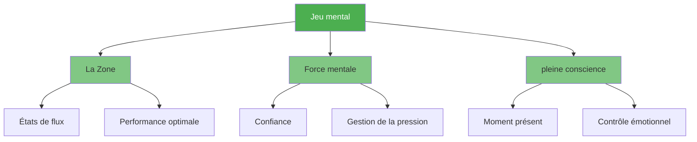

# Jeu mental

::: tip Le facteur le plus important
**Poids : 600 points** — Le mental a un impact majeur sur vos performances. Maîtrisez votre esprit, et le reste suivra.
:::

Le mental englobe tout ce qui se passe dans votre tête : vos pensées, votre concentration, votre confiance et votre dialogue intérieur. Les joueurs d’élite ne se contentent pas d’avoir une meilleure technique ; ils maîtrisent mieux leur état mental.

## Les trois piliers

### 🎯 [La Zone](/en/education/mental-game/the-zone/)
Accédez à l&#39;état de flow où la performance semble naturelle. Découvrez ce qui déclenche cet état et comment l&#39;atteindre de façon constante.

- [Introduction à The Zone](/en/education/mental-game/the-zone/)
- [Entraînement technique vs entraînement en situation de flow](/en/education/mental-game/the-zone/technical-vs-flow)
- [Entrer dans la zone](/en/education/mental-game/the-zone/entering-the-zone)

### 💪 [Force mentale](/en/education/mental-game/mental-strength/)
Développez votre résilience psychologique pour performer sous pression. Cultivez votre confiance en vous, apprenez à gérer les échecs et gardez votre sang-froid.

- [Développer sa force mentale](/en/education/mental-game/mental-strength/)
- [Gérer la pression](/en/education/mental-game/mental-strength/handling-pressure)
- [Routine d&#39;avant-tir](/en/education/mental-game/mental-strength/pre-shot-routine)

### 🧘 [Pleine conscience](/en/education/mental-game/mindfulness/)
Développez votre conscience du moment présent pour rester concentré et vous remettre rapidement de vos erreurs.

- [Introduction à la pleine conscience](/en/education/mental-game/mindfulness/)
- [Techniques de pleine conscience](/en/education/mental-game/mindfulness/techniques)
- [Pratique quotidienne](/en/education/mental-game/mindfulness/daily-practice)

## Pourquoi le mental est si important

| Aspect | Formation technique | Entraînement mental |
|--------|-------------------|-----------------|
| **En pratique** | Vous pouvez réussir le tir | Vous pouvez réussir le tir |
| **En compétition** | La technique peut échouer sous pression | Les compétences mentales permettent de maintenir la performance |
| **La différence** | L&#39;habileté physique est nécessaire | Le mental est un facteur multiplicateur. |

::: warning L&#39;erreur courante
La plupart des joueurs consacrent 90 % de leur temps à la technique et 10 % au mental. Les joueurs de haut niveau inversent souvent ce ratio une fois leurs fondamentaux bien maîtrisés.
:::

## Par où commencer ?

**Vous débutez dans l&#39;entraînement mental ?** Commencez par [The Zone](/en/education/mental-game/the-zone/) pour comprendre ce que signifie une performance optimale.

**Vous avez du mal à gérer la pression ?** Consultez [Mental Strength](/en/education/mental-game/mental-strength/) pour des techniques pratiques.

**Votre esprit vagabonde pendant les matchs ?** La [pleine conscience](/en/education/mental-game/mindfulness/) vous aidera à rester présent.

## Ressources connexes

- [Conscience de soi](/en/education/self-awareness/) — Apprenez à vous connaître pour progresser plus vite.
- Gestion de la tension — La relaxation physique favorise la clarté mentale
- [Outil d&#39;évaluation](/en/education/) — Évaluez votre préparation mentale et obtenez des recommandations personnalisées

