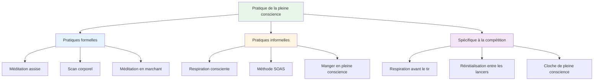

# Techniques de pleine conscience

Voici des techniques pratiques pour développer la pleine conscience. Commencez par une ou deux et progressez ensuite.

::: tip La grande idée
La pleine conscience est une compétence, pas un don. Comme viser ou tirer, elle s&#39;améliore avec la pratique. Commencez par de petits pas, soyez régulier, et les bienfaits se multiplieront avec le temps.
:::

## Pratiques formelles

Ce sont des séances dédiées à la pleine conscience – du temps spécifiquement réservé à cette pratique.

### Méditation assise

Les fondements de la pratique de la pleine conscience.

**Comment procéder :**
1. Asseyez-vous confortablement (sur une chaise ou par terre).
2. Fermez les yeux ou adoucissez votre regard
3. Concentrez-vous sur votre respiration : la sensation de l’air qui entre et qui sort.
4. Lorsque des pensées surgissent, observez-les sans jugement.
5. Ramenez doucement votre attention sur votre respiration.
6. Commencez par 5 minutes, puis augmentez progressivement jusqu&#39;à 15-20 minutes.

**Conseils:**
- Des pensées viendront, c&#39;est normal.
- Chaque fois que vous vous apercevez que vous vous êtes égaré et que vous revenez, vous développez cette compétence.
- Ne te juge pas pour avoir erré.
- La constance compte plus que la durée

### Scan corporel

Développe la conscience des sensations physiques.

**Comment procéder :**
1. Allongez-vous ou asseyez-vous confortablement
2. Commencez par vos pieds – remarquez toutes les sensations
3. Remontez lentement votre attention : chevilles, mollets, genoux…
4. Remarquez sans essayer de changer quoi que ce soit
5. Si vous ressentez des tensions, respirez profondément dans cette zone.
6. Continuez jusqu&#39;au sommet de votre tête
7. Cela prend 10 à 20 minutes

**Pour la pétanque :** Permet de repérer les tensions avant qu&#39;elles n&#39;affectent votre lancer.

### Méditation en marchant

La pleine conscience en mouvement – une excellente préparation pour les pistes.

**Comment procéder :**
1. Marchez lentement et délibérément
2. Ressentez chaque étape : soulever, déplacer, placer
3. Prenez conscience des sensations dans vos pieds et vos jambes.
4. Lorsque votre esprit s&#39;égare, revenez aux sensations physiques.
5. 5 à 10 minutes suffisent

## Pratiques informelles

Ces méthodes intègrent la pleine conscience aux activités quotidiennes.

### Respiration consciente

La technique la plus simple - disponible à tout moment.

**La pratique :**
- Prenez 3 respirations lentes et conscientes.
- Concentrez-vous entièrement sur la sensation
- Utilisez-le comme un bouton de réinitialisation tout au long de la journée.

**Quand l&#39;utiliser :**
- Avant d&#39;entrer dans le cercle
- Lorsque vous remarquez que le stress monte
- Entre les matchs
- Tout moment de transition

### La méthode SOAS

Votre outil pour gérer les moments difficiles.

| Étape | Action | Exemple |
|------|--------|---------|
| **Arrêt | Faites une pause, ne réagissez pas. | Ne vous découragez pas après un échec. |
| **Observer | Remarquez ce qui se passe | « Je suis frustré(e). J&#39;ai la mâchoire crispée. » |
| **Accepter | Reconnaître sans combattre | «Voilà comment je me sens en ce moment.» |
| **Glisser | Laisse tomber, passe à autre chose | Relâchez la tension, revenez au présent |

**Mettez cela en pratique au quotidien** pour que cela devienne automatique en compétition.

### Manger en pleine conscience

Une pratique étonnamment efficace.

**Comment procéder :**
- Prenez un repas sans distractions (ni téléphone, ni télévision).
- Observez les couleurs, les odeurs, les textures.
- Mâchez lentement, savourez pleinement.
- Remarquez quand vous êtes satisfait

**Pourquoi c&#39;est important :** Développe la capacité générale d&#39;attention.

### Conscience sensorielle

S&#39;engager pleinement avec son environnement.

**La technique 5-4-3-2-1 :**
- Remarquez 5 choses que vous pouvez voir
- Remarquez 4 choses que vous pouvez entendre
- Remarquez 3 choses que vous pouvez ressentir
- Remarquez deux choses que vous pouvez sentir.
- Remarquez une chose que vous pouvez goûter

**Utilisez ceci :** Lorsque votre esprit s’emballe avant un match important.

## Techniques spécifiques à la compétition

### L&#39;haleine avant le tir

Intégrez la respiration à votre routine :

1. Avant d&#39;entrer dans le cercle, prenez une respiration consciente.
2. Sentez vos pieds sur le sol
3. Laissez vos épaules se relâcher à l&#39;expiration.
4. Commencez ensuite votre routine

### Réinitialisation entre les lancers

Que faire en attendant :

- Observez où se porte votre attention.
- Si la question porte sur le score/résultat, accusez réception et revenez au présent.
- Concentrez-vous sur quelque chose de neutre (votre respiration, la sensation d&#39;une boule de bowling).
- Restez physiquement détendu

### La « cloche de la pleine conscience »

Utilisez des déclencheurs pour vous rappeler d&#39;être présent :

- Chaque fois que vous ramassez une boule
- Quand vous entendez le jack être jeté
- Lorsque vous entrez dans le cercle
- Quand un match se termine

Chaque déclencheur = une respiration consciente.

## Développer votre pratique

### Semaines 1 et 2 : Fondations
- 5 minutes de méditation assise par jour
- 3 respirations conscientes avant chaque repas
- Pratiquez SOAS une fois lorsqu&#39;un problème mineur survient.

### Semaines 3 et 4 : Expansion
- Augmentez la durée de la méditation à 10 minutes.
- Ajouter un scan corporel deux fois par semaine
- Utilisez les déclencheurs de cloches de pleine conscience dans la pratique

### Semaine 5 et suivantes : Intégration
- 15 à 20 minutes d&#39;entraînement quotidien
- Intégration complète dans la routine de pré-tir
- SOAS devient une réponse automatique aux erreurs

## Défis communs

| Défi | Solution |
|-----------|----------|
| «Je n&#39;arrive pas à arrêter de penser» | Vous n&#39;êtes pas censé le faire. Contentez-vous de le remarquer et de le renvoyer. |
| «Je n&#39;ai pas le temps» | On commence par 3 minutes. Chacun a 3 minutes. |
| «Je m&#39;endors» | Essayez de vous asseoir au lieu de vous allonger, ou pratiquez plus tôt dans la journée. |
| « Cela semble inutile » | La constance apporte des bénéfices. Ayez confiance dans le processus. |
| « J&#39;oublie de m&#39;entraîner » | Programmez un rappel quotidien. Associez-le à une habitude existante. |

## Points clés à retenir

> La pleine conscience est une compétence. Comme toute compétence, elle s&#39;améliore avec la pratique.

Commencez modestement. Soyez constant. Les bénéfices s&#39;accumulent avec le temps.

