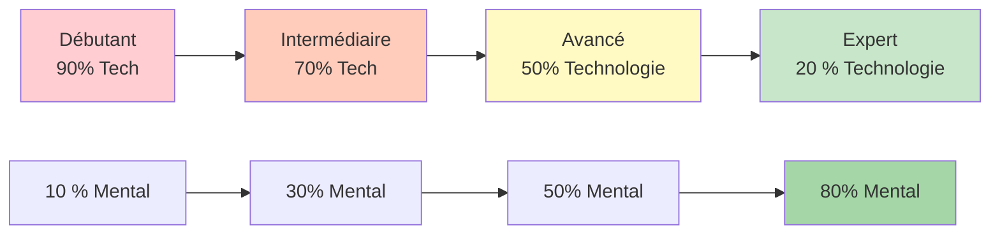

# Formation technique vs formation en situation réelle

Comprendre la différence entre l&#39;entraînement technique et l&#39;entraînement à la fluidité est essentiel pour le développement des athlètes de haut niveau. Les deux sont nécessaires, mais ils servent des objectifs différents et requièrent des approches différentes.

::: tip Le principe fondamental
**On ne peut pas former un débutant comme un expert** (il lui manque les voies neuronales), et **on ne peut pas former un expert comme un débutant** (un volume technique élevé entraîne une réflexion excessive).
:::

## Deux types de formation

::: info Formation technique (apprentissage explicite)
**Sujet principal :** Mécanique et forme
**Attention :** Mouvements corporels conscients
**Méthode :** Décomposition des compétences, pratique répétitive
**Idéal pour :** Apprendre de nouvelles compétences, corriger de mauvaises habitudes, acquérir des bases solides

**Exemple :** S&#39;entraîner 50 fois à son point de relâchement avec analyse vidéo
:::

::: info Formation en flux (apprentissage implicite)
**Priorité :** aux résultats, pas aux mécanismes
**Attention :** Laissez votre subconscient prendre le dessus
**Méthode :** Pratique variée, ludique, visualisation
**Idéal pour :** la préparation aux compétitions, le développement de la confiance en soi et l&#39;atteinte de performances optimales

**Exemple :** Jouer des matchs d&#39;entraînement sous pression, en se concentrant uniquement sur les cibles
:::

## Le modèle d&#39;inversion dynamique

Le ratio d&#39;entraînement optimal est inversement proportionnel à la compétence technique. À mesure que la technique se maîtrise, l&#39;entraînement mental devient plus important, et non moins.

### 1. Débutant (Stade cognitif)
- Vous réfléchissez consciemment à ce que vous devez faire.
- Les mouvements sont maladroits et demandent des efforts.
- Le cerveau est complètement saturé de mécanique.
- **Répartition :** 90 % Technique / 10 % Mental
- **Concentration mentale :** Plaisir, concentration externe (regarder la cible), visualisation simple.

### 2. Stade intermédiaire (stade associatif)
- Vous perfectionnez cette compétence par une réflexion moins consciente.
- Les mouvements deviennent plus fluides, les erreurs diminuent.
- Vous commencez à déceler vos propres erreurs.
- **Répartition :** 70 % Technique / 30 % Mental
- **Concentration mentale :** Élaborer votre routine de pré-performance (RPP)

### 3. Avancé (Seuil d&#39;autonomie)
- Cette compétence est en grande partie automatisée.
- Votre image de vous-même est souvent en retard par rapport à vos capacités physiques.
- La formation est axée sur la simulation de pression
- **Répartition :** 50 % technique / 50 % mental
- **Concentration mentale :** Visualisation, image de soi, gestion de l’anxiété

### 4. Expert (étape autonome)
- Les compétences techniques sont entièrement inconscientes.
- L&#39;attention consciente portée aux mécanismes perturbe les performances
- Le volume de maintenance est tout ce dont vous avez besoin techniquement.
- **Répartition :** 20 % Technique / 80 % Mental
- **Concentration mentale :** État de flow, stratégie, apaisement de l’esprit

## Tableau de progression

| Niveau | Technologie : Mentale | Objectif principal |
|-------|---------------|-------------------|
| Débutant | 90 : 10 | Construisez la machine |
| Intermédiaire | 70 : 30 | Stabiliser la compétence |
| Avancé | 50 : 50 | Faites confiance à la machine |
| Expert | 20 : 80 | Liberté d&#39;expression |

## Le piège de l&#39;expert

Pour les joueurs confirmés et experts, revenir à une approche trop technique est dangereux.

**Le problème :** Lorsqu’on automatise une compétence mais qu’on la surveille consciemment pendant la compétition, on sollicite l’esprit conscient et on court-circuite le subconscient. Cela provoque du stress et un blocage psychologique.

**Conclusion scientifique :** Le volume d’activité nécessaire au maintien d’une compétence est nettement inférieur (souvent de 1/3 à 1/9) à celui requis pour l’acquérir. Les experts ont besoin d’un minimum d’efforts techniques pour conserver leur savoir-faire.

**Exemple d&#39;élite :** Des champions comme Philippe Quintais et Dylan Rocher privilégient les scénarios tactiques et les moments critiques plutôt que les exercices mécaniques.

Signes que vous réfléchissez trop à votre technique :
- Paralysie par l&#39;analyse
- Performances irrégulières malgré une bonne technique
- Des résultats moins bons en compétition qu&#39;à l&#39;entraînement
- Sensation « mécanique » plutôt que fluide

## Comparaison des méthodes de formation

| Aspect | Formation technique | Formation Flow |
|--------|-------------------|---------------|
| **Type de pratique** | Bloqué (même compétence répétée) | Aléatoire (compétences variées) |
| **Retour** | Immédiat, détaillé | Retardé, axé sur les résultats |
| **Environnement** | Contrôlé, prévisible | Variable, comme un jeu |
| **État mental** | Analytique, conscient | Intuitif, automatique |
| **Meilleur moment** | Hors saison, développement des compétences | Avant la compétition, entretien |

## Entraînement bloqué vs aléatoire

**Exercice bloqué :** Répétez le même lancer 20 fois.
- On se sent productif (on constate une amélioration rapide).
- Idéal pour l&#39;apprentissage initial
- Mauvais pour la rétention à long terme

**Exercice aléatoire :** Variez la distance, la cible et le type de lancer
- Cela semble plus difficile (plus d&#39;erreurs)
- Meilleur pour les transferts en compétition
- Développe l&#39;adaptabilité et la prise de décision

## Conseils pratiques

### Pour les sessions techniques
1. Concentrez-vous sur UN aspect à la fois
2. Utiliser l&#39;analyse vidéo
3. Obtenez des commentaires d&#39;un entraîneur ou d&#39;un partenaire d&#39;entraînement
4. Acceptez que cela puisse paraître bizarre au début.
5. Privilégiez les séances plus courtes (la qualité à la quantité).

### Pour les séances de flow
1. Créer une pression similaire à celle d&#39;un jeu
2. Concentrez-vous sur la cible, pas sur votre corps.
3. Suivez votre routine pré-injection de façon constante.
4. N&#39;analysez pas pendant la session
5. Faites confiance à votre formation

## Le défi de l&#39;intégration

Le véritable savoir-faire réside dans la capacité à savoir quand utiliser chaque mode :

**Pendant un match de compétition :**
- Réflexion technique : JAMAIS pendant l&#39;exécution
- Mode flux : TOUJOURS lors du lancer

**Pendant l&#39;entraînement :**
- Sessions techniques : programmées et axées sur des points précis
- Séances de flow : simulation de jeu, pratique de la pression

## Exemple de solde hebdomadaire

| Jour | Type de session | Se concentrer |
|-----|-------------|-------|
| Lundi | Technique | Précision de pointage |
| Mardi | Technique | précision de tir |
| Mercredi | Couler | Entraînement mental, visualisation |
| Jeudi | Mixte | Scénarios de jeu axés sur le flux |
| Vendredi | Technique | Point faible |
| Samedi | Couler | Match play, simulation de compétition |
| Dimanche | Repos | Rétablissement, réflexion |

## Résumé : Règles d&#39;équilibre de l&#39;entraînement

::: tip Règle n° 1 : Adapter l&#39;entraînement au niveau
**Débutants (90/10) :** Construire la machine - se concentrer sur la technique
**Niveau intermédiaire (70/30) :** Stabiliser la compétence – ajouter un travail mental
**Avancé (50/50) :** Faites confiance à la machine - équilibrez les deux
**Expert (20/80) :** Liberté d&#39;exécution - principalement mentale
:::

::: tip Règle n° 2 : Entraînement bloqué vs aléatoire
**Exercice bloqué** (répéter le même lancer) : Idéal pour l’apprentissage initial, mais peu efficace pour la mémorisation.
**Entraînement aléatoire** (lancers variés) : Plus difficile à l’entraînement, meilleur en compétition
:::

::: tip Règle n° 3 : Le piège de l’expert
**Pour les experts :** Un volume technique élevé provoque une réflexion excessive et un blocage.
**Solution :** Maintenance technique minimale, entraînement mental maximal
:::

## Points clés à retenir

> On ne peut pas former un débutant comme un expert (il lui manque les voies neuronales nécessaires au travail mental), et on ne peut pas former un expert comme un débutant (un volume technique élevé provoque l&#39;épuisement professionnel et la suranalyse).

Le passage de la technique à la fluidité exige une inversion stratégique. Adaptez votre entraînement à votre stade de développement.

