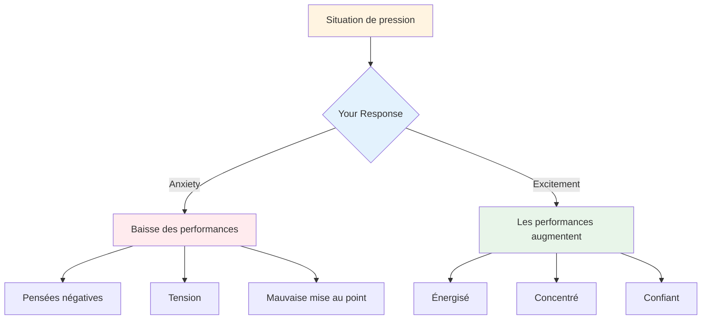

# Pression de manutention

La pression fait partie intégrante de la compétition. L&#39;objectif n&#39;est pas de l&#39;éliminer, c&#39;est impossible. L&#39;objectif est de bien performer malgré elle, voire de l&#39;utiliser à son avantage.

::: tip La grande idée
**La pression ne disparaît pas avec l&#39;expérience ; on apprend simplement à mieux la gérer.** Les meilleurs joueurs ne sont pas calmes ; ils savent utiliser leur excitation de manière productive.
:::

## Comprendre la pression

### Qu’est-ce qui crée de la pression ?
- Enjeux élevés (match important, lancer décisif)
- Être observé (par le public, les coéquipiers)
- Attentes (les vôtres et celles des autres)
- Incertitude (score serré, adversaires inconnus)
- Le temps (manque de temps, attente trop longue)

### Quels sont les effets de la pression sur votre corps ?
Lorsque vous ressentez une pression, votre corps réagit :
- Le rythme cardiaque augmente
- La respiration devient superficielle.
- Muscles tendus
- Les mains peuvent se serrer
- Le champ d&#39;action se restreint (parfois trop).

Votre corps se prépare à l&#39;action. Ce n&#39;est pas mauvais : c&#39;est de l&#39;énergie que vous pouvez utiliser.

## Pression de reconditionnement

### La pression comme source d&#39;excitation

Les sensations physiques de l&#39;anxiété et de l&#39;excitation sont presque identiques. La différence réside dans leur interprétation.

**Interprétation de l&#39;anxiété :** « Je suis nerveux, quelque chose de grave pourrait arriver. »
**Interprétation de l&#39;enthousiasme :** « Je suis plein d&#39;énergie, c&#39;est important pour moi. »

**Essayez ceci :** Lorsque vous ressentez de la pression, dites-vous : « Je suis enthousiaste » au lieu de « Je suis nerveux ».

### La pression comme privilège

Seuls les moments importants créent de la pression. Si vous la ressentez, c&#39;est que vous êtes dans une situation qui compte.

> « La pression est un privilège – elle n’est accordée qu’à ceux qui la méritent. » – Billie Jean King

## Techniques pour les moments de forte pression

### 1. Contrôle de la respiration

La respiration est le moyen le plus rapide de changer d&#39;état.

**La technique 4-7-8 :**
1. Inspirez pendant 4 secondes.
2. Tenir pendant 7 secondes
3. Expirez pendant 8 secondes.
4. Répéter 2 à 3 fois

**Réinitialisation rapide (dans le cercle) :**
- Une respiration lente et profonde
- Sentez vos pieds sur le sol
- Relâchez vos épaules à l&#39;expiration.

### 2. Enracinement physique

Connectez-vous à vos sensations physiques pour sortir de votre tête :
- Sentez le poids de la boule
- Sentez vos pieds sur le sol
- Serrez et relâchez votre main non lanceuse
- Redressez vos épaules

### 3. Rétrécissement du champ d&#39;application

Dans les moments de pression, concentrez-vous uniquement sur ce qui compte :
- Pas le score
- Pas le public
- Pas ce qui pourrait arriver
- Ce lancer, cette cible, cet instant précis

**Mots-clés :** « Ici. Maintenant. Ceci. »

### 4. Priorité au processus

Passer du résultat au processus :

**Orientation vers les résultats (crée une pression) :**
- «Je dois faire ça»
- «Si je rate, nous perdons.»
- « Tout le monde regarde »

**Concentration sur le processus (réduit la pression) :**
- « Suivez ma routine »
- &quot;Voir la cible&quot;
- «Faites confiance à mon entraînement»

### 5. La pression de la main gauche

Pour les joueurs droitiers, serrer la main gauche pendant 10 à 15 secondes :
- Active l&#39;hémisphère cérébral droit
- Calme la rumination analytique
- Permet d&#39;accéder à l&#39;exécution automatique

Utilisez ceci lorsque vous vous surprenez à trop réfléchir.

## Se préparer à la pression

### Simuler la pression en pratique

On ne peut pas gérer la pression de la compétition si on ne l&#39;a jamais expérimentée à l&#39;entraînement.

**Moyens de créer une pression à l&#39;entraînement :**
- Définir des conséquences (pompes pour les échecs, offrir un café au partenaire)
- Créer des scénarios « incontournables »
- S&#39;entraîner devant un public
- Pression temporelle (chronomètre)
- Fatigue (s&#39;entraîner en cas de fatigue)

### Visualisation

Répétez mentalement les situations de forte pression :
1. Fermez les yeux
2. Imaginez un scénario de pression en détail
3. Ressentez les sensations de pression
4. Vous vous voyez bien gérer la situation.
5. Exécutez avec succès dans votre esprit

Faites-le régulièrement, pas seulement avant les compétitions.

### Constituer un historique de pression

Notez les moments où vous avez bien géré la pression :
- Quelle était la situation ?
- Comment vous êtes-vous senti ?
- Qu&#39;est-ce que tu as fait?
- Quel a été le résultat ?

Relisez ceci avant les compétitions pour vous rappeler : « J&#39;ai déjà fait ça. »

## Pendant la compétition

### Avant la poussée de pression
1. Prenez du recul, respirez.
2. Rappelez-vous votre routine
3. Concentrez-vous sur le processus, pas sur le résultat.
4. Utilisez votre mot déclencheur ou votre signal.

### Dans le cercle
1. Effectuez votre routine exactement comme vous l&#39;avez pratiquée.
2. Concentrez-vous sur l&#39;extérieur (la cible, pas le corps).
3. Faites confiance à votre formation
4. Libérer sans hésitation

### Après le lancer
- Acceptez le résultat sans jugement.
- Si tout se passe bien : bref accusé de réception, passer à autre chose
- En cas d&#39;échec : méthode SOAS, réinitialisation pour le prochain jet

## Erreurs courantes liées à la pression

| Erreur | Meilleure approche |
|---------|----------------|
| Se précipiter | Ralentissez, utilisez la routine complète |
| Trop réfléchir | orientation externe, formation à la confiance |
| Changement de technique | Restez fidèle à ce que vous connaissez. |
| Se concentrer sur le résultat | Concentrez-vous sur le processus |
| Combattre les nerfs | Acceptez et utilisez l&#39;énergie |

## Points clés à retenir

> La pression ne disparaît pas avec l&#39;expérience. On apprend simplement à mieux la gérer.

Les meilleurs joueurs ne sont pas calmes – ils savent utiliser leur excitation de manière productive.

