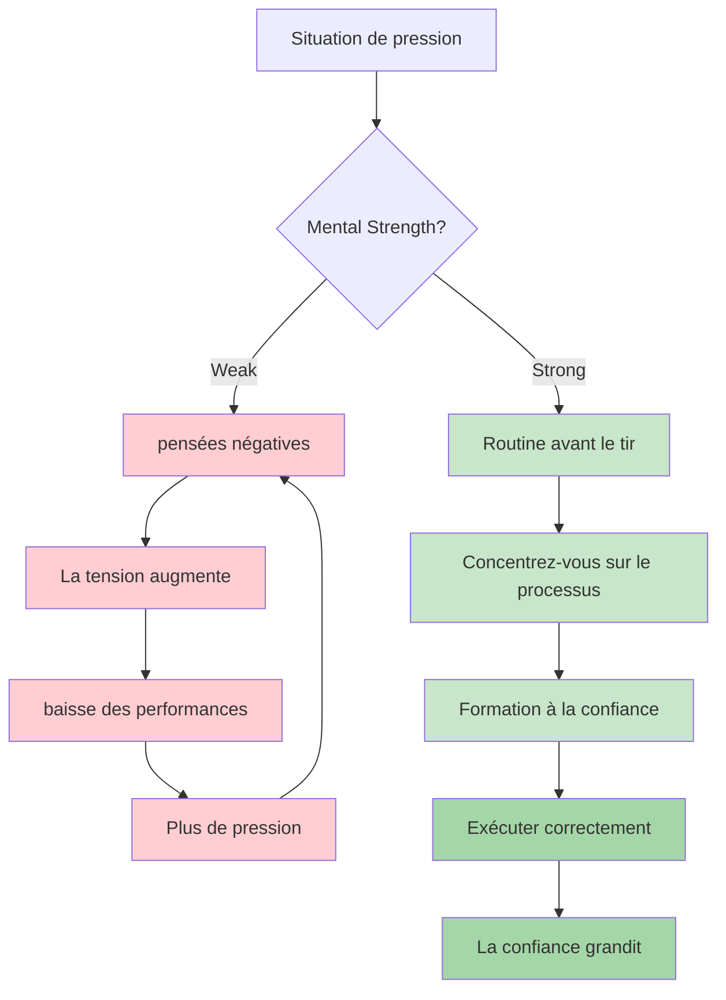
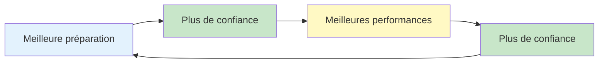

# Force mentale

La force mentale est ce qui distingue les joueurs performants à l&#39;entraînement de ceux qui excellent en compétition. C&#39;est la capacité à gérer la pression, à se relever après un échec et à maintenir sa concentration tout au long des compétitions de longue durée.

::: tip Le principe fondamental
La force mentale ne consiste pas à éliminer le stress ou à ne jamais faire d&#39;erreurs. Il s&#39;agit de bien performer malgré tout. Vous ne pouvez pas contrôler ce qui arrive. Vous pouvez contrôler votre réaction.
:::

## Qu&#39;est-ce que la force mentale ?

La force mentale comprend :
- **Confiance :** Croire en ses capacités
- **Concentration :** Maintenir son attention sur l&#39;essentiel
- **Résilience :** Se relever de ses erreurs
- **Maîtrise de soi :** Rester calme sous pression
- **Motivation :** Maintenir ses efforts dans le temps

Ce ne sont pas des traits fixes, ce sont des compétences que vous pouvez développer.

## Les exigences mentales de la pétanque

La pétanque présente des défis mentaux uniques :

| Défi | Pourquoi c&#39;est difficile |
|-----------|--------------|
| Temps entre les lancers | Possibilité de pensées négatives |
| Résultats visibles | Tout le monde voit tes erreurs |
| Format d&#39;équipe | Pression pour ne pas décevoir ses partenaires |
| Compétitions longues | fatigue mentale sur plusieurs heures |
| Matchs serrés | Enjeux importants sur un seul lancer |
| Les fluctuations de momentum | Montagnes russes émotionnelles |

## Développer sa force mentale

### 1. Développer la confiance en soi

La confiance vient de :
- **Préparation :** Savoir que vous avez effectué le travail
- **Succès passés :** Se souvenir des moments où vous avez bien performé
- **Discours intérieur positif :** La façon dont vous vous parlez à vous-même
- **Langage corporel :** Se tenir droit, se déplacer avec assurance

**Des outils pour renforcer la confiance en soi :**
- Tenez un journal de réussite
- Visualisez les performances réussies
- Préparez-vous minutieusement aux compétitions.
- Adoptez une posture corporelle assurée (cela influence votre état d&#39;esprit).

### 2. Maîtrisez votre dialogue intérieur

La voix dans votre tête compte énormément.

**Discours intérieur destructeur :**
- « Ça me manque toujours »
- «Je vais m&#39;étouffer»
- « Mes coéquipiers comptent sur moi » (pression)
- « C&#39;était terrible. »

**Discours intérieur constructif :**
- « J&#39;ai déjà fait ce lancer. »
- «Faites confiance à mon entraînement»
- &quot;Un lancer à la fois&quot;
- &quot;Prochain lancer, nouveau départ&quot;

**Modifier votre discours intérieur :**
1. Prenez conscience de ce que vous vous dites à vous-même.
2. Contester les affirmations négatives
3. Remplacer par des alternatives réalistes et utiles
4. Entraînez-vous jusqu&#39;à ce que cela devienne automatique.

### 3. Renforcer la résilience

La résilience est la capacité à se remettre des échecs.

**L&#39;état d&#39;esprit résilient :**
- Les erreurs sont des informations, pas des échecs
- Un mauvais lancer ne vous définit pas.
- Les revers sont temporaires
- Vous pouvez toujours bien réagir à ce qui se passe.

**Renforcer la résilience :**
- S&#39;entraîner à corriger ses erreurs
- Utilisez la méthode SOAS (Stop, Observe, Accept, Slip)
- Concentrez-vous sur la réaction, pas sur l&#39;événement.
- Apprenez à oublier rapidement les mauvais lancers.

### 4. Gérez votre énergie

La force mentale nécessite une gestion de l&#39;énergie :

**Énergie physique :**
- Bien dormir avant les compétitions
- Mangez correctement (glycémie stable)
- Restez hydraté
- Passez d&#39;un jeu à l&#39;autre (ne restez pas assis trop longtemps).

**Énergie mentale :**
- Faites des pauses dès que possible.
- Ne suranalysez pas entre les lancers.
- Réservez votre concentration intense pour les moments où vous en aurez besoin.
- Ayez des routines de récupération

## La boucle confiance-compétence

::: info Le cycle positif

**Construisez-le en suivant les étapes suivantes :**
1. Pratiques de qualité (développent les compétences)
2. Suivi des progrès (renforce la confiance)
3. Des performances réussies (renforcent les deux)
:::

## Dans cette section

- **[Gérer la pression](/en/education/mental-strength/handling-pressure)** - Techniques pour les situations à haut risque
- **[Routine d&#39;avant-tir](/en/education/mental-strength/pre-shot-routine)** - Développer son déclencheur de performance

## Résumé : Règles de la force mentale

::: tip Règle n° 1 : La règle de routine
**Des routines de préparation au tir régulières permettent d&#39;atteindre des performances optimales.**
Même routine à chaque fois = déclencheur fiable pour l&#39;état de flux
:::

::: tip Règle n° 2 : La règle de réinitialisation
**Mettez en place une routine de réinitialisation de 10 secondes après chaque erreur.**
Réinitialisation physique (respiration profonde, rotation des épaules) + réinitialisation mentale (méthode SOAS)
:::

::: tip Règle n° 3 : La règle de la boucle de confiance
**Meilleure préparation → Plus de confiance → Meilleure performance.**
Ce cercle vertueux fonctionne dans les deux sens. Construisez-le grâce à une pratique de qualité et au suivi des progrès.
:::

::: tip Règle n°4 : La règle du dialogue intérieur
**Parlez-vous à vous-même comme vous parleriez à un coéquipier.**
Soutien, constructivité, axé sur ce qu&#39;il faut faire (et non sur ce qui a mal tourné)
:::

::: tip Règle n° 5 : La règle de gestion de l&#39;énergie
**Réservez votre concentration intense pour les moments où vous en aurez besoin.**
Ne réfléchissez pas trop entre les lancers. Conservez votre énergie mentale pour l&#39;exécution.
:::

## Points clés à retenir

> La force mentale ne consiste pas à éliminer le stress ou à ne jamais commettre d&#39;erreurs. Il s&#39;agit de bien performer malgré tout.

Vous ne pouvez pas contrôler ce qui arrive. Vous pouvez contrôler votre réaction.

