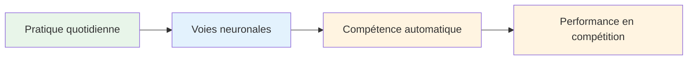
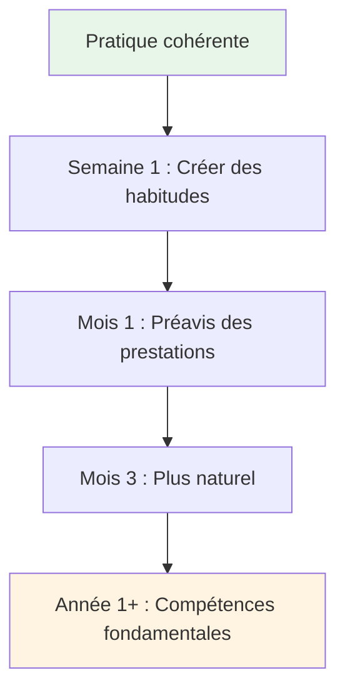

# Développer une pratique quotidienne de la pleine conscience
<AdBanner />

Les bienfaits de la pleine conscience proviennent d&#39;une pratique régulière. Voici comment l&#39;intégrer à votre vie.

::: tip La grande idée
**La régularité est plus efficace que l&#39;intensité.** Cinq minutes par jour valent mieux qu&#39;une heure une fois par semaine. Commencez petit à petit, soyez régulier, et les bienfaits se cumuleront au fil du temps.
:::

## Pourquoi la pratique quotidienne est importante

::: info La pleine conscience est comparable à la forme physique
- ❌ On ne peut pas se mettre en forme en une seule séance de gym
- ✅ Une pratique régulière engendre un changement durable
- ✅ Les effets s&#39;accumulent avec le temps
- ✅ Cela devient plus facile avec la régularité.
:::

::: tip Fondé sur la recherche
Des études montrent que même **3 minutes par jour** apportent des bienfaits mesurables. Mais il faut le faire régulièrement.
:::

## Créer sa routine

### Étape 1 : Choisissez votre heure

Choisissez un horaire régulier qui convienne à votre vie :

| Temps | Avantages | Considérations |
|------|------------|----------------|
| **Matin** | Donne le ton à la journée, moins d&#39;interruptions | Il faut se réveiller plus tôt |
| **Midi** | Cela permet de faire une pause dans la journée et de se recentrer. | Risque d&#39;oubli, conflits d&#39;horaire |
| **Soirée** | Détendez-vous, réfléchissez à votre journée. | Peut être fatigué, moins alerte |
| **Avant l&#39;entraînement** | Connexion directe à la pétanque | Cela dépend du programme d&#39;entraînement |

**Meilleure approche :** Liez-le à une habitude existante (après le café, avant le déjeuner, etc.).

### Étape 2 : Commencez petit

Ne visez pas 30 minutes le premier jour.

**Progression recommandée :**
- Semaines 1 et 2 : 3 à 5 minutes
- Semaines 3 et 4 : 5 à 10 minutes
- Mois 2 : 10 à 15 minutes
- Mois 3 et suivants : 15 à 20 minutes

Il vaut mieux faire 5 minutes par jour que 30 minutes une fois par semaine.

### Étape 3 : Créez votre espace

Vous n&#39;avez pas besoin d&#39;une salle de méditation, mais avoir un endroit régulier est utile :
- Un endroit calme (ou utilisez des écouteurs)
- Sièges confortables
- Distractions minimales
- Si possible, toujours au même endroit.

### Étape 4 : Supprimer les barrières

<AdInArticle />

Facilitez la pratique :
- Mettez votre téléphone en mode silencieux.
- Dites à votre famille/vos colocataires de ne pas interrompre
- Préparez tout (coussin, minuteur).
- N’attendez pas les conditions « parfaites ».

## Exemples d&#39;horaires quotidiens

### Pratique minimale (5 minutes)
- Matin : 3 minutes de respiration consciente
- Tout au long de la journée : 3 moments de pleine conscience
- Soirée : 2 minutes de conscience corporelle avant de dormir

### Exercice standard (15 minutes)
- Matin : 10 minutes de méditation assise
- Midi : 2 minutes de respiration consciente
- Soirée : 3 minutes de scan corporel

### Pratique intensive (30 minutes)
- Matin : 15 minutes de méditation assise
- Midi : 5 minutes de méditation en marchant
- Soirée : 10 minutes de scan corporel
- De plus : Manger en pleine conscience lors d&#39;un repas

## Intégration avec l&#39;entraînement à la pétanque

### Avant l&#39;entraînement
- 5 minutes de méditation assise
- Définissez une intention pour la séance
- Scannez votre corps pour détecter toute tension.

### Pendant l&#39;entraînement
- Utilisez votre routine pré-injection comme exercice de pleine conscience
- Appliquer SOAS après les erreurs
- Restez concentré entre les lancers

### Après l&#39;entraînement
- 3 minutes de réflexion (sans jugement)
- Notez les moments de fluidité.
- Respiration consciente pour la transition vers la sortie

## Suivi de votre pratique

Le suivi permet de maintenir la cohérence :

### Journal simple
| Date | Durée | Taper | Notes |
|------|----------|------|-------|
| Lun | 10 min | Assis | L&#39;esprit très occupé |
| Mar | 10 min | Assis | Plus calme aujourd&#39;hui |
| Épouser | 5 min | scan corporel | Tension ressentie dans les épaules |

### Que suivre
- Avez-vous pratiqué ? (Oui/Non)
- Combien de temps?
- De quel type ?
- Brève note sur l&#39;expérience (facultatif)

### Applications utiles
- Headspace
- Calme
- Minuteur Insight
- Suivi des habitudes simples

## Surmonter les obstacles courants

### «Je n&#39;ai pas le temps»
- Vous avez 3 minutes
- Il s&#39;agit de priorité, pas de temps.
- Essayez de créer des liens vers des activités existantes

### « J&#39;oublie sans cesse »
- Programmer une alarme quotidienne
- Lien avec une habitude existante
- Placez un rappel visuel à un endroit où vous le verrez.

### «Je ne m&#39;y prends pas bien»
- Il n&#39;y a pas de « bonne » façon
- Si vous êtes attentif, vous le faites.
- L&#39;esprit vagabonde est normal et attendu.

### «Je ne vois pas de résultats»
- Les bénéfices sont subtils au début.
- Tenez un journal pour noter les changements au fil du temps
- Faites confiance à la recherche : ça marche.

### « C&#39;est ennuyeux »
- L&#39;ennui n&#39;est qu&#39;une autre expérience à observer.
- Essayez différentes techniques
- N&#39;oubliez pas pourquoi vous le faites.

## Signes de progrès

Vous ne remarquerez peut-être pas de changements spectaculaires, mais soyez attentif à :
- Se reprendre lorsqu&#39;on a l&#39;esprit qui vagabonde (plus rapidement)
- Se remettre plus rapidement de la frustration
- Détecter les tensions avant qu&#39;elles ne s&#39;installent
- Se sentir plus présent pendant les jeux
- Un meilleur sommeil
- Moins réactif aux mauvais lancers

## Le jeu à long terme

La pleine conscience est une pratique qui dure toute la vie. Les athlètes de haut niveau affirment souvent que c&#39;est la compétence la plus précieuse qu&#39;ils aient développée.

**Mois 1 :** Instaurer l&#39;habitude
**Mois 2-3 :** On commence à constater les bienfaits
**Mois 4 à 6 :** Devenir plus naturel
**Année 1 et suivantes :** Une partie fondamentale de votre identité

## Points clés à retenir

> La régularité est plus importante que l&#39;intensité. Cinq minutes par jour valent mieux qu&#39;une heure une fois par semaine.

Commencez dès aujourd&#39;hui. Commencez petit. Persévérez.

<AdBanner />
