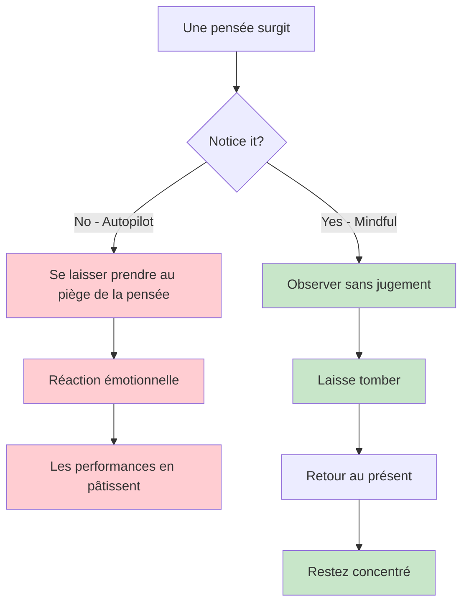
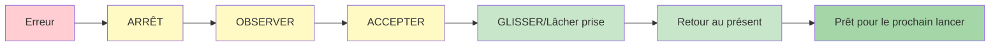

# La pleine conscience pour les joueurs de pétanque
<AdBanner />

La pleine conscience est l&#39;un des outils les plus puissants à la disposition des athlètes. Elle n&#39;a rien de mystique ni de compliqué : il s&#39;agit simplement de porter son attention sur le moment présent sans jugement.

::: tip Le principe fondamental
**La pleine conscience ne consiste pas à vider son esprit. Il s&#39;agit de choisir où porter son attention.** On ne peut empêcher les pensées d&#39;apparaître, mais on peut choisir de ne pas les suivre.
:::

## Qu&#39;est-ce que la pleine conscience ?

La pleine conscience signifie être pleinement présent et conscient de :
- Où vous êtes
- Ce que vous faites
- Comment vous vous sentez

…sans être submergé par ce qui se passe autour de vous ni y réagir de manière excessive.

Pour les joueurs de pétanque, cela se traduit par :
- Être pleinement présent à chaque lancer
- Observer ses pensées sans se laisser emporter par elles
- Se remettre rapidement de ses erreurs
- Garder son calme sous pression

## La science derrière tout ça

La pleine conscience n&#39;est pas qu&#39;une philosophie, elle est étayée par des recherches solides :

### Effets sur votre cerveau
- **Réduit l&#39;activité de l&#39;amygdale** (le système d&#39;alarme de votre cerveau)
- **Renforce le cortex préfrontal** (prise de décision et concentration) – ce qui vous aide à penser clairement lors de la planification.
- **Améliore votre capacité à apaiser votre esprit** lorsque nécessaire – essentiel pour accéder à l&#39;état de flow pendant l&#39;exécution
- **Améliore les connexions** entre les régions du cerveau
- **Crée des changements structurels durables** grâce à une pratique régulière

### Effets sur la performance
| Avantage | Comment cela améliore votre jeu |
|---------|----------------------|
| Réduction du stress | Cortisol plus faible, mains plus sûres |
| Meilleure concentration | Moins de distractions, des décisions plus claires |
| Contrôle émotionnel | Ne laissez pas les mauvais lancers s&#39;enchaîner. |
| Récupération plus rapide | Se relever rapidement de ses erreurs |
| Amélioration du sommeil | Un meilleur repos, de meilleures performances |

## Pourquoi les joueurs de pétanque ont besoin de pleine conscience

La pétanque présente des défis mentaux uniques :

1. **Temps entre les lancers** - Beaucoup d&#39;occasions pour des pensées négatives
2. **Erreurs visibles** - Tout le monde voit vos erreurs.
3. **Pression d&#39;équipe** - Votre lancer affecte vos partenaires
4. **Compétitions longues** - Fatigue mentale sur plusieurs heures
5. **Matchs serrés** - Forte pression dans les moments décisifs

La pleine conscience vous aide à gérer tout cela.

## La compétence fondamentale : la conscience sans jugement

Le mot clé est « sans jugement ».

<AdInArticle />

::: danger Pensée critique (Ajoute un poids émotionnel)
❌ « C&#39;était un lancer catastrophique »
❌ « Ça me manque toujours »
❌ « Mes coéquipiers doivent être frustrés »

**Résultat :** Spirale d’émotions négatives, tensions, baisse des performances
:::

::: tip Conscience sans jugement (Se contente d&#39;observer)
✅ « Le lancer est passé à gauche de la cible »
✅ « Je remarque que je suis tendu(e) »
✅ « Mon esprit vagabonde vers la partition »

**Résultat :** Observation claire, récupération rapide, maintien de la concentration
:::

**Quelle est la différence ?** Le jugement alourdit les émotions et déclenche des réactions. La pleine conscience, elle, se contente d’observer et permet de répondre avec discernement.

## Commencer

Vous n&#39;avez pas besoin de méditer pendant des heures. Commencez par ces pratiques simples :

### 1. Respiration consciente (2 minutes)
- Installez-vous confortablement
- Concentrez-vous sur votre respiration.
- Lorsque votre esprit s&#39;égare (cela arrivera), revenez doucement à votre respiration.
- Pas de jugement sur le fait de se promener - revenez simplement

### 2. Scan corporel (5 minutes)
- Prenez conscience des sensations dans vos pieds
- Déplacez lentement votre attention vers le haut de votre corps.
- Observez simplement, sans essayer de changer quoi que ce soit.
- Repérez les zones de tension sans les combattre.

### 3. Moments de pleine conscience
- Choisissez une activité quotidienne (boire du café, marcher)
- Faites-le en y consacrant toute votre attention.
- Prenez conscience de toutes les sensations impliquées.
- Lorsque votre esprit s&#39;égare, revenez à l&#39;activité.

## La pleine conscience en compétition

### Avant le match
- Prenez 2 à 3 minutes pour respirer consciemment.
- Définissez une intention quant à la manière dont vous souhaitez jouer (non pas le résultat, mais le processus).
- Observez toute nervosité sans chercher à la faire disparaître.

### Pendant le match
- Utilisez votre routine d&#39;avant-photo comme un point d&#39;ancrage pour la pleine conscience
- Entre deux lancers, ramenez votre attention au présent.
- Observez vos pensées concernant le score ou le résultat, puis laissez-les passer.

### Après les erreurs

::: warning La méthode SOAS (votre outil de réinitialisation)
**S**stop - Faites une pause avant de réagir
**Observer** - Que s&#39;est-il passé ? Que ressens-je ?
**Accepter** - C&#39;est arrivé. C&#39;est terminé.
**Lâcher prise** - Relâchez-vous, revenez au présent

**Temps nécessaire :** 10 secondes
**Utilisez-le :** Après chaque erreur, chaque mauvais rebond ou chaque moment frustrant
:::

## Dans cette section

- **[Techniques](/en/education/mindfulness/techniques)** - Exercices pratiques que vous pouvez utiliser
- **[Pratique quotidienne](/en/education/mindfulness/daily-practice)** - Intégrer la pleine conscience dans votre vie

## Résumé : Règles de la pleine conscience

::: tip Règle n° 1 : La règle de la sensibilisation
**Observez sans juger.**
Observez vos pensées et vos sentiments sans les qualifier de bons ou de mauvais.
:::

::: tip Règle n° 2 : La règle SOAS
**Arrêtez-vous, observez, acceptez, laissez aller (lâchez prise).**
Votre réinitialisation de 10 secondes après les erreurs. Utilisez-la systématiquement.
:::

::: tip Règle n° 3 : La règle du présent
**Vous ne pouvez contrôler que cet instant, ce lancer.**
Les tentatives passées sont terminées. Les tentatives futures n&#39;existent pas encore. Sois présent.
:::

::: tip Règle n° 4 : La règle de pratique
**Commencez petit à petit : 2 à 5 minutes par jour.**
La régularité est plus importante que la durée. La pratique quotidienne permet de développer ses compétences.
:::

## Points clés à retenir

> La pleine conscience ne consiste pas à faire le vide dans son esprit. Il s&#39;agit de choisir où porter son attention.

On ne peut empêcher les pensées de surgir. Mais on peut choisir de ne pas se laisser entraîner dans leurs méandres.

<AdBanner />
