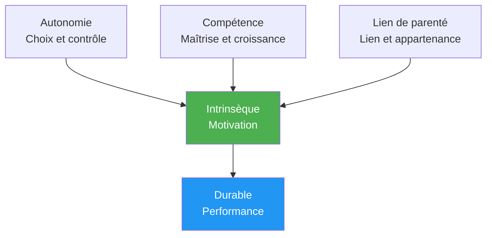

# Psychologie de la motivation

Comprendre POURQUOI vous êtes motivé – et pas seulement le fait que vous l&#39;êtes – vous aide à développer une motivation durable qui ne dépend pas des résultats.

---

## Motivation intrinsèque vs. motivation extrinsèque

### Motivation extrinsèque

Motivation stimulée par des récompenses ou des pressions externes :

| Source | Exemple |
|--------|---------|
| **Trophées/médailles** | «Je veux gagner le championnat» |
| **Classements** | « Je veux être dans le top 10 de ma région. » |
| **Reconnaissance** | « Je veux que les autres me voient comme un bon joueur. » |
| **Évitez les critiques** | «Je ne veux pas décevoir mon équipe.» |
| **Financier** | «Je veux gagner un prix.» |

**Caractéristiques:**
- Peut fournir une forte motivation initiale
- Diminue souvent avec le temps
- Cela dépend de facteurs indépendants de votre volonté.
- Peut nuire au plaisir

### Motivation intrinsèque

Motivation tirée de l&#39;activité elle-même :

| Source | Exemple |
|--------|---------|
| **Maîtrise** | « J&#39;adore la sensation de progresser » |
| **Couler** | « Le temps disparaît quand je joue » |
| **Défi** | « J&#39;aime me confronter aux problèmes. » |
| **Expression** | « La pétanque me permet d&#39;exprimer qui je suis. » |
| **Joie** | « J&#39;adore tout simplement jouer à ce jeu. » |

**Caractéristiques:**
- Plus durable au fil du temps
- Indépendamment des résultats
- Lié à une satisfaction plus profonde
- Améliore naturellement les performances

::: tip La recherche
Les études montrent de façon constante que la **motivation intrinsèque conduit à de meilleures performances, à une plus grande persévérance et à un plus grand bien-être** que la motivation extrinsèque seule.
:::

---

## Théorie de l&#39;autodétermination (TAD)

Développée par Deci et Ryan, la théorie de l&#39;autodétermination (SDT) identifie trois besoins psychologiques fondamentaux qui stimulent la motivation intrinsèque :

### 1. Autonomie

**Le besoin de se sentir maître de ses choix**

| Soutient l&#39;autonomie | Exploite l&#39;autonomie |
|-------------------|---------------------|
| Choisir son axe de formation | On me dit exactement ce que je dois faire. |
| Se fixer ses propres objectifs | Pressions extérieures pour performer |
| Décider comment s&#39;entraîner | Participation forcée |
| Contribuer aux décisions de l&#39;équipe | Entraîneurs/coéquipiers de contrôle |

**Pour la pétanque :**
- Choisissez les aspects sur lesquels travailler.
- Définissez votre propre parcours de développement
- Prenez vous-même les décisions tactiques.
- Prenez en main votre programme d&#39;entraînement

### 2. Compétence

**Le besoin de se sentir efficace et compétent**

| Soutient les compétences | Compromis la compétence |
|---------------------|----------------------|
| Défis appropriés | Tâches trop faciles ou trop difficiles |
| Un retour d&#39;information clair sur les progrès | Aucun retour ou seulement des commentaires négatifs |
| Amélioration visible | Stagnation sans explication |
| Compétition adaptée aux compétences | Sur-correspondance constante |

**Pour la pétanque :**
- Suivez vos indicateurs d&#39;amélioration
- Recherchez des niveaux de compétition appropriés
- Célébrez les petites victoires
- Obtenez des commentaires précis (pas seulement des résultats).

### 3. Lien de parenté

**Le besoin de connexion avec les autres**

| Soutient les liens sociaux | Sape les liens de parenté |
|----------------------|------------------------|
| relations d&#39;équipe positives | Isolement |
| Objectifs partagés avec les coéquipiers | Concentration purement individuelle |
| appartenance communautaire | Exclusion ou conflit |
| Mentorat (donner/recevoir) | Relations exclusivement compétitives |

**Pour la pétanque :**
- Établissez de véritables liens au sein de l&#39;équipe
- Trouver des partenaires d&#39;entraînement
- Participez aux activités communautaires du club
- Partager ses connaissances avec les autres

---

## La formule SDT

```
Autonomy + Competence + Relatedness = Intrinsic Motivation
```

Lorsque ces trois besoins sont satisfaits, la motivation intrinsèque s&#39;épanouit naturellement.



---

## Spectre des types de motivation

La théorie de l&#39;autodétermination (SDT) décrit la motivation comme un spectre allant de l&#39;externe à l&#39;interne :

| Taper | Description | Exemple | Qualité |
|------|-------------|---------|---------|
| **Amotivation** | Aucune motivation | « Pourquoi s&#39;embêter ? » | ❌ |
| **Externe** | Récompenses/Éviter les punitions | «Je vais gagner un trophée.» | ⭐ |
| **Introjecté** | Pression intérieure, culpabilité | «Je devrais m&#39;entraîner» | ⭐⭐ |
| **Identifié** | Résultat valorisé | « Cela m&#39;aide à m&#39;améliorer » | ⭐⭐⭐ |
| **Intégré** | Aligné sur les valeurs | « Voilà qui je suis » | ⭐⭐⭐⭐ |
| **Intrinsèque** | Plaisir pur | &quot;J&#39;aime cela&quot; | ⭐⭐⭐⭐⭐ |

**Objectif :** Orienter votre motivation vers le côté intrinsèque du spectre.

---

## Auto-évaluation : Votre profil de motivation

Évaluez chaque affirmation (1 = Pas du tout, 5 = Complètement) :

**Indicateurs extrinsèques :**
| Déclaration | Score |
|-----------|-------|
| Je joue principalement pour gagner des tournois. | /5 |
| La reconnaissance des autres compte beaucoup pour moi. | /5 |
| Je perdrais tout intérêt sans succès compétitif | /5 |
| **Total extrinsèque** | /15 |

**Indicateurs intrinsèques :**
| Déclaration | Score |
|-----------|-------|
| Je jouerais même s&#39;il n&#39;y avait pas de compétitions. | /5 |
| Le sentiment de progrès me réjouit. | /5 |
| Je perds la notion du temps quand je joue. | /5 |
| **Total intrinsèque** | /15 |

**Interprétation:**
- Un total intrinsèque plus élevé = une motivation plus durable
- L&#39;équilibre est acceptable, mais assurez-vous que les facteurs intrinsèques soient supérieurs ou extrinsèques.
- Si les motivations extrinsèques l&#39;emportent sur les motivations intrinsèques, renouez avec votre passion pour le jeu.

---

## Transition vers la motivation intrinsèque

### Retrouvez la joie

- **Rappelez-vous pourquoi vous avez commencé** — Qu&#39;est-ce qui vous a attiré au départ ?
- **Jouez sans enjeu** — Sessions occasionnelles « juste pour le plaisir »
- **Appréciez les moments** — Prenez conscience des moments où vous appréciez le jeu.

### Se concentrer sur la maîtrise

- **Fixez des objectifs d&#39;apprentissage** et pas seulement des objectifs de résultats.
- **Célébrez les progrès**, quels que soient les résultats.
- **Considérez les défis** comme des opportunités de croissance

### Développer l&#39;autonomie

- **Faites vos propres choix** concernant la formation
- **Prenez en main votre parcours de développement**
- **Résistez aux pressions extérieures** pour vous entraîner de certaines manières.

### Cultiver les liens

- **Investissez dans les relations**, au-delà de la compétition.
- **Partager les connaissances** avec les joueurs en développement
- **Trouvez votre communauté** au sein du sport

---

## Contenu associé

- [Fixation d&#39;objectifs](/fr/education/motivation/) — Fixer des objectifs efficaces
- Maintenir sa motivation — Durabilité à long terme
- [La Zone](/fr/education/mental-game/the-zone/) — Motivation intrinsèque et état de flow
- [Dynamique d&#39;équipe](/fr/education/team-dynamics/) — Liens d&#39;appartenance dans le contexte d&#39;une équipe

