# Nutrition pour une performance de précision

La pétanque est un sport de précision, pas d&#39;endurance. Vos besoins nutritionnels diffèrent de ceux d&#39;un marathonien ou d&#39;un footballeur. L&#39;essentiel est de maintenir une bonne concentration et une bonne motricité tout au long d&#39;une longue journée de compétition.

::: tip La grande idée
**Votre cerveau est votre outil le plus précieux à la pétanque. Nourrissez-le d&#39;une énergie stable, et non de fluctuations brusques.** Privilégiez les protéines, les bons gras et une bonne hydratation. Évitez les pics de glycémie.
:::

```mermaid
graph LR
    A[Sucres/Glucides simples] --> B[pic de glycémie]
    B --> C[Libération d&#39;insuline]
    C --> D[Chute de glycémie]
    D --> E[Réponse à l&#39;adrénaline]
    E --> F[Tremblements et anxiété]

    G[Protéines et graisses saines] --> H[Glycémie stable]
    H --> I[Énergie constante]
    I --> J[Mise au point nette]
    J --> K[Mains fermes]

    style A fill:#ffebee
    style F fill:#ffebee
    style G fill:#e8f5e9
    style K fill:#e8f5e9
```

## Le défi de l&#39;athlète de précision

Contrairement aux sports de haute intensité, la pétanque ne nécessite pas d&#39;importantes réserves de glycogène ni un apport énergétique rapide. Ce qu&#39;elle requiert, c&#39;est :

- **Glycémie stable** - sans pics ni chutes brutales
- **Clarté mentale constante** - une concentration qui dure toute la journée
- **Mains stables** - sans tremblements ni secousses
- **Nervosité apaisée** - faible anxiété et réponse au stress

Votre stratégie nutritionnelle doit être optimisée en fonction de ces facteurs, et non en fonction de la production d&#39;énergie brute.

## Le problème du sucre et des glucides simples

De nombreux athlètes optent systématiquement pour des régimes riches en glucides. Chez les joueurs de pétanque, cela peut en réalité nuire à leurs performances.

### Les montagnes russes de la glycémie

Lorsque vous consommez du sucre ou des glucides simples :
1. La glycémie monte en flèche rapidement
2. L&#39;insuline est libérée pour faire baisser la tension.
3. Chute brutale du taux de sucre dans le sang (hypoglycémie)
4. Votre corps libère de l&#39;adrénaline pour compenser.
5. Vous souffrez de tremblements, d&#39;anxiété et de difficultés de concentration.

**C&#39;est exactement le contraire de ce dont vous avez besoin pour être précis.**

### Symptômes d&#39;instabilité de la glycémie

| Symptôme | Impact sur la performance |
|---------|----------------------|
| Mains tremblantes | Publication incohérente |
| Difficultés de concentration | Mauvaise prise de décision |
| Irritabilité | Conflits d&#39;équipe, manque de sang-froid |
| Fatigue après les repas | Coup de barre de l&#39;après-midi |
| Anxiété | Sensibilité à la pression |
| brouillard cérébral | Réflexion tactique lente |

## Une meilleure approche : l’énergie stable

L&#39;objectif est de fournir à votre cerveau un carburant constant, sans les montagnes russes émotionnelles.

### Principes clés

1. **Privilégiez les protéines et les bonnes graisses** - Elles fournissent une énergie lente et constante.
2. **Privilégiez les glucides complexes aux glucides simples** - Si vous consommez des glucides, choisissez-en qui se digèrent lentement.
3. **Évitez les pics de glycémie** - Surtout avant et pendant la compétition
4. **Restez hydraté** - La déshydratation affecte considérablement la concentration
5. Mangez régulièrement - Ne vous laissez pas avoir trop faim

### Aliments qui aident

| Type d&#39;aliment | Exemples | Pourquoi ça marche |
|-----------|----------|--------------|
| Protéine | Œufs, noix, fromage, viande | Digestion lente, énergie stable |
| graisses saines | Avocat, huile d&#39;olive, noix | Carburant longue durée |
| Glucides complexes | légumes, légumineuses | Les fibres ralentissent l&#39;absorption |
| Fruits à faible teneur en sucre | Baies, pommes | Nutriments sans pic |

### Aliments à limiter

| Type d&#39;aliment | Exemples | Pourquoi c&#39;est problématique |
|-----------|----------|---------------------|
| Sucre | Bonbons, sodas, pâtisseries | pic et chute rapides |
| pain blanc/pâtes | Sandwichs, plats de pâtes | Conversion rapide en sucre |
| Jus de fruit | Jus d&#39;orange, smoothies | Sucre concentré |
| boissons énergisantes | La plupart des marques commerciales | coup de barre après sucre et caféine |

## Nutrition le jour de la compétition

### Avant la compétition

**2 à 3 heures avant :**
- Repas équilibré avec protéines, lipides et légumes
- Évitez les glucides lourds qui pourraient provoquer de la somnolence.
- Exemple : des œufs aux légumes, ou une salade au poulet

**1 heure avant :**
- Une collation légère si besoin
- Des noix, du fromage ou une petite portion de protéines
- Évitez tout ce qui est sucré.

### Pendant la compétition

**Entre les matchs :**
- L&#39;eau (le plus important)
- Petites collations protéinées (noix, fromage, viande)
- Évitez les collations et les boissons sucrées

**Signes indiquant que vous avez besoin de manger :**
- Difficultés de concentration
- Irritabilité
- Je me sens tremblante
- Mal de tête

### Après la compétition

- Reprenez des forces avec un repas équilibré
- Réhydrater complètement
- Ne vous « récompensez » pas avec du sucre – cela nuira à votre rétablissement

## Hydratation

La déshydratation affecte les fonctions cognitives avant même que l&#39;on ressente la soif.

### Lignes directrices

- **Bien s&#39;hydrater** - Buvez de l&#39;eau tout au long de la journée précédant la compétition.
- **Pendant le jeu** - Buvez régulièrement de petites gorgées d&#39;eau, n&#39;attendez pas d&#39;avoir soif.
- **Évitez l&#39;excès de caféine** - C&#39;est un diurétique
- **Soyez attentif aux signes suivants :** Maux de tête, urine foncée, fatigue

### Combien?

En règle générale, l&#39;urine doit être jaune pâle. Si elle est foncée, vous devez boire davantage.

## L&#39;option faible en glucides

Certains athlètes de précision adoptent des régimes pauvres en glucides ou cétogènes. La théorie :

**Avantages potentiels :**
- Glycémie très stable (aucune hausse possible)
- Clarté mentale constante
- Réduction de l&#39;anxiété et des tremblements
- Pas de baisse d&#39;énergie l&#39;après-midi

**Points à prendre en compte :**
- Nécessite une période d&#39;adaptation (1 à 2 semaines)
- Ne convient pas à tout le monde
- Exige de la planification et de l&#39;engagement
- Consultez d&#39;abord un professionnel de la santé.

Il s&#39;agit d&#39;une stratégie avancée, pas nécessaire pour tout le monde, mais qui mérite d&#39;être envisagée si la stabilité de la glycémie est un problème important pour vous.

## Conseils pratiques

### Collations faciles pour la compétition
- Noix mélangées (non salées)
- Œufs durs
- cubes de fromage
- Bœuf ou dinde séchée
- Légumes avec du houmous
- Olives

### Ce qu&#39;il faut éviter
- distributeurs automatiques de snacks
- Boissons énergétiques sucrées
- Pâtisseries et produits de boulangerie
- Barres de chocolat et de bonbons
- La plupart des barres « énergétiques » (vérifiez la teneur en sucre)

## Points clés à retenir

> Au pétanque, votre cerveau est votre outil le plus précieux. Nourrissez-le d&#39;énergie stable, pas d&#39;énergie en dents de scie.

Privilégiez les protéines, les bons gras et une bonne hydratation. Évitez les pics de glycémie. Votre concentration, votre calme et votre dextérité vous en remercieront.

