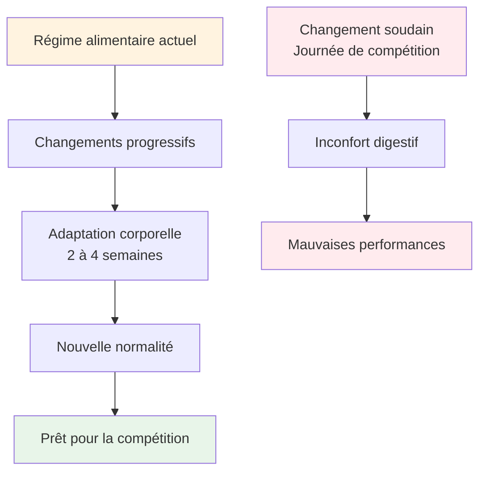

# Nutrition pour une performance de précision
<AdBanner />


La pétanque est un sport de précision, pas d&#39;endurance. Vos besoins nutritionnels diffèrent de ceux d&#39;un marathonien ou d&#39;un footballeur. L&#39;essentiel est de maintenir une bonne concentration et une bonne motricité tout au long d&#39;une longue journée de compétition.

::: tip La grande idée
**Your brain is your most important tool in pétanque. Feed it stable fuel, not roller coaster energy.** Focus on protein, healthy fats, and staying hydrated. Avoid sugar spikes.
:::



```mermaid
graph LR
    A[Sucres/Glucides simples] --> B[pic de glycémie]
    B --> C[Libération d&#39;insuline]
    C --> D[Chute de glycémie]
    D --> E[Réponse à l&#39;adrénaline]
    E --> F[Tremblements et anxiété]

    G[Protéines et graisses saines] --> H[Glycémie stable]
    H --> I[Énergie constante]
    I --> J[Mise au point nette]
    J --> K[Mains fermes]

    style A fill:#ffebee
    style F fill:#ffebee
    style G fill:#e8f5e9
    style K fill:#e8f5e9
```

## Le défi de l&#39;athlète de précision

Contrairement aux sports de haute intensité, la pétanque ne nécessite pas d&#39;importantes réserves de glycogène ni un apport énergétique rapide. Ce qu&#39;elle requiert, c&#39;est :

- **Glycémie stable – sans pics ni chutes brutales**
- **Une clarté mentale constante – une concentration qui dure toute la journée**
- **Mains fermes - sans tremblements ni secousses**
- **Sentiments apaisés – faible anxiété et réponse au stress**

Votre stratégie nutritionnelle doit être optimisée en fonction de ces facteurs, et non en fonction de la production brute d&#39;énergie.

## Le problème du sucre et des glucides simples

De nombreux athlètes optent systématiquement pour des régimes riches en glucides. Chez les joueurs de pétanque, cela peut en réalité nuire à leurs performances.

### Les montagnes russes de la glycémie

Lorsque vous consommez du sucre ou des glucides simples :
1. La glycémie augmente rapidement.
2. L&#39;insuline est libérée pour faire baisser le taux d&#39;insuline.
3. Chutes brutales de la glycémie (hypoglycémie)
4. Votre corps libère de l&#39;adrénaline pour compenser.
5. Vous ressentez des tremblements, de l&#39;anxiété et des difficultés de concentration.

**This is the opposite of what you need for precision.**

### Symptômes d&#39;instabilité de la glycémie

| Symptôme | Impact sur la performance |
|---------|----------------------|
| Mains tremblantes | Publication incohérente |
| Difficultés de concentration | Mauvaise prise de décision |
| Irritabilité | Conflits d&#39;équipe, manque de sang-froid |
| Fatigue après les repas | Coup de barre de l&#39;après-midi |
| Anxiété | Sensibilité à la pression |
| brouillard cérébral | Réflexion tactique lente |

## Une meilleure approche : l’énergie stable

L&#39;objectif est de fournir à votre cerveau un carburant constant, sans les montagnes russes émotionnelles.

### Principes clés

1. **Privilégiez les protéines et les graisses saines** - Elles fournissent une énergie lente et constante.
2. **Privilégiez les glucides complexes aux glucides simples** - Si vous consommez des glucides, choisissez-en qui se digèrent lentement.
3. **Évitez les pics de glycémie** - Surtout avant et pendant la compétition
4. **Restez hydraté** - La déshydratation affecte considérablement la concentration.
5. **Mangez régulièrement** - Ne vous laissez pas avoir trop faim

### Aliments qui aident

| Type d&#39;aliment | Exemples | Pourquoi ça marche |
|-----------|----------|--------------|
| Protéine | Œufs, noix, fromage, viande | Digestion lente, énergie stable |
| graisses saines | Avocat, huile d&#39;olive, noix | Carburant longue durée |
| Glucides complexes | légumes, légumineuses | Les fibres ralentissent l&#39;absorption |
| Fruits à faible teneur en sucre | Baies, pommes | Nutriments sans pic |

### Aliments à limiter

| Type d&#39;aliment | Exemples | Pourquoi c&#39;est problématique |
|-----------|----------|---------------------|
| Sucre | Bonbons, sodas, pâtisseries | pic et chute rapides |
| pain blanc/pâtes | Sandwichs, plats de pâtes | Conversion rapide en sucre |
| Jus de fruit | Jus d&#39;orange, smoothies | Sucre concentré |
| boissons énergisantes | La plupart des marques commerciales | coup de barre après sucre et caféine |

## Nutrition le jour de la compétition

### Avant la compétition

**2-3 hours before:**
- Repas équilibré avec protéines, lipides et légumes
- Évitez les glucides complexes qui pourraient provoquer de la somnolence.
- Exemple : des œufs aux légumes, ou une salade au poulet

**1 hour before:**
- Une collation légère si besoin
- Des noix, du fromage ou une petite portion de protéines
- Évitez tout ce qui est sucré.

### Pendant la compétition

**Between games:**
- L&#39;eau (le plus important)
- Petites collations protéinées (noix, fromage, viande)
- Évitez les collations et les boissons sucrées

**Signs you need to eat:**
- Difficultés de concentration
- Irritabilité
- Je me sens tremblante
- Mal de tête

### Après la compétition

- Reprenez des forces avec un repas équilibré
- Réhydrater complètement
- Ne vous « récompensez » pas avec du sucre – cela nuira à votre rétablissement

## Hydratation

La déshydratation affecte les fonctions cognitives avant même que l&#39;on ressente la soif.

### Lignes directrices

- **Hydratez-vous bien avant la compétition : buvez de l’eau tout au long de la journée.**
- **Pendant le jeu - Buvez régulièrement de l&#39;eau par petites gorgées, n&#39;attendez pas d&#39;avoir soif.**
- **Évitez la caféine en excès - c&#39;est un diurétique**
- **Soyez attentif aux signes suivants : maux de tête, urine foncée, fatigue**

### Combien?

En règle générale, l&#39;urine doit être jaune pâle. Si elle est foncée, vous devez boire davantage.

## L&#39;option faible en glucides

Certains athlètes de précision adoptent des régimes pauvres en glucides ou cétogènes. La théorie :

**Potential benefits:**
- Glycémie très stable (aucune hausse possible)
- Clarté mentale constante
- Réduction de l&#39;anxiété et des tremblements
- Pas de baisse d&#39;énergie l&#39;après-midi

**Considerations:**
- Nécessite une période d&#39;adaptation (1 à 2 semaines)
- Ne convient pas à tout le monde
- Exige de la planification et de l&#39;engagement
- Consultez d&#39;abord un professionnel de la santé.

<AdInArticle />

Il s&#39;agit d&#39;une stratégie avancée, pas nécessaire pour tout le monde, mais qui mérite d&#39;être envisagée si la stabilité de la glycémie est un problème important pour vous.

## L&#39;alimentation comme pratique : entraîner son corps

::: warning Concept critique
**Mat är inte bara bränsle - det är något du övar med.** Just like you practice your throw, you must practice your nutrition to get your body comfortable with competition-day eating.
:::

### Pourquoi les pratiques alimentaires sont importantes

Votre système digestif est capable d&#39;apprendre. Ce que vous mangez régulièrement devient ce à quoi votre corps s&#39;attend et ce qu&#39;il assimile le mieux. Si vous ne consommez que des protéines et des légumes les jours de compétition, votre corps ne s&#39;y adaptera pas.

**The problem:**
- Consommer des aliments inhabituels le jour d&#39;une compétition peut provoquer des troubles digestifs.
- Votre corps a besoin de temps pour s&#39;adapter à de nouvelles habitudes alimentaires.
- Stress + aliments inconnus = risques de troubles digestifs
- L&#39;anxiété de performance est déjà assez pénible sans y ajouter l&#39;anxiété digestive.

**The solution:**
- Mettez en pratique votre nutrition de compétition pendant l&#39;entraînement.
- Intégrez vos aliments du jour de compétition à votre routine quotidienne.
- Habituez votre corps à s&#39;acclimater aux aliments à énergie stable

### Le processus d&#39;adaptation



Lorsque vous modifiez votre régime alimentaire :
1. **Semaines 1 et 2 :** Votre corps s&#39;adapte aux nouveaux aliments et vous pouvez ressentir des changements.
2. **Semaines 3 et 4 :** L’adaptation se produit, les nouveaux aliments deviennent normaux.
3. **Semaine 5 et suivantes :** Votre corps est à l&#39;aise et fonctionne efficacement avec ces aliments

**This is why you can't just "eat healthy" on competition day and expect optimal results.**

### Comment prendre soin de sa nutrition

#### 1. Début pendant l&#39;entraînement

**Practice your competition-day eating during training sessions:**
- Prenez le même repas avant l&#39;entraînement qu&#39;avant une compétition.
- Apportez les mêmes en-cas que vous emporteriez à un tournoi.
- Observez comment votre corps réagit.
- Ajustez en fonction de ce qui fonctionne

**Example training day:**
```
2-3 hours before: Eggs with vegetables (same as competition)
During training: Water + nuts (same as competition)
After training: Balanced meal with protein
```

#### 2. Faites-en votre habitude

**Don't have a "competition diet" and a "regular diet"** - this creates two problems:
- Votre corps ne s&#39;adapte jamais complètement à l&#39;un ou l&#39;autre.
- Les aliments proposés en compétition sont inhabituels et stressants.

**Instead:**
- Faites des aliments à énergie stable votre norme quotidienne
- Votre corps devient efficace pour utiliser les protéines et les graisses.
- Le jour de la compétition se déroule normalement, sans différence.
- Aucune surprise digestive

#### 3. Tester et améliorer

**Use training to experiment:**

| Test | Ce qu&#39;il faut remarquer | Ajuster |
|------|----------------|--------|
| Horaires des repas avant l&#39;entraînement | Niveaux d&#39;énergie, concentration | Trouvez votre fenêtre optimale |
| Différentes sources de protéines | Digestion, confort | Identifiez ce qui fonctionne le mieux |
| Types de collations | énergie soutenue | Trouvez vos en-cas préférés |
| quantités d&#39;hydratation | Concentration, pauses toilettes | Apport équilibré |

**Keep a simple log:**
- Ce que vous avez mangé et quand
- Comment vous êtes-vous senti pendant l&#39;entraînement
- Niveaux d&#39;énergie et concentration
- Des problèmes digestifs ?

#### 4. Instaurer le confort et la confiance

**The psychological benefit:**

Lorsque vous avez répété votre plan nutritionnel des centaines de fois à l&#39;entraînement :
- Vous savez exactement comment votre corps va réagir.
- Aucune anxiété concernant les choix alimentaires
- Un souci de moins le jour de la compétition
- Confiance en votre préparation

**This is the same principle as practicing your throw** - repetition builds comfort and reliability.

### Défis d&#39;adaptation courants

::: details Transition d&#39;un régime riche en glucides à un régime à énergie stable

**Challenge:** You're used to bread, pasta, and sugary snacks

**Adaptation period:** 2-4 weeks

**What to expect:**
- Semaine 1 : Vous pourriez vous sentir différent, avoir envie d&#39;aliments familiers.
- Semaine 2 : L’énergie se stabilise, les envies diminuent
- Semaines 3-4 : Nouvelle normalité, le corps utilise efficacement les graisses et les protéines

**How to practice:**
- Commencez par un repas à la fois.
- Remplacez d&#39;abord les glucides simples par des glucides complexes.
- Augmentez progressivement les protéines et les graisses saines.
- Commencez par vous entraîner lors de séances à faible enjeu.
:::

::: details Trouver les aliments qui vous conviennent

**Challenge:** Not everyone digests the same foods well

**What to test:**
- Différentes sources de protéines (œufs, viande, noix)
- Moment des repas (2 heures ou 3 heures avant)
- Taille des portions (trop = léthargie, pas assez = faim)
- Certains aliments qui provoquent des inconforts

**Practice approach:**
- Essayez une variable à la fois
- Consacrez 2 à 3 séances d&#39;entraînement à chaque test.
- Notez ce qui vous fait le plus de bien.
- Élaborez votre « menu de compétition » personnel
:::

::: details Gestion des environnements alimentaires lors des tournois

**Challenge:** Tournaments often have limited food options

**Practice solution:**
- Apportez toujours vos propres collations (prenez-le en pratique).
- Repérer les lieux à l&#39;avance si possible
- Ayez des solutions de secours dont vous savez qu&#39;elles fonctionnent.
- Pratiquez de manger dans différents environnements

**Mental preparation:**
- Ne comptez pas sur la nourriture du lieu de réception.
- Considérez les aliments comme faisant partie de votre équipement.
- Emballez-le comme vous emballez vos boules.
:::

### Le plan de pratique nutritionnelle de 30 jours

**Goal:** Make stable-energy eating your comfortable normal

**Week 1-2: Foundation**
- Remplacez un repas par jour par un repas de type compétition.
- Pratiquez une alimentation adaptée avant l&#39;entraînement
- Commencez à apporter des collations à l&#39;entraînement
- Observez comment votre corps réagit.

**Week 3-4: Expansion**
- Préparez deux repas par jour axés sur une énergie stable.
- Entraînez-vous à manger comme un jour de compétition les jours d&#39;entraînement.
- Affinez vos choix de collations
- Établissez votre liste d&#39;aliments préférés

**Week 5+: Mastery**
- Une alimentation à apport énergétique stable est votre nouvelle norme.
- Le corps est entièrement adapté
- Le jour de la compétition se déroule comme d&#39;habitude
- Confiance en votre nutrition

### Votre kit alimentaire de compétition

**Practice packing this for every training session:**

**Pre-competition (2-3 hours before):**
- [ ] Source de protéines (œufs, viande ou noix)
- [ ] Légumes ou salade
- [ ] graisses saines (avocat, huile d&#39;olive, fromage)

**During competition:**
- [ ] Bouteille d&#39;eau (rechargeable)
- [ ] Noix mélangées (petites portions)
- [ ] Œufs durs (si vous pouvez les garder au frais)
- [ ] cubes de fromage ou fromage en bâtonnets
- [ ] viande séchée ou séchée
- [ ] En-cas de secours

**The more you practice with this kit, the more automatic it becomes.**

## Conseils pratiques

### Collations faciles pour la compétition
- Noix mélangées (non salées)
- Œufs durs
- cubes de fromage
- Bœuf ou dinde séchée
- Légumes avec du houmous
- Olives

### Ce qu&#39;il faut éviter
- distributeurs automatiques de snacks
- Boissons énergétiques sucrées
- Pâtisseries et produits de boulangerie
- Barres de chocolat et de bonbons
- La plupart des barres « énergétiques » (vérifiez la teneur en sucre)

## Points clés à retenir

> Au pétanque, votre cerveau est votre meilleur atout. Nourrissez-le d&#39;énergie stable, pas d&#39;énergie en dents de scie. Et travaillez votre alimentation comme vous travaillez votre lancer : la répétition engendre confort et régularité.

Privilégiez les protéines, les bons gras et une bonne hydratation. Évitez les pics de glycémie. **Surtout, adoptez les mêmes habitudes alimentaires qu&#39;en compétition.** Votre corps a besoin d&#39;entraînement pour donner le meilleur de lui-même.

**Remember:** You wouldn't show up to a tournament with a throwing technique you've never practiced. Don't show up with a nutrition strategy you've never practiced either.

<AdBanner />
