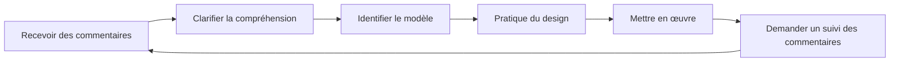

# Obtenir et utiliser des commentaires

Le feedback est un outil de développement extrêmement puissant, et pourtant souvent négligé. Cette page vous explique comment solliciter activement du feedback, le recevoir de manière constructive et le transformer en actions concrètes d&#39;amélioration.

---

## Pourquoi nous résistons aux commentaires

Avant d&#39;apprendre à solliciter des retours d&#39;information, il faut comprendre pourquoi c&#39;est difficile :

### Protection de l&#39;ego

Votre cerveau perçoit les critiques concernant vos performances comme une menace pour votre identité. Cela déclenche des réactions défensives :
- Rejeter les commentaires
- Trouver des raisons pour lesquelles la personne a tort
- Éviter des situations similaires à l&#39;avenir

### Biais de confirmation

Nous recherchons naturellement les informations qui confirment nos croyances. Si vous pensez être un bon pourvoyeur, vous remarquerez vos réussites et expliquerez vos erreurs.

### Le changement de mentalité de croissance

::: tip Recadrer les commentaires
**Mentalité fixe :** « La critique signifie que j&#39;ai des défauts. »
**Mentalité de croissance :** « Les commentaires sont des informations qui m&#39;aident à m&#39;améliorer. »

La différence ne réside pas dans la positivité, mais dans l&#39;exactitude. Les commentaires sont des données, pas des jugements.
:::

---

## Sources de rétroaction objective

### 1. Données quantitatives

Les chiffres ne mentent pas et n&#39;édulcorent pas la vérité :

| Métrique | Ce que cela révèle |
|--------|-----------------|
| **Précision du pointage %** | Données techniques de base et tendances |
| **Précision en début et en fin de partie** | Effets de fatigue/pression |
| **Taux de réussite au tir** | En fonction de la distance, du type de cible et de la situation de match |
| **Pourcentage de Carreau** | l&#39;efficacité de la prise de risque |

### 2. Coéquipiers

Vos coéquipiers vous voient en compétition, lorsque votre perception de vous-même est la moins précise :

**Que demander :**
- «Quelle impression est-ce que je donne à vos yeux quand nous sommes en retard ?»
- « Que remarquez-vous dans mon approche des matchs serrés ? »
- «Que pourrais-je faire pour être un meilleur coéquipier ?»

### 3. Adversaires

Les conversations d&#39;après-match avec des adversaires de confiance peuvent être révélatrices :

**Que demander :**
- « Qu&#39;essayiez-vous d&#39;exploiter dans mon jeu ? »
- « Y a-t-il quelque chose qui vous a surpris dans ma façon de jouer ? »

### 4. Entraîneurs/Joueurs expérimentés

L&#39;expertise externe apporte une perspective que vous ne pouvez pas générer vous-même :

**Que demander :**
- « Quel est le plus grand écart entre mon potentiel et mes performances actuelles ? »
- « Quel schéma voyez-vous dans mes échecs ? »
- « Quelles seraient vos priorités si vous étiez mon entraîneur ? »

### 5. Analyse vidéo

Le miroir le plus objectif qui soit. Consultez la [Analyse vidéo](/en/education/self-awareness/video) pour connaître les protocoles détaillés.

---

## Comment demander efficacement des commentaires

### Le cadre SEEK

**S - Spécifique**
Ne demandez pas : « Comment ai-je joué ? »
Demandez : « À quoi ressemblait ma précision au pointage dans la troisième manche, lorsque nous étions menés ? »

**E - Exemples**
Demandez : « Pouvez-vous me donner un exemple précis ? »
Cela impose un retour d&#39;information concret plutôt que des généralisations.

**E - Exploratoire**
Adoptez une attitude curieuse, et non défensive.
« J&#39;essaie de comprendre mes angles morts. Qu&#39;est-ce qui pourrait m&#39;échapper ? »

**K - Bienveillant (envers soi-même)**
N&#39;oubliez pas : demander des commentaires est courageux. Vous faites un travail difficile.

### Le timing est crucial.

| Quand | Idéal pour | Éviter |
|------|----------|-------|
| **Immédiatement après** | observations techniques spécifiques | Traitement émotionnel |
| **Lendemain** | Perspective équilibrée, modèles | Si les détails se sont estompés |
| **Critique vidéo** | Analyse objective | Si cela retarde l&#39;action trop longtemps |

---

## Recevoir des commentaires sans se mettre sur la défensive

Lorsque vous recevez des commentaires, votre cerveau aura tendance à se défendre. Voici comment contrer cette réaction :

### La règle des 3 secondes

Lorsque vous recevez un commentaire, **attendez 3 secondes avant de répondre**. Cela laisse le temps à votre cerveau rationnel de réagir avant que votre cerveau émotionnel ne prenne le dessus.

### La technique du « Dites-m&#39;en plus »

Au lieu de vous défendre, dites : « Parlez-moi-en davantage. »

Ce:
- Achat du temps de traitement
- Cela montre que vous accordez de l&#39;importance à l&#39;entrée.
- Révèle souvent la compréhension fondamentale

### Réception distincte de l&#39;évaluation

**Étape 1 :** Recevoir (écouter simplement)
**Étape 2 :** Clarifier (s&#39;assurer de bien comprendre)
**Étape 3 :** Remercier (accuser réception du cadeau)
**Étape 4 :** Évaluer (décider ensuite en privé des mesures à prendre)

Vous n&#39;êtes pas obligé d&#39;approuver immédiatement les commentaires. Il vous suffit de les recevoir avec ouverture d&#39;esprit.

---

## Protocole de réponse aux commentaires

Utilisez ceci lorsque vous recevez des commentaires :

1. « Merci de me l&#39;avoir dit. »
   - Une reconnaissance sincère, même si les commentaires sont blessants.

2. **« Pouvez-vous me donner un exemple précis ? »**
   - Passage du général au concret

3. **« Que me conseillez-vous d&#39;essayer ? »**
   - Invite à un partenariat pour l&#39;amélioration

4. **« Je vais y réfléchir. »**
   - Engagement sincère sans accord immédiat

---

## Transformer les commentaires en actions

Les commentaires sans actions ne sont que des conversations désagréables.

### Le processus de rétroaction à l&#39;action

### Modèle d&#39;action

Pour chaque commentaire exploitable :

| Élément | Votre réponse |
|---------|---------------|
| **Les commentaires** | (Ce qui a été dit) |
| **Le modèle** | (Quel problème récurrent cela révèle-t-il ?) |
| **L&#39;action** | (Quelle chose précise allez-vous pratiquer ?) |
| **La Mesure** | (Comment saurez-vous si vous avez progressé ?) |
| **Chronologie** | (Quand procéderez-vous à une nouvelle évaluation ?) |

---

## Créer une culture du feedback

### Avec votre équipe

- **Normalisez-le :** Les retours réguliers deviennent la norme, et non l&#39;exception.
- **Un échange réciproque :** Donnez votre avis pour en recevoir en toute sérénité.
- **Conventions relatives au calendrier :** « Faites le point après les matchs » contre les critiques non sollicitées
- **Concentrez-vous sur les détails :** « J&#39;ai remarqué X » est préférable à « Tu fais toujours Y ».

### Avec toi-même

- **Bilan hebdomadaire :** Prenez le temps d’évaluer votre semaine.
- **Réflexion écrite :** L’écriture permet d’y voir plus clair
- **Recherche de tendances :** Recherchez les thèmes récurrents dans plusieurs sources.

---

## Le joueur résistant aux commentaires

Si vous vous reconnaissez dans l&#39;une de ces situations, donnez la priorité à ce travail :

::: warning Signes de résistance à la rétroaction
- Vous pouvez toujours expliquer pourquoi les commentaires ne s&#39;appliquent pas.
- Vous ne sollicitez l&#39;avis que des personnes qui partagent votre opinion.
- Vous vous sentez attaqué lorsque vous recevez des commentaires constructifs
- Vous évitez les personnes qui remettent en question votre perception de vous-même.
- Vous justifiez les mauvais résultats par des facteurs externes.
:::

Rompre ces schémas exige un effort conscient, mais la récompense est une amélioration accélérée.

---

## Contenu associé

- [L&#39;avantage de la conscience de soi](/en/education/self-awareness/) — Pourquoi la connaissance de soi est importante
- [Analyse vidéo](/en/education/self-awareness/video) — Auto-observation objective
- [Dynamique d&#39;équipe](/en/education/team-dynamics/) — Communication avec les coéquipiers
- [Force mentale](/en/education/mental-game/mental-strength/) — Faire face aux vérités difficiles

