# L&#39;avantage de la conscience de soi

::: tip La méta-compétence qui multiplie tout
**Poids : 400 points** — Les joueurs ayant une perception précise d&#39;eux-mêmes progressent 2 à 3 fois plus vite car ils s&#39;entraînent sur ce qui a réellement besoin d&#39;être amélioré.
:::

## Pourquoi ceci est votre multiplicateur caché

> « On ne peut pas améliorer ce qu&#39;on ne voit pas. »

La plupart des joueurs passent des heures à s&#39;entraîner, mais **s&#39;entraînent-ils aux bonnes choses ?** La conscience de soi est la métacompétence qui garantit que votre temps d&#39;entraînement est réellement efficace.

### L&#39;effet multiplicateur d&#39;amélioration

```mermaid
flowchart TD
    A[Conscience de soi] --> B[Auto-évaluation précise]
    A --> C[Reconnaissance des angles morts]
    A --> D[Réception des commentaires]

    B --> E[Former ce qui a réellement besoin d&#39;être travaillé]
    C --> E
    D --> E

    E --> F[Amélioration 2 à 3 fois plus rapide]

    style A fill:#FF9800,color:#fff
    style F fill:#4CAF50,color:#fff
```



Sans conscience de soi, vous pourriez :
- Pratiquez ce que vous savez déjà faire (sensationnel, progression limitée)
- Manquez des défauts techniques invisibles à l&#39;œil nu.
- Attribuer à tort les pertes à des facteurs externes
- Résistez aux commentaires qui pourraient vous être utiles.

Grâce à la conscience de soi, vous :
- Identifier avec précision les faiblesses réelles
- Acceptez et intégrez les commentaires utiles.
- Comprenez comment la pression affecte votre jeu spécifique
- Connaître ses schémas dans différentes conditions

---

## Le paradoxe de la conscience de soi

::: danger La vérité qui dérange
Les recherches montrent de façon constante que les personnes qui ont besoin d&#39;une meilleure connaissance d&#39;elles-mêmes pensent généralement avoir une excellente connaissance d&#39;elles-mêmes. Celles qui ont une grande conscience d&#39;elles-mêmes se remettent constamment en question et recherchent des avis extérieurs.

**Lequel êtes-vous ?**
:::

C’est ce qu’on appelle l’**effet Dunning-Kruger** appliqué à la perception de soi. Le manque de conscience qui vous freine vous empêche également de voir que vous manquez de conscience.

### La solution : les rétroviseurs extérieurs

Puisque nous ne pouvons pas nous fier entièrement à notre perception interne, nous avons besoin de miroirs externes :

| Miroir | Ce que cela révèle |
|--------|-----------------|
| **Analyse vidéo** | Réalité technique vs ce que vous pensez faire |
| **Données de performance** | Des schémas que vous pourriez ne pas remarquer |
| **Commentaires des membres de l&#39;équipe** | Comment vous êtes perçu sous pression |
| **Observation de l&#39;entraîneur** | Un regard expert sur votre jeu |

---

## La fenêtre Johari pour les joueurs de pétanque

La fenêtre de Johari est un modèle psychologique qui cartographie ce que vous et les autres savez de votre jeu :

```
                    Known to Self    Unknown to Self
                   ┌────────────────┬────────────────┐
 Known to Others   │     OPEN       │     BLIND      │
                   │  Arena         │  Spot          │
                   │                │                │
                   │ Your conscious │ What others    │
                   │ skills and     │ see but you    │
                   │ tendencies     │ don't          │
                   ├────────────────┼────────────────┤
 Unknown to Others │    HIDDEN      │   UNKNOWN      │
                   │    Facade      │   Potential    │
                   │                │                │
                   │ What you know  │ Undiscovered   │
                   │ but don't      │ capabilities   │
                   │ share          │                │
                   └────────────────┴────────────────┘
```

### Votre objectif : agrandir la zone « ouverte ».

**1. Réduisez vos angles morts**
- Analyse vidéo de Seek
- Demandez des commentaires précis
- Soyez attentif aux tendances dans les résultats.

**2. Partagez davantage (réduisez les informations cachées)**
- Signalez à vos coéquipiers vos difficultés.
- Discutez ouvertement de votre approche.
- Demandez de l&#39;aide lorsque vous en avez besoin.

**3. Découvrez votre potentiel insoupçonné**
- Essayez de nouvelles approches
- Expérimentation en formation
- Sortir de sa zone de confort

---

## Conscience de soi vs. Autocritique

::: warning Mention spéciale
La conscience de soi est une **observation neutre** de la réalité.
L&#39;autocritique est un **jugement négatif** de soi-même.

Ce n&#39;est PAS la même chose.
:::

| Conscience de soi | Autocritique |
|----------------|----------------|
| «J&#39;ai raté trois carreaux aujourd&#39;hui» | «Je suis nulle en carreaux» |
| «Je me crispe lors des matchs serrés» | «Je perds toujours mes moyens sous la pression» |
| « Ma précision au doigt est moindre quand je suis fatigué. » | «Je ne supporte pas les tournois longs.» |
| « Je communique moins quand je perds. » | « Je suis un mauvais coéquipier quand je suis stressé. » |

**Cette différence est importante car :**
- La conscience de soi conduit à une amélioration ciblée
- L&#39;autocritique engendre la honte et l&#39;évitement.
- La conscience de soi est factuelle et spécifique
- L&#39;autocritique est émotionnelle et généralisée.

---

## Les trois niveaux de conscience de soi

### Niveau 1 : Conscience technique de soi
*&quot;Comment est-ce que je performe réellement ?&quot;*

- Précision dans différentes conditions
- Modèles d&#39;exécution technique
- L&#39;état physique influence la performance

### Niveau 2 : Conscience psychologique de soi
*« Comment réagir mentalement et émotionnellement ? »*

- Réponses et déclencheurs du stress
- fluctuations de confiance
- Modèles de focalisation et distracteurs

### Niveau 3 : Conscience sociale de soi
« Comment est-ce que j’influence les autres et comment me perçoivent-ils ? »

- Modèles de communication d&#39;équipe
- Moments (ou lacunes) de leadership
- Comment vos émotions affectent vos coéquipiers

---

## Auto-évaluation : Votre conscience de soi actuelle

Évaluez-vous honnêtement (1 = Jamais, 5 = Toujours) :

| Question | Score |
|----------|-------|
| Je peux prédire avec précision mes performances dans différentes situations. | /5 |
| Je sais quelles sont les conditions qui entraînent une baisse de mes performances. | /5 |
| Je comprends comment mes coéquipiers me perçoivent sous pression. | /5 |
| J&#39;accueille et intègre les commentaires critiques. | /5 |
| Mon auto-évaluation correspond à l&#39;évaluation de mon entraîneur/de mes coéquipiers | /5 |
| Je peux analyser objectivement ma performance sans réaction émotionnelle. | /5 |
| Je remarque que mon propre état mental change pendant la compétition. | /5 |

**Score :**
- **28-35 :** Forte conscience de soi (mais restez humble — continuez à solliciter des avis)
- **21-27 :** Conscience de soi modérée (bonne base sur laquelle construire)
- **14-20 :** Lacune en matière de conscience de soi (ce module est essentiel pour vous)
- **En dessous de 14 ans :** Points aveugles importants (prioriser ce travail)

---

## Dans ce module

### [Obtenir et utiliser le feedback](/en/education/self-awareness/feedback)
- Sources de retour d&#39;information objectif
- Comment demander efficacement des retours d&#39;information
- Recevoir des commentaires sans se mettre sur la défensive
- Transformer les commentaires en actions

### [Analyse vidéo pour la découverte de soi](/en/education/self-awareness/video)
- Que faut-il enregistrer et quand ?
- Que rechercher dans vos séquences ?
- Comparaison de la perception de soi à la réalité vidéo
- Protocoles d&#39;analyse vidéo

---

## Victoire rapide : Les trois questions

Après votre prochain entraînement ou match, posez-vous la question suivante :

1. **Qu&#39;est-ce que j&#39;ai bien fait, à mon avis ?** (Soyez précis)
2. **Que dirait un observateur objectif ?** (Distinguer la perception de la réalité)
3. **Quelle est la chose que j&#39;évite de regarder ?** (Trouvez l&#39;angle mort)

Notez vos réponses. Comparez-les au fil du temps. Des tendances se dégageront.

---

## Facteurs associés

- [Jeu mental](/en/education/mental-game/) — La conscience de soi favorise l&#39;entraînement mental
- Dynamique d&#39;équipe : Comprendre comment les autres vous perçoivent
- [Motivation](/en/education/motivation/) — Connaissez vos véritables motivations
- [Technique](/en/education/technique/) — L&#39;analyse vidéo révèle la vérité technique

